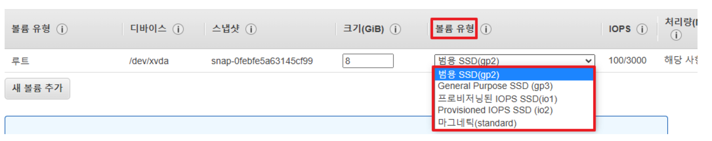
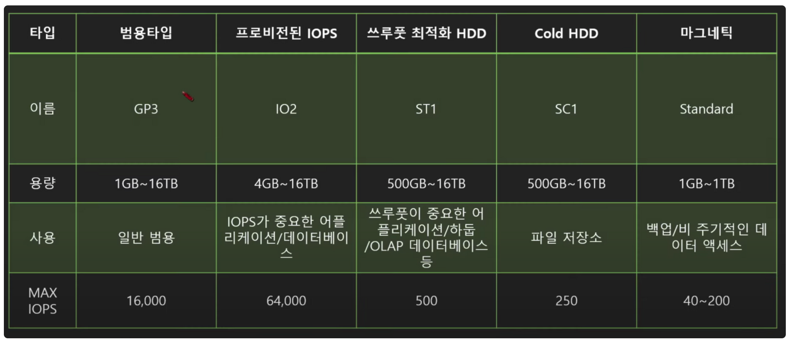
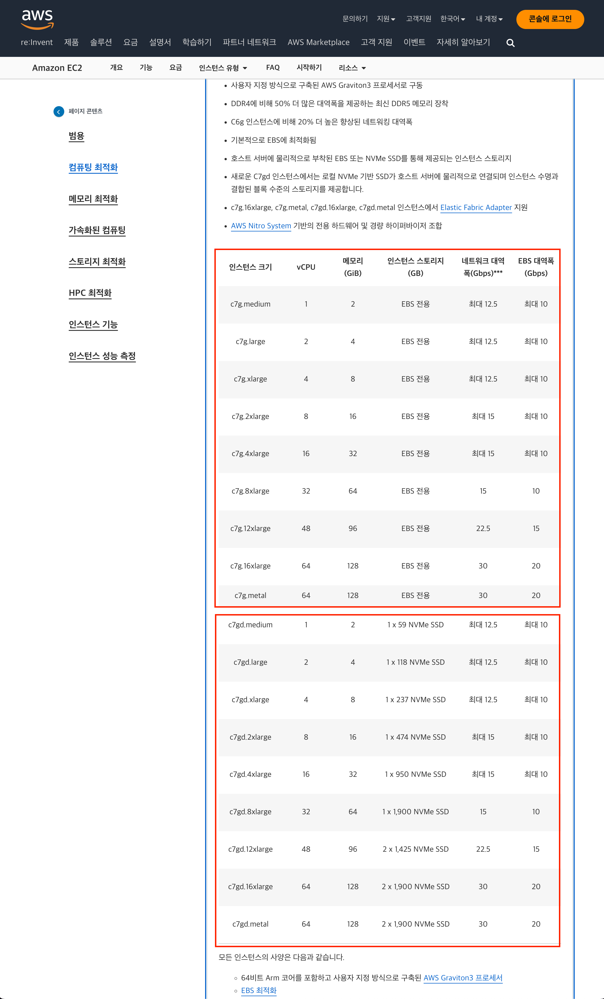
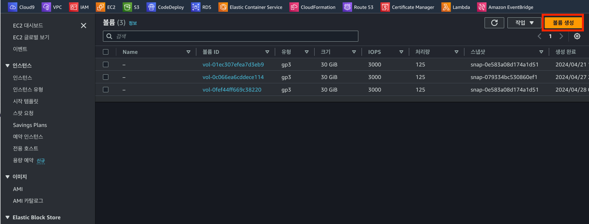
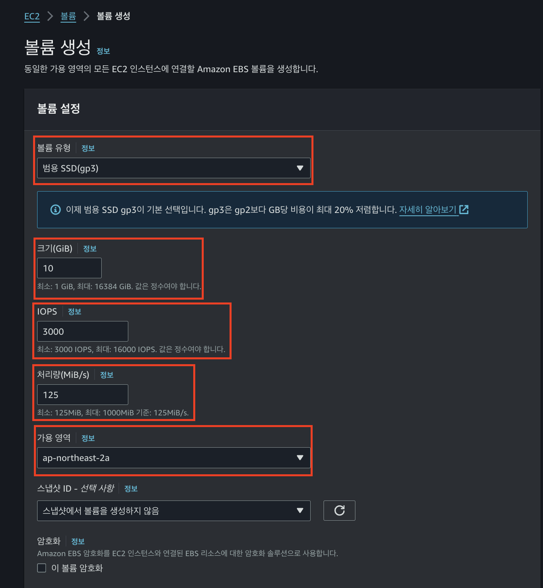
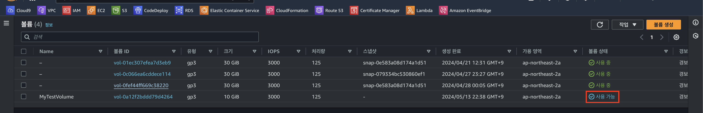
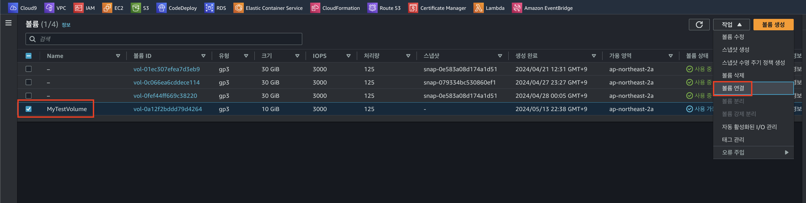
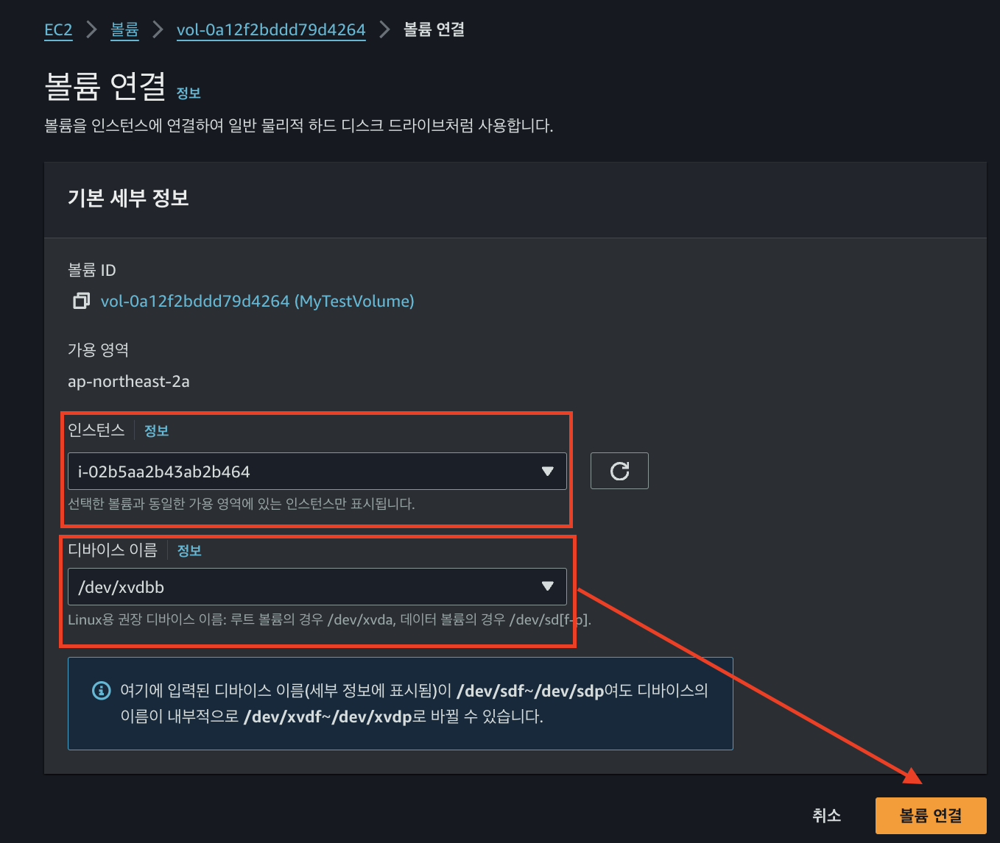
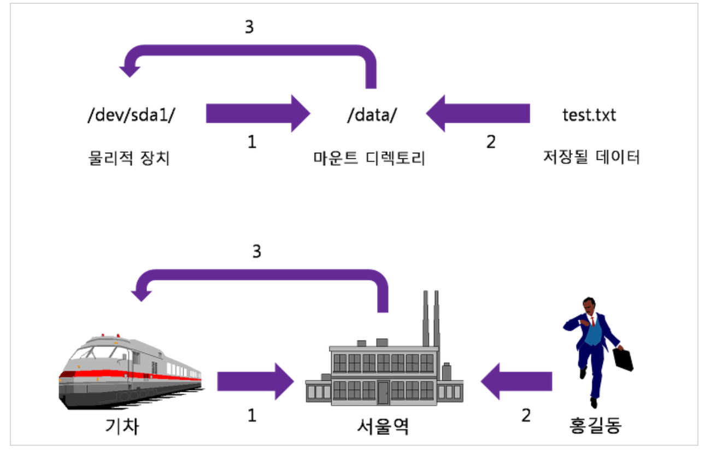

# 01. EBS(Elastic Block Storage)

> 😃 이번 시간에는 AWS에서 제공하는 HDD/SSD 역할을 하는 EBS에 대해 알아보자  
> EBS는 데이터를 저장하기 위한 저장 공간으로 사용이 된다.

## 01-1. EBS(Elastic Block Storage)란?

> EBS(Elastic Block Storage)는 몇분 만에 사용량을 많게 또는 적게 확장 할 수 있다.  
> 또한 프로비저닝(빌리는 행위)한 부분에 대해서만 저렴한 비용을 지불할 수 있다

- `컴퓨터 본체`를 보면, `CPU`, `RAM`, `HDD/SSD`가 `모두 장착`되어 `컴퓨터가 작동`하게 된다
- `EC2`(Elastic Compute Cloud) 인스턴스가 `연산`에 관한(CPU, Mem 등) 처리를 `수행`한다고 치면
- `EBS`(Elastic Block Storage)는 `데이터를 저장하는 역할`(HDD, SSD)을 `수행`한다고 보면 된다
- 즉, EBS는 `Cloud에서 사용하는 가상 하드디스크`(`HDD`)라고 할 수 있다
- **EBS**는 AWS Cloud 상의 EC2 인스턴스에 사용할 <u>`영구 블록 스토리지 볼륨을 제공`</u>한다

## 01-2. EBS와 EC2간의 연결 특징

- `EBS`의 `EC2가 종료 되어도 별개로 작동`하여 `유지`가 가능하다
- 보통은 컴퓨터가 꺼지면 HDD도 꺼지기 때문에 이용이 불가능
  - 하지만 `EBS`는 `EC2와 네트워크로 연결된 서비스`이기에 사용이 가능
- `EC2 인스턴스`를 `정지` 시켜도 `EBS`는 `독립적`으로 살아있기에 인스턴스 추가 비용 나가지 않음
- `EC2 인스턴스`에 여러개의 `EBS`를 `부착`하거나 한개의 EBS를 여러개의 EC2 인스턴스에 부착 가능
  - `1개의 EC2`에 `여러개의 EBS 볼륨 마운팅`
    - 하나의 컴퓨터에 여러개의 HDD, SDD 부착이 가능하지 않은가?
    - (물리적 컴퓨터에서는 불가능한 부분)
  - `1개의 EBS`를 `여러개의 EC2에 부착` 가능
    - 공용 저장소처럼 사용하는 경우
    - (물리적 컴퓨터에서는 불가능한 부분)

## 01-3. EBS는 같은 가용영역(AZ)에 존재?

- `EBS`(Elastic Block Storage)는 `EC2와 같은 가용영역`에 `존재`한다
- EC2와 `같은 가용영역에 존재`해야 `연결 및 통신이 빠름`
- 만약 다른 AZ로 생성해서 EC2에 붙히려고 하면 에러 발생한다, 아래 예를 참고하자
  - EC2 -> ap-northeast-2a -> 생성
  - EBS -> ap-northeast-2c -> 생성 -> EC2 부착 -> 에러 발생

> 다음 예시를 통해 네트워크로 연결되어 있는 EBS <--> EC2 의 장점에 대해 알아보자  
> 네트워크를 통해 HDD를 관리하는 이점은 아래와 같다.

## 집 컴퓨터의 CPU 업그레이드

1. 집 컴퓨터 같은 경우 CPU를 i9로 UPGRADE
2. CPU 업그레이드를 위해서 컴퓨터 본체를 뜯고 CPU 칩 교체를 해줘야 한다

## 사내 서버 컴퓨터의 HDD 교체

1. 예를 들어 회사에 데이터를 저장하는 서버 컴퓨터가 존재
2. 해당 서버의 디스크 저장 공간이 부족해 졌다고 가정
3. 온프라미스 환겨에서는 추가 저장 공간 확보를 위해 서버 HDD를 물리적으로 교체 or 새로운 HDD 설치 필요
4. 위 과정에서 서버를 일시적으로 중지 시키고, HDD 설치 혹은 교체 진행 중 서버 사용 불가능

> 이렇듯 AWS EBS는 위와 같은 불편한 부분을 네트워크 연결만으로 해결이 가능하도록  
> EBS라는 영구 블록 스토리지 볼륨을 제공해준다는 이점이 있다.  
> 그러면 EBS의 장점에 대해 간단히 알아보았으니, 이번에는 EBS 볼륨에 대해 알아보자

# 02. EBS 볼륨(Volume)?

> EBS 볼륨이란 EBS로 생성한 디스크 하나하나의 저장 단위를 의미한다.  
> EBS(Elastic Block Storage)는 AWS에서 제공하는 블록 레벨 스토리지 서비스를 의미하고  
> ⭐️ "EBS Volume은 EBS 서비스를 기반으로 하여 실제 생성된 스토리지 블록을 의미한다"

- `EBS 볼륨`을 `인스턴스`에 `연결하겠다는 말`은 EC2에서 EBS를 물리적 HDD처럼 사용하겠다는 의미다
- 쉽게 말하자면 `Window`에서 볼 수 있는 `C:드라이브`, `D:드라이브`는 각각 `디스크`이며 `볼륨`이라고 할 수 있다

## 02-1. EBS 볼륨 유형 타입



> EBS 타입이란 같은 하드 저장 디스크라도 SSD, HDD, 느브메로 구분이 된다  
> 또한 "용량"에 따라 "성능" 및 "가격" 차이가 나는 것처럼 EBS도 각 타입에 따라 구분 됨

- EBS는 총 `5가지` 타입으로 구분 된다
  - 범용(General Purpose of GP3) : `SSD`
  - 프로비저닝 된 IOPS(Provisioned IOPS or io2) : `SSD`
  - 쓰루풋 최적화 (Throughput Optimized HDD or st1)
  - 콜드 HDD(SC1)
  - 마그네틱(Standard)



- 각 `HDD`의 `성능`은 <u>`용량`</u> 과 <u>`Max IOPS`</u> 수치를 확인하면 된다
  - <u>`IOPS 성능이 높을수록` `데이터 통신이 빠르다고` 보면 됨</u>
- 일반적으로는 범용 타입인 `GP3 볼륨`을 주로 사용

# 03. EC2의 EBS 그리고 Instance Storage 저장 방식

- EC2의 `저장 타입`은 `대표적으로 2가지 존재`
- `EBS` or `인스턴스 저장 기반`

## 03-1. EBS 기반

- EC2 <==> EBS 네트워크 연결
- 네트워크 연결이기에 속도는 느림
- 인스턴스 삭제 -> EBS 남아있음 (영구 볼륨)
- 하나의 인스턴스에 연결한 EBS 볼륨 -> 분리 -> 다른 인스턴스 연결 가능 (USB 뺏다 넣듯이)

## 03-2. 인스턴스 저장 기반

- EC2안에 Storage 공간 존재
- 속도는 빠름
- 인스턴스 삭제 -> 디스크 공간 같이 삭제
- EBS처럼 스토어 분리 -> 다른 인스턴스 연결 불가능
- 영구적이지 않은 데이터 저장 시 사용
  - 캐시 데이터

## 03-3. EBS vs 인스턴스 스토리지 저장 방식의 예

> https://aws.amazon.com/ko/ec2/instance-types/



- 위 사진을 보면 EC2 유형 선택 시 `인스턴스 스토리지(GB)`에 `EBS 전용` 과 `1 x 59 NVMe SSD`라고 적힌 부분이 있음
- `EBS 전용`은 스토리지를 EBS만 사용 할 수 있는 인스턴스
- SSD로 명신된 것은 인스턴스 스토리지를 따로 가지고 있다는 의미

## 03-4. EBS 생성 및 연결 과정 데모



- 우선 AWS 사이트 로그인 후 볼륨 생성 클릭



- 볼륨 유형 : 여기서는 범용 타입인 GP3 선택
- 크기는 테스트이기에 10GB 로 설정
- IOPS, Throughput은 각각 3000, 125로 설정
- 가용 영역은 ap-northeast-2a 설정



- 생성 버튼을 클릭하게 되면 위와 같이 볼륨이 1개 생성된다
- 이렇게 생성된 볼륨 1개를 c: or d: 라고 봐도 무방하다
- 그러면 이제 EC2 인스턴스에 생성된 볼륨을 연결해보자



- 작업 > 볼륨 연결 클릭



- 연결할 인스턴스 선택
- 디바이스 이름은 윈도우의 D드라이브, C드라이브와 같이 HDD 이름을 지정하는걸로 보면 된다
- 연결이 되면 해당 볼륨 상태가 `사용 중`으로 변경이 될 것이다
- <u>`볼륨 연결 후에는 반드시 인스턴스 재부팅을 해줘야 볼륨 추가 적용이 된다`</u>

# 04. EBS 볼륨 연결 확인

```shell
[ec2-user@aws-xxx-bastion ~]$ ls -als /dev/xvda*
0 brw-rw---- 1 root disk 202, 0 May 13 13:53 /dev/xvda
0 brw-rw---- 1 root disk 202, 1 May 13 13:53 /dev/xvda1
```

- 디렉터리 조회

```shell
# 파일 시스템 조회
[ec2-user@aws-xxx-bastion ~]$ lsblk
NAME    MAJ:MIN RM SIZE RO TYPE MOUNTPOINT
xvda    202:0    0  30G  0 disk   # 루트 디바이스 
└─xvda1 202:1    0  30G  0 part / # xvda1 파티션
```

- `lsblk`: 리눅스 디바이스 정보 출력 명령어

## 04-1. EBS 볼륨을 파일시스템으로 포맷하기

- `/dev/xvda`는 `디렉토리가 아니다`
- 리눅스에서 /dev 경로는..?
  - 단순히 `외부 디바이스 파일`, `HDD`를 모아둔 곳
  - 볼륨을 리눅스에 연결한다고 D: 드라이브처럼 저장 디스크를 바로 사용할 수 있는건 아님
- 이를 <u>`파일 시스템 포맷을`</u> 해줘야 컴퓨터에서 하드를 쓸 수 있음
  - 파일 시스템을 생성하는 과정 -> `포맷`

> 파일 시스템 관련해서는 추후 자세하게 정리할 예정이니 여기서는 생략 한다  
> Linux 파일 시스템 : ext1, ext2, ext3, ext4, xfs 존재

```shell
# 파일 시스템 포맷
file -s <장치명>
```

```shell
# 값이 data라고 나오면 파일시스템이 존재하지 않는 것
file -s /dev/xvda
/dev/xvda: data
```

```shell
# root 권한 획득
sudo -s

# 해당 볼륨을 파일시스템으로 포맷
mkfs -t <볼륨타입> <볼륨장치명>
mkfs -t ext4 /dev/xvdb
```

```shell
[ec2-user@aws-xxx-bastion ~]$ sudo file -s /dev/xvda
/dev/xvda: x86 boot sector; partition 1: ID=0xee, starthead 0, startsector 1, 62914559 sectors, extended partition table (last)\011, code offset 0x63
```

- file -s /dev/xvda 명령어를 통해 파일시스템 생성이 된 부분 확인 가능

# 05. EBS 볼륨 마운트 설정하기

> 윈도우에서는 컴퓨터에 USB를 꼽으면 내 컴퓨터 폴더에 USB 파일이 뜨면서 자동으로 연결되고  
> 외장하드를 꼽아도 :E 와 같이 자동으로 인식이 되는 부분을 볼 수 있다.  
>
> 윈도우에서는 PnP(Plug and Play 플러그 앤 플레이 = 디바이스를 꼽기만 하면 알아서 설정 플레이)에 의해서  
> HDD, USB, CD-ROM 등 연결 시 자동으로 인식이 된다. 하지만 Linux는 수동으로 해야한다.

## 05-1. 마운트(Mount) 개념



> 기차는(물리적 장치 디바이스) => 서울역(/data) 마운트 디렉토리 <= test.txt  
> [마운트(Mount) 개념](https://sksstar.tistory.com/7)

- Window에서는 마운트(mount) 개념이 별로 사용되지 않음(자동 PnP)
- Linux에서는 HDD 파티션, CD/DVD, USB 메모리 등을 사용(접근)하려면 특정한 위치에 연결 필요
- `물리적인 장치`를 `특정한 위치`(대게는 디렉토리)에 `연결하는 과정`을 `마운트`라고 한다
- <u>EBS 볼륨은 가상 HDD 장치인데 `가상` 이든 `물리적이든` mount 과정은 필요하다고 함</u>
- 위 사진에 대한 예시
  - 기차는 서울역에 정차(=외부 디스크를 디렉터리에 마운팅)
  - 홍길동은 서울역에서 기차를 탄다 (=데이터를 마운트 디렉토리에 저장)
  - 기차가 홍길동을 태우고 목적지로 이동 (=실제 물리적으로 디스크에 저장됨)

## 05-2. 마운트 지점(포인트) 디렉토리 생성

```shell
# / 경로 이동 후 아래 디렉토리 생성
mkdir /xvdb
```

```shell
# 현재 파일 시스템들의 UUID 와 TYPE 확인
[root@aws-xxx-bastion /]# blkid
/dev/xvda1: LABEL="/" UUID="742b901d-2ed7-4356-9f3c-78fb1c59f421" TYPE="xfs" PARTLABEL="Linux" PARTUUID="f23869f5-7df0-444e-9524-8080607d467a"
/dev/xvdbb: UUID="f855e282-8ee1-4fec-b2d6-dba1ccce4fa7" TYPE="ext4"
```

```shell
# vi /etc/fstab

# 아래와 같이 형식에 맞춰 추가
UUID=742b901d-2ed7-4356-9f3c-78fb1c59f421     /           xfs    defaults,noatime  1   1
UUID=f855e282-8ee1-4fec-b2d6-dba1ccce4fa7     /xvdb       ext4    defaults,nofail  0   2
```

```shell
 # /etc/fstab에 있는 파일시스템 전체를 mount
mount -a

# disk free space -h(human) 확인
df -h
```

```shell
# 이제 디스크가 잘 마운트 되었는지 테스트 해보자
# /xvdb 디렉토리에 파일을 넣으면 디스크에 파일이 잘 저장됨을 확인 가능하다
echo "hello" > /xvdb/hello.txt
```

## 99. 참고 자료

- [[AWS] 📚 EBS 개념 & 사용법 💯 정리 (EBS Volume 추가하기)](https://inpa.tistory.com/entry/AWS-%F0%9F%93%9A-EBS-%EA%B0%9C%EB%85%90-%EC%82%AC%EC%9A%A9%EB%B2%95-%F0%9F%92%AF-%EC%A0%95%EB%A6%AC-EBS-Volume-%EC%B6%94%EA%B0%80%ED%95%98%EA%B8%B0#ebs_%EB%B3%BC%EB%A5%A8_%ED%99%95%EC%9E%A5%ED%95%98%EA%B8%B0)
- [리눅스 기초 - 기본 스토리지 관리 2 (파일시스템생성, 마운트, mkfs, mount)](https://www.youtube.com/watch?v=Nx74uvkuAyU)
- [마운트(mount) 란?](https://blog.naver.com/PostView.naver?blogId=ssoofeel&logNo=222496193311&parentCategoryNo=&categoryNo=&viewDate=&isShowPopularPosts=false&from=postView)
- [마운트(Mount) 개념](https://sksstar.tistory.com/7)