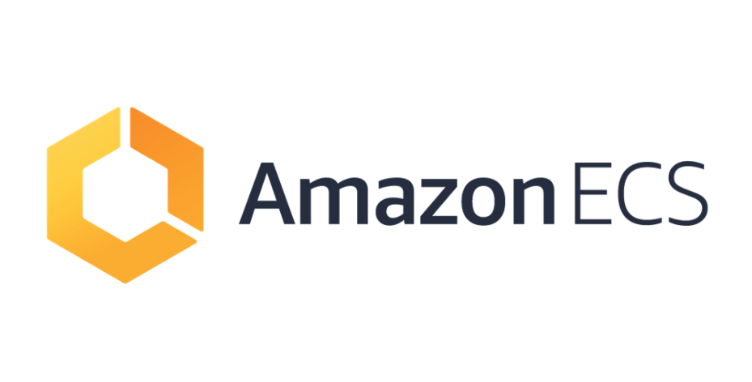
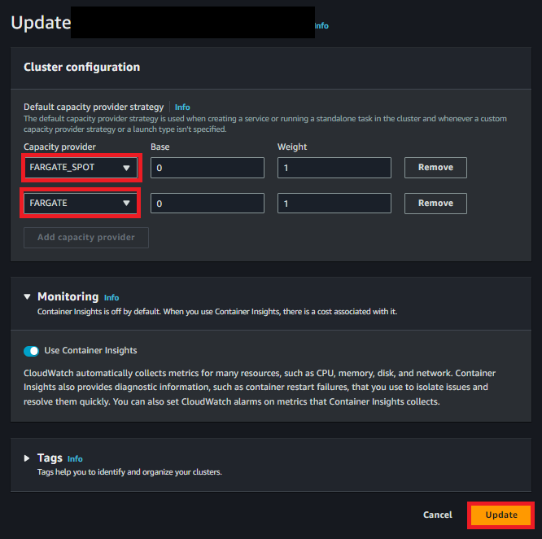
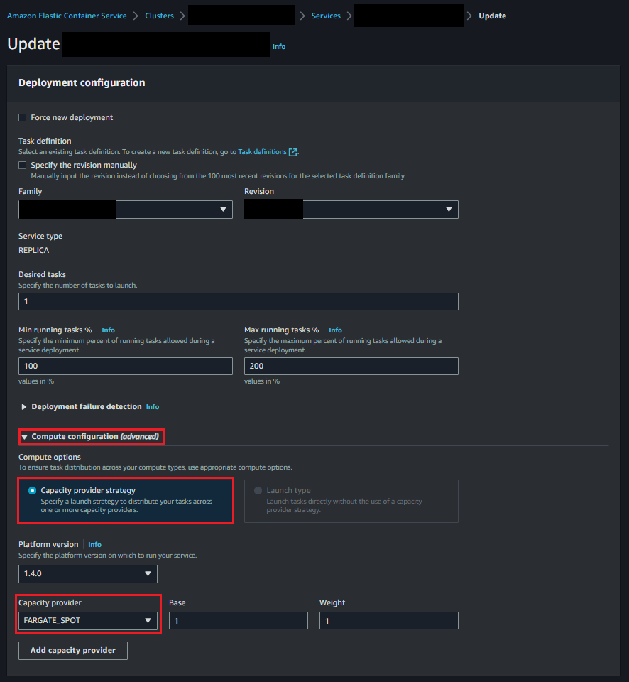

# AWS FARGATE 용량 공급자(Capacity Provider)



# 01. 서론

- `AWS Fargate 용량 공급자 사용`하면 AWS ECS Task에 `Fargate` & `Fargate Spot 용량 사용 가능`
- Fargate Spot 사용하면 Fargate 가격 대비 할인된 요금으로 중단 방지 Amazon ECS Task 실행이 가능
    - `정가 대비 최대 70% 할인된 가격`으로 `비용 최적화 가능`
- 용량 공급자와 Fargate, Fargate_Spot 둘다 이용이 가능
- AWS Fargate 스팟은 EC2 스팟 인스턴스와 동일한 개념
- AWS Cloud 예비 용량을 사용하여 Fargate 스팟 용량이 제공되면 지정한 요청에 따라 작업을 시작

## 01-1. Cloud의 예비 용량이란?

- AWS에서 말하는 **예비 용량**은 **클라우드 인프라에서 사용되지 않고 남아있는 컴퓨팅 자원**을 의미
- AWS는 대규모의 글로벌 인프라를 갖추고 있고, 해당 인프라는 다양한 고객의 요구사항을 충족시키기 위해 설계되어있음
    - 이 과정에서 **일정량의 자원**이 항상 **유휴 상태**로 남게 되는데, 이것이 바로 **예비 용량**입니다.
- ECS Fargate Spot은 이러한 유후 상태의 자원을 사용하는 구매 옵션
    - 스팟 인스턴스는 AWS의 미사용 EC2 용량을 할인된 가격에 제공하는 서비스
- 하지만 AWS가 해당 자원을 다시 필요로 할 경우 작업이 중단될 수 있다는 단점 존재
    - AWS는 작업 중단 2분 전에 알림을 제공, 고객이 필요한 조치를 취할 수 있게 함
- 이러한 특성으로 인해 Fargate 스팟은 높은 가용성이 필수적이지 않은 경우 사용하는게 좋음
    - 배치 작업
    - 백그라운드 작업(사용자의 직접적인 상호작용 없는 시스템 뒤에서 실행되는 작업)

# 02. 목적

- Fargate Spot은 기존 Fargate에 비해 70% 할인된 가격을 제공
- Dev, Stg 환경의 ECS Fargate Task에 대해 비용 최적화 구현하기 위함

# 03. Fargate 용량 공급자(Capacity Provider) 고려 사항

> 현재 운영중인 내부 시스템은 아래 고려사항에 해당하지 않기에, SPOT 적용 검토
> 
- Fargate의 **Windows** 컨테이너는 **Fargate Spot 용량 공급자 지원 안함**
- **ARM64 아키텍처** 사용하는 Task의 경우 **Fargate Spot 용량 공급자 지원 안함**
- Fargate Spot 사용 시 플랫폼 버전 **1.3.0 이상**(Linux용) **사용 필요**
- Fargate & Fargate Spot 용량 공급자를 사용하는 작업이 중지되면 작업 상태 변경 이벤트가 AWS EventBridge로 전송

# 04. AWS Fargate & Fargate Spot 요금

> AWS Fargate 요금은 컨테이너 이미지 다운로드를 시작한 시점부터 Amazon ECS Task 또는 Amazon EKS Pod가 종료될때까지 사용된 vCPU, Mem, 운영 체제(Linux, Windows), CPU 아키텍처(X86, ARM64), 스토리지 기준으로 계산되며 가장 가까운 초 단위로 반올림, Windows 운영 체제 및 ARM CPU 아키텍처는 현재 Amazon ECS에서만 사용 가능

## 04-1. Fargate 시간별 요금

| Resource          | Price (USD) |
| ----------------- | ----------- |
| vCPU (per hour)   | 0.04656     |
| Memory (per hour) | 0.00511     |

## 04-2. Fargate Spot 시간별 요금

| Resource          | Price (USD) |
| ----------------- | ----------- |
| vCPU (per hour)   | 0.013968    |
| Memory (per hour) | 0.001533    |

# 05. AWS ECS Fargate Spot 구성

## 05-1. AWS ECS 클러스터 콘솔 구성



> [클러스터] -> [클러스터 업데이트] 선택 -> 기본 용량 공급자 전략 FARGATE_SPOT 적용
> 
- 단일로 구성 가능(FARGATE_SPOT만 선택)
- FARGATE, FARGATE_SPOT 동시 선택 시 ( 전략을 2개 선택 )
    - 기본적으로 몇개의 Task에 해당 용량공급자(Capacity Provider)를 사용할 것 인지?
    - 운영 개수가 늘어날 시 가중치의 비율에 따라 몇 대 몇 비율로 운용할 것인지?
- 중단에 크리티컬하지 않은 DEV, STG 환경의 경우 100% FARGATE_SPOT 구성 가능
- 안정적이며, 단기적으로 늘어나는 트래픽 감당을 위한 방안을 고려 시에는 기본 FARGATE 개수 설정
늘어나는 태스크는 SPOT으로 적용하여 비용 최적화 구현 가능

> [클러스터] → [서비스] 선택 → [서비스 업데이트] 선택 → 용량 공급자 전략 FARGATE_SPOT 적용
> 



- ECS의 서비스 선택 후 서비스 업데이트 클릭 후 화면은 위와 같다
- 여기서 Compute configuration (advanced) 옵션에서 Capacity provider strategy를 선택한다
    - Platform version : 1.4.0
    - Capacity provider : FARGATE_SPOT
        - Base : 1
        - Weight : 1
- 어차피 Stg Cluster에서 사용할 것이고 중단이 되어도 상관이 없기에 FARGATE_SPOT로만 구성한다

# 06. 적용 여부 확인

## 06-1. 서비스 적용 확인

```bash
# service 확인
aws ecs describe-services --cluster search-xxx-xxx-cluster-stg --services search-xxx-xxx-service-stg --no-cli-pager
```

```bash
youngmin@DESKTOP-9A67367 MINGW64 /
$ aws ecs describe-services --cluster search-xxx-xxx-cluster-stg --services search-xxx-xxx-service-stg --no-cli-pager
{
    "services": [
        {
            "serviceArn": "arn:aws:ecs:ap-northeast-2:7xxxxxxxxxxx:service/search-xxx-xxx-cluster-stg/search-xxx-xxx-service-stg",
            "serviceName": "search-xxx-xxx-service-stg",
            "clusterArn": "arn:aws:ecs:ap-northeast-2:7xxxxxxxxxxx:cluster/search-xxx-xxx-cluster-stg",
            "loadBalancers": [
                {
                    "targetGroupArn": "arn:aws:elasticloadbalancing:ap-northeast-2:7xxxxxxxxxxx:targetgroup/search-xxx-nlb-tg-stg/fxxxxxxxxxxx",
                    "containerName": "search-nginx",
                    "containerPort": 80
                },
                {
                    "targetGroupArn": "arn:aws:elasticloadbalancing:ap-northeast-2:7xxxxxxxxxxx:targetgroup/search-xxx-alb-tg-stg/5xxxxxxxxxxx",
                    "containerName": "search-nginx",
                    "containerPort": 80
                }
            ],
            "serviceRegistries": [],
            "status": "ACTIVE",
            "desiredCount": 1,
            "runningCount": 1,
            "pendingCount": 0,
            "capacityProviderStrategy": [
                {
                    "capacityProvider": "FARGATE_SPOT",
                    "weight": 1,
                    "base": 0
                }
            ],
            "platformVersion": "1.4.0",
            "platformFamily": "Linux",
		...중략
	}
}
```

- 위와 같이 capacityProviderStrategy이 FARGATE_SPOT으로 설정되어 있으면 된다고 한다

```bash
aws ecs describe-tasks \
  --tasks $(aws ecs list-tasks \
              --cluster search-xx-xx-cluster-stg \
              --service-name search-xx-xx-service-stg \
              --query 'taskArns[*]' \
              --output text) \
  --cluster search-xx-xx-cluster-stg \
  --query 'sort_by(tasks,&capacityProviderName)[*].{TaskArn:taskArn, CapacityProviderName:capacityProviderName, Instance:containerInstanceArn, AZ:availabilityZone, Status:lastStatus}' \
  --output table
```

## **공식 문서 확인 내용**

> https://docs.aws.amazon.com/AmazonECS/latest/developerguide/service-event-messages.html

- 현재 해당 서브넷 영역에서 사용할 수 있는 Fargate 용량이 존재하지 않는 것으로 파악
- 또한 ECS STG 클러스터의 경우 1개의 Subnet에만 구성 되어있음
    - HA 보장이 안됨

# 99. 참고 자료

- [AWS Fargate, 스팟(Spot) 구매 옵션을 통해 최대 70% 비용 할인 (서울 리전 포함) | Amazon Web Services](https://aws.amazon.com/ko/blogs/korea/aws-fargate-spot-now-generally-available/)
- [AWS Cloud Containers Conference - Deep Dive on Amazon ECS Capacity Providers](https://www.youtube.com/watch?v=Vb_4wAEcfpQ&t=59s)
- [[AWS] Fargate spot 비용 최적화](https://velog.io/@xgro/fargatespot)
- [Service event messages - Amazon Elastic Container Service](https://docs.aws.amazon.com/AmazonECS/latest/developerguide/service-event-messages.html)
- [EKS Fargate capacity is unavailable at this time.](https://repost.aws/questions/QUvR4-70JNTOG_Jonp_Fq64A/eks-fargate-capacity-is-unavailable-at-this-time)
- [EC2 Spot Workshops](https://ec2spotworkshops.com/ecs-spot-capacity-providers/module-2/add_fargate_cp.html)