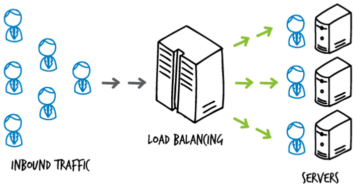

# NLB vs ALB 차이점 정리

# 01. 로드 밸런서(Load Balancer)

> [https://iamondemand.com/blog/elb-vs-alb-vs-nlb-choosing-the-best-aws-load-balancer-for-your-needs](https://iamondemand.com/blog/elb-vs-alb-vs-nlb-choosing-the-best-aws-load-balancer-for-your-needs/)

> 로드 밸런서는 클라우드 환경에서, 고가용성이 필요한 두개 이상의 인스턴스 앞에 있을 가능성이 높다.  
> AWS는 Elastic Load Balancer, Network Load Balancer, Application Load Balancer 세 가지 유형을 LB를 제공한다.

- **Load Balancer**는 **부하(Load)** **분산(Balancing)** **기술을 제공**해주는 **장치** 혹은 **기술**을 의미한다
- 이에 반해 **Load Balancing**은 **인터넷 서비스에 트래픽이 많은 경우 해당 트래픽을 부하/분산 처리**하여 **트래픽이 특정 서버에 집중되지 않게 하는 기술**
- 이러한 LB(Load Balancing)는 OSI 7계층 중 어느 계층에서 동작하는지에 따라 구분이 된다
    - L7(응용 계층) : ALB(Application Load Balancer)
    - L4(전송 계층) : NLB(Netword Load Balancer)

## 01-1. 로드 밸런서(Load Balancer) 장점

> [[네트워크] L4 스위치 L7 스위치 차이, 스위치란? 로드밸런서란?](https://code-lab1.tistory.com/321)

- **부하 분산 처리**
    - **로드 밸런서**는 **서버로 들어오는 트래픽을 여러 서버로 균등하게 분산하여 서버의 부하를 분담**한다
    - 이를 통해 **서버의 부하 방지**와 **시스템 전체 성능 향상**을 가져온다
- **고가용성**
    - **한 대의 서버에 장애 발생** → **다른 서버로 요청 전달**
    - 이를 통해 **시스템 가용성을 높일 수 있음**
- **확장성**
    - **새로운 서버 추가 시** **LB가 이를 감지**하고 **트래픽을 새로운 서버로 분산**
    - **유연**하고 **확장** 가능한 **운영 가능**

# 02.  ALB vs NLB?

## ALB(Application Load Balancer)

- **ALB**는 **L7 응용 계층**(**Application Layer**)에서 **작동**하여 **HTTP/HTTPS를 기반으로 트래픽을 처리**한다
- 복잡한 라우팅 결정(알고리즘 종류 중 하나라는데??) → 즉, **콘텐츠 기반 라우팅이 가능**합니다(아래 2가지 라우팅 종류를 **콘텐츠 기반 라우팅**이라 말한다)
    - **호스트 기반 라우팅(Host-based Routing)**
        - **호스트 헤더에 따라 트래픽 라우딩**, **ex) Host: [api.kenum.com](http://api.kenum.com) 헤더 정보를 통해 라우팅 결정**
        - [api.example.com](http://api.example.com) → A Target Group
        - [blog.example.com](http://blog.example.com) → B Target Group
    - **경로 기반 라우팅 등(Path-based Routing)**
        - **요청 URL 경로에 따라 트래픽 라우팅**
        - /api → A Target Group
        - /blog → B Target Group
- **ALB**는 **고정 IP**(static IP)를 **제공하지 않음**
    - Client에서는 ALB의 IP가 아닌, DNS 기반으로 접근 하는게 좋음
    - 고정 IP 사용하려면 NLB → ALB → Instance 구조를 사용 하거나 람다를 사용하는 방법도 존재하는 것 같다
- **ALB**는 **보안 그룹 지정**이 **가능**하다
- **ALB**는 **L7단**을 **지원**하기 때문에 **SSL** 적용 **가능**
    - WAF + ACM(Amazon Certificate Manager) 조합

## NLB(Network Load Balancer)

[Network Load Balancer, 이제 보안 그룹 지원](https://aws.amazon.com/ko/about-aws/whats-new/2023/08/network-load-balancer-supports-security-groups/)

- **NLB**는 **L4**(전송 계층)에서 작동하여 **TCP/UDP를 기반으로 트래픽을 처리**한다
- **NLB**는 주로 **속도**와 **성능**에 중점을 둔 로드 밸런싱에 적합
- **NLB**는 **고정 IP(Static IP) 제공**한다
    - Client에서는 NLB의 고정 IP를 지정하면 된다
- **NLB**는 **보안 그룹 지정이 불가능**하다
    - 원래는 불가능 하였는데 2023. 08. 10부터 가능하다고 한다, 위 공식 문서 참고
- **NLB**는 **L4단**을 **지원**하기 때문에 **SSL** 적용 **불가능**
    - 어플리케이션 레벨에서 적용해야 함(Nginx → TLS/SSL 적용)

# 03. 로드 밸런싱 알고리즘이란?

> 참고 : [Application Load Balancing, Network Load Balancing 및 Gateway Load Balancing - 로드 밸런싱 유형 간의 차이 - AWS](https://aws.amazon.com/ko/compare/the-difference-between-the-difference-between-application-network-and-gateway-load-balancing/)  
> 참고 : [게시물 | SmileShark](https://www.smileshark.kr/post/what-is-a-load-balancer-a-comprehensive-guide-to-aws-load-balancer)

> 로드밸런싱에는 다양하 알고리즘이 사용된다. 또한 2가지 알고리즘으로 분류(정적, 동적)를 나눌 수 있다.
가장 흔한 알고리즘은 라운드 로빈과 IP 해시 방식이다.
> 

## 03-1. 정적 로드 밸런싱

> 정적 알고리즘 ⇒ 고정된 규칙으로 동작
> 

### ✅ 라운드 로빈 방식(Round Robin Method)

- **클라이언트 요청**을 **여러 서버**에 **순차 배분하는 방식**
- 클라이언트 요청을 순서대로 분배하기 때문에 아래와 같은 경우가 활용하기 적합
    - **서버** **스펙 동일한 경우**
    - **클라이언트 → 서버 연결(세션) 지속 시간 짧은 경우**

### ✅ 가중치 기반 라운드 로빈 방식(Weighted Round Robin Method)

- **각 서버별**로 **가중치**(weight)를 매기고, **가중치가 높은 서버에 클라이언트 요청을 먼저 배분**
- 서버들이 같은 스펙이 아니고, 특정 서버의 스펙이 좋은 경우 해당 서버에 가중치 적용 → 트래픽 처리량을 올릴 수 있음
    - 서버 A : 가중치(8) ⇒ 8개의 request 할당
    - 서버 B : 가중치(2) ⇒ 2개의 request 할당
    - 서버 C : 가중치(3) ⇒ 3개의 request 할당

### ✅ IP 해시 방식(IP Hash Method)

- **로드밸런서**는 **클라이언트 IP 주소**에 대해 **해싱**(**수학적인 계산**)**을 수행**
- 클라이언트 IP 주소 → 숫자 변환 → 개별 서버에 매핑
- **사용자 IP를 해싱**하여 **부하 분산**하기에 **사용자가 항상 동일한 서버로 연결되는 것을 보장**

## 03-2. 동적 로드 밸런싱

> 동적 알고리즘 ⇒ 서버의 상태에 따라 반응
> 

### ✅ 최소 연결 방식(Least Connection Method)

- **최소 연결 방식**은 **연결수가 가장 적은 서버로 트래픽 전달**
- 모든 서버는 유사한 수준의 성능 스펙 필요

### ✅ 최소 응답시간 방식(Least Response Time Method)

- **서버**의 **현재 연결 상태**와 **응답 시간**을 **고려**, **가장 짧은 응답 시간을 보내는 서버로 트래픽 할당**
- 모든 서버의 리소스, 성능, 처리 데이터양이 다를 경우 적합

# 99. 참고 자료

- [AWS - ALB, NLB 비교](https://velog.io/@yange/내부망폐쇄망에서-repository-구성)
- [AWS | ALB와 NLB 차이점](https://no-easy-dev.tistory.com/entry/AWS-ALB와-NLB-차이점)
- [AWS ALB 도메인(호스트) 기반 라우팅 규칙 설정](https://happy-jjang-a.tistory.com/212)
- [Amazon ELB - ALB](https://roykeum1998.tistory.com/212)
- [Application Load Balancer란 무엇입니까? - Elastic Load Balancing](https://docs.aws.amazon.com/ko_kr/elasticloadbalancing/latest/application/introduction.html)