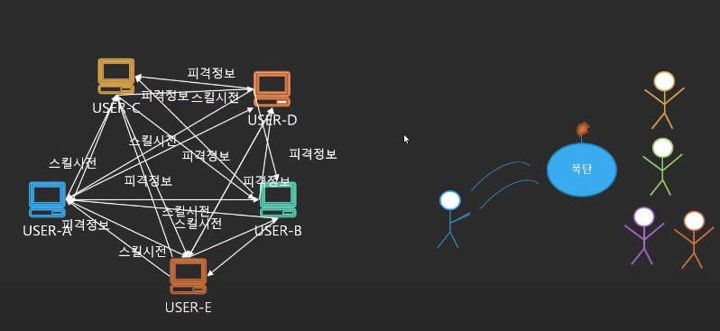

# 01. 클라우드 컴퓨팅이란?

> 온디멘드: 수요에 반응함

- `IT 리소스`를 `인터넷`을 통해 `온디맨드`로 제공하고, `사용한 만큼만 비용을 지불` 하는 것

## 01-1. 서버 클라이언트 아키텍처

> 우선 서버 - 클라이언트 아키텍처가 무엇인지 간단히 살펴보자  
> 또한 서버의 등장 배경에 대해 간략히 알아본다

- 위 장면은 USER-A가 USER-B에게 스킬을 시전하는 장면이다
- 후에 USER-B는 USER-A에게 스킬을 맞았다고 응답한다
- 근데 만약 USER가 3명이 되면 어떻게 될까? 다음 이미지를 보자

- USER-A가 USER-B, USER-C에게 폭탄을 던진다
- USER-B, USER-C는 USER-A에게 스킬에 맞았다고 응답한다
- 후에 USER-B, USER-C는 서로 스킬 피격 정보를 공유한다
- 만약에 USER가 5명이 넘어가면 어떻게 될까? 다음 이미지를 보자

- USER가 몇명 늘었을 뿐인데 위와 같이 엄청 복잡해진다
- 이는 1개의 오청만 잘못되어도 게임의 장애로 이어질 수 있다
- 또한 서버의 엄청난 부하를 가져온다
- `이러한 문제를 해결`하기 위해 `서버`가 `등장`하였다

- 위와 같이 중앙의 서버가 모든 요청을 받고 해당 요청을 처리한다
- 이러한 장점으로 인해 `기업`들은 `서버`를 `도입`하게 된다

## 01-2. 데이터 센터

- `기업`들은 서버 운영을 위해 `데이터 센터`를 `운영`하기 시작함
- `서버`가 `여러대 있는 공간`을 의미
- `데이터센터`
  - `애플리케이션 서버`를 `호스팅`하는 `실제 시설`
  - 컴퓨팅 시스템을 위한 `H/W 장비`
  - 네트워킹 장비 + 전원 공급 장치 + 전기 시스템
  - 백업 발전기
  - 환경 제어장치(에어컨, 냉각장치, 팬)
  - 서버 운영 인력
  - 기타 인프라(보안 장치 -> 아무나 출입 X)
- IDC 문제점
  - `운영 비용 증대`
    - 건물, 서버, 유지보수 비용
  - `한번 구매하면 수요 상관없이 계속 보유`해야함
    - 서버 100대 구매 -> 40대만 사용 -> 60대 낭비
  - `구축 시간`이 `오래 걸림`

> 이러한 문제를 해결하기 위해 기업은 Cloud 서비스를 사용하기 시작

# 02. 클라우드 출현

> 클라우드 컴퓨팅을 이해하기 위해 출장을 다니는 엔지니어에 대한 예시를 살펴보자.  
> 출장을 자주 다니는 엔지니어는 숙박할 곳이 필요하다 가정한다.

## 02-1. 숙박할 집을 직접 짓는다

> IDC Data Center

- 100% 커스텀 가능
- 투자 비용 많이 들고, 기간 오래 걸림
- `변경에 대처 힘듬`
- 유지보수 내가 해야 함
- 사용 안해도 돈 지불

## 02-2. 호텔에 머문다

> AWS Cloud Service

- 100% 커스텀 불가
- 투자 비용 적음, 기간 오래 안걸림
- `변경에 대처 쉬움`
- 유지보수 업체가 함
- 사용한 만큼만 돈 지불 - OnDemand

## 02-3. 클라우드 장점

> 클라우드 -> 빌려쓰기

- `초기 투자 비용 적음`
  - 막대한 초기 비용 대신 OnDemand로 비용 지불
- `수요 예측 필요 없음`
  - Auto Scaling 사용
- `수요에 대한 빠른 대처 가능`
  - 클릭 몇번으로 전 세계 어디든 서버 구축 가능
- `유지보수 쉬움`

## 99. 참고 자료

- [[AWS] AWS 기초 강좌 1: 클라우드 컴퓨팅이란?](https://www.youtube.com/watch?v=JjiYqBl2328&list=PLfth0bK2MgIan-SzGpHIbfnCnjj583K2m)