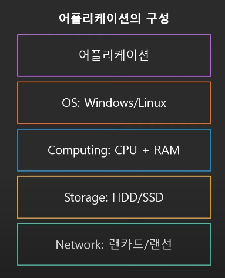
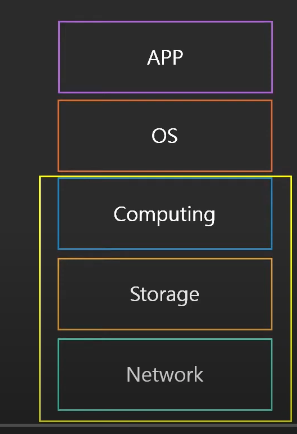
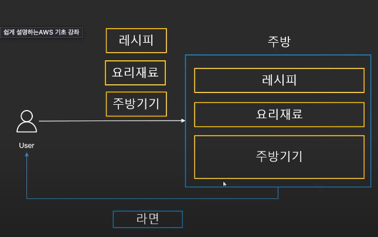
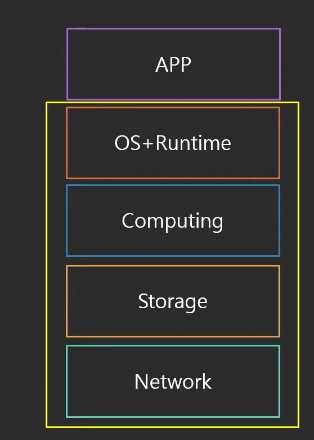
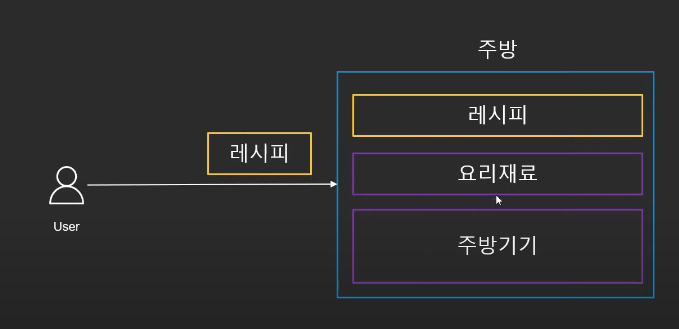
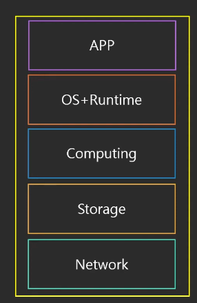
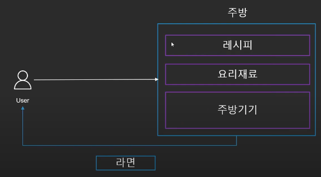

# 01. 클라우드 컴퓨팅 종류

> 이번 시간에는 클라우드 컴퓨팅의 종류에 대해 알아보자.  
> 대표적인 컴퓨팅 종류로는 IaaS, PaaS, SaaS가 존재한다.

## 01-1. 클라우드 컴퓨팅 유형

> 애플리케이션의 구성

- 어플리케이션
- OS: Windows/Linux
- Computing CPU + RAM
- Storage: HDD/SSD
- Network 랜카드/랜선

## 01-2. IaaS(Infrastructure as a Service)

- `Infrastructure as a Service`
  - `인프라만 제공`
  - `OS`를 `직접 설치`하고 `필요한 S/W`를 `개발`해서 사용
  - `가상`의 `컴퓨터 한대`를 `임대`하는 것과 비슷
  - 예: AWS EC2
- `IaaS`는 `주방`을 `빌려주는 것`과 같다
  - 라면 먹으려면 어떻게 해야 할까?

- User는 주방만 빌린다
- 후에 `레시피`, `요리재료`, `주방용품`은 개인거를 사용한다

## 01-3. PaaS(Platform as a Service)

- `Platform as a Service`
  - `인프라` + `OS` + `기타 프로그램 실행에 필요한 부분`(런타임)
  - `바로 코드만 올려서 돌릴 수 있게 구성`
  - 예: Firebase, Elastic Beanstalk
- `PaaS`는 `요리 재료`, `주방용품`은 `다 빌려준다`
  - `레시피`만 가지고 가면 된다

## 01-4. SaaS(Software as a Service)

- `Software as a Service`
  - 인프라 + OS + 필요 S/W 모두 제공
  - 즉, 서비스 자체 제공
  - 다른 셋팅 없이 서비스만 이용
  - 예: Slack, Gmail, Google Docs
- SaaS는 요리 재료, 주방용품, 레시피 다 빌려주는 것

# 02. 클라우드 컴퓨팅 배포 모델

> 다음으로는 클라우드 컴퓨팅 배포 모델에 대해 알아본다

## 02-1. 클라우드 컴퓨팅 배포 모델

### 공개형(클라우드)

- 모든 부분이 Cloud에서 실행
- 낮은 비용
- 높은 확장성

### 폐쇄형

- 커스터마이징 가능
- 초기 비용, 유지보수 비용 비쌈
- 높은 보안

### 혼합형(하이브리드)

- 폐쇄형 + 공개형 혼합
- 폐쇄형에서 공개형으로 전환하는 과도기에 사용
- 폐쇄형의 백업으로 사용

## 99. 참고 자료

- [[AWS] 쉽게 설명하는 AWS 기초 강좌 2: 클라우드 컴퓨팅의 종류](https://www.youtube.com/watch?v=s75iONF6XFw&list=PLfth0bK2MgIan-SzGpHIbfnCnjj583K2m&index=3)
- [[AWS] 가트너 특약 디지털혁신, 구름 하나로 안 된다면](https://www.thescoop.co.kr/news/articleView.html?idxno=37724)