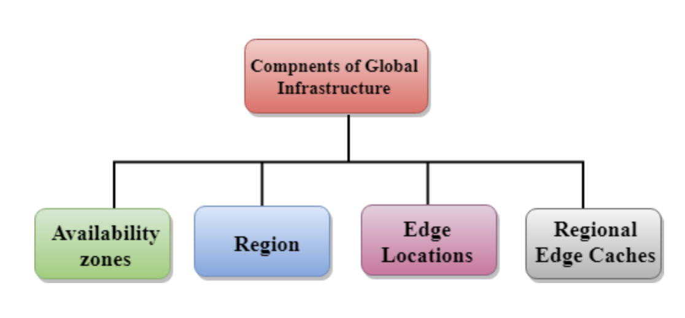
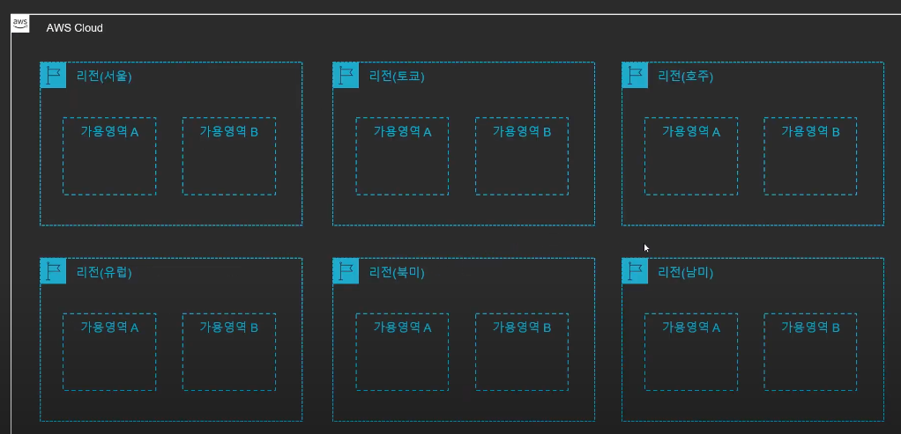

# 01. AWS의 구조-리전,가용역역,엣지로케이션 등

## 01-1. AWS 소개

> AWS는 전 세계적으로 분포한 데이터 센터에서 200개가 넘는 완벽한 기능의 서비스를 제공하는,  
> 세계적으로 가장 포괄적이며, 널리 채택되고 있는 클라우드 플랫폼입니다.

- 실제로 `AWS`는 `클라우드 점유율 1위`이며, 많은 `레퍼런스`가 존재함
- 스타트업, 대기업 상관없이 다양하게 사용됨
- `2002년 출시`되어, 현재 `2020년 기준 연 매출 53조`원 돌파

## 01-2. AWS의 구조

AWS는 리전(Region), 가용영역(Availability Zone), 엣지 로케이션(Edge Location)로 구성되어 있다.  
위 내용을 조금 풀어보자면 아래와 같다.

- AWS는 크게 `AWS 서비스` 존재
- 해당 AWS 서비스 안에 `여러개의 리전` 존재
- 리전 안에는 `2개 이상`의 `가용영역` 존재

> 또한 AWS 서비스는 크게 3가지로 구분 가능  
> 글로벌 서비스, 리전 서비스, 가용영역 서비스 존재

- AWS Cloud: IAM, CloudFront, Route53, WAF
- Region: VPC, S3
- AZ: EC2, RDS

## 01-3. 리전이란?

`전 세계`에는 `여러개의 리전이 존재`한다. 또한 한국은 현재 1개의 리전으로 구성되어 있다.  
`리전`이란 `실제 AWS 서비스가 제공되는 물리적인 서버의 위치를 의미`한다.

`이러한 리전`에는 `고유한 코드`가 부여된다(한국: ap-northeast-2). 또한 위 사진을 보면 리전이 분포되어 있는데  
이렇게 리전이 분포 되어 있는 `첫 번째 이유`는 `네트워크 속도` 때문이다. 우리나라에 존재하는 서버를 미국에서  
접근하면 속도가 느릴 수 있는데, 이 때 미국에 서버를 생성하여 문제 해결이 가능해진다.

`두 번째로`는 `법률 문제`이다. 예를 들면 우리나라 서비스 하는 데이터는 우리 나라에 저장이 되어야 한다는 정책이 있는 경우 등등.... 이러한 이유 때문에 리전을 잘 선택해야 한다.

`세 번째로`는 리전 별 사용 가능한 서비스가 다르기에, 리전을 잘 선택해야 한다.

- 전 세계에 여러개의 리전이 존재한다, 한국은 1개의 리전
- `AWS 서비스가 제공`되는 `서버의 물리적 위치`
- `각 리전에`는 `고유 코드` 부여됨
  - ex) 서울: ap-northeast-2
  - ex) 미국 동부: us-east-1(최초 리전)
- 리전별로 사용 가능한 서비스 다름
- `리전` `선택` 시 `고려할 점`
  - `지연 속도`
  - `법률`(데이터, 서비스 제공 관련)
  - 사용 가능한 AWS 서비스

> 실제 현재 위치에서 가용영역의 시간을 볼 수 있는 아래 사이트도 참고하자  
> [cloudping.info](https://cloudping.info)

## 01-4. 가용영역이란?

> 리전 안에 속해있는 가용영역이란?

- `리전`의 `하위 단위`
  - `하나의 리전`은 반드시 `2개 이상의 가용영역(AZ)로 구성`
- `하나이상`의 `데이터센터`로 구성
- `리전간 연결`은 `매우 빠른 전용 네트워크로 연결`
- 반드시 `물리적`으로 `일정 거리`(몇 KM 이상) 떨어져 있음
  - 다만 `모든 AZ`는 서로 `100KM 이내 위치`
  - 여러 재해에 대한 대비
- `각 계정별 AZ의 코드와 실제 위치 다름`
  - ex) 계정 TEST1의 AZ-A는 계정 TEST2의 AZ-A와 다른 위치(랜덤)
  - 보안 및 한 AZ 몰림 방지

- User A가 Data Center A에 중요 정보 저장
- User B는 Data Center A에 접속 후 탈취
- 사람들은 기본적으로 OK 선택 -> A 가용영역으로 트래픽 집중

- 그렇기에 `AWS`는 `매핑`을 통해 `계정별`로 `다른 AZ 로 연결`

## 01-5. 엣지 로케이션?

- 엣지 로케이션은 `AWS`의 `CloudFront`(CDN)등의 `여러 서비스를 가장` `빠른 속도로 제공`(캐싱)하기 위한 `거점`
- 전 세계 여러 장소에 흩어져 있음

## 01-6. 글로벌 서비스와 리전 서비스

> AWS에는 서비스가 제공되는 지역의 기반에 따라 글로벌, 리전 서비스로 분류한다

- 글로벌 서비스: 데이터 및 서비스를 전 세계의 모든 인프라가 공유
  - `CloudFront`
  - `IAM`
  - `Rout53`
  - `WAF`
- 리전 서비스: 특정 리반 기반 서비스 제공
  - 대부분의 서비스
  - `S3`
    - `S3의 경우 전 세계에서 동일하게 사용 가능하나, 데이터(파일) 자체는 리전에 종속`

## 99. 참고 자료

- [[AWS] AWS 기초 강좌 3: AWS의 구조-리전,가용역역,엣지로케이션 등](https://www.youtube.com/watch?v=tvwDDM-Y-qE&list=PLfth0bK2MgIan-SzGpHIbfnCnjj583K2m&index=4)
- [[AWS] 아마존 웹 서비스 구조 (Region / AZ / Edge Location / Cache)](https://inpa.tistory.com/entry/AWS-%F0%9F%93%9A-%EC%95%84%EB%A7%88%EC%A1%B4-%EC%9B%B9-%EC%84%9C%EB%B9%84%EC%8A%A4-%EA%B5%AC%EC%A1%B0-Region-AZ-Edge-Location-Cache-%EC%99%84%EB%B2%BD-%EC%A0%95%EB%A6%AC)