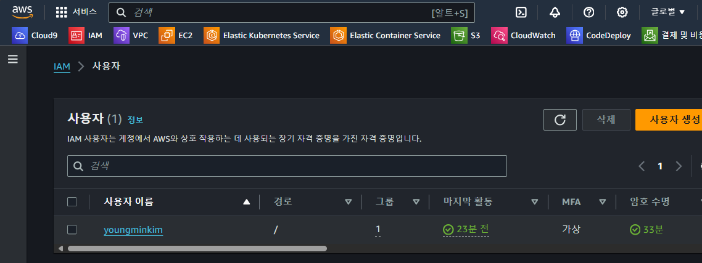
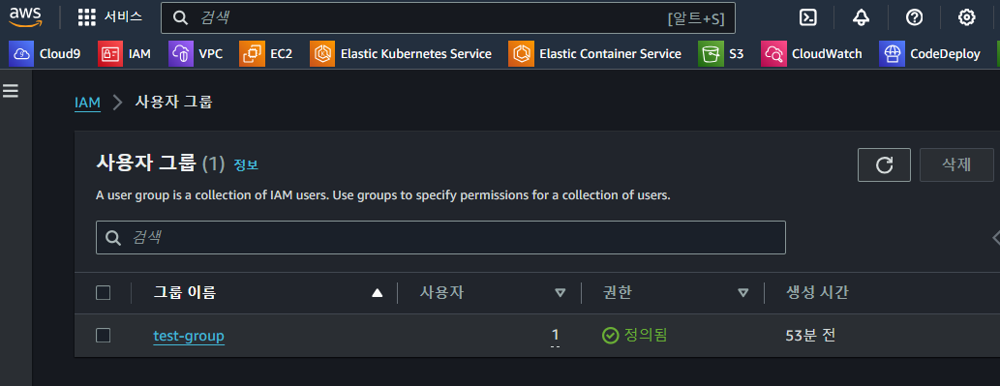
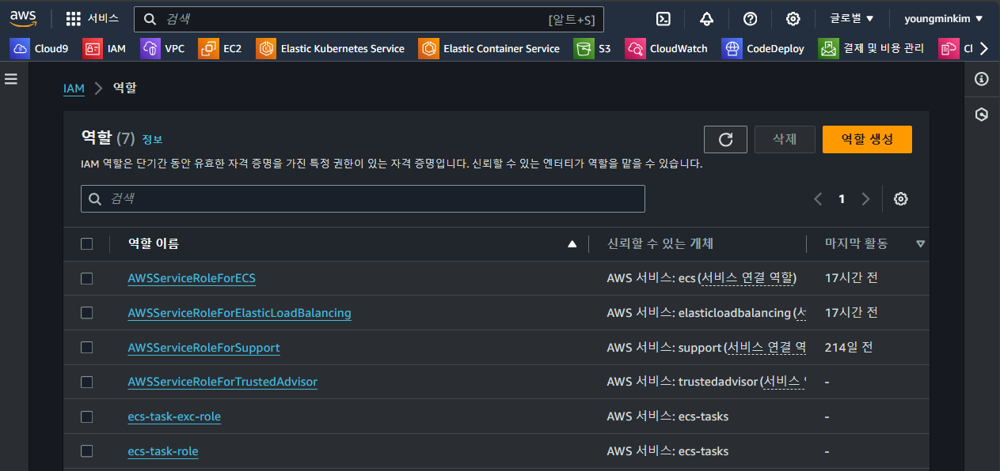
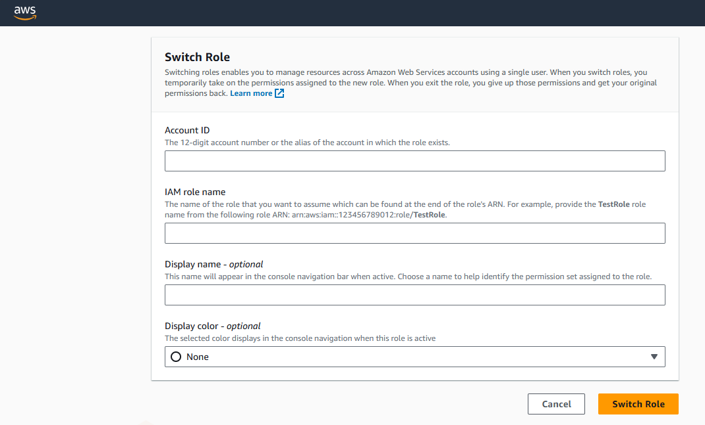

# ECS CI/CD 파이프라인 구성기

> AWS 테스트 계정에서 IAM, ECS, CI/CD 구성을 차례대로 구성해보자  
> VPC 생성의 경우 [해당 링크](https://github.com/ym1085/TIL-Category/blob/master/AWS/create_vpc_etc/README.md)을 참고 하면된다, 이번에는 CI/CD 테스트이기에 default vpc 사용

## 들어가기에 앞서 특이사항 검토

### Blue/Green 배포를 위해 기존 ELB 설정?


```shell
# 검토 내용 : NLB 사용 시 배포 타입 문의
# 가능 여부 : NLB 사용시 CodeDeployDefault.ECSAllAtOnce 옵션만 지원, Canary, Linear를 위해 ALB 사용 필요
# 참고 자료 : https://docs.aws.amazon.com/ko_kr/AmazonECS/latest/developerguide/deployment-type-bluegreen.html
Q. CodeDeploy를 사용하여 ECS Fargate 배포 프로세스를 구성하는 중 문의 사항 존재  
NLB를 사용하는 경우 'CodeDeployDefault.ECSAllAtOnce' 배포 구성만이 지원되는 것으로 파악을 하였는데,  
NLB에서 Canary, Linear 배포 방식을 사용할 수 있는 방법이 존재하는지 검토 요청

A. CodeDeploy서비스를 통해 배포를 진행할 때 NLB를 사용하여 서비스하는 경우  
문서에서 확인하신 것처럼 'CodeDeployDefault.ECSAllAtOnce' 옵션만을 지원한다.  
ECS서비스의 Canary, Linear 배포를 위해서는 ALB를 이용해야함.
```

```shell
# 검토 내용 : 운영중인 ECS의 배포 전략 변경이 가능한지?
# 가능 여부 : 운영중인 ECS의 배포 전략은 변경 불가능
Q. ECS Fargate의 Deployment type 옵션 관련 문의 사항이 있어 문의 사항 존재  
최초 ECS Fargate Service 생성 시 deployment type을 'Rolling Update'로 설정  
한번 배포가 되어 운영중인 ECS Service의 Deployment type을 변경 하는것은 불가능한 것으로 알고 있는데,  
새로운 ECS 서비스를 재생성 하지않고 해당 옵션을 Blue/Green로 변경 할 수 있는 방법이 존재 하는지 검토

A. ECS에서 지원하는 deployment type은 Rolling update, Blue/Green deployment, External 이렇게 세 가지가 존재  
하지만 기존에 생성되어 있는 Service의 deployment type을 변경하는 기능은 현재 ECS에 존재하지 않음.

ECS의 Service를 생성하면 프로비저닝을 위해 AWS CloudFormation이 동작하며 스택이 생성됨  
해당 스택에는 deployment controller가 존재하며 properties으로는 ECS, CODE_DEPLOY, EXTERNAL 이렇게 3개가 존재

하지만 해당 값이 변경되게 되면 새로운 리소스가 기존 리소스를 참조하여 생성되고 기존 리소스는 삭제됨  
이러한 스택의 업데이트 동작 작동 방식은 Replacement  

따라서 ECS deployment controller가 변경되면 CloudFormation 스택 업데이트는 Replacement 방식을 따른다
```

- 현재 ECS A 클러스터는 2개의 ELB(ALB, NLB) 사용중이고, B + C 클러스터는 NLB만 사용중이다
- `ECS Service 배포` 타입을 `Blue/Green`로 설정하는 경우 2개의 ELB 설정이 필요한가?
  - A 클러스터: NLB + ALB 혼합 사용
  - B 클러스터: NLB만 사용
  - C 클러스터: NLB만 사용

## IAM 사용자 생성



- AWS 로그인을 위한 사용자 생성
- 비밀번호의 경우 사용자가 다시 재설정 하도록 지정

## IAM 사용자 그룹 생성



- 위에서 생성한 사용자를, 사용자 권한을 묶기 위해 `test-group` 생성 후 해당 그룹에 넣는다
- 그룹에 넣는 이유는, 그룹별로 권한을 관리하기 위함
- (중요) IAM > 사용자 그룹 > test-group > 권한 Tab 클릭 > 권한 추가 > 인라인 정책 생성

```shell
# 사용자 그룹에 인라인 정책을 추가한다
# 아래와 같이 특정 Role을 Assume 할 수 있는 정책을 추가하여
# Role Base로 AWS 리소스를 사용하도록 권한을 관리한다
# Multi Account인 경우는 다른 AWS Account ID를 지정하겠지만, 현재는 동일한 AWS Account 지정
{
    "Version": "2012-10-17",
    "Statement": [
        {
            "Sid": "test",
            "Effect": "Allow",
            "Action": "sts:AssumeRole",
            "Resource": "arn:aws:iam::65xxxxxxxxx:role/test-role"
        }
    ]
}
```

## 역할 생성



> test-role이라는 역할 생성

- IAM > 역할 > 역할 생성 > 사용자 지정 신뢰 정책 > JSON 신뢰 정책 추가
- 역할은 기본적으로 AWS 서비스에 Attatch 된다, 사용자 or 사용자 그룹에 직접 Attach 되지는 않음
- 해당 Role을 Assume(임시 권한 부여)를 받기 위해서는, 해당 역할에 `신뢰 정책`이 추가 되어야 함
  - IAM > 역할 > test-role(role 선택) > 신뢰 관계 Tab 확인
- 여기서 중요한 부분은 `보안 주체 추가` 클릭 후 특정 AWS Account를 가진 USER를 지정해야 한다는 점
  - 위와 같이 설정을 해야 특정 사용자가 해당 Role을 Assume 할 수 있음

```shell
{
    "Version": "2012-10-17",
    "Statement": [
        {
            "Sid": "Statement1",
            "Effect": "Allow",
            "Principal": {
                "AWS": "arn:aws:iam::65xxxxxxxxx:root"
            },
            "Action": "sts:AssumeRole",
            "Condition": {
                "Bool": {
                    "aws:MultiFactorAuthPresent": "true"
                }
            }
        }
    ]
}
```

## 실제 IAM USER 로그인



> IAM 접속 링크 : https://{aws-account-id}.signin.aws.amazon.com/console

- 위 URL은 IAM > 대시보드 > AWS 계정란을 확인하면 된다
  - 계정 ID: 65xxxxxxxxx
  - 계정 별칭: 별칭은 추가 해주면 됨
  - 이 계정의 IAM 사용자를 위한 로그인 URL: 위에 있는 URL
- 해당 URL을 주소창에 입력 후 IAM 유저 접속 시도
  - 계정ID(12자리) 또는 계정 별칭: 별칭 혹은 AWS Account 입력
  - 사용자 이름: IAM 유저 이름 입력
  - 암호: 암호 입력
  - 로그인 버튼 클릭
  - MFA 코드: 휴대폰에 있는 MFA 코드를 입력한다
- 로그인에 성공 후
  - AWS 메인 화면 > 우측 계정 클릭 > 역할 전환 클릭
  - Account ID: 해당 Role이 존재하는 AWS Account ID 입력
  - IAM Role Name: 해당 AWS Account의 특정 Role 입력
  - Display Name: 아무 이름이나 상관 없음
  - Display Color: 이것도 상관 없음
  - Switch Role 클릭
  - 로그인 성공