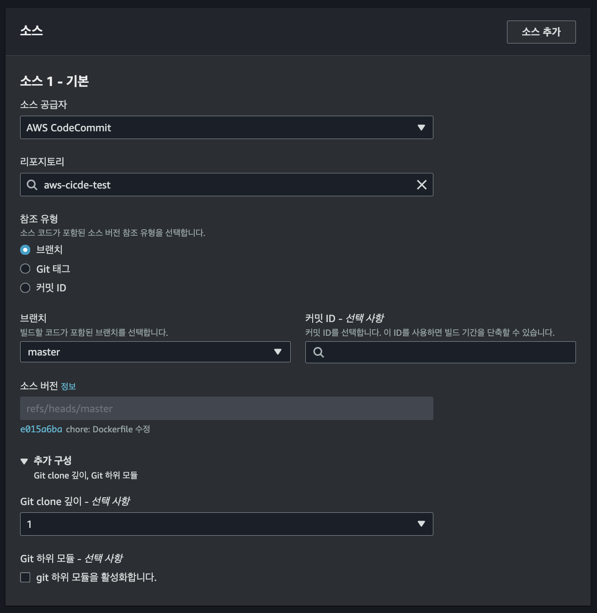

# ECS CI/CD 파이프라인 구성기


> VPC 설정은 따로 하지 않는다, VPC 생성의 경우 [해당 링크](https://github.com/ym1085/TIL-Category/blob/master/AWS/create_vpc_etc/README.md)를 참고  
> 구성 순서의 경우 아래와 같은 순서로 진행한다.  
>
> 1th) Code Commit  
> 2th) CodeBuild  
> 3th) CodePipeline  
> 4th) CodeDeploy  
> 5th) ECS Clustering  
> 6th) Configure Deploy State to Code Pipeline

| 항목 | Jenkins + CodeDeploy<br>(AWS EC2에서 Jenkins 운영) | AWS CodePipeline + CodeBuild + CodeDeploy |
|---|---|---|
| **구현 복잡도** | - Jenkins 설정 및 관리 필요<br>- EC2 인스턴스 관리 부담<br>- 멀티 모듈(4개의 API)에 대한 파이프라인 구성 가능<br>- Blue/Green 배포를 위한 추가 설정 필요 | - AWS 서비스 간 통합 원활<br>- 콘솔에서 파이프라인 설정 용이<br>- 멀티 모듈 프로젝트 지원<br>- Blue/Green 배포 네이티브 지원 |
| **유지 보수성** | - Jenkins 및 EC2 인스턴스의 유지 보수 필요<br>- 플러그인 업데이트 및 보안 패치 관리 필요 | - 완전 관리형 서비스로 유지 보수 부담 감소<br>- AWS에서 인프라 및 서비스 관리 |
| **확장성** | - EC2 인스턴스 성능에 의존<br>- 스케일링을 위해 추가 구성 필요 | - AWS의 자동 확장성 제공<br>- 사용량에 따른 탄력적 자원 관리 |
| **비용** | - EC2 인스턴스 비용 지속 발생<br>- Jenkins 운영에 따른 인력 및 유지 비용 | - 사용한 만큼 지불하는 요금제<br>- 초기 투자 비용 절감 가능<br>- 사용량 증가 시 비용 증가 가능성 |
| **AWS 서비스 통합** | - AWS 서비스와의 통합을 위한 추가 설정 필요<br>- IAM 권한 관리 복잡 | - AWS 서비스 간 원활한 통합<br>- IAM을 통한 세분화된 권한 관리 |
| **커스터마이징** | - Jenkins의 플러그인으로 세부적인 커스터마이징 가능<br>- 복잡한 빌드 및 배포 프로세스 구현 용이 | - 제한된 커스터마이징<br>- 표준화된 파이프라인 제공 |
| **러닝 커브** | - Jenkins 및 AWS 서비스 모두 숙지 필요<br>- 팀이 Jenkins에 익숙하다면 유리 | - AWS 서비스 학습 필요<br>- AWS 콘솔 및 서비스에 익숙하다면 이점 |
| **보안 및 컴플라이언스** | - Jenkins 서버의 보안 관리 필요<br>- EC2 인스턴스에 대한 보안 설정 필요 | - AWS의 보안 및 컴플라이언스 표준 준수<br>- 보안 패치 및 업데이트 자동 관리 |
| **모니터링 및 로깅** | - 추가적인 모니터링 도구 필요<br>- 설정 복잡도 증가 | - AWS CloudWatch와 통합<br>- 상세한 모니터링 및 로깅 제공 |
| **개발자 경험** | - Jenkins에 익숙한 팀에게 유리<br>- 기존 워크플로우 유지 가능 | - AWS 서비스에 익숙하다면 생산성 향상<br>- 통합된 환경 제공 |


## Stage 01 - Code Commit 구성

- 개발자 도구 > CodeCommit > 리포지토리 > 리포지토리 생성
- 리포지토리 이름: aws-cicde-test
- 설명: 설명
- 태그
  - Name: aws-cicde-test
  - Env: test
- 생성 버튼 클릭 -> 생성 완료

> Code Commit 리포지토리 생성 완료 HTTPS Git 자격 증명을 위해 해당 IAM 유저의 자격증명 설정


- IAM > 사용자 > cicde-deploy-user > 보안 자격 증명 선택
  - AWS CodeCommit에 대한 HTTPS Git 자격 증명 생성
  - (중요) `ID` + `Password`를 메모장에 따로 저장
- 로컬 포로젝트에서 CodeCommit HTTPS URL 경로 연결
- Git Push를 통해 업로드하면 완료
  - `ID`는 이전에 `위에서 발급받은 ID`를 넣는다
  - `Password`도 이전에 `위에서 발급한 Password`를 넣는다

## Stage 02 - Code Build 구성

> 우선 ECR(Elastic Container Registry) 저장소를 하나 만들어야 한다.  
> 해당 저장소는 Code Commit에 의해 만들어진 이미지가 저장이 될 것이다.

### ECR 이미지 리포지토리 추가


- IAM 권한은 `AmazonEC2ContainerRegistryFullAccess` 추가
  - 테스트이기에 모든 권한 일단 허용
- Amazon ECR > 프라이빗 레지스트리 > 리포지토리 > 리포지토리 생성
- `해당 리포지토리`에는 `Code Build에 의해 생성된 이미지`가 저장됨

### CodeBuild 프로젝트 구성

> ✅ CodeBuild??  
>
> S/W 개발에 필요한 소스를 컴파일 --> 테스트 --> 소스 패키지형으로 만들어주는,  
> 완전 관리형 지속적 통합(CI) 서비스

`AWS CodeBuild`란 S/W `개발`에 `필요한` `소스코드`를 `컴파일`하고 `테스트`를 `실행`하며,  
`배포 준비가 완료`된 S/W 패키지를 생성하는 `완전 관리형 지속적 통합`(Continuous Integration/CI) `서비스`이다.

`AWS CodeBuild`는 `빌드`를 `수행`할 `빌드 작업의 양`에 따라 `인프라`가 `자동`으로 `확장` 및 `축소`를 지원해,  
`여러 빌드`를 `동시`에 `처리`할 수 있기에 대기시간 없이 `빠르게` `빌드가 가능`하다.

`AWS CodeBuild`는 `AWS KMS`(Key Management Service)를 이용해 `빌드 아티팩트가 암호화` 된다.  
또한 IAM을 사용하여 권한 관리도 가능하다.

> 🚀 CodeBuild 프로젝트 구성 진행

이제 CodeCommit 리포지토리도 구성하였고, CodeBuild에 의해 생성되는 Docker 이미지가 저장되는 리포지토리도 생성이 되었다.  
다음으로 `CodeBuild 프로젝트를 구성`하여 CodeCommit의 `소스`를 `빌드`(`Build`)하고 `ECR`에 `업로드` 하는 저장하는 구조를 만들어보자.

- 개발자 도구 > CodeBuild > 빌드 프로젝트 > 프로젝트 생성
- 빌드 프로젝트 생성 설정(Configuration)
  - Project Configuration: 빌드 프로젝트 이름, 상세 설명, 태그
  - Source: 프로젝트 소스 저장소
  - Environment: 실행 환경
  - BuildSpec: 빌드 실행 파일 설정(빌드 진행 시 참조되는 .yml 타입의 설정 파일)
  - Artifacts: 빌드 파일 저장 및 캐싱 파일 관리
  - Logs: 빌드 로그

### CodeBuild Option 01 - Project Configuration


- 프로젝트 이름: CodeBuild 프로젝트명 입력
- 설명: 상세 설명 입력(Optional)
- Tags: 태그 입력(Optional)
- `빌드 배지 활성화`
  - `GUI적으로 빌드 단계를 확인하고 싶으면 뱃지 활성화 체크`
- `빌드 횟수 제한`
  - `동시에 빌드되는 횟수 제한 하는 경우 사용`

### CodeBuild Option 02 - Source(소스 저장소 지정)



- 소스 1 - 기본
- 소스 공급자
  - Github, AWS CodeCommit, AWS S3 등 지정
- 리포지토리
  - 빌드에 사용할 리포지토리의 이름 지정
- 참조 유형
  - 브랜치: 소스 코드가 있는 브랜치하여 빌드 수행 가능
  - Git 태그: 특정 태그를 참조하여 빌드 수행 가능
  - 커밋 ID: 특정 커밋을 참조하여 빌드 수행 가능
- 브랜치
  - 빌드 대상 소스가 있는 브랜치 지정
  - 이왕이면 `master`를 기준으로 하자
- 소스 버전
  - 빌드할 소스의 Git 참조
  - 여기서 refs/heads/master는 master 브랜치 의미
- 추가 구성
  - Git Clone 깊이 - 선택 사항
    - 빌드할 때 Git 리포지토리의 히스토리를 얼마나 깊게 클론할 것인지 지정
    - 위 설정을 통해 클론 시간 단축 가능
    - Git Clone 깊이 1: 최신 커밋 한개만 가져온다
    - Git Clone 깊이 2: 최신 커밋과 그 이전 커밋, 총 2개의 커밋을 가져온다
    - Git Clone 깊이 2: 최신 세 개의 커밋을 가져온다
  - Git 하위 모듈 - 선택 사항
    - Git 서브 모듈 관련 리포티토리 존재 시 활성화

> 💡 Add Source를 클릭하여 여러개의 프로젝트를 동시에 빌드하는 것도 가능  

### CodeBuild Option 03 - Environments(환경)


- `빌드 실행 환경 구성`
- 환경 이미지
  - 관리형 이미지(선택)
    - `AWS CodeBuild`에서 `제공`하는 `기본 이미지`
    - 다양한 운영체제 + 런타임 환경 제공
    - 별도의 이미지 관리할 필요 없음
  - 사용자 지정 이미지
    - 사용자 지정 Docker image
    - 맞춤 설정 필요한 경우 사용
    - `특정 버전 라이브러리가 필요한 경우 사용`
- 운영체제
  - `CodeBuild`는 `컨테이너화된 환경`에서 `빌드`를 수행한다
  - 빌드 환경에서 사용할 운영체제 지정
  - Amazon Linux(선택), Ubuntu, Windows
- 런타임
  - 빌드 환경에서 사용할 S/W 스택 선택
  - `Standard`(선택), Node.js, Python, Java, Docker
  - Standard는 만능, 나머지는 특정 언어에 특화된 런타임 환경 제공
- 이미지
  - `운영체제`와 `런타임`이 `포함`된 `Docker 이미지 지정`
- 이미지 버전
  - 선택한 Docker 이미지의 버전 지정
- 서비스 역할
  - 새 서비스 역할(선택)
- 추가 구성
  - 제한시간
    - 빌드 제한 시간
      - 빌드 작업이 완료될때까지의 최대 시간 지정
        - 시간: 1
        - 분: 0
    - 대기중인 제한 시간
      - 빌드 작업이 대기열에서 기다릴 수 있는 최대 시간 지정
        - 시간: 8
        - 분: 0
  - 권한이 있음(중요)
    - Docker 컨테이너 내부에서 또 다른 Docker 컨테이너를 실행하거나
    - 빌드 작업 중 권한 승격이 필요한 경우 이 옵션 사용

### CodeBuild Option 04 - Buildspec(빌드 사양)

> ✅ Build Spec??  
>
> 참고 : <https://velog.io/@chosule/AWS-CodeBuild>
> Build Spec은 AWS CodeBuild가 빌드를 실행하는데 사용하는 YAML 형태의 빌드 명령 및 관련 설정의 모음.  
> 소스코드의 일부로 빌드 사양을 포함 가능하며, 빌드 프로젝트를 생성할때 빌드 사양 정의도 가능함.  
>
> 🚀 Build Spec 옵션이 CodeBuild에서 가장 중요한 옵션이라고 봐도 된다.  
> 기본적으로 프로젝트 루트(/) 경로에서 파일을 읽어온다.  
>
> 💡 아래 3개의 파일을 프로젝트 루트 경로에 넣어준다

```yml
# 참고 : https://github.com/ym1085/aws-cicde-code-series?tab=readme-ov-file
version: 0.2

phases:
  pre_build:
    commands:
      - echo Logging in to Amazon ECR...
      - echo "IMAGE_REPO_NAME - $IMAGE_REPO_NAME"
      - echo "IMAGE_TAG - $IMAGE_TAG"
      - echo "AWS_ACCOUNT_ID - $AWS_ACCOUNT_ID"
      - echo "AWS_DEFAULT_REGION - $AWS_DEFAULT_REGION"
      - aws ecr get-login-password --region $AWS_DEFAULT_REGION | docker login --username AWS --password-stdin $AWS_ACCOUNT_ID.dkr.ecr.$AWS_DEFAULT_REGION.amazonaws.com
      - ./gradlew test # Gradle 테스트 실행
      - echo Pre-build completed on `date`
  build:
    commands:
      - echo Build started on `date`
      - ./gradlew build # Gradle 빌드 실행
      - echo Building the Docker image...
      - docker build -t $IMAGE_REPO_NAME:$IMAGE_TAG .
      - docker tag $IMAGE_REPO_NAME:$IMAGE_TAG $AWS_ACCOUNT_ID.dkr.ecr.$AWS_DEFAULT_REGION.amazonaws.com/$IMAGE_REPO_NAME:$IMAGE_TAG
  post_build:
    commands:
      - echo Build completed on `date`
      - echo Pushing the Docker image...
      - docker push $AWS_ACCOUNT_ID.dkr.ecr.$AWS_DEFAULT_REGION.amazonaws.com/$IMAGE_REPO_NAME:$IMAGE_TAG
      - echo "updated line for codebuild ci"
      #- printf '[{"name":"aws-cicd-test","imageUri":"%s"}]' $AWS_ACCOUNT_ID.dkr.ecr.$AWS_DEFAULT_REGION.amazonaws.com/$IMAGE_REPO_NAME:$IMAGE_TAG > imagedefinitions.json
      #- printf '{"ImageURI":"%s"}' $AWS_ACCOUNT_ID.dkr.ecr.$AWS_DEFAULT_REGION.amazonaws.com/$IMAGE_REPO_NAME:$IMAGE_TAG > imageDetail.json

artifacts:
  files:
    - appspec.yml
    - taskdef.json
    #- imagedefinitions.json
    #- imageDetail.json
  discard-paths: yes

cache:
  paths:
    - ~/.gradle/caches/**/* # Gradle 캐시를 사용하여 빌드 시간을 단축
    - ~/.gradle/wrapper/dists/**/* # Gradle 래퍼를 캐시
```

```yml
# appSpec.yml
version: 0.0
Resources:
  - TargetService:
      Type: AWS::ECS::Service
      Properties:
        TaskDefinition: "arn:aws:ecs:ap-northeast-2:65xxxxxxxxxx:task-definition/test-api-td-prod:1"
        LoadBalancerInfo:
          ContainerName: "test-api-server"
          ContainerPort: 8080
        PlatformVersion: "1.4.0"
        NetworkConfiguration:
          AwsvpcConfiguration:
            Subnets: ["subnet-0xxxxxxxxxx", "subnet-0xxxxxxxxxx"]
            SecurityGroups: ["sg-0xxxxxxxxxx"]
            AssignPublicIp: "DISABLED"
```

```json
{
  "family": "test-api-td-prod",
  "containerDefinitions": [
    {
      "name": "aws-cicd-test-api",
      "image": "6xxxxxxxxxxxx.dkr.ecr.ap-northeast-2.amazonaws.com/aws-cicd-test:latest",
      "cpu": 256,
      "memory": 512,
      "memoryReservation": 512,
      "portMappings": [
        {
          "containerPort": 8080,
          "hostPort": 8080,
          "protocol": "tcp"
        }
      ],
      "essential": true,
      "environment": [
        {
          "name": "TZ",
          "value": "Asia/Seoul"
        },
        {
          "name": "SPRING_PROFILES_ACTIVE",
          "value": "production"
        }
      ],
      "mountPoints": [
        {
          "sourceVolume": "test-shared-volume",
          "containerPath": "/data/",
          "readOnly": false
        }
      ],
      "volumesFrom": [],
      "linuxParameters": {
        "capabilities": {
          "add": [],
          "drop": []
        }
      },
      "privileged": false,
      "readonlyRootFilesystem": false,
      "pseudoTerminal": false,
      "dockerLabels": {
        "env": "prod",
        "Name": "test-api-server"
      },
      "healthCheck": {
        "command": [
          "CMD-SHELL",
          "curl --location --request GET 'http://127.0.0.1:8080/api/v1/health-check' || exit 1"
        ],
        "interval": 10,
        "timeout": 10,
        "retries": 10
      },
      "systemControls": []
    }
  ],
  "taskRoleArn": "arn:aws:iam::6xxxxxxxxxxxx:role/ecs-task-role",
  "executionRoleArn": "arn:aws:iam::6xxxxxxxxxxxx:role/ecs-task-exc-role",
  "networkMode": "awsvpc",
  "volumes": [
    {
      "name": "test-shared-volume",
      "host": {}
    }
  ],
  "requiresCompatibilities": [
    "FARGATE"
  ],
  "cpu": "256",
  "memory": "512",
  "ephemeralStorage": {
    "sizeInGiB": 21
  },
  "runtimePlatform": {
    "operatingSystemFamily": "LINUX"
  }
}
```

> buildspec.yml 파일에서 -> printf '[{"name":"ECR_리포지토리명","imageUri":"%s"}]'... -> 이 부분 반드시 ECR_리포지토리명으로 지정

- 기본적으로 `buildspec.yml` 파일 생성 후 관리
- buildspec.yml 파일은 아래 내용 관리
  - 빌드 소스에 대한 명세(코드 및 버전)
  - 빌드 라이프 사이클
  - Output로 나오는 파일
  - 캐싱 데이터
- buildspec.yml은 크게 4가지로 구분
  - version: 빌드 스펙 버전 지정(2022년 04월) 0.2 버전 지원, 0.3 도 나옴
  - `phases`: 빌드 프로세스의 각 단계(단계별 스크립트) 정의
    - `install`: 빌드에 필요한 도구 + lib `설치 단계`
    - `pre_build`: `빌드 전`에 `수행`할 `작업` 정의하는 단계
    - `build`: `실제 빌드 작업` `수행 단계`
    - `post_build`: `빌드 완료` 후 `수행`할 `작업` 정의(ex: test, deploy)
  - artifacts
    - 빌드 결과물 정의, 어디에 저장할지 명시
    - ex) S3 버킷 파일이나 Dir 지정
  - cache
    - `빌드 시간 단축`을 위해 `캐시`할 `파일`이나 `Dir` 지정
    - ex) 종속성 파일, 빌드 결과물 등을 캐싱하여 다음 빌드 시 재사용
  - env
    - 환경 변수 지정
      - AWS_DEFAULT_REGION: ap-northeast-2
      - IMAGE_REPO_NAME: aws-cicd-test
      - IMAGE_TAG: latest
      - AWS_ACCOUNT_ID: 6xxxxxxxxxxxx
    - `AWS Systems Manager Parameter Store`(`SSPS`)에서 환경변수 조회 가능
    - `AWS Secrets Manager`에서 비밀 값 조회 가능

> Code Build의 Service Role은 다음과 같이 생성

<details>  
<summary>codebuild-service-role.json Role</summary>  
<div markdown="1">  

```json
{
  "Version": "2012-10-17",
  "Statement": [
    {
      "Effect": "Allow",
      "Principal": {
        "Service": "codebuild.amazonaws.com"
      },
      "Action": "sts:AssumeRole"
    }
  ]
}
```

</div>  
</details>

- IAM > 역할 > 역할 생성 > 사용자 지정 신뢰 정책
- codebuild 서비스가 특정 정책(권한)을 Assume 할 수 있게 위 신뢰 정책 지정
- 다음으로 어떤 정책을 위 role에 연동할지 지정
  - codebuild-basepolicy 정책을 위 role에 연결한다

<details>  
<summary>codebuild-basepolicy.json policy</summary>  
<div markdown="1">  

```json
{
    "Version": "2012-10-17",
    "Statement": [
        {
            "Sid": "CloudWatchLogsPolicy",
            "Effect": "Allow",
            "Action": [
                "logs:CreateLogGroup",
                "logs:CreateLogStream",
                "logs:PutLogEvents"
            ],
            "Resource": "*"
        },
        {
            "Sid": "CodeCommitPolicy",
            "Effect": "Allow",
            "Action": [
                "codecommit:GitPull"
            ],
            "Resource": "*"
        },
        {
            "Sid": "S3GetObjectPolicy",
            "Effect": "Allow",
            "Action": [
                "s3:GetObject",
                "s3:GetObjectVersion"
            ],
            "Resource": "*"
        },
        {
            "Sid": "S3PutObjectPolicy",
            "Effect": "Allow",
            "Action": [
                "s3:PutObject"
            ],
            "Resource": "*"
        },
        {
            "Sid": "ECRPullPolicy",
            "Effect": "Allow",
            "Action": [
                "ecr:BatchCheckLayerAvailability",
                "ecr:GetDownloadUrlForLayer",
                "ecr:BatchGetImage"
            ],
            "Resource": "*"
        },
        {
            "Sid": "ECRAuthPolicy",
            "Effect": "Allow",
            "Action": [
                "ecr:GetAuthorizationToken"
            ],
            "Resource": "*"
        },
        {
            "Sid": "ECRUploadPolicy",
            "Effect": "Allow",
            "Action": [
                "ecr:InitiateLayerUpload",
                "ecr:UploadLayerPart",
                "ecr:CompleteLayerUpload",
                "ecr:PutImage"
            ],
            "Resource": "arn:aws:ecr:ap-northeast-2:<your-account-id>:repository/<your-repository-name>"
        },
        {
            "Effect": "Allow",
            "Action": [
                "codebuild:CreateReportGroup",
                "codebuild:CreateReport",
                "codebuild:UpdateReport",
                "codebuild:BatchPutTestCases",
                "codebuild:BatchPutCodeCoverages"
            ],
            "Resource": "*"
        }
    ]
}
```

</div>  
</details>

- 실제 운영 환경에서는 이렇게 권한 러프하게 주면 절대 안된다
- ECRUploadPolicy도 특정 버킷을 지정해주어야 함
- 위 Role에 Policy를 Attach하고 생성을 클릭하였으나 passrole 관련 오류가 발생한다

> User: arn:aws:iam::6xxxxxxxxxxxxx:user/cicd-deploy-user is not authorized to perform: iam:PassRole on resource: arn:aws:iam::6xxxxxxxxxxxxx:role/codebuild-service-role because no identity-based policy allows the iam:PassRole action

<details>  
<summary>codebuild-service-pass-role.json Policy</summary>  
<div markdown="1">  

```json
{
    "Version": "2012-10-17",
    "Statement": [
        {
            "Effect": "Allow",
            "Action": "iam:PassRole",
            "Resource": "arn:aws:iam::654654278070:role/codebuild-service-role"
        }
    ]
}
```

- 위와 같이 사용자 그룹에 새로운 정책(codebuild-service-pass-role.json)을 추가한다
- 위 정책(Policy)를 통해 해당 그룹에 포함된 사용자는 해당 role(codebuild-service-pass-role.json)를 pass role 할 수 있다

</div>  
</details>

### CodeBuild Option 05, 06, 07 - 배치 구성, 아티팩트, 로그

- 위 3개의 옵션은 이번 내용에서는 사용하지 않음
- CloudWatch만 true로 설정한다, true로 해야 실시간 로그 확인 가능

### CodeBuild 실행 확인


- `빌드 로그`를 `실시간`으로 보려면 Cloudwatch Logs를 true로 설정해야 나온다
- 프로젝트의 루트 경로('/')에 buildspec-dev.yml 파일이 업로드 되었다 가정
- 해당 프로젝트를 CodeCommit에 업로드 완료 하였다 가정
- 개발자 도구 > CodeBuild > 빌드 프로젝트 > CodeBuild명 > 빌드 시작 클릭
  - 빌드가 완료되면 위와 같이 ECR에 이미지가 업로드된 것을 확인 가능

## Stage 03 - Code Pipeline 구성

> ✅ 권한은 일단 CodePipelineFull_Access 권한 주고 시작

- `AWS Code Pipeline`이 `담당`하는 부분은 아래 `5가지 영역`
  - `지정한 리포지토리`의 `특정 브랜치`에 대한 `소스 코드 변경 감지` (이벤트 감지)
  - 변경 감지 후 `빌드 공급자`를 통한 `빌드 진행` (CodeBuild)
  - 빌드 완료 시 `배포 공급자`를 통한 `배포` (CodeDeploy)
  - 파이프라인 과정 `모니터링`
  - 파이프라인 과정 `알림`
- `AWS Code Pipeline`의 `생성 과정`은 총 `5가지 스텝`으로 구분
  - 1th) `파이프라인 설정` 선택
  - 2th) 소스코드 변경 감지할 `소스 스테이지`
  - 3th) 빌드 과정 설정을 위한 `빌드 스테이지`
  - 4th) 배포 과정을 설정할 `배포 스테이지`
  - 5th) 마지막 검토 존재
  - etc) 빌드 스테이지 + 배포 스테이지는 설정 안해도 `추후 설정 가능`

### CodePipeline option 01 - Pipeline Configuration(파이프라인 설정)

> ✅ (중요) CodePipeline으로 배포하려면 멀티 모듈 프로젝트를 배포 구성하기 불편합니다  
> 또한 IDC와 클라우드가 공존하려면 Jenkins + Code Deploy 조합이 간편함
> 참고 : https://jojoldu.tistory.com/283


- AWS Console > CodePipeline 생성
- 파이프라인 이름 필드에 `aws-cicd-pipeline-test` 입력
- 실행모드
  - 대체
    - 기본 설정(default)
    - 파이프라인이 여러 실행을 처리 시 가장 최근의 실행이 이전 실행을 대체
    - ex) 첫번째 실행 완료 x -> 새로운 커밋 + 푸시 발생 첫번째 실행은 중단하고 최근 실행이 시작됨
  - 대기(파이프라인 유형 V2 필요)
    - 실행이 완료될때까지 대기열에 들어가는 모드
    - 실행이 대체되지 않고 순차적으로 처리됨
  - 병렬(파이프라인 유형 V2 필요)
    - 여러 실행이 병렬로 처리됨
    - 개발 환경에서 각 기능이 별도의 브랜치에서 독립적으로 배포될때 유용
- 서비스 역할
  - 기존 서비스 역할(선택)
  - `AWSCodePipelineServiceRole-aws-cicd-pipeline-test`
  - 서비스 역할 이름 입력 true 설정
- 변수
  - 설정 안함
- 고급 설정
  - 아티팩트 스토어
    - 기본 위치 - CodePipeline이 S3에 버킷을 생성하여 해당 버킷에 아티팩트 저장
    - 사용자 지정 위치 - 사용자가 원하는 S3 버킷에 아티팩트 저장
  - 암호화 키
    - 기본 AWS 관리형 키 - `AWS에서 관리하는 키`를 사용하여 `CodePipeline`이 `자동`으로 `키`를 `생성`하고 `관리`한다
    - 고객 관리형 키 - 사용자가 키를 생성하여 관리, 권한 등 직접 제어

### CodePipeline option 02 - Add source stage(소스 스테이지 추가)


- AWS Console > CodePipeline 생성
- 소스 공급자
  - AWS CodeCommit(선택)
- 리포지토리 이름
  - aws-cicde-test(선택)
- 브랜치 이름
  - master(선택)
- 변경 감지 옵션
  - Amazon CloudWatch Events(권장) (선택)
- 출력 아티팩트 형식
  - CodePipeline 기본값 (선택)

### CodePipeline option 03 - Add build stage(빌드 스테이지 추가)


> ✅ 이전에 CodeBuild에서 환경 변수를 지정하였는데 Code Pipeline에서 환경 변수를 지정하면  
> 어떤 환경변수가 적용이 되는 것인지? -> CodePipeline에서 지정한 환경변수가 CodeBuild에서 지정한 환경변수보다 우선순위 된다고 한다.

- AWS Console > Code Pipeline 생성
- 빌드 공급자
  - AWS CodeBuild(선택)
- 리전
  - 아시아 태평양(서울) (선택)
- 입력 아티팩트
  - SourceArtifact (선택)
- 프로젝트 이름
  - aws-cicd-codebuild-test (선택)
- 환경변수
  - 생략
- 빌드 유형
  - `단일 빌드`
    - `단일 CodeBuild 작업`을 `생성`하고 `실행`
    - `빌드 단계가 실행`될 때마다 `하나의 빌드 작업이 생성`됨
    - 해당 작업은 `단일 개체`로 `처리`되며, 각 작업은 `직렬`로 처리됨
    - 각 단계의 이전 빌드가 성공적으로 완료된 후 다음 빌드 단계 실행
  - `배치 빌드`
    - 여러개의 CodeBuild 작업을 배치로 생성하고 실행
    - `여러 빌드 작업을 동시에 실행`하고, `병렬`로 진행
    - 시간 단축 효과

### CodePipeline option 04 - Add deploy stage(배포 스테이지 추가)


- 지금은 배포 단계를 건너뛴다. 파이프라인을 검토하고 추후에 만든다

### CodePipeline option 05 - 검토 및 생성


- 파이프라인 생성 버튼 클릭
- 음 일단 IAM:CreateRole 권한 부여하고 해소, 추후 왜 그런지 원인 파악은 필요

> ❌ 서비스 역할 cwe-role-ap-northeast-2-aws-cicd-pipeline-test을(를) 생성할 수 없습니다. 다음 메시지에 예외에 대한 세부 정보가 포함되어 있습니다. User: arn:aws:iam::6xxxxxxxxxx:user/cicd-deploy-user is not authorized to perform: iam:CreateRole on resource: arn:aws:iam::6xxxxxxxxxx:role/service-role/cwe-role-ap-northeast-2-aws-cicd-pipeline-test because no identity-based policy allows the iam:CreateRole action

- cwe-role-ap-northeast-2-aws-cicd-pipeline-test 생성된거를 보니 권한은 따로 없음, 신뢰 관계만 있음
- 추후 권한 막히는 경우 위 권한 추가 후 신뢰 관계만 추가해달라고 해야겠음

```json
{
    "Version": "2012-10-17",
    "Statement": [
        {
            "Effect": "Allow",
            "Principal": {
                "Service": "events.amazonaws.com"
            },
            "Action": "sts:AssumeRole"
        }
    ]
}
```

> CodePipeline 생성 후 화면은 다음과 같다


> ❌ The service role or action role doesn’t have the permissions required to access the AWS CodeCommit repository named aws-cicde-test. Update the IAM role permissions, and then try again. Error: User: arn:aws:sts::6xxxxxxxxxxx:assumed-role/codepipeline-service-role/1726745559598 is not authorized to perform: codecommit:GetBranch on resource: arn:aws:codecommit:ap-northeast-2:6xxxxxxxxxxx:aws-cicde-test because no identity-based policy allows the codecommit:GetBranch action

- 에러를 확인해보니 위와 같은 에러가 출력됨
- 우선 codepipline-service-role에 custom role 추가

```json
{
    "Version": "2012-10-17",
    "Statement": [
        {
            "Effect": "Allow",
            "Action": [
                "codecommit:GetBranch",
                "codecommit:GetCommit",
                "codecommit:UploadArchive",
                "codecommit:GetUploadArchiveStatus",
                "codecommit:CancelUploadArchive"
            ],
            "Resource": "arn:aws:codecommit:ap-northeast-2:6xxxxxxxxxxx:aws-cicde-test"
        }
    ]
}
```

## Stage 04 - ECS 클러스터 구성

### 클러스터 생성


- Elastic Container Service > Create Cluster
  - Cluster name: test-cluster
  - Default namespace - optional: test-cluster-ns
  - Infrastructure: AWS Fargate(Serverless)
  - Monitoring: false
  - Encryption: false
  - Tags: false
  - Create 클릭

### Task Definition 생성

```json
{
    "family": "test-api-td-prod",
    "containerDefinitions": [
        {
            "name": "test-api-server",
            "image": "65xxxxxxxxxx.dkr.ecr.ap-northeast-2.amazonaws.com/test-api-server:1.0.0",
            "cpu": 256,
            "memory": 512,
            "memoryReservation": 512,
            "portMappings": [
                {
                    "containerPort": 8080,
                    "hostPort": 8080,
                    "protocol": "tcp"
                }
            ],
            "essential": true,
            "environment": [
                {
                    "name": "TZ",
                    "value": "Asia/Seoul"
                },
                {
                    "name": "SPRING_PROFILES_ACTIVE",
                    "value": "production"
                }
            ],
            "mountPoints": [
                {
                    "sourceVolume": "test-shared-volume",
                    "containerPath": "/data/",
                    "readOnly": false
                }
            ],
            "volumesFrom": [],
            "linuxParameters": {
                "capabilities": {
                    "add": [],
                    "drop": []
                }
            },
            "privileged": false,
            "readonlyRootFilesystem": false,
            "pseudoTerminal": false,
            "dockerLabels": {
                "env": "prod",
                "Name": "test-api-server"
            },
            "healthCheck": {
                "command": [
                    "CMD-SHELL",
                    "curl --location --request GET 'http://127.0.0.1:8080/health-check' || exit 1"
                ],
                "interval": 10,
                "timeout": 10,
                "retries": 10
            },
            "systemControls": []
        }
    ],
    "taskRoleArn": "arn:aws:iam::65xxxxxxxxxx:role/ecs-task-role",
    "executionRoleArn": "arn:aws:iam::65xxxxxxxxxx:role/ecs-task-exc-role",
    "networkMode": "awsvpc",
    "volumes": [
        {
            "name": "test-shared-volume",
            "host": {}
        }
    ],
    "requiresCompatibilities": [
        "FARGATE"
    ],
    "cpu": "256",
    "memory": "512",
    "ephemeralStorage": {
        "sizeInGiB": 21
    },
    "runtimePlatform": {
        "operatingSystemFamily": "LINUX"
    }
}
```

- Task Definition > Task 생성(JSON) 기반 > 위 JSON을 통해 TD 생성
- ECR에 이미지를 올리는 것은 나중에 하고, 우선 ECS Service부터 만들어보자
- 그 전에 우선 Service를 생성하기 위해 IAM Role을 만들어야 한다

### IAM Role ecsCodeDeployRole 생성

> ECS Service에서 배포 타입을 Blue/Green로 설정하려면 CodeDeploy 관련 Role이 필요하다  
> 하여 신규 Role을 만들고 해당 Role을 ECS Service 사용 시 사용 해보자

```json
{
    "Version": "2012-10-17",
    "Statement": [
        {
            "Sid": "",
            "Effect": "Allow",
            "Principal": {
                "Service": [
                    "codedeploy.amazonaws.com",
                    "ecs.amazonaws.com"
                ]
            },
            "Action": "sts:AssumeRole"
        }
    ]
}
```

- IAM > 역할 > 역할 생성 > AWS 서비스
  - 서비스 또는 사용 사례: Code Deploy
  - 사용 사례: CodeDeploy - ECS 후 다음 선택
  - 위와 같이 신뢰할 수 있는 엔터티 선택, 엔터티는 ecs와 codedeploy 지정
- 이렇게 하면 ECS Service 생성 시 해당 권한을 사용할 수 있음

### Target Group 생성

> 현재는 테스트이기에 Nginx와 같은 웹 서버를 따로 사용하지 않는다,  
> 하여 기존에는 80, 81 과 같은 포트를 사용하지만 지금은 WAS 서버에 바로 TG를 붙힌다

- EC2 > 대상그룹 > 대상 그룹 생성
  - 1번 타겟 그룹 생성
    - 대상 유형 선택: IP 주소(Fargate는 IP 지정)
    - 대상 그룹 이름: test-tg-01
    - 프로토콜:포트: HTTP/8080
    - IP주소 유형: IPv4
    - VPC: default-vpc
    - 프로토콜 버전: HTTP1
    - 상태검사: HTTP
    - 상태검사 경로: /health-check
  - 2번 타겟 그룹 생성
    - 대상 유형 선택: IP 주소(Fargate는 IP 지정)
    - 대상 그룹 이름: test-tg-02
    - 프로토콜:포트: HTTP/8081
    - IP주소 유형: IPv4
    - VPC: default-vpc
    - 프로토콜 버전: HTTP1
    - 상태검사: HTTP
    - 상태검사 경로: /health-check

### ALB 생성

> 2개의 타겟그룹 생성 후 ALB를 생성해보자, 우선 테스트 후 바로 삭제할 것이기에,  
> 여기서는 요금 추적을 위한 Tags나 WAF 등에 설정은 생략 하였다

- EC2 > 로드 밸런서
  - 로드밸런서 생성
  - Application Load Balancer 생성 버튼 클릭
  - 로드밸런서 이름: test-alb
  - 체계
    - 인터넷 경계(public)
    - VPN 환경인 경우 -> NLB를 사용하고 내부 경계로 변경하면 내부에서만 사용 가능
  - 로드 밸런서 IP 주소 유형: IPv4
  - 네트워크 매핑
    - VPC: default-vpc 선택
    - ap-northeast-2a, 2b 선택
  - 보안그룹: default(NLB도 이제는 보안그룹 추가 가능, 생성 후 변경은 못함)
  - 리스너 및 라우팅
    - 1번 옵션
      - 1-1) 프로토콜: HTTP
      - 1-2) 포트: 8080
      - 1-3) 기본 작업: test-tg-01 선택
    - 2번 옵션
      - 2-1) 프로토콜: HTTP
      - 2-2) 포트: 8081
      - 2-3) 기본 작업: test-tg-02 선택
  - 로드밸런서 생성

### ECS Service 생성

> ECS Service에서도 테스트이기에 Service Connect와 같은 부가 옵션은 설정하지 않음

- AWS ECS Container Service > Clusters > test-cluster > Services > Create 선택
  - Environments
    - Compute Options: Launch Type
    - Launch Type: FARGATE
    - Platform Version: 1.4.0
  - Deployment configuration
    - Application Type: Service
    - Task Definition: 이전에 만든 Task 선택
    - Service name: test-service-prod
    - Desired Tasks: 0(ECR 없기에 우선 0로 지정)
    - Deployment Type: Blue/Green
    - Deployment Configuration: CodeDeployDefaults.ECSAllAtOnce
    - Service role for CodeDeploy: ecsCodeDeployRole
  - Service connect
    - 비활성화
  - Service discovery
    - 비활성화
  - Network
    - 여기서는 기본 네트워크 사용
    - public IP는 off로 지정
  - Load balancing
    - Load balncer type: Application Load Balancer
    - Container: test-api-server 8080:8080
    - Application Load Balancer
      - Use an Existing Load Balancer
    - Load Balancer: test-alb
    - Health Check grace period: 200
    - Listeners
      - Use an existing listener: 8080:HTTP
    - Test Listeners
      - Use an existing listener: 8081:HTTP
    - Target Group 1
      - test-tg-01
      - /health-check
      - HTTP
    - Target Group 2
      - test-tg-02
      - /health-check
      - HTTP
    - Create 버튼 클릭

## Stage 05 - Code Deploy 구성


- AWS Console > CodePipeline > 파이프라인 > 파이프라인명 > 파이프라인 편집 > Add Stage
- 작업 그룹 추가
  - 작업 이름
    - ECS-FARGATE-BLUE-GREEN-DEPLOY-TASK
  - 작업 공급자
    - Amazon ECS(Blue/Green)
  - 리전
    - 아시아 태평양 (서울)
  - 입력 아티펙트
    - BuildArtifact
  - AWS CodeDeploy 애플리케이션 이름
    - AppECS-test-cluster-aws-cicd-test-api(ECS 생성 시 자동으로 만들어지는 리소스)
  - AWS CodeDeploy 배포 그룹
    - DgpECS-test-cluster-aws-cicd-test-api(ECS 생성 시 자동으로 만들어지는 리소스)
  - Amazon ECS 작업 정의
    - BuildArtifact / taskdef.json(CodeBuild에 의한 작업물)
  - AWS CodeDeploy AppSpec 파일
    - BuildArtifact / appspec.yaml(CodeBuild에 의한 작업물)
  - 이미지 세부 정보가 있는 입력 아티팩트
    - imagedefinitions.json(CodeBuild에 의한 작업물)
- AWSCodeDeployDeployerAccess IAM 정책 추가

> ❌ Exception while trying to read the task definition artifact file from: BuildArtifact. 오류 발생  
> Artifact는 3MB를 넘기면 안된다는 이슈가 있음  
>
> 참고 1 : https://stackoverflow.com/questions/57216053/invalid-action-configuration-exception-while-trying-to-read-the-task-definition  
> 참고 2 : https://happyengine.tistory.com/m/140

### ECS 배포 및 부가 설정 관련 AWS TAM 답변 정리

> 기존 서비스 운영중에 SA 분의 도움을 받았던 부분에 관하여 정리

### Blue/Green 배포를 위해 기존 ELB 설정?


```shell
# 검토 내용 : NLB 사용 시 배포 타입 문의
# 가능 여부 : NLB 사용시 CodeDeployDefault.ECSAllAtOnce 옵션만 지원, Canary, Linear를 위해 ALB 사용 필요
# 참고 자료 : https://docs.aws.amazon.com/ko_kr/AmazonECS/latest/developerguide/deployment-type-bluegreen.html
Q. CodeDeploy를 사용하여 ECS Fargate 배포 프로세스를 구성하는 중 문의 사항 존재  
NLB를 사용하는 경우 'CodeDeployDefault.ECSAllAtOnce' 배포 구성만이 지원되는 것으로 파악을 하였는데,  
NLB에서 Canary, Linear 배포 방식을 사용할 수 있는 방법이 존재하는지 검토 요청

A. CodeDeploy서비스를 통해 배포를 진행할 때 NLB를 사용하여 서비스하는 경우  
문서에서 확인하신 것처럼 'CodeDeployDefault.ECSAllAtOnce' 옵션만을 지원한다.  
ECS서비스의 Canary, Linear 배포를 위해서는 ALB를 이용해야함.
```

```shell
# 검토 내용 : 운영중인 ECS의 배포 전략 변경이 가능한지?
# 가능 여부 : 운영중인 ECS의 배포 전략은 변경 불가능
Q. ECS Fargate의 Deployment type 옵션 관련 문의 사항이 있어 문의 사항 존재  
최초 ECS Fargate Service 생성 시 deployment type을 'Rolling Update'로 설정  
한번 배포가 되어 운영중인 ECS Service의 Deployment type을 변경 하는것은 불가능한 것으로 알고 있는데,  
새로운 ECS 서비스를 재생성 하지않고 해당 옵션을 Blue/Green로 변경 할 수 있는 방법이 존재 하는지 검토

A. ECS에서 지원하는 deployment type은 Rolling update, Blue/Green deployment, External 이렇게 세 가지가 존재  
하지만 기존에 생성되어 있는 Service의 deployment type을 변경하는 기능은 현재 ECS에 존재하지 않음.

ECS의 Service를 생성하면 프로비저닝을 위해 AWS CloudFormation이 동작하며 스택이 생성됨  
해당 스택에는 deployment controller가 존재하며 properties으로는 ECS, CODE_DEPLOY, EXTERNAL 이렇게 3개가 존재

하지만 해당 값이 변경되게 되면 새로운 리소스가 기존 리소스를 참조하여 생성되고 기존 리소스는 삭제됨  
이러한 스택의 업데이트 동작 작동 방식은 Replacement  

따라서 ECS deployment controller가 변경되면 CloudFormation 스택 업데이트는 Replacement 방식을 따른다
```

- 현재 ECS A 클러스터는 2개의 ELB(ALB, NLB) 사용중이고, B + C 클러스터는 NLB만 사용중이다
- `ECS Service 배포` 타입을 `Blue/Green`로 설정하는 경우 2개의 ELB 설정이 필요한가?
  - A 클러스터: NLB + ALB 혼합 사용
  - B 클러스터: NLB만 사용
  - C 클러스터: NLB만 사용

## 99. 참고 자료

- [[AWS] AWS CodePipeline를 이용한 CICD 환경 구성](https://www.joinc.co.kr/w/man/12/codepipeline?page=2&name=REDIS&)
- [[AWS] AWS Code Commit, Code Build & Code Deploy with Amazon Fargate (ECS)](https://sunitabachhav2007.hashnode.dev/create-an-aws-code-pipeline-with-aws-code-commit-code-build-code-deploy-with-amazon-fargate-ecs)
- [[AWS] AWS Code Family 를 통해 CI/CD 환경 구축](https://blog.kyobodts.co.kr/2024/05/07/hands-on-aws-code-family-%EB%A5%BC-%ED%86%B5%ED%95%B4-ci-cd-%ED%99%98%EA%B2%BD-%EA%B5%AC%EC%B6%95/)
- [[AWS] 헷갈리는 AWS CI/CD](https://blog.toktokhan.dev/%ED%97%B7%EA%B0%88%EB%A6%AC%EB%8A%94-aws-ci-cd-399db833e45f)
- [[AWS] CI/CD 구성(2) - 소스 빌드 CodeBuild](https://log4day.tistory.com/46)
- [[AWS] AWS CodeBuild를 이용해서 프로젝트 빌드하기](https://blog.walkinpcm.com/10)
- [[AWS] AWS CodeBuild로 docker image build 하는 project 생성하는 방법](https://velog.io/@bellship24/AWS-CodeBuild%EB%A1%9C-docker-image-build-%ED%95%98%EB%8A%94-project-%EC%83%9D%EC%84%B1%ED%95%98%EB%8A%94-%EB%B0%A9%EB%B2%95)
- [[AWS] 향로님 - AWS로 배포하기 시리즈 - 3. AWS Code Pipeline으로 배포하기
](https://jojoldu.tistory.com/283)