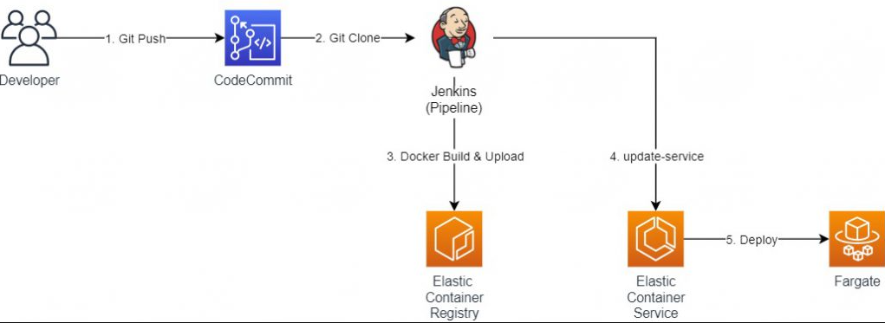
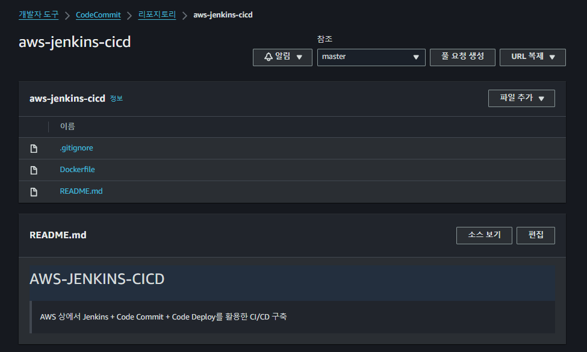
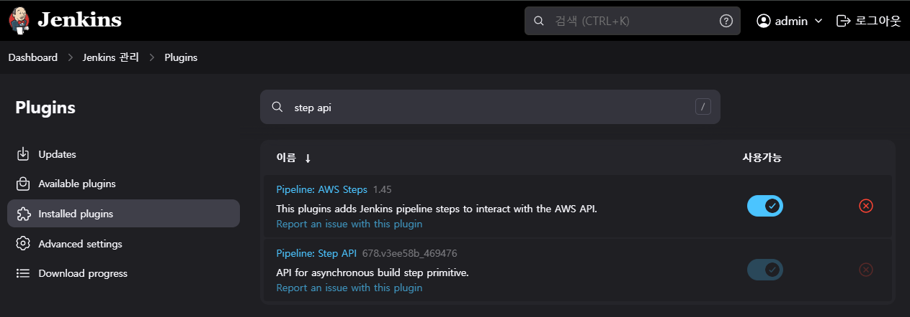

# ECS CI/CD 파이프라인 구성기 - Jenkins pipeline을 이용한 ECS 배포

> 이전에 ECS CI/CD Code Series를 통한 Hands on은 진행한 경험이 있다  
> 이번에는 ECS Fargate + Code Commit + Code Deploy + Jenkins를 통한 파이프라인을 구성해보자

## Hands on 실습 환경 구성 및 동작 과정



> Hands On 동작 과정은 아래와 같음

1. 개발자 -> `Git Push` -> Code Commit 리포티토리
2. Jenkins -> Code Commit Git Credentials 사용 -> Code Commit `소스 Clone`
   1. AWS에서 IAM 사용자 HTTPS Git 자격증명 다운로드
3. Jenkins -> `소스 docker build` -> 빌드한 이미지 ECR 업로드
4. Jenkins -> AWS CLI ecs update-service -> 배포 진행

### Hands On 순서

1. Dockerfile 생성
2. CodeCommit에 소스 코드 Push
3. Jenkins 서버 환경 구성
4. Jenkins 환경변수(ENV) 등록
5. Jenkins용 IAM Role 생성
6. Jenkins Pipeline 설정

### ✅ 1. Dockerfile 생성

> Dockerfile 빌드를 통해 이미지 생성 > 이미지 기반 컨테이너 실행

Dockerfile이란 컨테이너 이미지를 생성하기 위한 하나의 구성 파일을 의미한다.  
컨테이너에 생성해야 하는 `패키지`, `소스 코드`, `명령어`, `환경 변수` 등을 정의하는 파일이다.

```dockerfile
# alpine은 경량화된 리눅스 배포판
FROM node:10.13-alpine

WORKDIR /home
COPY . .
ENV TZ Asia/Seoul

RUN npm install
CMD npm run start
```

1. FROM: 생성할 이미지의 베이스 이미지 지정
2. WORKDIR: 작업 DIR 지정
3. COPY: 로컬 경로에서 컨테이너로 복사할 파일 지정
4. ADD: 호스트 OS의 파일을 컨테이너로 복사
   1. COPY와 파일 복사하는 부분은 동일
   2. 원격 URL을 기반으로 다운로드 -> 복사
   3. gzip 압축 해제 -> 복사
   4. ADD는 COPY와 같이 명확하지 않음, 복사만 할거면 COPY 사용 권장
5. ENV: Docker Container 안에서 사용할 환경변수 지정
6. EXPOSE: 컨테이너 노출 포트 지정
7. CMD: 컨테이너 실행 -> 최초 실행 -> <실행할 명령어>
   1. docker run 인자로 오버라이딩 가능
8. ENTRYPOINT: 컨테이너 실행 -> 최초 실행 -> <실행할 명령어>
   1. docker run 인자로 오버라이딩 불가능

### ✅ 2. CodeCommit에 소스 코드 Push



1. Code Commit 리포지토리 생성
2. CI/CD를 수행할 IAM 사용자 생성
   1. IAM 사용자 -> AWSCodeCommitPowerUser 정책 연결
3. 생성한 IAM 사용자의 HTTPS Git 자격증명 다운로드
4. 다운로드한 자격증명을 이용해 CodeCommit 접근
5. AWS Code Commit push 결과 확인

### ✅ 3. Jenkins 서버 환경 구성

> Jenkins 설치의 경우 [공식 문서](https://www.jenkins.io/doc/tutorials/tutorial-for-installing-jenkins-on-AWS/)를 통해 AWS EC2 t2.micro 인스턴스를 통해 설치 진행  
> t2.micro 인스턴스의 경우 무료 인스턴스이므로 비용 없이 사용 가능하며, swap mem 사용

### ✅ 4. Jenkins 환경변수(ENV) 등록

1. Jenkins 대시보드에서 "Manage Jenkins" > "Manage Plugins"로 이동
2. Available > AWS Code Commit Jobs Plugin, Pipeline: AWS Steps, AWS CodePipeline, Docker 검색 및 설치
3. Dashboard > Jenkins 관리 > Credentials > (globals) 클릭 > Code Commit Credentials 등록

### ✅ 5. Jenkins용 IAM Role 생성

> 외부 시스템 -> AWS 리소스 사용하려면 어떻게 해야 하는가?  
> 기본적으로는 AWS IAM(Identity and Access Management)을 통해 접근 권한을 관리한다.

외부 시스템에서 AWS 리소스에 접근하려면 `장기 보안 자격증명`, `임시 보안 자격증명`을 사용해야 한다.

### 장기 보안 자격증명

1. 삭제하지 않는 이상 장기적으로 사용 가능한 자격 증명(access_key, secret_key)
2. Jenkins에 자격증명 KEY가 노출되므로 권장 안함

### 임시 보안 자격증명

1. 임시적으로 사용하는 자격증명(session_token)
2. Hands On에서는 보안을 위해 임시 보안 자격증명을 사용 -> Role 베이스

> 1개의 Role을 생성하고 3개의 정책 연결

`jenkins-role`

```json
{
  "Version": "2012-10-17",
  "Statement": [
    {
      "Effect": "Allow",
      "Principal": {
        "Service": "ec2.amazonaws.com"
      },
      "Action": "sts:AssumeRole"
    }
  ]
}
```

`least-ecs-policy`

```json
{
  "Version": "2012-10-17",
  "Statement": [
    {
      "Effect": "Allow",
      "Action": [
        "application-autoscaling:Describe*",
        "application-autoscaling:PutScalingPolicy",
        "application-autoscaling:DeleteScalingPolicy",
        "application-autoscaling:RegisterScalableTarget",
        "cloudwatch:DescribeAlarms",
        "cloudwatch:PutMetricAlarm",
        "ecs:List*",
        "ecs:ExecuteCommand",
        "ecs:Describe*",
        "ecs:UpdateService",
        "iam:PassRole",
        "iam:AttachRolePolicy",
        "iam:CreateRole",
        "iam:GetPolicy",
        "iam:GetPolicyVersion",
        "iam:GetRole",
        "iam:ListAttachedRolePolicies",
        "iam:ListRoles",
        "iam:ListGroups",
        "iam:ListUsers"
      ],
      "Resource": "*"
    }
  ]
}
```

1. 전반적인 ECS 관련 서비스 관리를 위한 정책

`sts-assume-role`

```json
{
  "Version": "2012-10-17",
  "Statement": [
    {
      "Sid": "VisualEditor0",
      "Effect": "Allow",
      "Action": "sts:AssumeRole",
      "Resource": "*"
    }
  ]
}
```

1. EC2 인스턴스가 instance profile IAM Role로 사용하도록 assume policy 추가

`ecr-upload-policy`

```json
{
  "Version": "2012-10-17",
  "Statement": [
    {
      "Effect": "Allow",
      "Action": [
        "ecr:GetAuthorizationToken",
        "ecr:BatchCheckLayerAvailability",
        "ecr:PutImage",
        "logs:CreateLogStream",
        "logs:PutLogEvents"
      ],
      "Resource": "*"
    }
  ]
}
```

1. Jenkins에서 ECR 이미지 업로드를 위한 정책

### ✅ 6. Jenkins Pipeline 설정



> Assume Role을 통해 Jenkins 파이프라인을 구성하려면 아래 2개의 플러그인 설치 필요

1. Pipeline: AWS Steps
2. Pipeline: Step API

> Jenkins 신규 Item 생성

1. 새로운 Item 생성 클릭
2. Enter an item name: nodejs-pip
3. Select an item type: Pipeline
4. Dashboard > nodejs-pip > Configuration > 이 빌드는 매개변수가 있습니다 > password parameter
   1. 매개변수명: GIT_CREDENTIALS_ID
   2. Default Value: HTTPS Git 자격증명 비밀번호 입력
5. Pipeline script 칸에 코드 삽입

```groovy
pipeline {
    agent any
    stages {
        stage('Git Clone') {
            steps {
                script {
                    try {
                        git url: "{CodeCommit 리포지토리 HTTPS URL}", branch: "master", credentialsId: "$GIT_CREDENTIALS_ID"
                        sh "sudo rm -rf ./.git"
                        env.cloneResult=true
                    } catch (error) {
                        print(error)
                        env.cloneResult=false
                        currentBuild.result = 'FAILURE'
                    }
                }
            }
        }
        stage('ECR Upload') {
            steps {
                script{
                    try {
                        withAWS(role: '{Jenkins용 IAM Role 이름}', roleAccount: '{AWS 계정 번호}', externalId:'externalId') {
                            sh 'aws ecr get-login-password --region ap-northeast-2 | docker login --username AWS --password-stdin {ECR 리포지토리 URI}'
                            sh 'docker build -t nodejs .'
                            sh 'docker tag nodejs:latest {ECR 리포지토리 URI}/nodejs:latest'
                            sh 'docker push {ECR 리포지토리 URI}/nodejs:latest'
                        }
                    } catch (error) {
                        print(error)
                        echo 'Remove Deploy Files'
                        sh "sudo rm -rf /var/lib/jenkins/workspace/${env.JOB_NAME}/*"
                        currentBuild.result = 'FAILURE'
                    }
                }
            }
            post {
                success {
                    echo "The ECR Upload stage successfully."
                }
                failure {
                    echo "The ECR Upload stage failed."
                }
            }
        }
        stage('Deploy') {
            steps {
                script{
                    try {
                        withAWS(role: '{IAM Role 이름}', roleAccount: '{AWS 계정 번호}', externalId:'externalId') {
                            sh"""
                                aws ecs update-service --region ap-northeast-2 --cluster {ECS 클러스터 이름} --service {ECS 서비스 이름} --force-new-deployment
                            """
                        }

                    } catch (error) {
                        print(error)
                        echo 'Remove Deploy Files'
                        sh "sudo rm -rf /var/lib/jenkins/workspace/${env.JOB_NAME}/*"
                        currentBuild.result = 'FAILURE'
                    }
                }
            }
            post {
                success {
                    echo "The deploy stage successfully."
                }
                failure {
                    echo "The deploy stage failed."
                }
            }
        }
    }
}
```

- `pipeline`
  - Jenkins 파이프라인 정의
- `agent any`
  - Jenkins가 파이프라인을 실행할 때 사용할 agent 지정
  - Jenkins는 master - worker 구조로 동작
- `stages`
  - 파이프라인 여러 단계 정의, 각 단계 `stage`로 구분
    - stage('Git Clone'): git command 통해 CodeCommit에서 소스 클론(Clone)
    - stage('ECR Upload'): 빌드한 이미지 ECR 업로드
    - stage('Deploy'): ECS 배포 진행
- `try-catch 블록`
  - 예외처리 수행을 위한 블록
- `post 블록`
  - 각 단계의 성공/실패 후 출력 메시지 표시

## 99. 참고 자료

- [[CI/CD] [Hands On] CI/CD – Jenkins pipeline을 이용한 ECS 배포](https://tech.cloud.nongshim.co.kr/2021/08/30/hands-on-ci-cd-jenkins-pipeline%EC%9D%84-%EC%9D%B4%EC%9A%A9%ED%95%9C-ecs-%EB%B0%B0%ED%8F%AC/)
- [[CI/CD] ECS CICD Automation - 1. Intro](https://aws-diary.tistory.com/34)
- [[CI/CD] Jenkins 설치와 AWS Code Repository와 연동](https://yes5.tistory.com/m/47)
