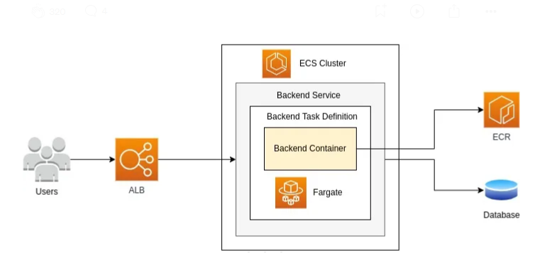
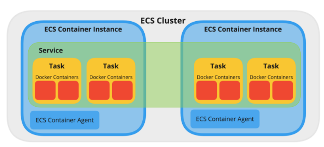
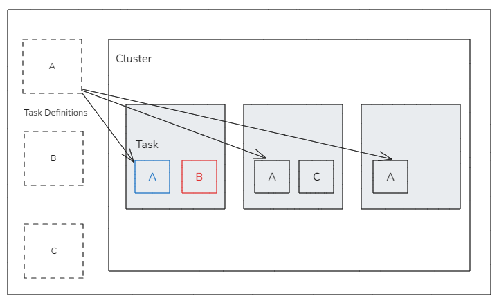
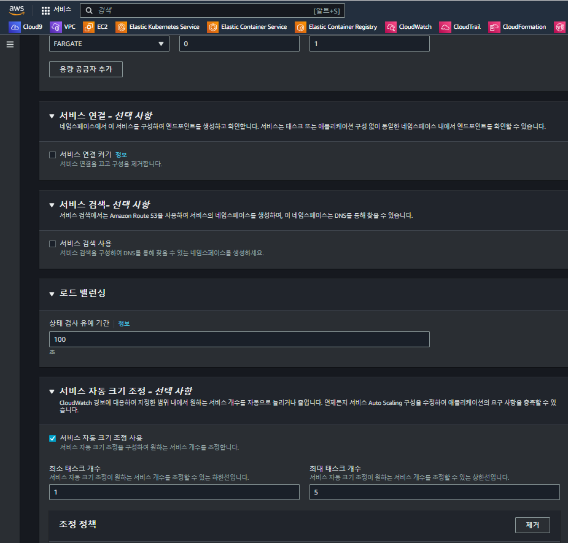

# ECS란?

> 이번에는 ECS에서 Task 타입으로 EC2 or Fargate를 사용하는 경우에 대해 정리한다.  
> ECS는 AWS에서 제공하는 Elastic Container Service(완전 관리형 컨테이너 오케스트레이션) 서비스이다.

## ECS(Elastic Container Service)?

> 그냥 EC2에 docker 설치해서 구성하면 되는거 아닌가? <- 이렇게 생각 할 수 있다.  
> 하지만 위 방법이 아닌, AWS ECS를 사용하는 이유는 다음과 같다고 생각한다.

- ECS: `AWS에서 제공`하는 `완전 관리형 컨테이너 오케스트레이션 서비스`
- `컨테이너 관리`
  - `AWS 타 서비스와의 연동 가능`(IAM, ELB, ECR.. 등)
  - 컨테이너의 `생성`, `중지`, `관리` 할 수 있게 해주는 컨테이너 관리 서비스
  - 컨테이너의 `배포`, `Auto Scailing`, `로드 밸런싱` 및 관리를 `자동화`
  - AWS에서 제공되는 자동화 배포 파이프라인 구성 가능(Code commit, Code pipeline, Code Deploy..)
- 서비스 스케쥴러 도구(Docker swam, K8s, Nomad)
  - 서비스 스케쥴러란?
    - 클러스터 내의 컴퓨팅 리소스 관리
    - 사용자 APP을 어느 호스트에서 서비스할지 결정하는 S/W
    - 즉, Container를 관리하는 S/W라 이해하면 될 것 같다

## ECS 구성 요소

> AWS ECS의 구성 요소는 크게 Cluster, Service, Task, Container 로 구성되어있다.  
> 출처 : https://sakyasumedh.medium.com/setup-application-load-balancer-and-point-to-ecs-deploy-to-aws-ecs-fargate-with-load-balancer-4b5f6785e8f

### Cluster

- `클러스터`는 `Docker Container`를 `실행` 시킬 수 있는 `논리적인 공간`
  - `Docker가 설치`된 `인스턴스`에 `Docker Container`가 실행 되는데,
  이러한 `인스턴스`들을 `목적에 맞게 하나로 묶는 단위`를 `클러스터`라 한다
  - `논리적인 공간이`므로, 컨테이너 인스턴스가 없는 `빈 클러스터 생성 가능`
  - `ECS Agent`를 통해 `논리적인 클러스터에 연결` 됨
    - 실제 인스턴스에 ECS Agent 설치 되어 있어야함

### Service

- `ECS Task를 관리하는 상위 개념`
- Task를 실행하는 방법은 아래 2가지가 존재
  - `직접 Task를 실행`
  - `Service를 이용한 실행`
- 직접 Task 실행은 `Task에 대한 관리가 안됨` + `ELB, AutoScale 사용 불가능`, 대부분 사용 안함
- 서비스는 Task 실행 및 관리를 담당
  - `Task`가 `실행`되어야 하는 `개수` 및 Task 실행 유형(EC2, Fargate) 지정
  - `배포 방식`(Rolling Update or Blue Green) 선택
  - `Task 배치 전략`
  - `AutoScaling`
  - `ELB`(ALB, NLB)

### Task & Task Definition

- 작업(Task)
  - `Task`(작업)은 `컨테이너`를 `실행`하는 `최소 단위`
  - `최소 1개 이상`의 Container로 구성 가능
  - 해당 Task 내의 Container는 `같은 클러스터 내에서 실행`
  - `docker-compose`와 비슷한 개념
- 작업 정의(Task Definition)
  - Task Definition은 `Task를 정의한 작업 정의서`
  - `Task 실행 시 사용할` `설정`을 `정의`
    - [Task Role & Task Execution Role](https://github.com/ym1085/TIL-Category/blob/master/AWS/ecs_task_role/README.md)
    - [Task Network Mode : awsvpc, bridge, host, none, defaul](https://github.com/ym1085/TIL-Category/blob/master/AWS/ecs_network/README.md)
    - CPU, Mem, Disk 설정
    - Logging Driver(S3..)
    - Volume Mount(Fargate는 volume 지원 안함)
- 특정 `Revision Version`로 Task `배포` 혹은 `롤백` 시 유용
- 서비스 타입
  - 복제(Replica)
    - 정의된 작업 개수 및 AG 설정에 따라 클러스터 인스턴스에 Task가 복제되어 실행되는 방식
    - 작업 개수 동적 조정 가능
  - 데몬(Daemon)
    - 클러스터 내 모든 ECS 인스턴스에 무조건 하나씩 실행하는 방식
    - 작업 수 == 서버 대수

## 상태 검사 유예 기간(ECS 설정)

ECS Service를 보면 `상태 검사 유예 기간`이라는 설정이 존재한다.
이러한 `상태 검사 유예 기간 설정`은 서비스(Application)이 배포된 이후에,  
상태 검사(Health Check)가 시작 되기 전에 기다리는 시간을 의미한다.

즉, ECS Fargate는 새로운 테스크 실행 시 즉시 상태 검사를 시작할 수 있는데,  
이러한 경우 애플리케이션 준비가 되어 있지 않을 수 있다.  
하여 유예 시간을 두어 애플리케이션의 웜업이 끝난 후 상태 검사를 실행 하도록 할 수 있다.

> 필자는 넉넉하게 300초(5분)을 상태 유예 검사로 주고 운영하고 있다

## 등록 취소 지연(Target Group 설정)

`등록 취소 지연 설정`은 `Target Group`에 `설정`되는 기능으로, `타겟 그룹`에서 `인스턴스 등록을 취소`하려고 할 때  
`즉시 제거되지 않고` `지정된 시간`(예: 50초) 동안 `기존 요청을 처리 완료할 시간을 주는 기능`이다.

이러한 부분을 `드레이닝`라고 부르며 설정된 기간 동안은 진행중인 연결이 끊기지 않고,  
현재 요청 중인 트래픽을 마무리할 수 있게 해준다.

> 등록 취소 지연 설정을 50초로 설정한 경우 동작 과정은 다음과 같다

사용자가 ECS 서비스를 배포할 때, 롤링 업데이트(Rolling Update) 방식으로 배포가 진행한다.  
기존에 운영 중이던 인스턴스는 타겟 그룹에서 즉시 제거되지 않고, 제거될 준비를 시작한다.

기존 인스턴스는 새로운 트래픽 요청을 받지 않으며, 기존에 처리 중이던 요청들만 50초 동안 계속 처리합니다.  
`50초가 지나면`, `인스턴스`는 타겟 그룹에서 `완전히 제거(Draining)`되어 `모든 트래픽 처리가 중단`됩니다.

## 99. 참고 자료

- [[AWS] ecsworkshop.com](https://ecsworkshop.com/)
- [[AWS] AWS ECS 살펴보기](https://boostbrothers.github.io/technology/2020/01/29/AWS-ECS-%EC%82%B4%ED%8E%B4%EB%B3%B4%EA%B8%B0/)
- [[AWS] Setup Application Load Balancer and Point to ECS — Deploy to AWS ECS Fargate with Load Balancer (Last Part)](https://sakyasumedh.medium.com/setup-application-load-balancer-and-point-to-ecs-deploy-to-aws-ecs-fargate-with-load-balancer-4b5f6785e8f)
