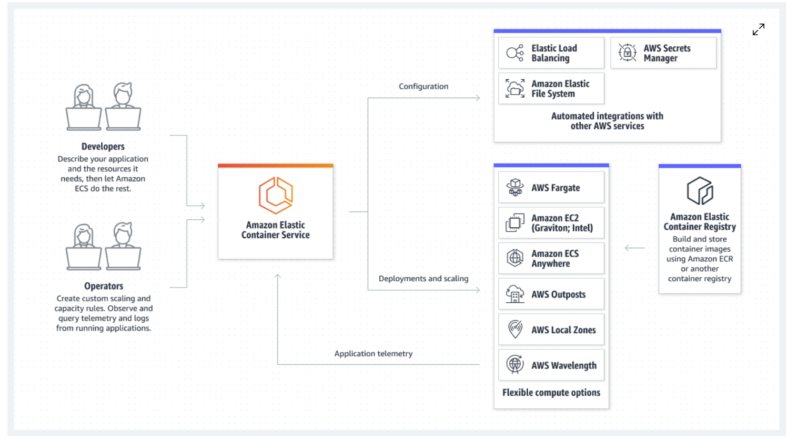
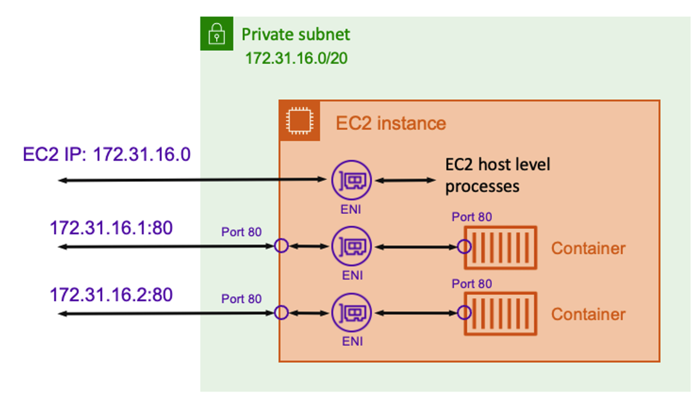
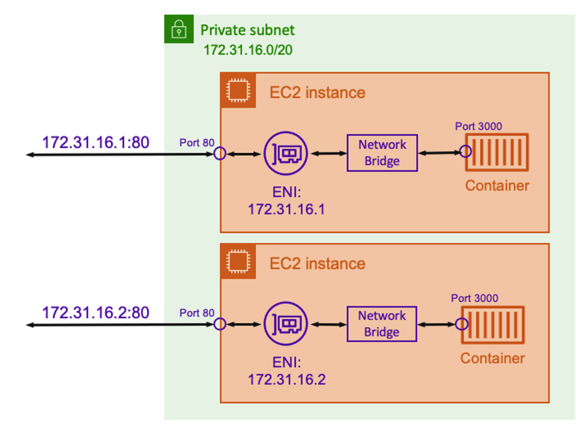
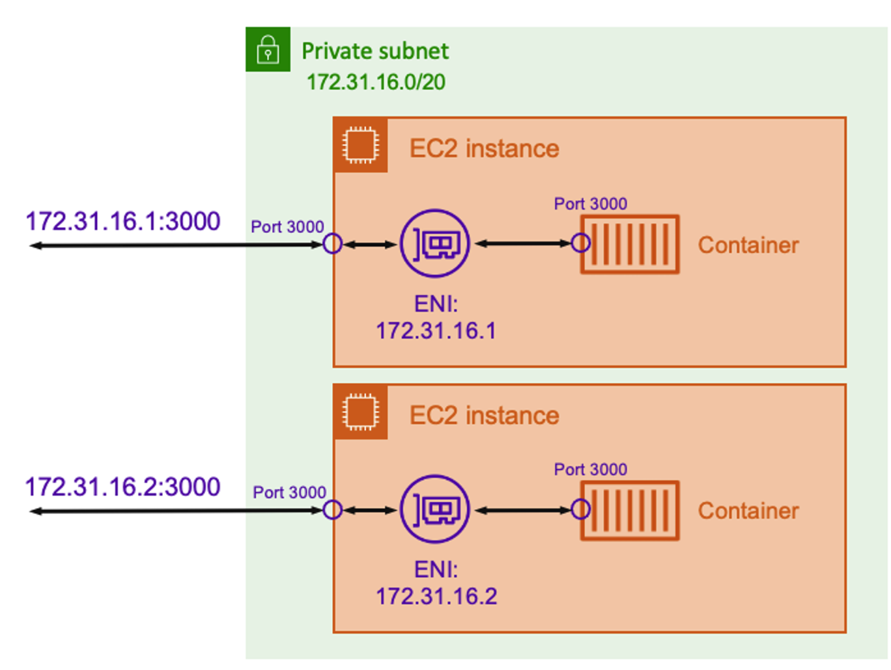

# ECS Task Network Mode 정리

  

> 출처 : <https://aws.amazon.com/ko/ecs>

```json
{ 
    ..중략
    "networkMode": "awsvpc",
    "volumes": [
        {
            "name": "xxx-shared-volume",
            "host": {}
        }
    ],
    "requiresCompatibilities": [
        "FARGATE"
    ],
    "cpu": "8192",
    "memory": "20480",
    "ephemeralStorage": {
        "sizeInGiB": 50
    },
    ..중략
}
```

- `ECS Task`의 `Networking 동작`은 `Task Defintion`에 `정의` 된다
- ECS `Fargate`의 Task `기본 네트워킹 동작`은 `awsvpc`로 `Task 별`로 `ENI`(Elastic Network Interface - 랜카드)와 IPv4 `private IP`가 제공된다
- `Fargate`의 경우 `다른 네트워크 모드`(host, bridge..)를 사용하고 싶어도 `지원 안함`

> 컨테이너는 아래와 같은 장점을 가지고 있다  
> 격리성, 이식성, 빠른 배포, DevOps 통합

- 격리성
  - `각 컨테이너`는 `독립된 환경`에서 `실행`되고, 서로 간섭 없음
- 이식성
  - 동일한 컨테이너 이미지를 언제 어디서든 동일하게 실행 가능 (환경 일관성 유지)
- 빠른 배포
  - `컨테이너`는 `가볍고 빠르게` 시작됨, `빠른 배포` 및 `스케일링` 가능
- DevOps 통합
  - `CI/CD 파이프라인`와 같은 `툴`을 통해 `자동화 배포 구성 가능`

## ECS Task Network Mode

> ECS Task EC2 vs Fargate 네트워크 지원 비교  
> ECS Task 네트워크에서 중요한 포인트는 컨테이너간의 네트워크 격리가 아닌, Task 간의 네트워크 격리

| Network mode | Linux containers on EC2 | Windows containers on EC2 |
|--------------|-------------------------|---------------------------|
| awsvpc       | O                       | O                         |
| bridge       | O                       | X                         |
| host         | O                       | X                         |
| none         | O                       | X                         |
| default      | X                       | O                         |

### awsvpc



> Task 당 고유한 ENI(Elastic Network Interface)와 IPv4 private IP를 할당

- `Task`에 `고유한 ENI`와 `Private IPv4 주소 할당`
- AWS EC2 인스턴스와 동일한 네트워크 속성 적용
- `Network` / `ENI`는 `AWS`가 관리
  - `ENI`는 `분리 + 수정 불가능` ( Task 삭제 후 분리 가능 )
- Task가 자동 생성하는 `ENI`는 `private IP만 생성`
- ECS용 Instance Type에 따른 ENI 할당량 존재
  - 하나의 Instance에 할당 할 수 있는 ECS Task 개수 제한
  - ENI Trunking Mode 사용 -> ENI 한계 확장 가능
- 장점
  - `ENI`와 `IP` `AWS`에서 관리
  - `각 Task 고유한 ENI + IP를 가짐`-> <ins>`네트워크 격리 가능`</ins>
    - ex) <ins>하나의 서버 상에서 ENI를 통해 네트워크 격리 가능</ins>
- 단점
  - `ENI 사용` -> `비용 비쌈`
  - ENI 할당량 제한 -> Task 수 제한되며, 추가 설정 필요
  - ENI Trunking Mode 사용 -> `네트워크 구조 복잡해질 수 있음`

### bridge



> Host(ex. EC2)와 Container 사이의 가상 네트워크 인터페이스 docker0를 통해 통신

- Host <--> Container 사이에서 <ins>`가상 네트워크 브릿지`</ins>(virtual ethernet bridge) `docker0` 제공
- `정적` 또는 `동적` `포트`(Port) `매핑`을 사용
  - 동적은 Port 지정 안하면 Docker가 Host Port 결정 ( 보안 그룹 Port 범위 문제 )
  - 정적은 사용자가 Port 지정
  - AWS EC2 호스트의 포트 <--> 컨테이너의 포트 매핑
- 같은 Port 가진 여러개 Container, 1개의 Host에 구동 가능(Container 달라짐)
- 장점
  - `컨테이너` `포트 포워딩 가능`, `유연한 포트 매핑` 가능
  - `컨테이너`는 호스트 네트워크와 `분리된 내부 네트워크에서 실행`, `보안` + `네트워크 관리` 좋음
- 단점
  - Fargate 지원 안함
  - <ins>가상 브릿지 사용으로 인한 네트워크 성능 저하</ins>

### host



> Container는 Host의 네트워크 네임스페이스 및 Port를 공유

- 컨테이너가 호스트(ex. EC2)의 `네트워크 네임스페이스`를 공유
  - 즉, `컨테이너`는 `호스트`와 `동일한 IP 주소` + `Port`도 직접 공유
- 장점
  - 호스트(ex. EC2)의 네트워크 사용, 추가적인 네트워크 오버 헤드 없음
  - 특정 Port를 반드시 사용해야 하거나, 네트워크 성능이 중요한 경우 사용
- 단점
  - Fargate 지원 안함
  - 컨테이너 포트 포워딩 불가능
  - 즉, Host의 Port를 그대로 따라가야 한다

### none

- 태스크에 외부 네트워크 연결 없음

## 99. 참고 자료

- [[AWS] AWS ECS - Network Mode](https://cloudest.oopy.io/posting/107)
- [[AWS] ECS 네트워크 모드](https://jmholly.tistory.com/entry/AWS-ECS-%EB%84%A4%ED%8A%B8%EC%9B%8C%ED%81%AC-%EB%AA%A8%EB%93%9C)
- [[AWS] ECS vs EKS vs Fargate | 한눈에 비교하는 AWS 컨테이너 서비스](https://www.smileshark.kr/post/aws-container-service-ecs-eks-fargate-comparison)
- [[AWS] [따배도] 9-1. 컨테이너간 통신(네트워크) - 이론편](https://www.youtube.com/watch?v=jOX80bXND2w&t=151s)
