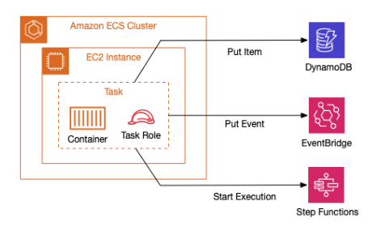
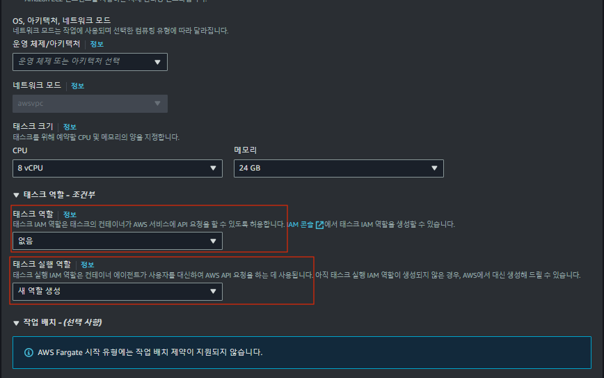
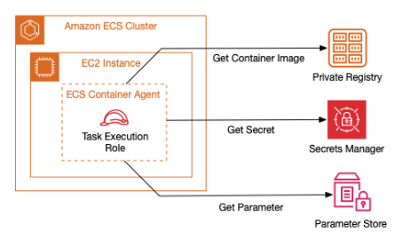
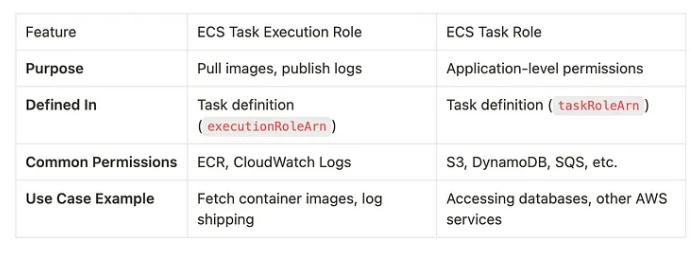

# 01. ECS Task Role vs Execution Role 차이 및 AWSServiceRoleForECS

> 이번에는 Task에 적용이 되는 ECS의 Task Role 과 Task Execution Role에 대해 알아보자.

## 01-1. ECS Task Role

```shell
# ECS Task가 S3, DynamoDB에 접근하기 위한 정책을 IAM Task Role에 부여
# 아래는 우선 S3만 기재 하였다 -> ecsTaskRole
{
   "Version":"2012-10-17",
   "Statement":[
      {
         "Effect":"Allow",
         "Action": "s3:ListAllMyBuckets",
         "Resource":"*"
      },
      {
         "Effect":"Allow",
         "Action":[
         	"s3:ListBucket",
         ],
         "Resource":"arn:aws:s3:::<bucketName>"
      },
      {
         "Effect":"Allow",
         "Action":[
            "s3:PutObject",
            "s3:GetObject",
         ],
         "Resource":"arn:aws:s3:::<bucketName>/*"
      }
   ]
}
```





> ECS Cluster를 구성하기 위해 Service, Task 를 만들어야 하는데,  
> Task를 만들 때 위 사진 과 같이 Task Role과 Task Execution Role을 지정해야 한다.  
> 참고 : [[AWS] Authenticating with AWS services](https://docs.aws.amazon.com/ko_kr/whitepapers/latest/replatform-dotnet-apps-with-windows-containers/authenticating-with-aws-services.html)

Task Role은 Task Definition에 정의된 IAM Role로써, ECS Task 내의 컨테이너(Application)들이 다른 AWS 서비스를 이용해야 하는 경우 사용이되는 Role 이다. 즉, `ECS Task`의 `컨테이너`가 `실행되고 있는 동안` `다른 AWS 서비스`와 `상호작용` 하는데 `필요한 권한을 제어`한다.

> 대표적인 Task Role의 사용 예시는 아래와 같다.  
> Task Execution Role과는 다르게 Task Role은 구동되어 있는 Container Application이 사용할 권한을 부여해야 한다.

- Application -> S3 버킷에 파일을 업로드하는 작업 수행
  - 요새 보면 Java에서 AWS S3에 파일 올리는 작업이 많지 않은가??
  - 위와같이 Container Application에서 AWS 서비스를 사용하는 경우 Task Role이 필요하다
- DynamoDB에서 데이터를 읽는 작업 수행
  - Application에서 DynamoDB에서 값을 CRUD 하는 작업을 해야 하는데??
  - 위 작업을 수행하려면 Task Role의 권한에 DynamoDB 관련 권한이 부여되어야 한다

> ⭐️ 기억해야 하는 부분  
> Task Role은 Task 상의 구동된 개별적인 Container들이 다른 AWS 서비스를 사용할 때 필요한 권한을 지정한 것이다.  
> 무분별하게 Task Role의 Attatch된 역할에 권한을 부여하지 말자, 잘못하면 서비스 전체에 영향을 미친다.

## 01-2. ECS Task Execution Role

```shell
# AmazonECSTaskExecutionRolePolicy
# ECS Task Execution Role에 붙히면 되는 IAM Role
{
  "Version": "2012-10-17",
  "Statement": [
    {
      "Effect": "Allow",
      "Action": [
        "ecr:GetAuthorizationToken",
        "ecr:BatchCheckLayerAvailability",
        "ecr:GetDownloadUrlForLayer",
        "ecr:BatchGetImage",
        "logs:CreateLogStream",
        "logs:PutLogEvents"
      ],
      "Resource": "*"
    }
  ]
}
```



> Task Execution Role은 ECS Service 자체가 컨테이너를 관리하기 위해 필요한 권한만 부여해야 한다.  
> 이는 애플리케이션 코드(Container 안의 Application)가 직접 사용할 필요가 없는 권한이다.

`Task execution role`은 `Container Agent` or `Fargate`가 `사용자`를 `대신`하여 컨테이너를 관리(`AWS API 호출`)하기 위한 role이다.  
즉, ECS `Task 상에 구동 된 컨테이너를 실행하기 위한 Role`이라고도 볼 수 있다.

> 대표적인 Task Execution Role의 사용 예시는 아래와 같다  
> 아래 예를 보면 애플리케이션 레벨의 IAM 권한이 아닌 ECS Service 레벨의 권한이라고 볼 수 있다

- ECR에서 Container image를 pull 하는 경우
- Secret Manager의 값(ID, PWD)를 가져오는 경우
- CloudWatch Logs에 로그를 기록하는 경우

## 01-3. ECS Service Role

> AWSServiceRoleForEcs  
> 실제 ECS Service 구동시에 사용하는 IAM Managed Policy, Service 구동 시 사용하면 된다

```json
{
  "Version": "2012-10-17",
  "Statement": [
    {
      "Effect": "Allow",
      "Action": [
        "ec2:AuthorizeSecurityGroupEgress",
        "ec2:AuthorizeSecurityGroupIngress",
        "ec2:CreateNetworkInterface",
        "ec2:CreateSecurityGroup",
        "ec2:CreateTags",
        "ec2:DeleteNetworkInterface",
        "ec2:DeleteSecurityGroup",
        "ec2:Describe*",
        "ec2:DetachNetworkInterface",
        "ec2:ModifyNetworkInterfaceAttribute",
        "ec2:RevokeSecurityGroupEgress",
        "ec2:RevokeSecurityGroupIngress"
      ],
      "Resource": "*"
    },
    {
      "Effect": "Allow",
      "Action": [
        "elasticloadbalancing:AddTags",
        "elasticloadbalancing:ApplySecurityGroupsToLoadBalancer",
        "elasticloadbalancing:AttachLoadBalancerToSubnets",
        "elasticloadbalancing:ConfigureHealthCheck",
        "elasticloadbalancing:CreateLoadBalancer",
        "elasticloadbalancing:CreateLoadBalancerListeners",
        "elasticloadbalancing:DeleteLoadBalancer",
        "elasticloadbalancing:DeleteLoadBalancerListeners",
        "elasticloadbalancing:Describe*",
        "elasticloadbalancing:DeregisterInstancesFromLoadBalancer",
        "elasticloadbalancing:RegisterInstancesWithLoadBalancer"
      ],
      "Resource": "*"
    },
    {
      "Effect": "Allow",
      "Action": [
        "ecs:CreateCluster",
        "ecs:CreateService",
        "ecs:DeleteCluster",
        "ecs:DeleteService",
        "ecs:DeregisterContainerInstance",
        "ecs:DeregisterTaskDefinition",
        "ecs:Describe*",
        "ecs:DiscoverPollEndpoint",
        "ecs:List*",
        "ecs:RegisterTaskDefinition",
        "ecs:StartTask",
        "ecs:StopTask",
        "ecs:UpdateService"
      ],
      "Resource": "*"
    },
    {
      "Effect": "Allow",
      "Action": [
        "logs:CreateLogGroup",
        "logs:CreateLogStream",
        "logs:Describe*",
        "logs:PutLogEvents",
        "logs:PutRetentionPolicy"
      ],
      "Resource": "*"
    },
    {
      "Effect": "Allow",
      "Action": [
        "application-autoscaling:DeleteScalingPolicy",
        "application-autoscaling:DeregisterScalableTarget",
        "application-autoscaling:DescribeScalableTargets",
        "application-autoscaling:DescribeScalingActivities",
        "application-autoscaling:DescribeScalingPolicies",
        "application-autoscaling:PutScalingPolicy",
        "application-autoscaling:RegisterScalableTarget"
      ],
      "Resource": "*"
    },
    {
      "Effect": "Allow",
      "Action": [
        "servicediscovery:CreateService",
        "servicediscovery:DeleteService",
        "servicediscovery:DeregisterInstance",
        "servicediscovery:Get*",
        "servicediscovery:List*",
        "servicediscovery:RegisterInstance"
      ],
      "Resource": "*"
    },
    {
      "Effect": "Allow",
      "Action": [
        "cloudwatch:DeleteAlarms",
        "cloudwatch:Describe*",
        "cloudwatch:GetMetricStatistics",
        "cloudwatch:List*",
        "cloudwatch:PutMetricAlarm",
        "cloudwatch:PutMetricData"
      ],
      "Resource": "*"
    },
    {
      "Effect": "Allow",
      "Action": [
        "sns:ListTopics"
      ],
      "Resource": "*"
    },
    {
      "Effect": "Allow",
      "Action": [
        "ssm:GetParameter",
        "ssm:GetParameters",
        "ssm:GetParametersByPath"
      ],
      "Resource": "arn:aws:ssm:*:*:parameter/aws/service/ecs*"
    },
    {
      "Effect": "Allow",
      "Action": [
        "iam:PassRole"
      ],
      "Resource": [
        "arn:aws:iam::*:role/ecsInstanceRole*",
        "arn:aws:iam::*:role/ecsAutoscaleRole*"
      ],
      "Condition": {
        "StringLike": {
          "iam:PassedToService": [
            "ecs-tasks.amazonaws.com",
            "ec2.amazonaws.com",
            "application-autoscaling.amazonaws.com"
          ]
        }
      }
    },
    {
      "Effect": "Allow",
      "Action": [
        "iam:CreateServiceLinkedRole"
      ],
      "Resource": "*",
      "Condition": {
        "StringLike": {
          "iam:AWSServiceName": [
            "ecs.amazonaws.com",
            "ecs.application-autoscaling.amazonaws.com",
            "spot.amazonaws.com",
            "spotfleet.amazonaws.com"
          ]
        }
      }
    }
  ]
}
```

- 해당 권한(AWSServiceRoleForECS Policy)는 ECS Service에 Attached 되어 있는 권한
- 실제 서비스 구동 시 해당 권한 사용

## 01-4. 비교



## 99. 참고 자료

- [[AWS] Authenticating with AWS services](https://docs.aws.amazon.com/ko_kr/whitepapers/latest/replatform-dotnet-apps-with-windows-containers/authenticating-with-aws-services.html)
- [[AWS] [ECS] Task Role vs. Execution Role 차이](https://jibinary.tistory.com/63)
- [[AWS] Task role vs task execution role in Amazon ECS](https://towardsthecloud.com/amazon-ecs-task-role-vs-execution-role)
- [[Stack Overflow] Difference between AWS Elastic Container Service's (ECS) ExecutionRole and TaskRole](https://stackoverflow.com/questions/48999472/difference-between-aws-elastic-container-services-ecs-executionrole-and-taskr)
- [[AWS] Understanding ECS Task Execution Role and Task Role: Key Differences and Use Cases](https://prabhanu.medium.com/understanding-ecs-task-execution-role-and-task-role-key-differences-and-use-cases-17693e05c758)
- [[AWS] 오토피디아 블로그 - ECS 톺아보기](https://blog.doctor-cha.com/ecs-in-depth)