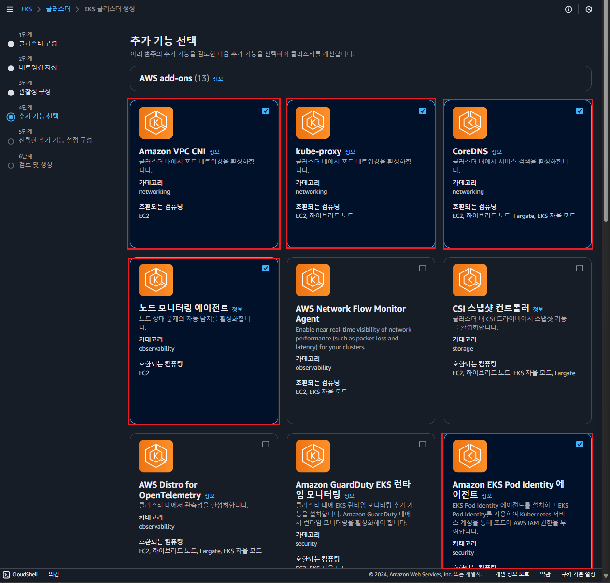

# EKS 클러스터 콘솔 상에서 구축 해보기

> 2024-12-27일자 기준으로 업데이트 된 AWS 콘솔 상에서 EKS 클러스터 구축에 관하여 정리.

## 1단계: 클러스터 구성

### 구성 옵션 - 신규

- 빠른 구성(EKS 자율 모드 사용) - 신규
  - EKS 클러스터 및 노드를 자동으로 1설정하는 간소화 옵션
  - 클러스터 및 노드 그룹 자동 생성
- 기본 설정으로 EKS 클러스터 제공
  - 세부 설정이나 커스텀이 필요한 경우는 비적합
- 사용자 지정 구성
  - EKS 세부 설정을 직접 정의하는 옵션
  - 클러스터 및 노드의 모든 구성 요소를 사용자가 직접 관리 및 제어
  - 네트워킹, 보안, IAM 역할, 노드 그룹 등을 완전히 커스텀 가능

### EKS 자율 모드 - 신규

> TODO

빠른 구성(EKS 자율 모드 사용) - 신규 를 선택한 경우 활성화 해주라고 하는데  
필자는 사용자 지정 구성을 선택하였기에, 비활성화 후 진행하라고 한다

### 클러스터 구성

- 이름
  - 클러스터명 지정: test-eks-cluster
- 클러스터 IAM 역할
  - 클러스터 IAM 역할을 지정하여, Control Plan이 사용자를 대신하여 AWS 리소스 관리하도록 제어
  - 클러스터 생성 이후에는 IAM Role 변경` 불가능하다고 함
  - 즉, EKS Control Plan이 EC2, LB 생성 등등의 대한 제어를 할때 필요한 권한
  - 해당 Role은 아래 2개의 Policy를 가지고 있어야 한다고 함
    - AmazonEKSClusterPolicy: 클러스터 생성 및 관리에 필요한 권한 제공
    - AmazonEKSVPCResourceControllerPolicy: VPC 리소스와의 통신을 지원하는 권한 제공.
    - 추가적으로 A Policy를 추가해야 한다

### Kubernetes 버전 설정

- 쿠버네티스 버전
  - 1.3.1 -> k8s 버전 지정
- 정책 업그레이드
  - 표준
    - 릴리스일로부터 `14개월` 동안 `k8s 버전 지원`
    - 지원 종료 시, 클러스터가 자동으로 다음 버전으로 업그레이드
  - 확장됨
    - 릴리스일로부터 `26개월` 동안 해당 `k8s 버전 지원`
    - 표준 지원 기간(14개월) 끝난 후, 추가 비용 발생하며 지원 계속 유지
    - 지원 종료 시, 클러스터가 자동으로 다음 버전으로 업그레이드
  - 버전을 지원한다?
    - AWS가 해당 버전을 안정적이고 보안적으로 운영할 수 있도록 관리하고 유지보수를 제공한다는 말
    - 지원 기간이 끝나면 보안과 안정성을 잃을 위험이 존재함

### 컴퓨팅 - 신규

- EKS 클러스터에 대한 노드 구성을 지정하는 부분으로 보임
- 지원 컴퓨팅 종류(4가지 컴퓨팅 지원)
  - `EKS 자율 모드`
    - AWS가 컴퓨팅 리소스를 자동으로 관리
    - 노드 그룹 생성, 스케일링, 패치 등을 AWS가 처리하고 사용자는 관리 부담이 적음
    - 자동화된 클러스터 관리에 적합
  - `EC2 관리형 노드 그룹`
    - EKS에서 EC2 인스턴스 기반의 노드 그룹 관리
    - AWS가 노드 그룹 생성과 기본 관리(ex: 업데이트)를 처리하지만, 세부 제어는 사용자가 담당
  - `Fargate`
    - `서버리스` 방식으로 `Pod 단위`로 컴퓨팅 리소스 관리
    - `노드` or `클러스터`를 `직접 관리할 필요가 없으며`, 애플리케이션 단위로 실행 가능
    - 간단한 워크로드에 적합
  - `하이브리드 노드`
    - 클러스터가 온프레미스 or 다른 클라우드 환경과 통합되어 하이브리드 환경에서 실행 되어야 하는 경우 사용
    - AWS Outpost 또는 VMware와 같은 환경을 활용

### 클러스터 엑세스

> IAM 보안 주체가 이 클러스터에 엑세스하는 방법을 제어하는 옵션

- 부트스트랩 클러스터 관리자 엑세스
  - 클러스터 관리자 엑세스 허용
    - IAM 보안 주체(AWS 사용자 or 역할)에 초기 클러스터 관리자 권한 부여
  - 클러스터 관리자 엑세스
    - RBAC(Role-Based Access Control)로 세부적인 권한 관리 필요
- 클러스터 인증 모드
  - EKS API: 기본 IAM 인증 방식, 간단하고 빠르게 클러스터 엑세스 가능
  - EKS API 및 ConfigMap: aws-auth configMap을 통한 세밀한 IAM 사용자/역할 관리

### Password encryption

> 운영 클러스터 상에서는 해당 옵션은 비활성화 되어 있음

- k8s Secrets에 저장된 암호와 같은 데이터를 추가적으로 암호화 하는 기능 제공
- AWS KMS를 사용해 Envelope Encryption을 활성화하며, 한 번 활성화하면 이후 수정 및 제거 불가능

### ARC 영역 전환

> ARC: Availability Zone Rebalancing

- ARC(Availability Zone Rebalancing)
  - `활성화`
    - EKS 클러스터 특정 가용영역에 장애가 발생한 경우, 애플리케이션 트래픽을 자동으로 다른 AZ로 전환
    - 가용성 보장을 할 수 있음
  - `비활성화`
    - 클러스터를 ARC 영역 전환에 등록하지 않음
    - AZ 장애에 대비하기 위해 사용자가 직접 구성해야함
  - `클러스터 생성 후에도 변경 가능하다고 함`

### 태그

- EKS 서비스 태그 지정

## 2단계: 네트워킹 지정

- VPC
  - EKS 클러스터의 컨트롤 플레인(Control Plan)과 워크로를 실행하는 워커 노드(Worker Node)를 포함한 전체 클러스터 인프라가 위치할 가상 네트워크를 정의하기 위함
- 서브넷
  - EKS `Control Plane`가 `Worker Node`와 `통신`하기 위해 사용할 subnet을 지정하는 것
  - 여기서는 생성되어 있는 Private Subnet을 지정해야 한다고 한다
  - Control Plane은 AWS가 관리하는 별도의 네트워크 환경에 위치하고, Worker Node가 지정한 Subnet에 위치
- 보안그룹
  - 여기서 지정하는 보안 그룹은 EKW worker node 및 ENI에 적용되는 보안 그룹
  - EKS는 총 3개의 SG를 가지고 있다고 한다
    - Cluster SG: control plane이 사용
    - Worker Node SG: worker node가 사용
    - Additional SG: control plane 추가 보안그룹

## 3단계: 관찰성 구성

- 지표
  - Prometheus
    - 비활성화 선택
    - 관리형 Prometheus로 스크랩핑 로그 전송하는 기능
- 컨트롤 플레인 로그
  - API 서버: 클러스터에 대한 API 요청과 관련된 로그
  - `감사`: k8s API를 통한 클러스터 엑세스와 관련된 로그
  - `Authenticator`: 클러스터에 대한 인증 요청과 관련된 로그
  - 컨트롤러 관리자: 클러스터 컨트롤러 상태와 관련된 로그
  - 스케줄러: 예약 결정과 관련된 로그

## 4단계: 추가 기능 선택

### Amazon VPC CNI(Container Networking Interface ✅정리 필)

> 참고 자료 : [[AEWS 2주차] #1 EKS VPC CNI란?](https://bigco-growth-diary.tistory.com/72)

- EKS 클러스터 내에서 Pod 네트워킹용 플러그인(활성화)
- `k8s`의 `Pod`가 `AWS VPC`의 `서브넷`에서 `직접 IP 주소 할당 받음`
- `Pod간`, `Service 간`, `외부 리소스와의` `통신` 모두 `VPC`의 `네트워크 설정 규칙`을 `따름`
- `보안그룹`, `라우팅 테이블`, `NAT Gateway` 활용 가능

AWS EKS에 있는 Pod 네트워킹용 플러그인이다.  
파드의 IP를 할당해주며 파드의 IP 네트워크 대역과 노드(워커)의 IP 대역이 같아서 통신이 가능하다.

### kube-proxy(✅정리 필)

### CoreDNS(✅정리 필)

### 노드 모니터링 에이전트(✅정리 필)

## 참고 자료

- [[AWS] EKS security group 톺아보기](https://malwareanalysis.tistory.com/709)
- [[AEWS 2주차] #1 EKS VPC CNI란?](https://bigco-growth-diary.tistory.com/72)