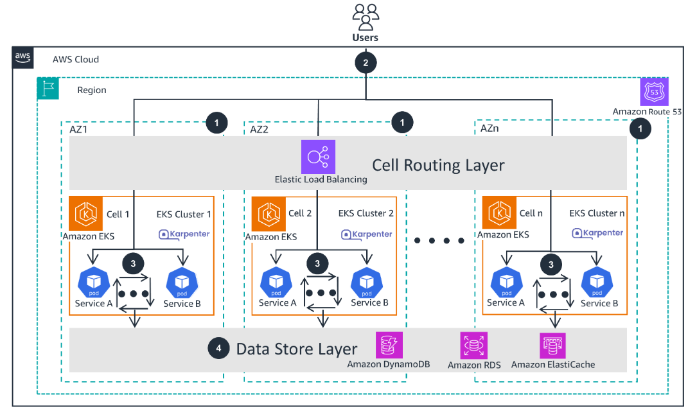
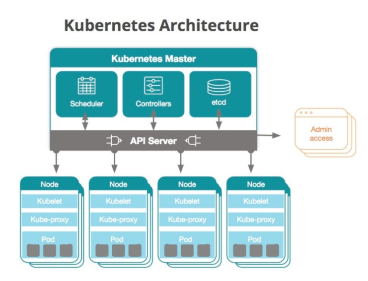
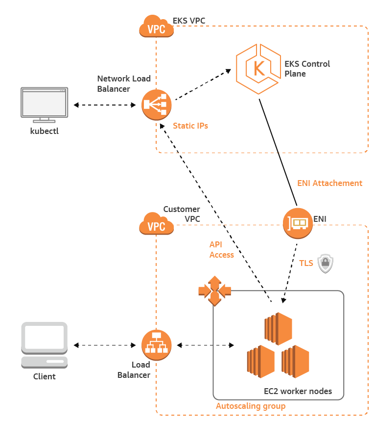
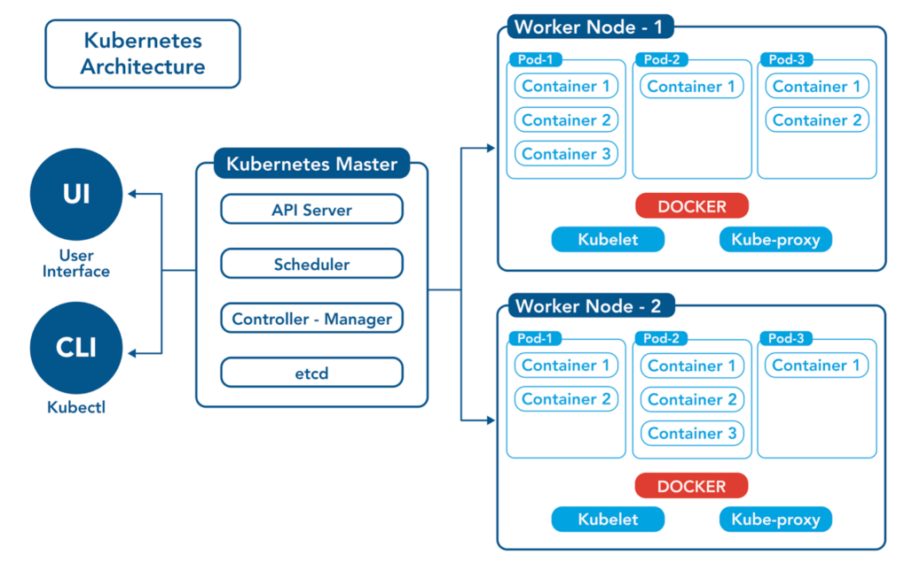

# EKS Introduce & hands on EKS in 30 minutes

> A brief introduction to EKS and how to use it

현재 AWS EC2 온디멘드로 Elasticsearch를 운영하는 중이다.  
추후 EKS로 Elasticsearch를 이관할 필요성이 있어 핸즈온 진행.

## ECS Fargate vs EKS

EKS를 도입하기 전 API를 운영중인 ECS Fargate에 Elasticsearch를 구동하는게 어떨지 고민해봤다.  
하지만 Fargate의 경우 stateless한 서비스에서 사용하고 스토리지 역시 영구적으로 관리가 힘들것이라 판단하였다.  
또한 ECS Fargate + S3 or EFS 조합도 고민해보았지만, Elasticsearch의 경우 빠른 I/O(입출력)이 필요한데,  
S3나 EFS를 쓰는 경우 I/O 속도가 나오지 않을 것으로 보인다.

## EKS(Elastic Kubernetes Service)?

> 참고 URL : https://aws.amazon.com/ko/solutions/guidance/cell-based-architecture-for-amazon-eks/#

AWS `EKS`는 `Control Plane`을 `자동`으로 `생성` 및 `관리`해주는 `완전 관리형 컨테이너 오케스트레이션 서비스`다.  
개발자 및 운영자는 이러한 `Control Plane`에 대한 `관리`가 필요하지 않고 `AWS에 의해 관리`가 된다.  
대표적인 EKS의 특징은 아래와 같다.

- `Control Plane`을 `직접 프로비저닝 하지 않아도 되며`, `AWS가 관리`
  - AWS Control Plane은 적어도 `3대` 유지
  - Control Plane의 `etcd`도 `동기화` 해줌
- `고가용성`(HA) 유지 가능
- `편리한 k8s 업데이트`
- `AWS 서비스`와의 `통합`
- `eksctl`, `aws console`, `aws cli`, `kubectl` 등 사용 가능

## EKS 구성

> EKS는 클러스터(Cluster), 노드(Node), 파드(Pod)로 구성된다.

- 컨트롤 플레인(Control Plane)은 사용자가 정의한 VPC가 아닌 별도의 VPC에 구동
- 사용자가 정의한 VPC에 구동되는 것은 데이터 플레인(Data Plane) 워커 노드

### EKS 구성 요소

- 클러스터(Cluster)
  - `1개 이상의 노드를 포함한 논리 그룹`
  - 클러스터 내부는 `컨트롤 플레인`(Control Plane), `데이터 플레인`(Data Plane)로 구분
  - 컨트롤 플레인(Control Plane): 클러스터 전반 `관리` 및 `제어` -> `노드 관리`
  - 데이터 플레인(Data Plane): `노드 배치 영역`
- 컨트롤 플레인(Control Plane)
  - API Server(`클러스터 내외의 모든 요청 처리하는 인터페이스`)
    - `클러스터`와 `외부` 간의 `중앙 제어 인터페이스`이며 모든 요청을 수신 및 처리 한다
    - `클러스터의 모든 구성 요소`가 `API Server`를 통해 `통신`
    - ALB를 통한 REST API 요청과는 무관
  - etcd(`클러스터 상태 데이터 저장` - `분산 저장소`)
    - `클러스터`의 `모든 상태 정보`(`노드 상태`, `설정 정보` 등)를 분산 저장하는 `KEY-VALUE` 형태 `DB`
    - `데이터` `일관성` + `고가용성`을 `보장`, `클러스터`의 `백업` 및 `복구`에 `중요한 역할`
  - Scheduler(`리소스 관리 + 파드 배치`)
    - `새로운 파드`가 `어느 노드`에 `배치`될지 `결정`하는 `스케쥴링 작업 수행`
    - 각 노드의 리소스 상태 고려하여 적합한 노드에 배치 + 자원 효율성 보장
  - Controller(`클러스터 상태 모니터링 + 자동 복구`)
    - 클러스터 상태 지속적으로 모니터링
      - 원하는 상태와 실제 상태가 일치하도록 관리
      - 파드 or 노드 문제 발생 시 자동 복구
- 데이터 플레인(Data Plane)
  - 애플리케이션이 실제로 실행되는 영역
  - `Node`와 `Pod` 가 `배치`되어 `애플리케이션 트래픽 처리`
  - 구성요소
    - 노드(Node)
      - 물리적 가상 서버로, 애플리케이션을 실행하는 역할
      - 각 노드(Node)는 하나 이상의 파드를 호스팅
    - 파드(Pod)
      - 하나 이상의 컨테이너로 구성되며, Kubernetes의 기본 실행 단위 의미
      - 실제 트래픽 처리 + 애플리케이션이 동작하는 공간
    - Kubelet
      - 각 노드에서 실행되는 에이전트(agent)
      - API 서버와 통신 -> 노드에서 파드가 정상 실행되도록 관리
    - Kube-Proxy
      - 클러스터 네트워킹 관리
      - API 서버와 통신 -> 노드와 파드 간 네트워크 트래픽 라우팅 -> 파드 간 통신 지원

## 99. 참고 자료

- [[AWS] Amazon ECS Fargate](https://docs.aws.amazon.com/AmazonECS/latest/developerguide/AWS_Fargate.html)
- [[AWS] Amazon EKS](https://docs.aws.amazon.com/ko_kr/eks/latest/userguide/what-is-eks.html)
- [[AWS] 초보자를 위한 EKS 맛 보기](https://devocean.sk.com/blog/techBoardDetail.do?ID=163578)
- [[AWS] Amazon EKS (Elastic Kubernetes Service): Everything You Should Know](https://k21academy.com/docker-kubernetes/amazon-eks-kubernetes-on-aws/)
