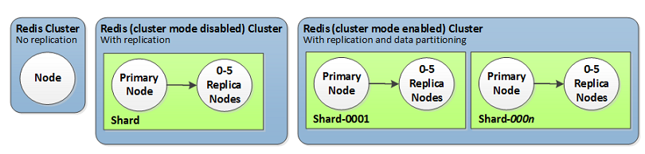

# ElastiCache

> ElastiCache 구성을 위해 기재하였습니다. 자세한 내용은 추후 공부하여 추가할 예정입니다 :)

Elastic Cache는 클라우드에서 ValKey, Memcached, Redis OSS 프로토콜 준수 캐시의 배포 및 실행을 간소화하는 웹 서비스이다.  
주로 속도가 느린 디스크 기반 시스템에 의존하기보다, 메모리 시스템에서 정보를 검색할 수 있도록하여 애플리케이션 성능을 향상시킨다.

> AWS ElastiCache primary node 다운!  
> secondary node 중 새로운 primary node를 선출

`Amazon ElastiCache`는 기존 `primary 노드`가 `다운`되면 이를 자동으로 감지(monitoring)한 후  
복제 작업을 하던 secondary 노드에서 새로운 primary 노드를 선출한다고 한다.

이러한 `auto failover` 기능을 바탕으로, `복원`력이 뛰어난 환경을 제공하는 것은 물론이며  
앱 서비스 로드 시간이 길어지게 하는 `DB 오버로드의 위험을 완화`할 수 있다.

## Redis 클러스터 구성 종류

> AWS ElastiCache  
> ✅ 기본 엔드포인트  
> -> Cluster의 Primary Node(마스터 노드)에 연결  
> -> 읽기(Read), 쓰기(Write) 작업을 모두 처리  
> -> Primary Node에 장애 발생하는 경우, 클러스가 자동으로 새로운 Primary Node를 선택  
> 기본 엔드포인트는 이를 반영하여 새로운 Primary Node로 자동 라우팅을 수행한다  
> -> 읽기/쓰기 작업을 동일한 노드에서 처리하는 경우 사용
>
> ✅ 리더 엔드포인트  
> -> Cluster의 Replica Node(복제본 노드)에 연결  
> -> 읽기(Read) 작업만 지원, 쓰기(Write) 작업은 지원 안함  
> -> Replica Node가 여러개인 경우, 읽기 요청을 노드 간에 로드 밸런싱하여 처리  
> -> 읽기 부하(Read Load)가 많은 애플리케이션의 성능 최적화를 위해 사용  
> -> Primary Node의 부하를 줄이고, Read의 경우 Replica Node를 사용하려는 경우



| **구분**          | **① 싱글 클러스터 노드**       | **② 클러스터 모드 X (Replication만 지원)** | **③ 클러스터 모드 O**                         |
| ----------------- | ------------------------------ | ------------------------------------------ | --------------------------------------------- |
| **데이터 복제**   | X                              | O (노드 당 최대 5 replicas)                | O (노드 당 최대 5 replicas)                   |
| **데이터 분할**   | O                              | X (싱글 샤드)                              | O (최대 90 샤드)                              |
| **확장성**        | 노드 타입을 변경하는 수직 확장 | 노드 타입을 변경하는 수직 확장             | 샤드의 추가/삭제 및 밸런싱을 통한 수평적 확장 |
| **Multi-AZ 지원** | X                              | 최소 1 replica 이상의 옵션 필요            | 최소 1 replica 이상의 옵션 필요               |

- `싱글 클러스터 노드`
  - `단일 노드`만 존재
  - `Primary Node 1개`만 있고, `Replica`(복제 노드)는 `없음`
  - `Replication` or `클러스터 모드` `사용 안함`
  - `데이터`는 `단일 노드`에서 `처리`, `장애 복구 or 확장성 제공 안함`
  - 간단한 애플리케이션 or 테스트 시 사용
  - `Replication 지원 여부`
    - 지원 안함
  - `확장성`
    - 지원 안함
- 클러스터 모드 없이 Replication만 지원 (클러스터 모드 X)
  - `Primary Node 1개`, `최대 5개`의 `Replica Node`(복제본 노드)로 구성
  - 데이터를 1개의 샤드(Shard)에만 저장
  - 1개의 샤드(Shard) 안에는 1개의 Primary Node + 최대 5개의 Replica Node가 존재
  - `Replication 지원 여부`
    - Primary Node에 데이터 저장 + Replica Node로 복제
    - 장애 복구 지원 -> Primary Node 다운 시 Replica Node 승격
  - `확장성`
    - `노드 타입 수직 증가`, 수평 확장 아님
- 클러스터 모드와 Replication 모두 지원 (클러스터 모드 O)
  - `Primary Node 1`개, `최대 5개`의 `Replica Node`가 `N개의 샤드로 구성`
  - 데이터를 1개의 샤드(Shard)가 아닌, 여러개의 샤드(Shard)에 저장
  - Replication 지원 여부
    - Primary Node에 데이터 저장 + Replica Node로 복제
    - 장애 복구 지원 -> Primary Node 다운 시 Replica Node 승격
  - `확장성`
    - `샤드의 추가/삭제 및 밸런싱을 위한 수평 확장`, 수직 증가 아님
    - `최대 100개의 샤드까지 수평 확장 가능`

## 사용 목적

1. 캐시 서버를 사용하여, 검색엔진(ES)의 부하를 줄이기 위한 목적으로 사용
2. 기술 선택의 경우 Valkey를 사용하였으며, 기존 Redis와 호환이 되고 자동 장애복구 등의 이유로 선택 하였다

## ElastiCache 엔진 비교

| **기능/특성**         | **Valkey (AWS Managed)**                                              | **Redis OSS (AWS Managed)**                                           | **Memcached (AWS Managed)**                           | **Redis (EC2 직접 설치)**                                             |
| --------------------- | --------------------------------------------------------------------- | --------------------------------------------------------------------- | ----------------------------------------------------- | --------------------------------------------------------------------- |
| **사용 라이선스**     | BSD 3-Clause (상업적 사용에 제한 없음)                                | RSAL/SSPL (하단 추가설명 참고)                                        | BSD (하단 추가설명 참고)                              | BSD (하단 추가설명 참고)                                              |
| **데이터 영속성**     | 지원 (유지)                                                           | 지원 (옵션)                                                           | 미지원                                                | 지원                                                                  |
| **고가용성**          | 클러스터링 지원 (데이터 분산 및 자동 복제 수행) + 자동 장애 복구 지원 | 클러스터링 지원 (데이터 분산 및 자동 복제 수행) + 자동 장애 복구 지원 | 클러스터링 지원 X + 자동 장애 복구 지원 X             | 클러스터링 지원 (데이터 분산 및 자동 복제 수행) + 자동 장애 복구 지원 |
| **확장성**            | 자동 샤딩 지원 (자동 데이터 분배 및 재배치)                           | 자동 샤딩 지원 (자동 데이터 분배 및 재배치)                           | 수동 샤딩 (애플리케이션에서 직접 샤딩 로직 구현 필요) | 수동 샤딩                                                             |
| **보안 기능**         | AWS IAM, 데이터 암호화, 인증                                          | AWS IAM, 기본 보안                                                    | AWS IAM, 기본 보안                                    | 보안 그룹 설정 및 추가적인 보안 설정 필요                             |
| **복제 및 장애 복구** | 자동화된 복제 및, 장애 복구 지원                                      | 수동 구성 가능                                                        | 지원하지 않음                                         | 수동 구성 필요                                                        |
| **운영 비용**         | Redis OSS, Memcached에 비해 시간당 요금 저렴                          | 고비용 (관리형 서비스)                                                | 상대적으로 저렴                                       | 초기 설정 비용 있지만 낮은 운영 비용                                  |
| **유지보수**          | AWS 관리 (자동화)                                                     | AWS 관리 (자동화)                                                     | AWS 관리 (자동화)                                     | 사용자 직접 유지보수 필요                                             |
| **사용 예시**         | 고성능 및 보안이 필요한 애플리케이션                                  | 실시간 데이터 처리, 캐싱 등                                           | 웹 애플리케이션 캐싱                                  | 세션 관리, 고성능 실시간 데이터 처리                                  |
| **호환성**            | Redis와 호환 가능 (하위호환 지원)                                     | 널리 호환됨                                                           | 널리 호환됨                                           | 널리 호환됨                                                           |

## ElastiCache 구성 순서

- ElasticCache > Valkey 캐시 > Valkey 캐시 생성 이동
  - 배포 옵션
    - 서버리스 - 신규
      - 서버 관리 없이 자동으로 확장되는 캐시를 빠르게 생성하는 옵션
      - 애플리케이션 트래픽에 맞게 자동으로 조정
    - `자체 캐시 설계`
      - `사용자가 직접` `노드 유형`, `크기`, `개수` 선택 및 `캐시 생성하는 옵션`
      - 맞춤형 구성 필요할 때 사용
  - 생성 방법
    - `클러스터 캐시 선택`
  - 클러스터 모드
    - 클러스터 모드 활성화 여부 선택
    - 활성화
      - 확장성 및 가용성 개선을 위해, 여러 샤드에 데이터 복제 및 파티셔닝 지원
      - 최대 500개의 노드 그룹 사용 가능
      - 대규모 분산 처리 필요할 때 적합
    - `비활성화`
      - `단일 샤드로 동작, 간단한 캐싱에 적합`
  - 클러스터 정보
    - 이름 및 설명
      - 캐시 이름 및 설정
  - 위치
    - AWS 클라우드 설정
    - 다중 AZ
      - 사용 설정
  - 클러스터 설정
    - 엔진 버전
      - 7.2
    - 포트
      - Redis 포트 지정 - 6379
    - 파라미터 그룹
      - default.valkey8
    - 노드 유형
      - `클러스터`에서 `사용할 노드`의 `크기 및 스펙 선택`
        - `cache.r7g.large`
    - 복제본 개수
      - 가용성을 높이기 위해, 복제본 노드의 개수 지정
      - `2개 지정`
  - 연결
    - 네트워킹 유형: IPv4
    - 서브넷 그룹
      - 새 서브넷 그룹 생성
      - `Subnet을 신규로 만드는게 아니라, 기존에 있는 서브넷을 그룹으로 묶는 부분`
    - 이름 및 설명
      - 서브넷 그룹 이름 지정
    - VPC ID
      - `기존에 사용하는 VPC 지정`
    - 서브넷 선택
      - `Private Zone 서브넷 대역 선택`
    - 서브넷 그룹에 대한 태그
      - 태그 추가
  - 가용 영역 배치
    - `ap-northeast-2a`
    - `ap-northeast-2b`
    - `ap-northeast-2c`
  - 고급설정
    - 보안
      - 저장 중 암호화
        - 미사용
      - 암호화 키
        - AWS 제공 기본 키
      - 전송 중 암호화
        - 미사용
      - 엑세스 제어
        - `없음`
      - 보안 그룹 선택됨
        - 보안 그룹 지정
        - 인바운드 6379 포트 열어야 함
        - 출발지에서는 아웃바운드 6379 포트 열어야함
      - 자동 백업 사용
        - 비활성화
      - 백업 보존 기간
        - 비활성화
      - 백업 창
        - 비활성화

## EC2 -> AWS ElastiCache 접속

EC2에 구동되고 있는 모든 서비스는 Private Subnet 대역에 구동중이다.  
RoutingTable + NAT를 통해 외부로 나가는 네트워크는 없기에 Public Zone EC2에서  
redis-stable.tar.gz 파일을 다운로드 후 Private 대역으로 전달해주려고 한다.

또한 접근하고자 하는 출발지(EC2)의 `아웃바운드는 6379`(redis port) 요청이 가능해야 하며,  
AWS ElastiCache의 보안그룹에서도 `인바운드로 6379`(출발지 EC2)가 등록이 되어 있어야 통신이 가능하다.

```shell
# Public EC2에서 redis-stable.tar.gz 다운로드 -> Private EC2에 SCP 통해 파일 전달
scp -i ./xxx.pem ./redis-stable.tar.gz ec2-user@172.xx.xx.xx:/home/ec2-user
```

```shell
# make(빌드 자동화 툴) 하기 위한 gcc(GNU Compiler Collection) 컴파일러 다운로드
# make는 빌드를 수행하기 위해 사용되는 커멘드이다
# gcc는 컴파일을 통해 특정 소스코드를 -> 바이너리 파일로 변환하기 위한 컴파일러
sudo yum install -y gcc
```

`gcc 패키지`는 `C/C++ 프로그램`을 `컴파일`하는데 `사용`되는 기본 컴파일러이다.  
또한 `gcc 컴파일러`를 통해 `다양한 프로그램 언어로 작성된 소스 코드`를 `Binary File`로 `컴파일` 하기 위해 `사용`한다.  

```shell
# redis-cli 설치 및 make
wget http://download.redis.io/redis-stable.tar.gz && tar xvzf redis-stable.tar.gz && cd redis-stable && make
```

위 명령어를 통해 redis-stable.tar.gz 다운로드 후 tar 압축 해제 후 make 명령어를 통해 빌드 작업을 진행한다.  
이전에 gcc 패키지를 받아두었기 때문에 빌드하는데 큰 무리는 없는 것으로 보인다.

```shell
# redis-cli를 bin에 추가해 어느 위치서든 사용 가능하게 등록
sudo cp src/redis-cli /usr/bin/
```

후에 모든 설치가 완료되면 redis-cli 실행 파일을 /usr/bin/ 경로에 위치시키고,  
이제 어디서든 redis-cli 실행이 가능한 상태가 된다.

```shell
# AWS ElastiCache 기본 엔드포인트
redis-cli -h <엔드포인트>
```

위 명령어를 통해 이제 redis에 접속을 시도한다.

## 참고 자료

- [EC2에 Redis CLI 설치하기](https://jojoldu.tistory.com/348)
- [[Spring/ Redis] Spring으로 ElasticCache for Redis 사용해보기](https://loosie.tistory.com/814)
- [Amazon ElastiCache for Redis에서 클러스터 모드를 사용하는 방법](https://aws.amazon.com/ko/blogs/database/work-with-cluster-mode-on-amazon-elasticache-for-redis/)
- [[AWS] ElastiCache for Redis 클러스터 모드(cluster mode) 실습](https://m.blog.naver.com/techtrip/222114663016)
