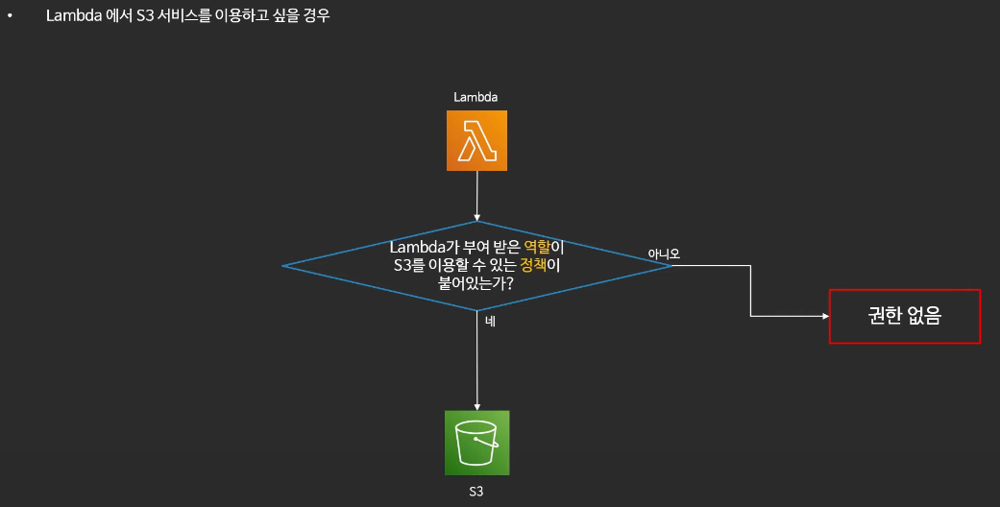

# 01. IAM 기초

> 이번에는 IAM(Identity and Access Management)에 대해 알아본다

## 01-1. IAM(Identity and Access Management)?

> IAM이란 AWS 서비스 혹은 리소스에 대한 제어를 할 수 있게 도와주는 AWS 글로벌 서비스 이다.  
> IAM을 사용하게 되면 AWS 서비스의 접근에 대한 제어를 할 수 있다.

- `✅ IAM은 AWS 전체의 권한 통제 시스템`
- AWS IAM 사용 하는 경우
  - `AWS 서비스` 혹은 `리소스`에 대한 `엑세스` `제어 가능`
    - `사용자` 혹은 `사용자 그룹`을 만들어 `AWS 서비스` 혹은 `리소스`에 대한 `엑세스` `제어`
    - `사용자 패스워드 관리 가능`(일정 시간마다 패스워드 변경 등)
    - `계정 별칭 부여` + `로그인 주소 생성` 가능

> ✅ AWS 계정 생성과 IAM 유저?

AWS account를 생성하게 되면 기본적으로 루트(root)유저가 생성된다. 이러한 루트(root) 유저는 기본적으로 너무 많은 권한을 가지기에 보안적으로 취약점을 가진다. 
하여 AWS에서 직접 만들 수 있는 보안 주체가 존재하게 되는데 대표적으로 `사용자`, `역할`같은 보안 주체가 존재한다. `IAM 사용자`는 `장기 Credential`을 사용해 
서비스에 접근하는 보안 주체이다.

> ✅ AWS IAM Role?

`IAM Role`은 `자동`으로 `로테이션`되는 `임시 자격증명을 사용`하기에, 장기 Credentials을 사용하는 것보다 안전하다.  
또한 이렇게 `역할`을 `사용`하는 것을 `Assume` 한다고 한다.

> ✅ AWS IAM Policy?

`IAM Policy`는 위와 같은 구조로 구성

## 01-2. IAM(Identity and Access Management) 구성?

> IAM은 크게 사용자(User), 사용자 그룹(User Group), 정책(Policy), 역할(Role) 4가지로 구성된다.

1. `사용자(User)`는 `실제 AWS를 사용하는 사람` or `어플리케이션`(EC2, RDS..)를 의미
2. `사용자 그룹(User Group)`은 `사용자의 집합`이다. `그룹에 속한 사용자는 그룹 권한을 사용` 가능
3. `정책(Policy)`은 `사용자`, `사용자 그룹`, `역할`이 `무엇을 할 수 있는지`에 관한 문서를 의미
   1. `언제, 어디서, 무엇을, 어떻게, 왜?` 와 같이 `정책` 지정가능(JSON 형태)
   2. 여러개의 권한이 모여 1개의 정책(Policy)가 된다
   3. 정책(Policy) -> 역할에 부여 --> AWS 서비스에 권한 부여
   4. 정책(Policy) -> 그룹에 부여 --> 사용자에 권한 부여
4. `역할`(Role)은 `AWS 리소스`에 부여하여 `AWS 리소스가 무엇을 할 수 있는지 정의` 한다
   1. 🔥 (중요) `역할은 IAM 사용자, IAM 그룹에 연결되지 않는다`
   2. A 서비스가 B 서비스에 접근해야 하는 경우
   3. 또한 `다른 사용자가 역할을 부여 받아 사용`하거나 `역할을 바꾸어` 사용 가능

> IAM 구성은 어떻게 되는지 도식으로 살펴보자  
> 언제, 어디서, 무엇을, 어떻게 왜? 가 중요

- 모든 것은 정책(Policy)으로 결정된다 -> `'무엇을 할 수 있는가?'`
  - 정책은 사용자, 사용자 그룹, 역할에 부착(Attached) 된다
  - 역할에는 AWS 서비스가 부착(Attached) 된다

## 01-3. IAM 권한 검증 과정

> 만약 사용자가 AWS S3를 사용한다고 가정

1. 우선 `사용자`에게 S3 이용 정책이 있는지 확인
   1. OK -> 사용
2. `사용자 그룹`에 S3 이용 정책이 있는지 확인
   1. OK -> 사용
3. 내가 `위임된 역할`에 S3 이용 정책이 있는지 확인
   1. OK -> 사용
4. 권한 없음

> 그렇다면 AWS 서비스가 다른 서비스를 이용하는 경우에는?  
> Lambda가 S3를 사용하는 순서를 보자

1. Lambda가 S3 이용 정책이 있는가?
   1. OK -> 사용
2. 권한 없음

## 01-4. 사용자 종류?

> 그러면 IAM 구성 요소의 사용자는 어떤 종류가 있는지 보자

- `루트(root) 유저 -> Super User`
  - `관리자 계정`으로 모든 권한 가지고 있음
  - MFA 반드시 설정 + 관리 권한 말고 다른 권한 제외하자! -> 필수임
- `IAM 사용자`
  - `IAM를 통해 생성된 한명의 사용자`
  - `빌링 기능 사용 불가`

## 01-5. IAM 자격증명 보고서

- `IAM 현 상황 보여주는 보고서`
- 모든 `사용자 암호`, `엑세스 키`, `MFA 증명 상태` 나열 보고서 `엑셀 다운 가능`

## 01-6. IAM 모범 사례

- ❌ 루트(root) 사용자 절대 사용하지 말자
- ❌ 불필요한 사용자 만들지 말자
- ✅ MFA 활성화 하기
- ✅ access_key 대신 역할 사용하기
- ✅ 최소 권한만 주기

## 99. 참고 자료

- [[AWS] IAM 기초](https://www.youtube.com/watch?v=lcly_aIq1KI&list=PLfth0bK2MgIan-SzGpHIbfnCnjj583K2m&index=6)
- [[AWS] AWS IAM 작동 방식 한방에 이해하기](https://www.youtube.com/watch?v=iJuLmM56y-M)
- [[AWS] AWS IAM과 친해지기 (레벨 200) – 조이정:: AWS Builders Online Series](https://www.youtube.com/watch?v=zIZ6_tYujts)