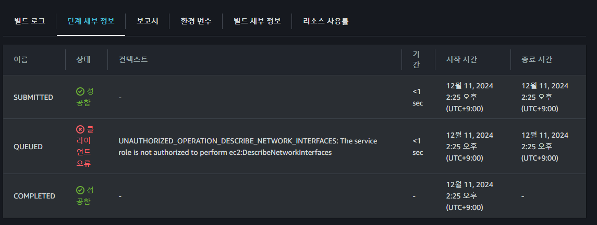
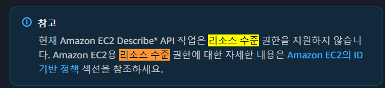

# IAM Codebuild 관련 Policy

Codebuild 구성 중 AWS VPC를 지정하는 경우, ec2:networkInterface 관련 권한이 필요한 상황이 존재한다.  
하여 위와 같은 상황에서 발생한 이슈 관련하여 정리 하였다.

## 에러 문구



```shell
# 현재 codebuild의 service role에 아래 권한이 없어서 빌드에 실패하는 상황
UNAUTHORIZED_OPERATION_DESCRIBE_NETWORK_INTERFACES: The service role is not authorized to perform ec2:DescribeNetworkInterfaces
```

## Role에 Attacth 되어 있는 custom policy 확인

```json
{
  "Statement":[{
    "Effect":"effect",
    "Action":"action",
    "Resource":"arn",
    "Condition":{
      "condition":{
        "key":"value"
        }
      }
    }
  ]
}
```

정책(Policy) 구문은 위와 같이 구성이 되어있다.  

- Effect: Allow(허용), Deny(미허용) 지정, Deny가 우선된다
- Action: AWS 특정 API 작업 명시
- Resource: 작업의 영향을 받는 리소스
- Condition: 조건 지정

### AS-IS

```json
{
    "Version": "2012-10-17",
    "Statement": [
        {
            "Effect": "Allow",
            "Action": [
                "ec2:CreateNetworkInterface",
                "ec2:DescribeDhcpOptions",
                "ec2:DescribeNetworkInterfaces",
                "ec2:DeleteNetworkInterface",
                "ec2:DescribeSubnets",
                "ec2:DescribeSecurityGroups",
                "ec2:DescribeVpcs",
                "ec2:CreateNetworkInterfacePermission"
            ],
            "Resource": [ ----> 제거 필요
                "arn:aws:ec2:ap-northeast-2:7xxxxxxxxxxx:network-interface/*",
                "arn:aws:ec2:ap-northeast-2:7xxxxxxxxxxx:subnet/*"
            ],
            "Condition": {
                "StringEquals": {
                    "ec2:AuthorizedService": "codebuild.amazonaws.com"
                },
                "ArnEquals": {
                    "ec2:Subnet": [
                        "arn:aws:ec2:ap-northeast-2:7xxxxxxxxxxx:subnet/subnet-0xxxxxxxxxxx",
                        "arn:aws:ec2:ap-northeast-2:7xxxxxxxxxxx:subnet/subnet-0xxxxxxxxxxx",
                        "arn:aws:ec2:ap-northeast-2:7xxxxxxxxxxx:subnet/subnet-0xxxxxxxxxxx"
                    ]
                }
            }
        }
    ]
}
```

> 참고 자료 : [Amazon EC2의 ID 기반 정책](https://docs.aws.amazon.com/ko_kr/AWSEC2/latest/UserGuide/iam-policies-for-amazon-ec2.html?utm_source=chatgpt.com)



```shell
# 아래 Action은 리소스 수준에서의 권한 제거가 불가능하다
"ec2:CreateNetworkInterface",
"ec2:DescribeDhcpOptions",
"ec2:DescribeNetworkInterfaces",
"ec2:DeleteNetworkInterface",
"ec2:DescribeSubnets",
"ec2:DescribeSecurityGroups",
"ec2:DescribeVpcs",
"ec2:CreateNetworkInterfacePermission"
```

```shell
# 이에 반해 아래 Action은 리소스 수준 권한 제거가 가능하다고 함
"ec2:CreateNetworkInterfacePermission"
```

ec2:Describe의 경우 리소스(resource) 수준에서의 권한을 지원하지 않는다고 한다.  
하여 ec2:Describe로 Action을 기재하는 경우 Resource는 "*"를 지정해야 한다고 한다.  
즉, 리소스 수준 권한을 부분적으로 제공하기에 Resource 부분에 특정 리소스를 상세히 명시못하는 케이스가 존재한다.

### TO-BE

```json
{
  "Version": "2012-10-17",
  "Statement": [
    {
      "Effect": "Allow",
      "Action": [
        "ec2:CreateNetworkInterface",
        "ec2:DescribeDhcpOptions",
        "ec2:DescribeNetworkInterfaces",
        "ec2:DeleteNetworkInterface",
        "ec2:DescribeSubnets",
        "ec2:DescribeSecurityGroups",
        "ec2:DescribeVpcs"
      ],
      "Resource": "*"
    },
    {
      "Effect": "Allow",
      "Action": [
        "ec2:CreateNetworkInterfacePermission"
      ],
      "Resource": "arn:aws:ec2:ap-northeast:7xxxxxxxxxxx:network-interface/*",
      "Condition": {
        "StringEquals": {
          "ec2:AuthorizedService": "codebuild.amazonaws.com"
        },
        "ArnEquals": {
          "ec2:Subnet": [
            "arn:aws:ec2:region:account-id:subnet/subnet-id-1",
            "arn:aws:ec2:region:account-id:subnet/subnet-id-2"
          ]
        }
      }
    }
  ]
}
```

변경 후 `ec2:CreateNetworkInterfacePermission` 리소스(Resource-Level) 수준에서의 권한 제어가 가능하기에 위와 같이 수정한다.