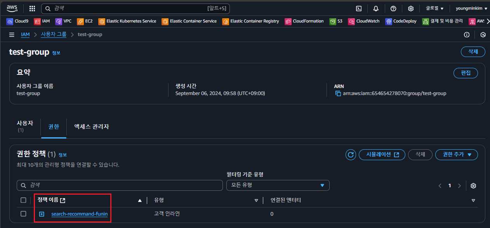
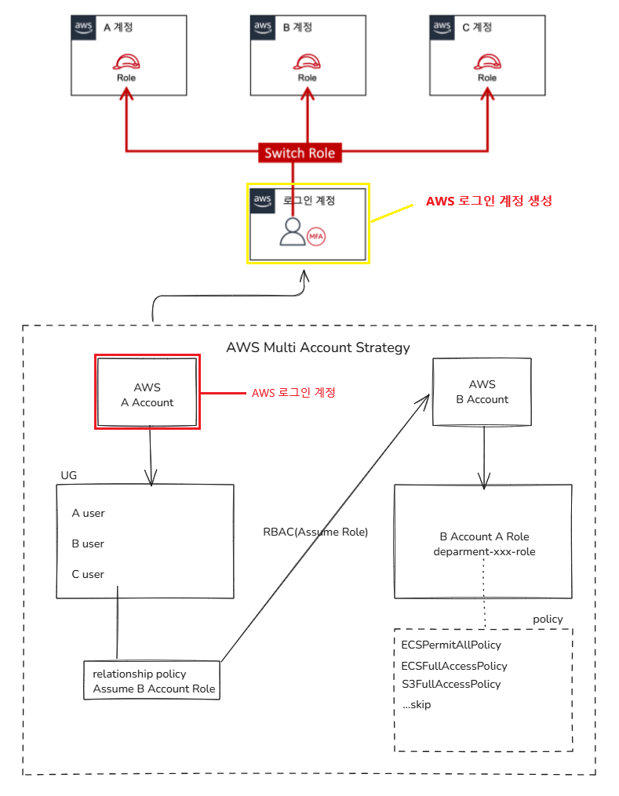
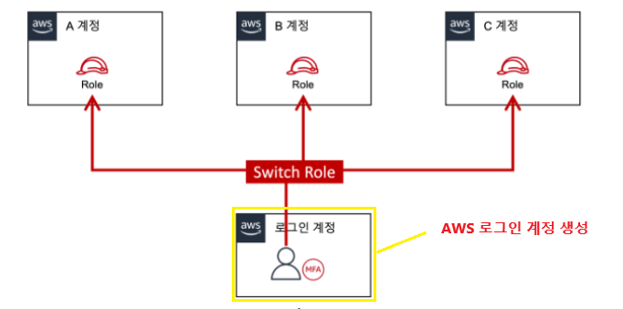

# IAM 유저 생성 후 역할 전환

## IAM 사용자 생성


- AWS 로그인을 위한 사용자 생성
- 비밀번호의 경우 사용자가 다시 재설정 하도록 지정

## IAM 사용자 그룹 생성




- 위에서 생성한 사용자를, 사용자 권한을 묶기 위해 `test-group` 생성 후 해당 그룹에 넣는다
- 그룹에 넣는 이유는, 그룹별로 권한을 관리하기 위함
- (중요) IAM > 사용자 그룹 > test-group > 권한 Tab 클릭 > 정책(Policy) 추가 > 인라인 정책 생성

```shell
# 사용자 그룹에 인라인 정책을 추가한다
# 아래와 같이 특정 Role을 Assume 할 수 있는 정책을 추가하여
# Role Base로 AWS 리소스를 사용하도록 권한을 관리한다
# Multi Account인 경우는 다른 AWS Account ID를 지정하겠지만, 현재는 동일한 AWS Account 지정
{
    "Version": "2012-10-17",
    "Statement": [
        {
            "Sid": "test",
            "Effect": "Allow",
            "Action": "sts:AssumeRole",
            "Resource": "arn:aws:iam::65xxxxxxxxx:role/test-role"
        }
    ]
}
```

## 역할 생성


> test-role이라는 역할 생성

- IAM > 역할 > 역할 생성 > 사용자 지정 신뢰 정책 > JSON 신뢰 정책 추가
- 역할은 기본적으로 AWS 서비스에 Attatch 된다, 사용자 or 사용자 그룹에 직접 Attach 되지는 않음
- 해당 Role을 Assume(임시 권한 부여)를 받기 위해서는, 해당 역할에 `신뢰 정책`이 추가 되어야 함
  - IAM > 역할 > test-role(role 선택) > 신뢰 관계 Tab 확인
- 여기서 중요한 부분은 `보안 주체 추가` 클릭 후 특정 AWS Account를 가진 USER를 지정해야 한다는 점
  - 위와 같이 설정을 해야 특정 사용자가 해당 Role을 Assume 할 수 있음

```shell
{
    "Version": "2012-10-17",
    "Statement": [
        {
            "Sid": "Statement1",
            "Effect": "Allow",
            "Principal": {
                "AWS": "arn:aws:iam::65xxxxxxxxx:root"
            },
            "Action": "sts:AssumeRole",
            "Condition": {
                "Bool": {
                    "aws:MultiFactorAuthPresent": "true"
                }
            }
        }
    ]
}
```

## 실제 IAM USER 로그인


> IAM 접속 링크 : https://{aws-account-id}.signin.aws.amazon.com/console

- 위 URL은 IAM > 대시보드 > AWS 계정란을 확인하면 된다
  - 계정 ID: 65xxxxxxxxx
  - 계정 별칭: 별칭은 추가 해주면 됨
  - 이 계정의 IAM 사용자를 위한 로그인 URL: 위에 있는 URL
- 해당 URL을 주소창에 입력 후 IAM 유저 접속 시도
  - 계정ID(12자리) 또는 계정 별칭: 별칭 혹은 AWS Account 입력
  - 사용자 이름: IAM 유저 이름 입력
  - 암호: 암호 입력
  - 로그인 버튼 클릭
  - MFA 코드: 휴대폰에 있는 MFA 코드를 입력한다
- 로그인에 성공 후
  - AWS 메인 화면 > 우측 계정 클릭 > 역할 전환 클릭
  - Account ID: 해당 Role이 존재하는 AWS Account ID 입력
  - IAM Role Name: 해당 AWS Account의 특정 Role 입력
  - Display Name: 아무 이름이나 상관 없음
  - Display Color: 이것도 상관 없음
  - Switch Role 클릭
  - 로그인 성공

> ✅ 아래 내용에서는 Multi Account 사용 이유와 방법에 대해 다시 한번 복기한다

## Multi Account 사용 이유

> A 프로젝트 : AWS A Account  
> B 프로젝트 : AWS B Account  
> C 프로젝트 : AWS C Account  
> ...중략

회사 내에서 운영하는 `프로젝트` 혹은 `사업` 건이 `여러개`인 경우 `Multi Account`를 사용하지 않으면,  
특정 프로젝트의 AWS 리소스를 관리 해야할때마다 `프로젝트에 해당하는 계정에 로그인`을 해야 한다.

만약 프로젝트가 `10개`고, 각 프로젝트별로 `AWS 계정이 따로 존재`한다면,  
해당 프로젝트의 AWS 리소스 관리를 위해 `10번`의 `재 로그인`을 `수행`해야 한다.



위와 같은 부분을 방지 하기 위해, 1개의 로그인 IAM 계정을 생성 한다.  
후에는 다른 AWS Account(B, C, D..)별로 AWS Account를 생성한 후, 해당 계정 내에 Role(역할)을 생성 한다.  
이렇게 구성 된 경우 1개의 로그인 IAM 계정에 로그인 후, 필요에 따라 다른 Account의 Role로 역할을 Assume하면 된다.

## 작업 진행 순서

### 01. 로그인 계정 준비

```shell
# AWS root 계정의 IAM 콘솔

## A User Group

- User Group A
  - A User (Email: aaa@example.com)
  - B User (Email: bbb@example.com)
  - C User (Email: ccc@example.com)

## B User Group

- User Group B
  - A User (Email: user4@example.com)
  - B User (Email: user5@example.com)
  - C User (Email: user6@example.com)
  - D User (Email: user6@example.com)
```

최초로 가입한 AWS root 계정에서 로그인 계정으로 사용할 IAM user를 생성한다.  
여기서 로그인 계정으로 사용할 IAM user는 `해당 팀에 속한 사용자 인원별로 생성`한다.  

사용자를 모두 만들었으면 사용자가 포함되어 있는 `User Group`에 `Role Assume`하기 위한 신규 정책(Policy)를 추가한다.  
아래와 같이 해당 정책(Policy)의 내용을 정해주면 된다. 또한 A-Role, B-Role의 신뢰 관계도 수정을 해준다.

> ✅ 로그인 계정의 User Group에 아래 내용을 가진 신규 정책(xxx-xxx-assume-policy) 추가

```json
{
    "Version": "2012-10-17",
    "Statement": [
        {
            "Sid": "xxxxxxxxxxxx",
            "Effect": "Allow",
            "Action": "sts:AssumeRole",
            "Resource": "arn:aws:iam::프로젝트별_AWS_ACCOUNT_ID:role/A-Role"
        },
        {
            "Sid": "xxxxxxxxxxxx",
            "Effect": "Allow",
            "Action": "sts:AssumeRole",
            "Resource": "arn:aws:iam::프로젝트별_AWS_ACCOUNT_ID:role/B-Role"
        }
    ]
}
```

> ✅ Assume Role한 계정의 Role에 아래 신뢰 관계를 추가  
> 7xxxxxxxxxxx:root -> 해당 AWS Account의 root + 모든 IAM 유저가 해당 Role Assume 가능

```json
{
    "Version": "2012-10-17",
    "Statement": [
        {
            "Sid": "Statement1",
            "Effect": "Allow",
            "Principal": {
                "AWS": [
                    "arn:aws:iam::7xxxxxxxxxxx:root", 
                    "arn:aws:iam::5xxxxxxxxxxx:root"
                ]
            },
            "Action": "sts:AssumeRole",
            "Condition": {
                "Bool": {
                    "aws:MultiFactorAuthPresent": "true"
                }
            }
        }
    ]
}
```

여기서 `arn:aws:iam::7xxxxxxxxxxx:root`로 지정한 부분은, AWS 루트(root) 사용자 뿐만 아니라 모든 IAM 사용자 및 역할을 포함하는 경우 저렇게 사용한다.  

### 02. 프로젝트별 계정(A, B, C)에서 Role 생성

1. A 계정 로그인 후 IAM 콘솔 창에서 역할 생성 클릭
2. 다른 AWS 계정 선택하고, 로그인 계정의 AWS Account ID를 적고 + MFA 필요도 클릭 한다
3. 해당 역할에서 사용할 정책(Policy) 지정
4. 마지막으로 역할 명을 지정하고 역할 만들기 클릭

### 03. 콘솔 접속 플로우



1. 로그인 계정으로 AWS 콘솔 접속 시도 (user별 ID + Password 지급)
2. 접속 성공 > 우측 상단의 계정명 클릭 > 역할 전환 클릭
   1. Account ID: 전환하고자 하는 특정 AWS Account의 ID or alias 입력
   2. IAM role name: 전화하고자 하는 특정 AWS Account의 role name 입력
   3. Display name - optional: 역할 전환 후 콘솔에 출력되는 이름
   4. Display color - optional: 이름 색상
   5. Switch Role 클릭
3. 역할 전환 성공

## 참고 자료

- [[AWS] 사용자에서 IAM 역할로 전환(콘솔)](https://docs.aws.amazon.com/ko_kr/IAM/latest/UserGuide/id_roles_use_switch-role-console.html)
- [[AWS] 관리해야하는 AWS 계정이 여러개일때? 어떻게 접속할까?](https://1mini2.tistory.com/141)