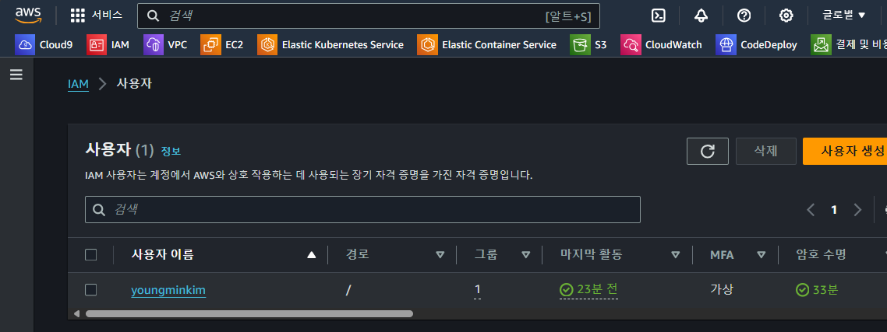
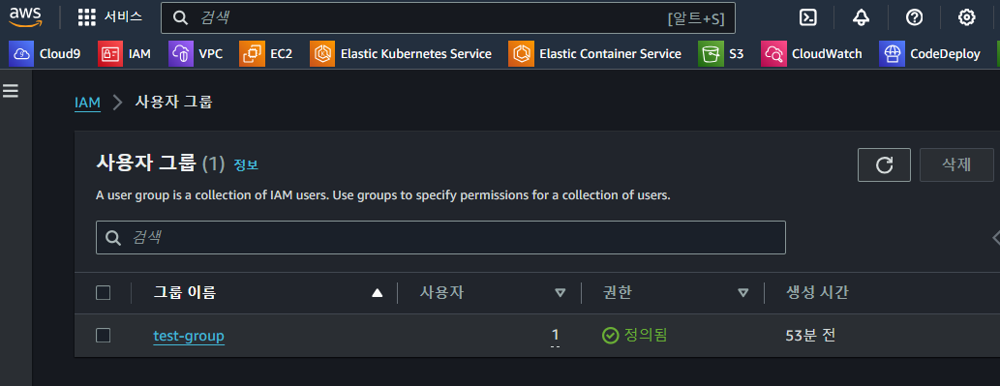
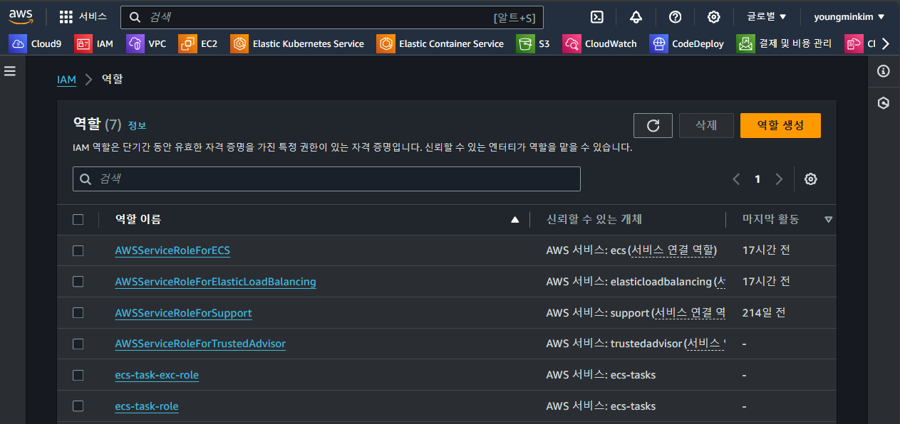
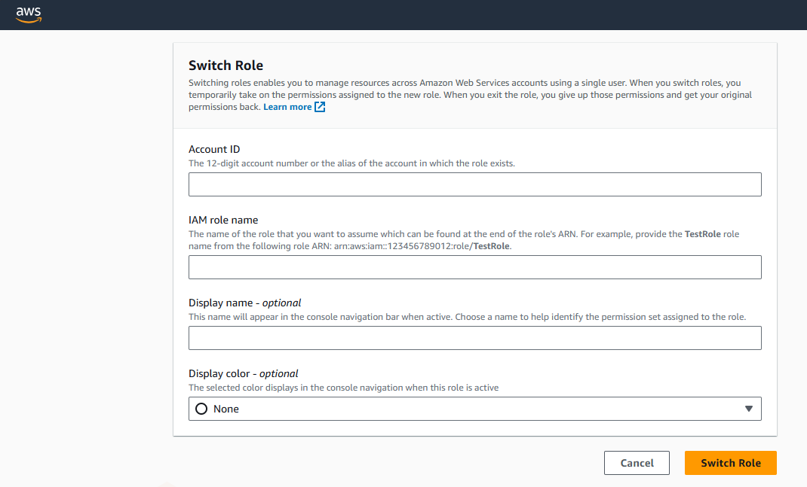

# IAM 유저 생성 후 역할 전환

## IAM 사용자 생성



- AWS 로그인을 위한 사용자 생성
- 비밀번호의 경우 사용자가 다시 재설정 하도록 지정

## IAM 사용자 그룹 생성



- 위에서 생성한 사용자를, 사용자 권한을 묶기 위해 `test-group` 생성 후 해당 그룹에 넣는다
- 그룹에 넣는 이유는, 그룹별로 권한을 관리하기 위함
- (중요) IAM > 사용자 그룹 > test-group > 권한 Tab 클릭 > 권한 추가 > 인라인 정책 생성

```shell
# 사용자 그룹에 인라인 정책을 추가한다
# 아래와 같이 특정 Role을 Assume 할 수 있는 정책을 추가하여
# Role Base로 AWS 리소스를 사용하도록 권한을 관리한다
# Multi Account인 경우는 다른 AWS Account ID를 지정하겠지만, 현재는 동일한 AWS Account 지정
{
    "Version": "2012-10-17",
    "Statement": [
        {
            "Sid": "test",
            "Effect": "Allow",
            "Action": "sts:AssumeRole",
            "Resource": "arn:aws:iam::65xxxxxxxxx:role/test-role"
        }
    ]
}
```

## 역할 생성



> test-role이라는 역할 생성

- IAM > 역할 > 역할 생성 > 사용자 지정 신뢰 정책 > JSON 신뢰 정책 추가
- 역할은 기본적으로 AWS 서비스에 Attatch 된다, 사용자 or 사용자 그룹에 직접 Attach 되지는 않음
- 해당 Role을 Assume(임시 권한 부여)를 받기 위해서는, 해당 역할에 `신뢰 정책`이 추가 되어야 함
  - IAM > 역할 > test-role(role 선택) > 신뢰 관계 Tab 확인
- 여기서 중요한 부분은 `보안 주체 추가` 클릭 후 특정 AWS Account를 가진 USER를 지정해야 한다는 점
  - 위와 같이 설정을 해야 특정 사용자가 해당 Role을 Assume 할 수 있음

```shell
{
    "Version": "2012-10-17",
    "Statement": [
        {
            "Sid": "Statement1",
            "Effect": "Allow",
            "Principal": {
                "AWS": "arn:aws:iam::65xxxxxxxxx:root"
            },
            "Action": "sts:AssumeRole",
            "Condition": {
                "Bool": {
                    "aws:MultiFactorAuthPresent": "true"
                }
            }
        }
    ]
}
```

## 실제 IAM USER 로그인



> IAM 접속 링크 : https://{aws-account-id}.signin.aws.amazon.com/console

- 위 URL은 IAM > 대시보드 > AWS 계정란을 확인하면 된다
  - 계정 ID: 65xxxxxxxxx
  - 계정 별칭: 별칭은 추가 해주면 됨
  - 이 계정의 IAM 사용자를 위한 로그인 URL: 위에 있는 URL
- 해당 URL을 주소창에 입력 후 IAM 유저 접속 시도
  - 계정ID(12자리) 또는 계정 별칭: 별칭 혹은 AWS Account 입력
  - 사용자 이름: IAM 유저 이름 입력
  - 암호: 암호 입력
  - 로그인 버튼 클릭
  - MFA 코드: 휴대폰에 있는 MFA 코드를 입력한다
- 로그인에 성공 후
  - AWS 메인 화면 > 우측 계정 클릭 > 역할 전환 클릭
  - Account ID: 해당 Role이 존재하는 AWS Account ID 입력
  - IAM Role Name: 해당 AWS Account의 특정 Role 입력
  - Display Name: 아무 이름이나 상관 없음
  - Display Color: 이것도 상관 없음
  - Switch Role 클릭
  - 로그인 성공