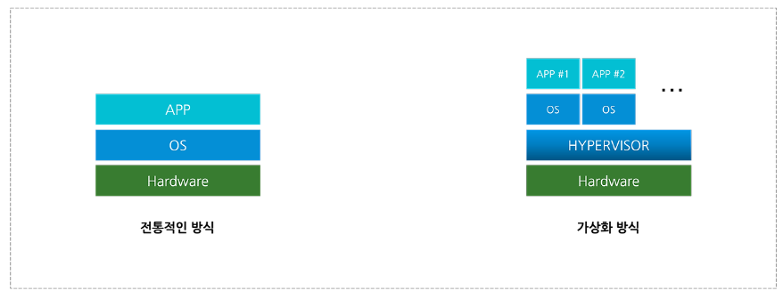
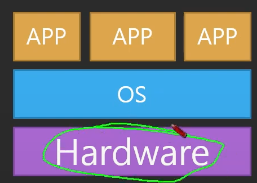
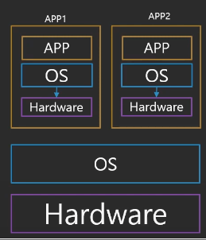
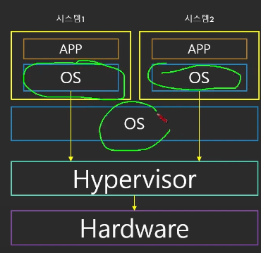
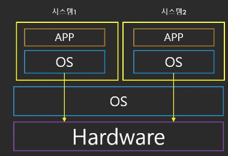
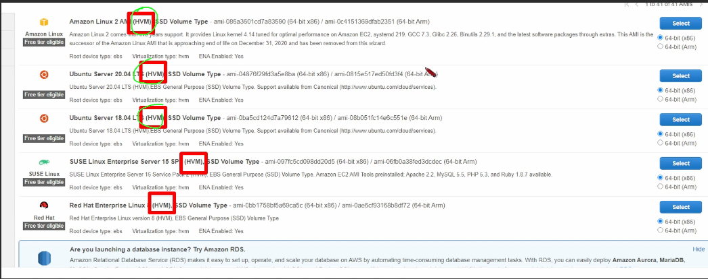
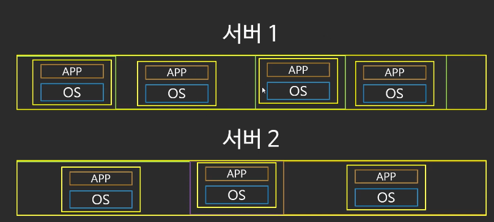

# 01. 가상화란?

> 이번에는 클라우드의 핵심이라 할 수 있는 가상화 대해 알아본다

## 01-1. 가상화(Virtualization)란?

`가상화란`(Virtualization)란 `단일 컴퓨터`의 `하드웨어 요소`를 `다수의 가상 컴퓨터`(VM 가상머신)로 `분할(쪼개는)`하는 `기술`을 의미한다. 가상화의 대상이 되는 자원은 `CPU`, `Memory`, `Storage`, `Network`가 존재한다.

기존처럼 하나의 OS만 운영할 경우 서버에는 유후 자원이 발생하게 된다. 하지만 단일 서버에 여러 서비스(프로세스)를 올릴 수 있으면 "`리소스 활용률 향상`", "`서버 구축 시간 및 비용`" 등을 절감 할 수 있다.

이처럼 `물리적인 하드웨어 자원`을 `논리적`으로 `통합` 한것을 `서버 가상화`라 한다.  
전통 방식과 가상화 방식의 차이는 아래와 같다.

### 전통 방식과 가상화 방식의 차이

- 전통적인 방식
  - 1개의 물리적 하드웨어(서버 or 컴퓨터) 위에 하나의 OS (1:1)
- 가상화 방식
  - 1개의 물리적 하드웨어(서버 or 컴퓨터) 위에 다수의 가상 머신(VM) (1:N)
  - 각 VM 위에는 독립적인 운영체제(OS) 실행
  - `1개의 물리적 서버가 여러개의 OS를 실행하는 효과`

### 하이퍼 바이저를 통한 가상화

> 하드웨어 위에 설치되는 부분은 호스트 OS, 호스트 OS로부터 관리되는 부분을 게스트 OS라 지칭

기본적으로 가상화를 구현하기 위해서는 기존과 같이 1개의 하드웨어(서버 or 컴퓨터)에 운영체제를 바로 깔고, 그 위에 애플리케이션을 구동하는 식으로 하면 안된다.

우선 하드웨어(서버 or 컴퓨터) 위에 하이퍼바이저(Hypervisor)를 설치한다.  
여기서 `하이퍼바이저`(Hypervisor)는 `1개의 서버`에서 `다수의 VM(가상머신 위에 OS 깔림)`를 실행하는 플랫폼을 의미한다.

`하이퍼바이저`는 `아래 2가지 타입`으로 구분한다.

### 1. 베어 메탈 방식(Type-1 or Bare Metal or Native)

- 하드웨어(서버 or 컴퓨터) 위에 하이퍼바이저(Hypervisor) 설치
- 호스트 OS == 하이퍼바이저 이기에 가상화 목적으로만 사용 가능
- Type-2에 비해 레이어가 적어 오버헤드 발생 적음
- 종류
  - Microsoft Hyper-V

> 💡 Type-1 BareMeta의 경우 전가상화(Full-Virtualization), 반가상화(Para-Virtualization) 로 구분

- 전가상화(Full-Virtualization)
  - `하드웨어 전체를 가상화 하는 방식`
  - `하이퍼바이저 관리용 가상 머신`(`DOM0`)이 `실행`됨, 모든 가상머신의 하드웨어 접근이 해당 관리 머신(`DOM0`)을 통해 이루어짐
  - GuestOS는 하이퍼바이저의 존재 몰라도 됨
  - 하이퍼바이저 관리용 가상 머신이 모든 명령 컨트롤하기에, 성능 느림
- 반가상화(Para-Virtualization)
  - `전가상화와 다르게, 완전히 가상화 안함`
  - `전가상화 성능 문제 해소`를 위해, `하이퍼콜`(`Hyper Call`) 이라는 `인터페이스`를 통해 하이퍼바이저에게 명령 수행
  - 위와 같은 명령을 위해 Guest OS의 커널 수정이 필요

### 2. 호스트형 방식(Type-2 or Hosted)

- 하드웨어(서버 or 컴퓨터) 위에 호스트 OS 설치 후 하이퍼바이저 설치
- Type-1 or Bare Metal에 비해 속도는 느림
- 종류
  - VirtualBox, VMware Workstation

## 01-2. 들어가기 전에

- 운영체제(Operating System, OS): `시스템` `H/W`, `S/W 자원`을 `운영` 및 `관리`하는 `프로그램`
  - Windows, Linux, Mac OS, Android...
- 특권 명령(privileged instructions): `시스템 요소들과 소통할 수 있는 명령` - `OS만 가능`
  - 컴퓨터의 `H/W`와 `소통`할 수 있는 명령
  - OS는 특권 명령 때문에 `1개의 H/W`에는 `1개의 OS`만 구동 가능
  - `일반 프로그램`은 특권 명령 필요 없기에, `많은 P/G 동시 수행 가능`
- 가상화가 나오기 전 1개의 H/W == 1개의 OS만 실행 가능
  - 일반 컴퓨터처럼 직접 OS가 H/W에 설치된 상태(Bare-Metal)로만 운영 가능했었음
  - H/W > OS > APP

## 01-3. 1세대 가상화의 등장

> 이전에 1개의 H/W == 1개의 OS만 구동 가능하다고 하였다.  
> 하지만 1세대 가상화의 등장으로 변화가 시작된다.

- 1세대: `완전 가상화`(Fully Emulated)
  - `모든 시스템 요소`가 `에뮬레이터 안에서 돌아감`
  - `CPU`, `HDD`, `마더보드` 등 `모든 요소`를 `에뮬레이터`(물리적 장치가 아닌 가상의 장치)로 `구현`하여 `OS와 연동`
  - 엄청나게 느림

## 01-4. 2세대 가상화의 등장

- 2세대: `ParaVirtualization`
  - `Guest OS`는 `하이퍼 바이저`(hypervisor)와 통신
  - `하이퍼 바이저`(hypervisor): OS와 H/W 사이에 존재하는 일종의 `가상화 매니저`
  - 1세대에 비해 속도는 향상됨
    - 몇 요소의 경우 여전히 느림

## 01-5. 3세대 가상화의 등장

- 3세대: Hardware Virtual Machine(HVM)
  - `H/W`에서 `직접 가상화 지원`
  - 직접 `Guest OS`가 `H/W와 통신` = 빠른 속도(near bare-metal)

## 01-6. 가상화 그리고 클라우드

> 그래서 가상화가 무엇이 중요한가?

- AWS 환경에서 리소스를 빠르게 구성할 수 있는 원동력은 가상화다
  - EC2는 빠르게 컴퓨팅 파워를 제공, 이 원동력은 가상화다
  - 미리 고정되어 있는 서버의 가상화를 통해, 1개의 서버를 할당해주는 것

## 99. 참고 자료

- [서버 가상화 개념](https://smallrich.tistory.com/2)
- [가상화란?(가상화 개념, 가상화 클라우드 차이)](https://claudy.tistory.com/entry/%EA%B0%80%EC%83%81%ED%99%94Virtualization%EB%9E%80%EA%B0%80%EC%83%81%ED%99%94-%EA%B0%9C%EB%85%90-%EA%B0%80%EC%83%81%ED%99%94-%ED%81%B4%EB%9D%BC%EC%9A%B0%EB%93%9C-%EC%B0%A8%EC%9D%B4)
- [하이퍼바이저(Hypervisor) 개념 및 종류](https://nice-engineer.tistory.com/entry/%ED%95%98%EC%9D%B4%ED%8D%BC%EB%B0%94%EC%9D%B4%EC%A0%80Hypervisor-%EA%B0%9C%EB%85%90-%EB%B0%8F-%EC%A2%85%EB%A5%98)
- [쉽게 설명하는 AWS 기초 강좌 6: 가상화란?](https://www.youtube.com/watch?v=hb_4Tf6bAtY&list=PLfth0bK2MgIan-SzGpHIbfnCnjj583K2m&index=7)
- [[농심] 가상화의 종류3가지](https://tech.cloud.nongshim.co.kr/2018/09/18/%EA%B0%80%EC%83%81%ED%99%94%EC%9D%98-%EC%A2%85%EB%A5%983%EA%B0%80%EC%A7%80/)
- [[kt cloud Blog] 한방에 이해되는 가상화 기술 용어 정리](https://tech.ktcloud.com/77)