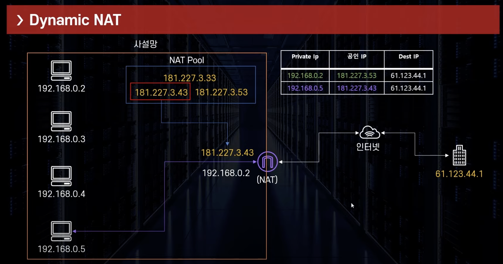
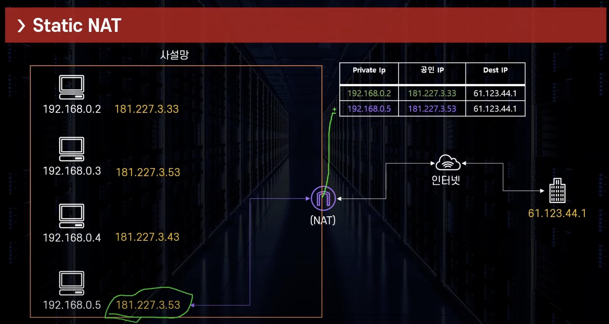
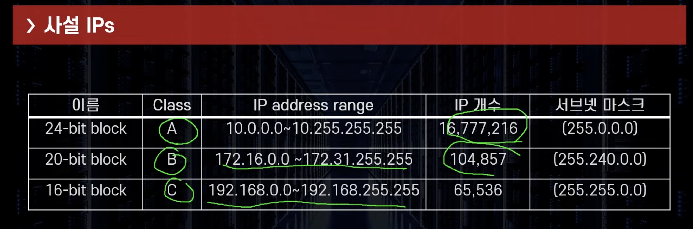
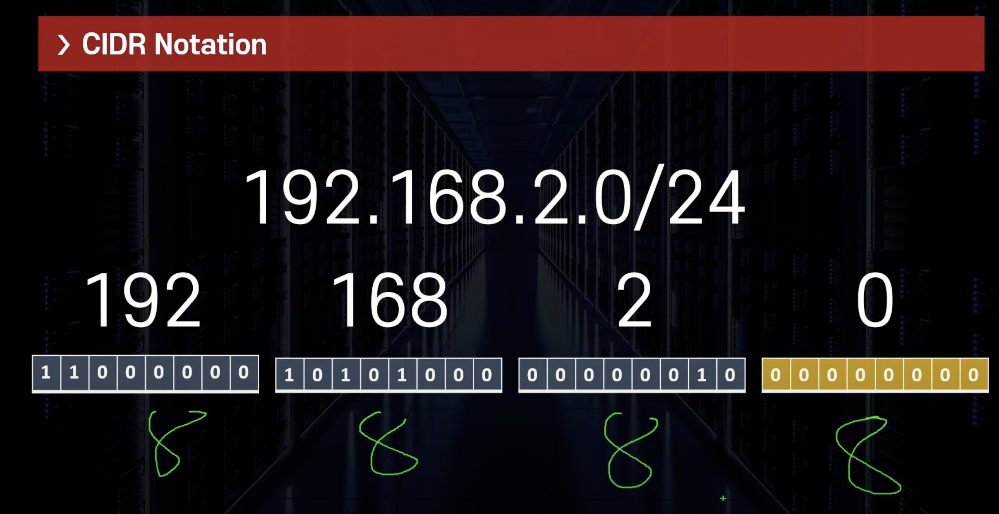

# 사설 IP, 공인 IP, NAT 정리

# 01. 아이피(IP)란

- **IP**(Internet Protocol)란 **인터넷에 연결된 모든 장치들(컴퓨터, 서버 장비, 스마트폰)을 식별**할 수 있도록 각 장비에 부여된 **고유 주소**
- 다른 사람에게 우편물을 보낼 때 우리는 국가, 지연, 아파트, 호수를 기재 후 발송하는 경우가 있음
- 네트워크 데이터(패킷)가 우리에게 도달해 네이버 같은 페이지를 보여주려면 **정확한 주소 정보가 필요함**

> 예를 들어 아래와 같은 경우가 있다고 가정한다
> 
- 철수는 짱구 집에서 보기로 약속을 잡은 상태이다
- 철수가 짱구 집을 가려면 어떻게 해야 하는가?
    - 철수는 짱구가 어디에 살고 있는지 정확한 집 주소를 알아야한다
    - ex) 경기도 성남시 분당구 내정로 24, 한진 아파트 602동 102호
- 이렇듯 인터넷 상에서도 정확한 정보가 있어야 목적지에 도달할 수 있음

## 01-2. IP 종류

> IP 종류에는 IPv4, IPv6 2가지 종류가 있다. 일반적으로 말하는 IP 주소라 하면 IPv4라 할 수 있음

### IPv4(구)

- **IPv4**는 **IP Version 4의 약자**로, **전 세계적으로 첫 번째로 사용된 인터넷 프로토콜**
- IP는 일반적으로 172.21.x.x와 같이 4개의 숫자 + 마침표로 구분
- 10진수로 IP를 표현
- **IP를 이진법**으로 표현하면 **32bit가 된다**
    - 8bit.8bit.8bit.8bit == 1byte.1byte.1byte.1byte
    - 2^32 = 4,294,967,296(43억개 정도 IP 표현 가능)
- **하지만 IPv4는 현재, 전 세계 인터넷 사용자가 급증하면서 IPv4 주소가 고갈된 위기에 처해있음**
    - **이러한 고갈 문제를 해결하기 위해 IPv6가 등장**

### IPv6(신)

- **IPv6**는 **IP version 6의 약자**로, **IPv4의 주소체계를 128비트로 확장한 차세대 인터넷 프로토콜**
- **16비트씩 8자리**로, **각 자리는 콜론(:)으로 구분**
- IPv6는 IPv4와 다르게 8개의 16비트 블록으로 구분이 되어있음
    - ex) 2001:0db8:85a3:0000:0000:8a2e:0370:7334
- IPv6는 네트워크 속도, 보안 등에서 뛰어나지만, 기존 주소체계 변경하기에는 비용이 많이 듬
    - 현재 완전히 상용화 되지 않음

## 01-3. IP 고갈 위험?

- IPv4의 사용 가능한 IP가 43억개면 많아보이지만, 전세계 인구가 78.88억(2021년) 이다
- 요새는 다양한 장치에 IP가 들어가기에 43억개로는 택도 없음, 그럼 어떻게 해야 하는가? 부족하다면?
    - 휴대폰
    - IOT
    - 테블릿 PC
- **이러한 부분을 방지하기 위한 트릭이 사설 IP 개념이다**

# 02. 공인 IP, 사설 IP, 고정 IP, 유동 IP

> IP는 기본적으로 4개(공인, 사설, 유동, 고정)로 구분이 되어있다

## 02-1. 공인 IP

- **공인 IP 주소**는 **전세계에서 유일한 IP 주소를 가진다**
- **공인 IP 주소**는 **외부에 공개**되어 있기에 **인터넷에 연결된 다른 PC로부터의 접근이 가능**하다
- **공인 IP 주소**를 사용하는 경우에는 **방화벽 등의 보안 프로그램을 설치할 필요**가 있다
- **IP 주소는 임의로 우리가 부여하는 것이 아니다**
    - 전 세계적으로 **ICANN이라는 기관**이 **국가별 IP 대역을 관리**
- 한국은 **ISP**(Internet Servicec Provider -> KT, LG, SKT 통신업체가)가 **ICANN**으로부터 **부여받는다**
    - 사용자는 위 회사에 가입 후 IP를 제공받아 인터넷 사용
    - 이렇게 발급받은 IP를 공인 IP라 함

## 02-2. 사설 IP(private IP)

> 한정된 IP 주소를 최대한 활용하기 위해 IP 주소를 분할하고자 만든 개념

- **공유기를 사용한 인터넷 접속 환경**의 경우 공유기까지는 **공인 IP 할당**
- **공유기에 연결된 가정 또는 회사의 각 네트워크 기기**에는 **사설 IP 할당**
    - 공유기 > 직원 1의 컴퓨터(사설 IP / 192.168.0.128)
    - 공유기 > 직원 2의 컴퓨터(사설 IP / 192.168.0.171)
- **사설 IP는 특정 네트워크 안에서 내부적으로만 사용되는 고유한 주소**
- 공인 IP : 전세계에서 유일
- 사설 IP : 하나의 네트워크 안에서만 유일

> 회사 -> 공유기 -> 인터넷 접속 플로우는 아래와 같다

1. 사용자는 자신의 데스크탑을 통해 웹사이트에 접속 요청
2. 요청된 데이터 패킷은 회사의 공유기/라우터로 전송됨
3. 공유기(라우터)는 NAT(Network Address Translation)을 사용하여 사설 IP -> 공인 IP로 변환
4. 위 과정에서 포트 번호도 기록하여, 인터넷에서 돌아오는 응답을 올바른 장치로 라우팅할 수 있게 함
5. 변환된 데이터 패킷(사설 IP -> 공인 IP)은 ISP(KT, SKT 인터넷 제공자)를 통해 인터넷으로 전송됨
6. 인터넷 페이지가 보임

## 사설 IP 대역

| IP 주소 범위 | 시작 주소 | 종료 주소 |
| --- | --- | --- |
| 10.0.0.0 ~ 10.255.255.255 | 10.0.0.0 | 10.255.255.255 |
| 172.16.0.0 ~ 172.31.255.255 | 172.16.0.0 | 172.31.255.255 |
| 192.168.0.0 ~ 192.168.255.255 | 192.168.0.0 | 192.168.255.255 |

## 02-3. 고정 IP

- **고정적으로 부여된 IP → 고정 IP라 한다**
    - AWS Bastion Host 사용시 EC2 재기동시 IP가 계속 변하는 현상 발생
    - 이때 고정 IP를 사용하여 Bastion Host의 Public IP를 고정 한 기억이 있다
- 고유 IP로 보안성 우수하기에 보안이 필요한 업체 & 기관에서 사용

## 02-4. 유동 IP

- 유동적으로 변하는 IP
- 인터넷 사용자 모두에게 고정 IP를 부여해 주기는 힘들기에, 사용자들이 인터넷에 접속하는 매 순간마다 사용하지 않는
IP 주소를 임시로 발급해주는 IP
- 대부분의 사용자는 유동 IP 사용

# 03. 사설망

> NAT 기능을 갖춘 Gateway : WIFI 공유기

- **지정된 대역의 아이피만 사용 가능**하고, **사설 IP로만 구성된다**
- 사설망 내부에서 바로 외부 인터넷 망으로 통신 불가능
- **보통 하나의 사설망에는 사설 IP를 부여받은 기기들과 NAT 기능을 갖춘 Gateway로 구성**
- 사설망 & 사설 IP 예시
    - 반 : 사설망
    - 반장 : Gateway ( 192.168.0.1 <-> 181.227.3.33 )
    - 반 학생들 : 각 컴퓨터 ( 192.168.0.2, 192.168.0.3, 192.168.0.4... )
    - 학교 : 외부 인터넷 ( 61.123.44.1 )

# 04. NAT (사설망 <-> 외부 통신 방법)

> 사설망 안에 있는 컴퓨터는 어떻게 외부와 통신 하는지에 대해 간략히 알아보자

- 여기서 바로 NAT(Netword Address Translation) 개념이 등장
- **NAT는 공인 IP를 사설 IP로 변경해주고 혹은 사설 IP를 공인 IP로 변경하는 역할을 수행한다**
    - 인터넷 주소 번역기(사설 IP -> 공인 IP or 공인 IP -> 사설 IP)
- 왜 IP 간의 변경해야 할까?
    - 위에서 말했다시피 IPv4는 43억개인데 현재 고갈이 되었고 1개의 공인 IP와 N개의 사설IP를 제공함으로써 IP를
    효율적으로 관리할 수 있기 때문이다

## 04-1. 인터넷 주소 변역 원리(NAT)

1. NAT는 공유기(라우터)에 연결되어 있는 각 사내 컴퓨터들의 사설 IP (192.168.0.x)를 받아와서 공인 IP로 변환
2. 해당 공인 IP 정보를 외부 인터넷으로 전송
3. 외부에서는 어느 컴퓨터에서 보냈는지는 알 수 없고, 해당 공유기의 주소만 알고 있다

## 04-2. NAT(Network Address Translation) 종류

### ✅ Dynamic NAT(동적 NAT)

- **1개의 사설 IP를 가용 가능한 공인 IP로 연결**
- **공인 IP(NAT Pool)에서 현재 사용 가능한 IP 가져와서 1:1 연결**
- 외부(61.123.44.1)에서 봤을때 통신하는 IP는 192.168.0.4가 아니라 181.227.3.43 로 보인다

### ✅ Static NAT(고정 NAT)

- **하나의 사설 IP와 고정된 공인 IP를 1:1로 연결**
- **AWS Internet Gateway**가 **사용하는 방식**

### ✅ PAT NAT(Port Address Translation)

- **하나의 공인 IP가 하나의 사설망을 대표하고 있음**
- **다수의 사설 IP(N)를 1개의 공인 IP(1)로 연결**
- **NAT Gateway/NAT Instance**가 **사용하는 방식**

## 04-3. CIDR(Classless Inter Domain Routing)

- **원래는 위와 같이 Class A, B, C 가 존재하였으나, 현재 발전하여 CIDR(Classless Inter Domain Routing) 사용**
- **IP 주소의 영역을 여러 네트워크 영역으로 나누기 위해 IP를 묶는 방법**
- 여러개의 사설망을 구축하기 위해 망을 나누는 방법

## 04-4. CIDR 블록(Block)

- **CIDR 블록**(Block)은 **서브넷**이다
    - 즉, 서브넷을 CIDR Block이라 봐도 무방할 듯
- AWS 진영에선 서브넷을 멋스럽게 CIDR 블럭이라 부른다고 이해하면 된다고 함
- 예를 들어 위 사진과 같이 192.168.0.0/16 사설 대역망이 있다 가정해보자
    - 이를 3개의 네트워크 단위(서브넷)으로 쪼갠 것이다, 저 서브넷 1, 2, 3 이 CIDR 블럭이다

## 04-5. CIDR 표기법(Notation)

- CIDR Notation
    - **CIDR Block을 표시하는 방법**
    - 네트워크 주소와 호스트 주소로 구성
    - 각 호스트 주소 숫자 만큼의 IP를 가진 네트워크 망 형성 가능
- A.B.C.D/E 형식
    - 여기서 /E에 해당 하는 부분을 사이더 표기법이라고 봐도 될 것 같다고 한다
    - 예) 10.0.1.0/24, 172.16.0.0/12
    - A.B.C.D: 네트워크 주소 + 호스트 주소 표시, E: 0 ~ 32 : 네트워크 주소가 몇 bit 인지 표시

- **각 IP의 자리**는 **8bit로** 구분, 총 **32bit**가 된다
    - 192.168.2.0 ~ 192.168.2.255 까지 표현 가능
- A.B.C.D**/24 → 네트워크의 주소가 얼만큼이 되는지 표현하는 영역**
- 위 사진에서는 **1번째부터 3번째**까지 **네트워크 주소**이고, 나머지는 **호스트 주소**라는 의미
- **네트워크 주소는 고정된 주소, 호스트 주소는 변동되는 주소**

## 04-6. 서브넷(Subnet)

- **네트워크 안의 또 다른 네트워크**
- 큰 네트워크를 잘게 쪼갠 단위
- 일정 IP주소의 범위를 보유
    - 큰 네트워크에 부여된 IP 범위를 조금씩 잘라 작은 단위로 나눈 후 각 서브넷에 할당

# 99. 참고 자료

- [https://www.youtube.com/watch?v=3VXLD0-Iq8A&t=615s](https://www.youtube.com/watch?v=3VXLD0-Iq8A&t=615s)
- [https://inpa.tistory.com/entry/WEB-🌐-IP-기초-사설IP-공인IP-NAT-개념-정말-쉽게-정리](https://inpa.tistory.com/entry/WEB-%F0%9F%8C%90-IP-%EA%B8%B0%EC%B4%88-%EC%82%AC%EC%84%A4IP-%EA%B3%B5%EC%9D%B8IP-NAT-%EA%B0%9C%EB%85%90-%EC%A0%95%EB%A7%90-%EC%89%BD%EA%B2%8C-%EC%A0%95%EB%A6%AC)
- [https://inpa.tistory.com/entry/WEB-🌐-NAT-란-무엇인가](https://inpa.tistory.com/entry/WEB-%F0%9F%8C%90-NAT-%EB%9E%80-%EB%AC%B4%EC%97%87%EC%9D%B8%EA%B0%80)
- [https://inpa.tistory.com/entry/WEB-🌐-CIDR-이-무얼-말하는거야-⇛-개념-정리-계산법](https://inpa.tistory.com/entry/WEB-%F0%9F%8C%90-CIDR-%EC%9D%B4-%EB%AC%B4%EC%96%BC-%EB%A7%90%ED%95%98%EB%8A%94%EA%B1%B0%EC%95%BC-%E2%87%9B-%EA%B0%9C%EB%85%90-%EC%A0%95%EB%A6%AC-%EA%B3%84%EC%82%B0%EB%B2%95)