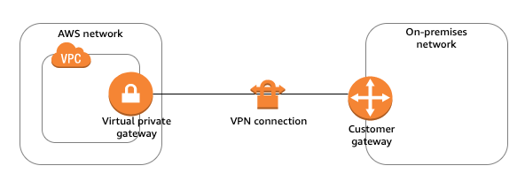

# AWS Practitional examtopics 문제 풀이

> AWS Practitional 자격증 취득을 위한 덤프 문제 풀이

## Question 01

A company is planning to run a global marketing application in the AWS Cloud. The application will feature videos that can be viewed by users. The company must ensure that all users can view these videos with low latency. Which AWS service should the company use to meet this requirement?

A. AWS Auto Scaling  
B. Amazon Kinesis Video Streams  
C. Elastic Load Balancing  
D. Amazon CloudFront

[번역] 회사에서 AWS 클라우드에서 글로벌 마케팅 애플리케이션을 실행할 계획입니다. 응용 프로그램은 사용자가 볼 수 있는 비디오를 제공합니다. 회사는 모든 사용자가 이러한 비디오를 짧은 대기 시간으로 볼 수 있도록 해야 합니다. 회사는 이 요구 사항을 충족하기 위해 어떤 AWS 서비스를 사용해야 합니까?

A. AWS Auto Scaling  
B. Amazon Kinesis 비디오 스트림  
C. 탄력적 로드 밸런싱  
D. Amazon CloudFront

> ✅

정답 보기

정답은: D

AWS CloudFront 기능은 AWS에서 제공하는 CDN 서버라고 봐도 된다.

## Question 02

Which pillar of the AWS Well-Architected Framework refers to the ability of a system to recover from infrastructure or service disruptions and dynamically acquire computing resources to meet demand?

A. Security  
B. Reliability  
C. Performance efficiency  
D. Cost optimization

[번역] AWS Well-Architected 프레임워크의 다음 중 인프라 또는 서비스 중단으로부터 복구하고 수요를 충족하기 위해 컴퓨팅 리소스를 동적으로 확보하는 시스템의 기능을 나타내는 요소는 무엇입니까?

A. 보안  
B. 신뢰성  
C. 성능 효율성  
D. 비용 최적화

> ✅

정답 보기

정답은: B

시스템의 신뢰성과 복구 능력에 초점을 맞춘 개념은 B. Reliability

## Question 03

Which of the following are benefits of migrating to the AWS Cloud? (Choose two.)

A. Operational resilience  
B. Discounts for products on Amazon.com  
C. Business agility  
D. Business excellence  
E. Increased staff retention

[번역] 다음 중 AWS 클라우드로 마이그레이션할 때의 이점은 무엇입니까? (2개를 선택하세요.)

A. 운영 탄력성  
B. Amazon.com의 제품 할인  
C. 비즈니스 민첩성  
D. 비즈니스 우수성  
E. 직원 유지 증가

> ✅

정답 보기

정답은: A, C

## Question 04

A company is planning to replace its physical on-premises compute servers with AWS serverless compute services. The company wants to be able to take advantage of advanced technologies quickly after the migration. Which pillar of the AWS Well-Architected Framework does this plan represent?

A. Security  
B. Performance efficiency  
C. Operational excellence  
D. Reliability

[번역] 회사는 물리적 온프레미스 컴퓨팅 서버를 AWS 서버리스 컴퓨팅 서비스로 교체할 계획입니다. 이 회사는 마이그레이션 후 고급 기술을 신속하게 활용할 수 있기를 원합니다. 이 계획이 나타내는 AWS Well-Architected 프레임워크의 기둥은 무엇입니까?

A. 보안  
B. 성능 효율성  
C. 운영 우수성  
D. 신뢰성

> ❌

정답 보기

정답은: B

## Question 05

A large company has multiple departments. Each department has its own AWS account. Each department has purchased Amazon EC2 Reserved Instances. Some departments do not use all the Reserved Instances that they purchased, and other departments need more Reserved Instances than they purchased. The company needs to manage the AWS accounts for all the departments so that the departments can share the Reserved Instances. Which AWS service or tool should the company use to meet these requirements?

A. AWS Systems Manager  
B. Cost Explorer  
C. AWS Trusted Advisor  
D. AWS Organizations

[번역] 대기업에는 여러 부서가 있습니다. 각 부서에는 자체 AWS 계정이 있습니다. 각 부서는 Amazon EC2 예약 인스턴스를 구매했습니다. 일부 부서에서는 구매한 모든 예약 인스턴스를 사용하지 않고 다른 부서에서는 구매한 것보다 더 많은 예약 인스턴스가 필요합니다. 부서가 예약 인스턴스를 공유할 수 있도록 회사는 모든 부서의 AWS 계정을 관리해야 합니다. 이러한 요구 사항을 충족하기 위해 회사는 어떤 AWS 서비스 또는 도구를 사용해야 합니까?

A. AWS 시스템 관리자  
B. 비용 탐색기  
C. AWS Trusted Advisor  
D. AWS 조직

> ✅

정답 보기

Most Voted: D, 정답은: B

## Question 06

Which component of the AWS global infrastructure is made up of one or more discrete data centers that have redundant  power, networking, and connectivity?

A. AWS Region  
B. Availability Zone  
C. Edge location  
D. AWS Outposts

[번역] AWS 글로벌 인프라의 어떤 구성 요소가 중복 전원, 네트워킹 및 연결이 있는 하나 이상의 개별 데이터 센터로 구성되어 있습니까?

A. AWS 리전  
B. 가용 영역  
C. 엣지 로케이션  
D. AWS 전초기지

> ✅

정답 보기

정답은: B

개별 데이터 센터라는 키워드를 통해 가용영역을 의미하는 것으로 판단.  
만약 리전이면 하나의 리전에 여러개의 데이터 센터가 존재할 수 있기 때문이다.

## Question 07

Which duties are the responsibility of a company that is using AWS Lambda? (Choose two.)

A. Security inside of code  
B. Selection of CPU resources  
C. Patching of operating system  
D. Writing and updating of code  
E. Security of underlying infrastructure

[번역] AWS Lambda를 사용하는 회사의 책임은 무엇입니까? (2개를 선택하세요.)

A. 코드 내부 보안  
B. CPU 자원의 선택  
C. 운영체제 패치  
D. 코드 작성 및 업데이트  
E. 기반 인프라의 보안

> ❌

정답 보기

정답은: A, D

이 질문에서는 Lambda를 사용하는 회사가 어떤 책임을 가져야 하는지를 묻는 질문이다.  
Lambda는 서버리스 컴퓨팅 서비스로, AWS가 많은 인프라 관리 작업을 처리해 주지만,  
Lmbda의 코드를 작성하고 수정하는 작업은 개발자에게 책임이 주어지며 보안도 개발자의 책임.  

## Question 08

Which AWS services or features provide disaster recovery solutions for Amazon EC2 instances? (Choose two.)

A. Reserved Instances  
B. EC2 Amazon Machine Images (AMIs)  
C. Amazon Elastic Block Store (Amazon EBS) snapshots  
D. AWS Shield  
E. Amazon GuardDuty

[번역] Amazon EC2 인스턴스에 재해 복구 솔루션을 제공하는 AWS 서비스 또는 기능은 무엇입니까? (2개를 선택하세요.)

A. 예약 인스턴스  
B. EC2 Amazon 머신 이미지(AMI)  
C. Amazon Elastic Block Store(Amazon EBS) 스냅샷  
D. AWS 쉴드  
E. Amazon GuardDuty

> ❌

정답 보기

정답은: B, C

AMI는 특정 시점의 EC2 인스턴스 상태를 캡처한 이미지. 해당 AMI 이미지를 통해 복구 가능.  
EBS 스냅샷 역시 특정 EBS 볼륨의 상태를 캡처하여 저장하는 기능, 손상된 데이터 복구 가능

## Question 09

A company is migrating to the AWS Cloud instead of running its infrastructure on premises. Which of the following are advantages of this migration? (Choose two.)

A. Elimination of the need to perform security auditing  
B. Increased global reach and agility  
C. Ability to deploy globally in minutes  
D. Elimination of the cost of IT staff members  
E. Redundancy by default for all compute services

[번역] 회사는 온프레미스에서 인프라를 실행하는 대신 AWS 클라우드로 마이그레이션하고 있습니다. 다음 중 이 마이그레이션의 장점은 무엇입니까? (2개를 선택하세요.)

A. 보안 감사 수행의 필요성 제거  
B. 글로벌 범위 및 민첩성 증가  
C. 몇 분 안에 전 세계적으로 배포할 수 있는 기능  
D. IT 직원 비용 제거  
E. 기본적으로 모든 컴퓨팅 서비스에 대한 중복성

> ✅

정답 보기

정답은: B, C

AWS 클라우드를 사용하여 인터넷을 통해 전 세계 어디든 빠르고 쉽게 배포가 가능하다.  
D를 정답이라고 하는 경우도 있는데, 직원이 줄어들수도 있지만 오히려 늘어나야할수도 있다.

## Question 10

A user is comparing purchase options for an application that runs on Amazon EC2 and Amazon RDS. The application cannot sustain any interruption. The application experiences a predictable amount of usage, including some seasonal spikes that last only a few weeks at a time. It is not possible to modify the application. Which purchase option meets these requirements MOST cost-effectively?

A. Review the AWS Marketplace and buy Partial Upfront Reserved Instances to cover the predicted and seasonal load.  
B. Buy Reserved Instances for the predicted amount of usage throughout the year. Allow any seasonal usage to run on Spot Instances.  
C. Buy Reserved Instances for the predicted amount of usage throughout the year. Allow any seasonal usage to run at an On-Demand rate.  
D. Buy Reserved Instances to cover all potential usage that results from the seasonal usage.

[번역] 사용자가 Amazon EC2와 Amazon RDS에서 실행되는 애플리케이션의 구매 옵션을 비교하고 있습니다. 응용 프로그램은 중단을 유지할 수 없습니다. 애플리케이션은 한 번에 몇 주만 지속되는 일부 계절 스파이크를 포함하여 예측 가능한 사용량을 경험합니다. 응용 프로그램을 수정할 수 없습니다. 어떤 구매 옵션이 이러한 요구 사항을 가장 비용 효율적으로 충족합니까?

A. AWS Marketplace를 검토하고 부분 선결제 예약 인스턴스를 구입하여 예측 및 계절적 로드를 처리합니다.  
B. 연중 예상 사용량에 대해 예약 인스턴스를 구매합니다. 모든 계절적 사용량이 스팟 인스턴스에서 실행되도록 허용합니다.  
C. 연중 예상 사용량에 대해 예약 인스턴스를 구매합니다. 계절별 사용량이 온디맨드 요금으로 실행되도록 허용합니다.  
D. 예약 인스턴스를 구매하여 계절적 사용량으로 인한 모든 잠재적 사용량을 처리합니다.

> ❌

정답 보기

정답은: C

중단 없이 비용 효율 + 예측 가능한 일년 내내 사용량에 대해 비용 효율 가능

A. AWS Marketplace 애플리케이션 S/W 구매에 관련된 서비스, 해당 시나리오와 맞지 않음  
B. 스팟 인스턴스는 저렴, 언제든 종료 가능 + 애플리케이션 중단 됨  
D. 모든 사용량을 예약 인스턴스 -> 불필요한 비용 발생

## Question 11

A company wants to review its monthly costs of using Amazon EC2 and Amazon RDS for the past year. Which AWS service or tool provides this information?

A. AWS Trusted Advisor  
B. Cost Explorer  
C. Amazon Forecast  
D. Amazon CloudWatch

[번역] 한 회사에서 지난 1년 동안 Amazon EC2 및 Amazon RDS를 사용한 월별 비용을 검토하려고 합니다. 이 정보를 제공하는 AWS 서비스 또는 도구는 무엇입니까?

A. AWS Trusted Advisor  
B. 비용 탐색기  
C. 아마존 예측  
D. 아마존 클라우드워치

> ✅

정답 보기

정답은: B

비용 관련은 Cost Explorer

AWS Trusted Advisor는 비용 최적화, 성능 개선, 보안 격차 해소 관련 서비스  
Amazon Forecase는 `기계학습 기반 수요 예측 서비스`  
AWS Cloudwatch는 메트릭 수집 및 로그 추적 및 대시보드 구성을 위한 서비스

## Question 12

A company wants to migrate a critical application to AWS. The application has a short runtime. The application is invoked by changes in data or by shifts in system state. The company needs a compute solution that maximizes operational efficiency and minimizes the cost of running the application. Which AWS solution should the company use to meet these requirements?

A. Amazon EC2 On-Demand Instances  
B. AWS Lambda  
C. Amazon EC2 Reserved Instances  
D. Amazon EC2 Spot Instances

[번역] 회사에서 중요한 애플리케이션을 AWS로 마이그레이션하려고 합니다. 애플리케이션의 런타임이 짧습니다. 응용 프로그램은 데이터 변경 또는 시스템 상태 변경에 의해 호출됩니다. 이 회사는 운영 효율성을 극대화하고 애플리케이션 실행 비용을 최소화하는 컴퓨팅 솔루션이 필요합니다. 이러한 요구 사항을 충족하기 위해 회사는 어떤 AWS 솔루션을 사용해야 합니까?

A. Amazon EC2 온디맨드 인스턴스  
B. AWS 람다  
C. Amazon EC2 예약 인스턴스  
D. Amazon EC2 스팟 인스턴스

> ✅

정답 보기

정답은: B

애플리케이션의 런타임이 짧다. 이 말인 즉슨 실행 되고 바로 종료가 된다는 말이다.  
서버리스 서비스인 람다가 제일 적합하며, 런타임 종료 시 비용 안나감.

## Question 13

Which AWS service or feature allows users to connect with and deploy AWS services programmatically?

A. AWS Management Console  
B. AWS Cloud9  
C. AWS CodePipeline  
D. AWS software development kits (SDKs)

[번역] 사용자가 프로그래밍 방식으로 AWS 서비스에 연결하고 배포할 수 있는 AWS 서비스 또는 기능은 무엇입니까?

A. AWS 관리 콘솔  
B. AWS 클라우드9  
C. AWS 코드 파이프라인  
D. AWS 소프트웨어 개발 키트(SDKs)

> ✅

정답 보기

정답은: D

SDK: AWS 서비스와 프로그래밍 방식으로 상호작용 할 수 있는 유일한 옵션

AWS Management Console: UI 기반 제어  
AWS Cloud9: 클라우드 기반 IDE 제공, AWS 서비스와 상호작용하는 코드 작성 가능하지만 여튼 아님  
AWS CodePipeline: CI/CD 파이프라인 자동화, 프로그래밍 방식은 아닌듯

## Question 14

A company plans to create a data lake that uses Amazon S3. Which factor will have the MOST effect on cost?

A. The selection of S3 storage tiers  
B. Charges to transfer existing data into Amazon S3  
C. The addition of S3 bucket policies  
D. S3 ingest fees for each request

[번역] 회사는 Amazon S3를 사용하는 데이터 레이크를 만들 계획입니다. 비용에 가장 큰 영향을 미치는 요소는 무엇입니까?

A. S3 스토리지 계층 선택  
B. 기존 데이터를 Amazon S3로 전송하기 위한 요금  
C. S3 버킷 정책 추가  
D. 각 요청에 대한 S3 수집 수수료

> ❌

정답 보기

정답은: A

S3는 스토리지 티어(S3 Standard, S3 Intelligence-tiering, S3 Glacier 등)에 따라 비용에 가장 큰 영향을 미침.

B. Charges to transfer existing data into Amazon S3  
기존 데이터를 Amazon S3로 전송하는 비용은 초기 데이터 전송시에만 발생하는 일회성 비용

C. The addition of S3 bucket policies  
버킷 정책 자체는 비용 없음, 비용에 미치는 직접적인 영향도 없음

D. S3 ingest fees for each request  
S3에 데이터를 업로드 하는 비용(ingest fee)은 Amazon S3에서 매우 미미하거나 없을 수 있음.  
S3는 데이터 업로드에 비용 부과 안함, 읽거나 전송하는 비용이 더 중요함

## Question 15

A company is launching an ecommerce application that must always be available. The application will run on Amazon EC2 instances continuously for the next 12 months. What is the MOST cost-effective instance purchasing option that meets these requirements?

A. Spot Instances  
B. Savings Plans  
C. Dedicated Hosts  
D. On-Demand Instances

[번역] 회사는 항상 사용할 수 있어야 하는 전자 상거래 응용 프로그램을 시작합니다. 애플리케이션은 향후 12개월 동안 계속해서 Amazon EC2 인스턴스에서 실행됩니다. 이러한 요구 사항을 충족하는 가장 비용 효율적인 인스턴스 구매 옵션은 무엇입니까?

> ❌

정답 보기

정답은: B

Saving Plans는 1년 or 3년 동안 일정한 사용량을 약정함으로써 장기적으로 EC2 비용 절감 가능.  
해당 옵션은 지속적으로 실행될 애플리케이션에 매우 적합, On-Demand Instance에 비해 72%까지  
비용 절감 가능.

기간이 정해져있고, 12개월동안 지속적으로 실행한다면 Saving Plan 이 적합함.

Spot Instance는 저렴하지만, 종료 가능성 있음

Dedicated Hosts는 AWS EC2 인스턴스를 물리적인 서버에서 독점으로 사용 가능.  
이는 다른 고객과 서버를 공유하지 않겠다는 의미. 비용 비쌈

On-Demand Instances는 유연성 있음, 장기 사용 비효율적 비용에 있어서

## Question 16

Which AWS service or feature can a company use to determine which business unit is using specific AWS resources?

A. Cost allocation tags  
B. Key pairs  
C. Amazon Inspector  
D. AWS Trusted Advisor

[번역] 회사가 특정 AWS 리소스를 사용하는 사업부를 결정하기 위해 어떤 AWS 서비스 또는 기능을 사용할 수 있습니까?

A. 비용 할당 태그  
B. 키 쌍  
C. 아마존 인스펙터  
D. AWS Trusted Advisor

> ✅

정답 보기

정답은: 1번

AWS 리소스에 태그를 할당하여 비용 추적 및 관리 가능.  
key-value 형태로 태그 달고, cost explorer를 통해 특정 사업부의 비용 확인 가능.

key pairs는 aws access_key, secret_key, ec2에 접근하기 위한 pem key를 의미

AWS Trusted Advisor는 비용 최적화, 보안 관련, 성능 최적화의 권장 사항을 제안해주는 서비스

Amazon Inspector는 `인프라 보안 취약점 평가 도구`

## Question 17

A company wants to migrate its workloads to AWS, but it lacks expertise in AWS Cloud computing.

Which AWS service or feature will help the company with its migration?

A. AWS Trusted Advisor  
B. AWS Consulting Partners  
C. AWS Artifacts  
D. AWS Managed Services

[번역] 회사에서 워크로드를 AWS로 마이그레이션하고 싶지만 AWS 클라우드 컴퓨팅에 대한 전문 지식이 부족합니다.  
회사의 마이그레이션에 도움이 되는 AWS 서비스 또는 기능은 무엇입니까?

A. AWS Trusted Advisor  
B. AWS 컨설팅 파트너  
C. AWS 아티팩트  
D. AWS 관리형 서비스

> 💡 애매함

정답 보기

정답은: D

정답이 D라고 나왔지만 AWS Managed Service를 사용한다고 AWS 지식이 해소되는건 아닌 것 같음.  
그것보다 AWS 협력사와 같이 일하면서 컨설팅 받는게 200배는 좋을 듯.

## Question 18

Which AWS service or tool should a company use to centrally request and track service limit increases?

A. AWS Config  
B. Service Quotas  
C. AWS Service Catalog  
D. AWS Budgets

[번역] 회사에서 서비스 한도 증가를 중앙에서 요청하고 추적하기 위해 어떤 AWS 서비스 또는 도구를 사용해야 합니까?

A. AWS 구성  
B. 서비스 할당량  
C. AWS 서비스 카탈로그  
D. AWS 예산

> ❌

정답 보기

정답은: B

`Service Quotas`는 AWS `서비스 한도`를 `중앙`에서 `관리`

`AWS Config`는 리소스 변경 모니터링 및 규정 준수 여부 확인하는 서비스

AWS Budgets는 예산 관련 경고를 날리거나 하는거지, 한도랑은 상관 없음

## Question 19

Which documentation does AWS Artifact provide?

A. Amazon EC2 terms and conditions  
B. AWS ISO certifications  
C. A history of a company's AWS spending  
D. A list of previous-generation Amazon EC2 instance types

[번역] AWS Artifact는 어떤 문서를 제공합니까?

A. Amazon EC2 이용약관  
B. AWS ISO 인증  
C. 회사의 AWS 지출 내역  
D. 이전 세대 Amazon EC2 인스턴스 유형 목록

> ❌

정답 보기

정답은: B

AWS Artifact는 AWS의 규정 준수 및 보안 관련 문서와 보고서를 제공하는 서비스.  
ISO 인증서와 같은 AWS의 규제 문서가 포함된다. 고객은 AWS Artifact를 통해 이러한 문서를  
다운로드하여 자신의 규정 준수 요구 사항을 충족 가능.

EC2 이용약관(terms and conditions)는 공식문서 참고

회사 AWS 이전 지출은 Cost에서 확인

이전 EC2 인스턴스 타입은 공식문서 참고

## Question 20

Which task requires using AWS account root user credentials?

A. Viewing billing information  
B. Changing the AWS Support plan  
C. Starting and stopping Amazon EC2 instances  
D. Opening an AWS Support case

[번역] AWS 계정 루트 사용자 자격 증명을 사용해야 하는 작업은 무엇입니까?

A. 결제 정보 보기  
B. AWS Support 플랜 변경  
C. Amazon EC2 인스턴스 시작 및 중지  
D. AWS Support 사례 열기

> ❌

정답 보기

정답은: B

`AWS Support Plan 변경은 모든 계정에 적용됨, root 사용자만 가능`

결제 정보 보기는 root 사용자가 IAM 유저 추가 가능

Amazon EC2 인스턴스 시작 및 중지는 IAM 유저도 가능

AWS Support 사례 열기 이것도 IAM 유저가 권한만 있으면 가능

## Question 21

A company needs to simultaneously process hundreds of requests from different users. Which combination of AWS services should the company use to build an operationally efficient solution?

A. Amazon Simple Queue Service (Amazon SQS) and AWS Lambda  
B. AWS Data Pipeline and Amazon EC2  
C. Amazon Kinesis and Amazon Athena  
D. AWS Amplify and AWS AppSync

[번역] 회사는 서로 다른 사용자의 수백 가지 요청을 동시에 처리해야 합니다. 기업이 운영상 효율적인 솔루션을 구축하기 위해 어떤 AWS 서비스 조합을 사용해야 합니까?

A. Amazon Simple Queue Service(Amazon SQS) 및 AWS Lambda  
B. AWS 데이터 파이프라인 및 Amazon EC2  
C. Amazon Kinesis 및 Amazon Athena  
D. AWS Amplify 및 AWS AppSync

> ✅

정답 보기

정답은: A

`AWS Data Pipeline`은 주로 `데이터` `이동`, `변환`, `백업` 작업에 사용한다.  
실시간 요청 처리보다는 배치 작업 or 정기적인 데이터 처리에 적합.

`Amazon Kinesis`, `Athena`는 `실시간 데이터 분석`에 중점을 둔 서비스.  
사용자 요청을 처리하는 작업과는 거리가 멀다.

`AWS Amplify`는 주로 빠른 풀스택 개발 + 서버리스 백엔드 등등 제공하는 서비스.

Amazon SQS(Simple Queue Service)는 완전 관리형 `메시지 대기열 서비스`이다.  
여러 시스템 간에 `비동기`적으로 `데이터 전달`이 가능하며, `메시지 기반 애플리케이션 통신`.

## Question 22

What is the scope of a VPC within the AWS network?

A. A VPC can span all Availability Zones globally.  
B. A VPC must span at least two subnets in each AWS Region.  
C. A VPC must span at least two edge locations in each AWS Region.  
D. A VPC can span all Availability Zones within an AWS Region.

[번역] AWS 네트워크 내 VPC의 범위는 무엇입니까?

A. VPC는 전 세계의 모든 가용 영역에 걸쳐 있을 수 있습니다.  
B. VPC는 각 AWS 리전에서 최소 2개의 서브넷에 걸쳐 있어야 합니다.  
C. VPC는 각 AWS 리전에서 2개 이상의 엣지 로케이션에 걸쳐 있어야 합니다.  
D. VPC는 AWS 리전 내의 모든 가용 영역에 걸쳐 있을 수 있습니다.

> ✅

정답 보기

정답은: D

`VPC`는 `AWS의 특정 리전 내에서만 동작`, 해당 리전의 모든 가용 영역에 걸쳐 사용 가능.  
VPC는 리전 내에 여러 가용 영역에 걸쳐 구성 가능하고, 리전 밖으로는 확장 불가.

VPC는 전 세계 가용 영역에 걸칠 수 없음, 각 리전의 가용 영역 내에만 가능.

VPC는 반드시 2개 이상의 서브넷을 포함해야 하는건 아님, 한개여도 상관 없음.

엣지 로케이션은 VPC와 상관 없음, CloudFront와 관련 있음.  
엣지 로케이션은 데이터 캐싱 및 지연 없는 컨텐츠 전송을 위해 사용.

## Question 23

Which of the following are components of an AWS Site-to-Site VPN connection? (Choose two.)

A. AWS Storage Gateway  
B. Virtual private gateway  
C. NAT gateway  
D. Customer gateway  
E. Internet gateway

[번역] 다음 중 AWS Site-to-Site VPN 연결의 구성 요소는 무엇입니까? (2개를 선택하세요.)

A. AWS 스토리지 게이트웨이  
B. 가상 사설 게이트웨이  
C. NAT 게이트웨이  
D. 고객 게이트웨이  
E. 인터넷 게이트웨이

> ✅

정답 보기

정답은: B, D

- [VPN 관련 참고 링크](https://btcd.tistory.com/46)

VPN의 구성 요소로는 AWS의 `Virtual Private Gateway`, `VPN Connection`, `Customer Gateway`가 존재.

A. AWS Storage Gateway

- 온프레미스와 AWS 클라우드 스토리지 간 통합 지원

B. Virtual private gateway

`Virtual private gateway`란 `AWS VPC`와 `온프레미스`를 `연결`하는 `VPN 게이트웨이`이다.  

- `VPN 터널`을 통해 `보안 트래픽`을 `전송`
- `Direct Connect` 지원
- `VPC로의 진입점`(게이트웨이)
- `하이브리드 클라우드 환경 구축`
- `VPC 대역에 바로 붙어 있는 것으로 보임`

C. NAT gateway
NAT gateway는 private subnet에 위치한 리소스가 routing table의 rule에 의해  
외부 통신이 가능하도록 설정하기 위해 사용하는 서비스. routing table에 내부 소스 IP를 입력 후  
해당 IP의 목적지는 NAT로 설정하면 private subnet에서 외부 통신이 가능해진다.

D. Customer gateway

Customer gateway은 온프레미스(고객)측 네트워크의 엔드포인트 의미.  
정리하면 VPN 터널을 통해 외부 네트워크와 안전하게 통신하기 위한 장치 및 소프트웨어.

E. Internet gateway
Internet gateway는 public subnet에 위치한 리소스가 AWS 외부 통신을 위해 사용하는 게이트웨이.

## Question 24

A company needs to establish a connection between two VPCs. The VPCs are located in two different AWS Regions. The company wants to use the existing infrastructure of the VPCs for this connection. Which AWS service or feature can be used to establish this connection?

A. AWS Client VPN  
B. VPC peering  
C. AWS Direct Connect  
D. VPC endpoints

[번역] 회사는 두 VPC 간에 연결을 설정해야 합니다. VPC는 두 개의 서로 다른 AWS 리전에 있습니다.  
회사는 이 연결을 위해 VPC의 기존 인프라를 사용하려고 합니다. 이 연결을 설정하는 데 사용할 수 있는 AWS 서비스 또는 기능은 무엇입니까?

A. AWS 클라이언트 VPN  
B. VPC 피어링  
C. AWS 다이렉트 커넥트  
D. VPC 엔드포인트

> ✅

정답 보기

정답은: B

A. AWS 클라이언트 VPN
VPN Client Gateway 역할을 하며, 온프레미스의 장비와 AWS VPC를 연동하기 위한 네트워크 엔드포인트.  

B. VPC 피어링
두 VPC간 프라이빗 네트워크를 연결하는 AWS 서비스.  
두 VPC가 동일 혹은 다른 계정에 있거나, 서로 다른 리전에 있어도 연결 가능.  

VPC 피어링은 1:1 VPC 연결, 복잡해질 수 있음.  
이를 보완하기 위해 Transit Gateway(중앙 허브)로 관리하는 서비스 존재.
VPC == VPC 통신 가능
VPC == 온프레미스 통신 가능

C. AWS 다이렉트 커넥트
VPN virtual private gateway와 customer gateway를 중간에서 연결하는 커넥트

D. VPC 엔드포인트
Private Subnet에서 AWS 네트워크를 사용하여 AWS 서비스에 접근하기 위한 서비스

## Question 25

Question #25
According to the AWS shared responsibility model, what responsibility does a customer have when using Amazon RDS to host a database?

A. Manage connections to the database  
B. Install Microsoft SQL Server  
C. Design encryption-at-rest strategies  
D. Apply minor database patches

[번역] AWS 공동 책임 모델에 따르면 Amazon RDS를 사용하여 데이터베이스를 호스팅할 때 고객은 어떤 책임을 지게 됩니까?

A. 데이터베이스 연결 관리  
B. Microsoft SQL Server 설치  
C. 미사용 데이터 암호화 전략 설계  
D. 마이너 데이터베이스 패치 적용

> ✅

정답 보기

정답은: A, C(정답이 될 수 있음)

A. 데이터베이스 연결 관리
AWS RDS가 연결 설정에 도움은 주지만, `연결을 어떻게 구성 + 사용` 하는지는 고객의 몫.

B. Microsoft SQL Server 설치
AWS가 설치 및 관리

C. 미사용 데이터 암호화 전략 설계
`AWS RDS`는 `암호화 기능을 제공`하지만, `데이터 암호화 방법` 및 `키 관리 전략 설계`는 고객의 몫.

D. 마이너 데이터베이스 패치 적용
AWS가 패치 및 업그레이드 자동 수행

## Question 26

What are some advantages of using Amazon EC2 instances to host applications in the AWS Cloud instead of on premises? (Choose two.)

A. EC2 includes operating system patch management.  
B. EC2 integrates with Amazon VPC, AWS CloudTrail, and AWS Identity and Access Management (IAM).  
C. EC2 has a 100% service level agreement (SLA).  
D. EC2 has a flexible, pay-as-you-go pricing model.  
E. EC2 has automatic storage cost optimization.

[번역] Amazon EC2 인스턴스를 사용하여 온프레미스가 아닌 AWS 클라우드에서 애플리케이션을 호스팅하면 어떤 이점이 있습니까? (2개를 선택하세요.)

A. EC2에는 운영 체제 패치 관리가 포함됩니다.  
B. EC2는 Amazon VPC, AWS CloudTrail 및 AWS Identity and Access Management(IAM)와 통합됩니다.  
C. EC2에는 100% 서비스 수준 계약(SLA)이 있습니다.  
D. EC2에는 유연한 종량제 가격 모델이 있습니다.  
E. EC2에는 자동 저장 비용 최적화 기능이 있습니다.

> ✅

정답 보기

정답은: B, D

A. EC2에는 운영 체제 패치 관리가 포함됩니다.
운영 체제 패치 및 관리는 고객 몫

B. EC2는 Amazon VPC, AWS CloudTrail 및 AWS Identity and Access Management(IAM)와 통합됩니다.
EC2사용하면 VPC 등등 다양한 서비스와 통합 가능

C. EC2에는 100% 서비스 수준 계약(SLA)이 있습니다.
EC2의 SLA는 99% 가용성 보장, 100%는 아님

D. EC2에는 유연한 종량제 가격 모델이 있습니다.
EC2는 사용한 만큼만 가격을 지불

E. EC2에는 자동 저장 비용 최적화 기능이 있습니다.
EC2에 자동 자장 비용 최적화 기능은 없음, S3 or EBS 사용 필요

## Question 27

A user needs to determine whether an Amazon EC2 instance's security groups were modified in the last month.  
How can the user see if a change was made?

A. Use Amazon EC2 to see if the security group was changed.  
B. Use AWS Identity and Access Management (IAM) to see which user or role changed the security group.  
C. Use AWS CloudTrail to see if the security group was changed.  
D. Use Amazon CloudWatch to see if the security group was changed.

[번역] 사용자는 Amazon EC2 인스턴스의 보안 그룹이 지난 달에 수정되었는지 확인해야 합니다.  
사용자가 변경 사항이 있는지 어떻게 알 수 있습니까?

A. Amazon EC2를 사용하여 보안 그룹이 변경되었는지 확인하십시오.  
B. AWS Identity and Access Management(IAM)를 사용하여 보안 그룹을 변경한 사용자 또는 역할을 확인합니다.  
C. AWS CloudTrail을 사용하여 보안 그룹이 변경되었는지 확인합니다.  
D. Amazon CloudWatch를 사용하여 보안 그룹이 변경되었는지 확인합니다.

> ✅

정답 보기

정답은: C

A. Amazon EC2를 사용하여 보안 그룹이 변경되었는지 확인하십시오.
지난달 수정된지 이력 못봄

B. AWS Identity and Access Management(IAM)를 사용하여 보안 그룹을 변경한 사용자 또는 역할을 확인합니다.
IAM에는 보안그룹 수정 이력 안나옴

C. AWS CloudTrail을 사용하여 보안 그룹이 변경되었는지 확인합니다.
AWS 계정에서 발생하는 모든 API 호출 확인 및 감사 가능.  
보안 그룹과 같은 리소스 변경 사항 추적 가능.

D. Amazon CloudWatch를 사용하여 보안 그룹이 변경되었는지 확인합니다.
Cloudwatch에도 안나옴

## Question 28

Which AWS service will help protect applications running on AWS from DDoS attacks?

A. Amazon GuardDuty  
B. AWS WAF  
C. AWS Shield  
D. Amazon Inspector

[번역] DDoS 공격으로부터 AWS에서 실행되는 애플리케이션을 보호하는 데 도움이 되는 AWS 서비스는 무엇입니까?

A. Amazon GuardDuty  
B. AWS WAF  
C. AWS Shield  
D. Amazon Inspector

> ✅

정답 보기

정답은: C

A. Amazon GuardDuty
AWS GuardDuty는 `악의적인 활동`이나 `비정상적인 동작` `감지`를 위한 `탐지 서비스`.  
DDos랑은 연관 없음.

B. AWS WAF  
AWS `WAF`는 `Web Application 방화벽`으로, `SQL Injection` + `XSS`(`크로스 사이트 스크립팅`) 등의 `공격 보호`.  
DDos 방어에 도움이 되지만 특화된 건 아님.

C. AWS Shield  
DDos 공격으로부터 AWS 서비스를 보호하는 서비스, 2가지로 구분.  
AWS Shield Standard: 추가 비용 x + 대부분 DDos 공격 방지
AWS Shield Advanced: 추가 비용 o + 복잡한 DDos 공격 방지

D. Amazon Inspector
AWS 애플리케이션의 보안 취약성 평가하는 서비스

## Question 29

Which AWS service or feature acts as a firewall for Amazon EC2 instances?

A. Network ACL  
B. Elastic network interface  
C. Amazon VPC  
D. Security group

[번역] Amazon EC2 인스턴스의 방화벽 역할을 하는 AWS 서비스 또는 기능은 무엇입니까?

A. Network ACL  
B. 탄력적 네트워크 인터페이스  
C. Amazon VPC  
D. 보안 그룹

> ✅

정답 보기

정답은: D

A. Network ACL  
`NACL`은 `VPC`의 `Subnet 수준`에서 `트래픽을 제어`하는 `방화벽`.  
EC2에 직접 적용 아님, `서브넷 전체에 적용`.

B. 탄력적 네트워크 인터페이스  
ENI(Elastic Network Interface)로 랜카드(LAN CARD)를 의미, 네트워크 통신을 위해 사용이된다.

C. Amazon VPC  
Virtual Private Cloud의 약자로 가상 네트워크를 의미.  
VPC는 네트워크 격리를 수행하지만, 방화벽은 NACL이나 SG에서 담당

D. 보안 그룹
보안 그룹은 인바운드, 아웃바운드 IP/PORT 기반으로 트래픽을 제어하는 방화벽.

## Question 30

How does the AWS Cloud pricing model differ from the traditional on-premises storage pricing model?

A. AWS resources do not incur costs  
B. There are no infrastructure operating costs  
C. There are no upfront cost commitments  
D. There are no software licensing costs

[번역] AWS 클라우드 요금 모델은 기존 온프레미스 스토리지 요금 모델과 어떻게 다릅니까?

A. AWS 리소스에는 비용이 발생하지 않습니다.  
B. 인프라 운영 비용이 없습니다.  
C. 선불 비용 약정이 없습니다.  
D. 소프트웨어 라이선스 비용이 없습니다.

> 💡

정답 보기

정답은: C

A. AWS 리소스에는 비용이 발생하지 않습니다.  
AWS 리소스 사용하면 비용 당연히 발생.

B. 인프라 운영 비용이 없습니다.  
인프라 운영 비용도 당연히 발생.

C. 선불 비용 약정이 없습니다.  
선불 안해도 됨, 사용한 만큼만 가격 지불.

D. 소프트웨어 라이선스 비용이 없습니다.
AWS 서비스 중 일부는 라이선스 비용 포함, Microsoft Widows Server, SQL Server

## Question 31

A company has a single Amazon EC2 instance. The company wants to adopt a highly available architecture.  
What can the company do to meet this requirement?

A. Scale vertically to a larger EC2 instance size.  
B. Scale horizontally across multiple Availability Zones.  
C. Purchase an EC2 Dedicated Instance.  
D. Change the EC2 instance family to a compute optimized instance.

[번역] 회사에 단일 Amazon EC2 인스턴스가 있습니다. 이 회사는 고가용성 아키텍처를 채택하기를 원합니다.  
이 요구 사항을 충족하기 위해 회사는 무엇을 할 수 있습니까?

A. 더 큰 EC2 인스턴스 크기로 수직으로 확장합니다.  
B. 여러 가용 영역에 걸쳐 수평으로 확장합니다.  
C. EC2 전용 인스턴스를 구매합니다.  
D. EC2 인스턴스 패밀리를 컴퓨팅 최적화 인스턴스로 변경합니다.

> ✅

정답 보기

정답은: B

A. 더 큰 EC2 인스턴스 크기로 수직으로 확장합니다.  
더 큰 EC2 1대가 떨어지면, 고가용성 유지 불가

B. 여러 가용 영역에 걸쳐 수평으로 확장합니다.  
HA(고가용성) 환경 구성

C. EC2 전용 인스턴스를 구매합니다.  
이것도 의미 없음

D. EC2 인스턴스 패밀리를 컴퓨팅 최적화 인스턴스로 변경합니다.
EC2 인스턴스 패밀리를 바꾼다고 고가용성 유지 안됨, 1대 떨어지면 끝

## Question 32

A company's on-premises application deployment cycle was 3-4 weeks.  
After migrating to the AWS Cloud, the company can deploy the application in 2-3 days.  
Which benefit has this company experienced by moving to the AWS Cloud?

A. Elasticity  
B. Flexibility  
C. Agility  
D. Resilience

[번역] 회사의 온프레미스 애플리케이션 배포 주기는 3-4주였습니다.  
AWS 클라우드로 마이그레이션한 후 회사는 2~3일 안에 애플리케이션을 배포할 수 있습니다.  
이 회사는 AWS 클라우드로 전환하여 어떤 이점을 얻었습니까?

A. 탄력성  
B. 유연성  
C. 민첩성  
D. 회복력

> ✅

정답 보기

정답은: C

A. Elasticity(탄력성)
`탄력성`은 `리소스`를 `자동`으로 `확장`하거나 `축소` 할 수 있는 능력에 가까움.

B. Flexibility(유연성)
`유연성`은 `다양한 애플리케이션 아키텍처`와 `기술`을 `지원`하는 `능력` 의미

C. Agility(민첩성)
클라우드 환경에서 Agility(민첩성)을 통해 빠르게 배포 및 확장 가능

D. Resilience(회복력)
`시스템 장애` 시 정상 작동 가능한 능력

## Question 33

Which of the following are included in AWS Enterprise Support? (Choose two.)

A. AWS technical account manager (TAM)  
B. AWS partner-led support  
C. AWS Professional Services  
D. Support of third-party software integration to AWS  
E. 5-minute response time for critical issues

[번역] 다음 중 AWS Enterprise Support에 포함된 것은 무엇입니까? (2개를 선택하세요.)

A. AWS 기술 계정 관리자(TAM)  
B. AWS 파트너 주도 지원  
C. AWS 전문 서비스  
D. AWS에 대한 타사 소프트웨어 통합 지원  
E. 중요한 문제에 대한 5분 응답 시간

> ❌

정답 보기

정답은: A, D (E: 이것도 가능)

A. AWS 기술 계정 관리자(TAM)  
TAM 포함, 컨설팅 해줌

B. AWS 파트너 주도 지원  
AWS 파트너 주도 지원 포함 안됨, AWS 파트너와 협력하여 별도 지원

C. AWS 전문 서비스  
별도의 유료 서비스, AWS 클라우드 전문가가 고객의 클라우드 여정을 도와주는 컨설팅 서비스

D. AWS에 대한 타사 소프트웨어 통합 지원  
AWS 리소스와 통합된 타사 S/W 지원 제공

E. 중요한 문제에 대한 5분 응답 시간
AWS Enterprise에는 심각한 문제 발생 시 5분 내 응답 지원 서비스 제공

## Question 34

A global media company uses AWS Organizations to manage multiple AWS accounts.  
Which AWS service or feature can the company use to limit the access to AWS services for member accounts?

A. AWS Identity and Access Management (IAM)  
B. Service control policies (SCPs)  
C. Organizational units (OUs)  
D. Access control lists (ACLs)

[번역] 글로벌 미디어 회사는 AWS Organizations를 사용하여 여러 AWS 계정을 관리합니다.  
회사에서 멤버 계정의 AWS 서비스에 대한 액세스를 제한하는 데 사용할 수 있는 AWS 서비스 또는 기능은 무엇입니까?

A. AWS Identity and Access Management(IAM)  
B. 서비스 통제 정책(SCP)  
C. 조직 단위(OU)  
D. 액세스 제어 목록(ACL)

> ❌

정답 보기

정답은: B, (C: 이건 정답으로 나오긴 함)

## Question 35

A company wants to limit its employees' AWS access to a portfolio of predefined AWS resources.  
Which AWS solution should the company use to meet this requirement?

A. AWS Config  
B. AWS software development kits (SDKs)  
C. AWS Service Catalog  
D. AWS AppSync

[번역] 회사에서 사전 정의된 AWS 리소스 포트폴리오에 대한 직원의 AWS 액세스를 제한하려고 합니다.  
회사는 이 요구 사항을 충족하기 위해 어떤 AWS 솔루션을 사용해야 합니까?

A. AWS 구성  
B. AWS 소프트웨어 개발 키트(SDK)  
C. AWS 서비스 카탈로그  
D. AWS 앱싱크

> ❌

정답 보기

정답은: C

## Question 36

An online company was running a workload on premises and was struggling to launch new products and features.  
After migrating the workload to AWS, the company can quickly launch products and features and can scale its infrastructure as required.  
Which AWS Cloud value proposition does this scenario describe?

A. Business agility  
B. High availability  
C. Security  
D. Centralized auditing

[번역] 온라인 회사는 온프레미스에서 워크로드를 실행하고 있었고 새로운 제품과 기능을 출시하는 데 어려움을 겪고 있었습니다.  
워크로드를 AWS로 마이그레이션한 후 회사는 제품과 기능을 신속하게 출시하고 필요에 따라 인프라를 확장할 수 있습니다.  
이 시나리오에서 설명하는 AWS 클라우드 가치 제안은 무엇입니까?

A. 비즈니스 민첩성  
B. 고가용성  
C. 보안  
D. 중앙 집중식 감사

> ✅

정답 보기

정답은: A

## Question 37

Which of the following are advantages of the AWS Cloud? (Choose two.)

A. AWS management of user-owned infrastructure  
B. Ability to quickly change required capacity  
C. High economies of scale  
D. Increased deployment time to market  
E. Increased fixed expenses

[번역] 다음 중 AWS 클라우드의 장점은 무엇입니까? (2개를 선택하세요.)

A. 사용자 소유 인프라의 AWS 관리  
B. 필요한 용량을 빠르게 변경할 수 있는 능력  
C. 높은 규모의 경제  
D. 시장 출시 시간 증가  
E. 고정비 증가

> ❌

정답 보기

정답은: B, C

A. AWS management of user-owned infrastructure  
AWS가 사용자가 소유한 물리적 인프라를 관리하지는 않음.  
AWS는 자체 클라우드를 관리, 사용자가 대여.

B. Ability to quickly change required capacity  
빠르게 리소스 추가 삭제 가능

C. High economies of scale  
높은 규모의 경제, 비용 절감 효과

D. Increased deployment time to market  
배포 시간을 줄어듬

E. Increased fixed expenses
고정비 증가 안함, 가변 비용 증가

## Question 38

AWS has the ability to achieve lower pay-as-you-go pricing by aggregating usage across hundreds of thousands of users.  
This describes which advantage of the AWS Cloud?

A. Launch globally in minutes  
B. Increase speed and agility  
C. High economies of scale  
D. No guessing about compute capacity

[번역] AWS는 수십만 사용자의 사용량을 집계하여 더 낮은 종량제 요금을 달성할 수 있습니다.  
이것은 AWS 클라우드의 어떤 이점을 설명합니까?

A. 몇 분 만에 전 세계적으로 출시  
B. 속도와 민첩성 증가  
C. 높은 규모의 경제  
D. 컴퓨팅 용량에 대한 추측 없음

> ✅

정답 보기

정답은: C

## Question 39

A company has a database server that is always running. The company hosts the server on Amazon EC2 instances.  
The instance sizes are suitable for the workload. The workload will run for 1 year.  
Which EC2 instance purchasing option will meet these requirements MOST cost-effectively?

A. Standard Reserved Instances  
B. On-Demand Instances  
C. Spot Instances  
D. Convertible Reserved Instances

[번역] 회사에는 항상 실행되는 데이터베이스 서버가 있습니다. 회사는 Amazon EC2 인스턴스에서 서버를 호스팅합니다.  
인스턴스 크기는 워크로드에 적합합니다. 워크로드는 1년 동안 실행됩니다.  
이러한 요구 사항을 가장 비용 효율적으로 충족하는 EC2 인스턴스 구매 옵션은 무엇입니까?

A. 표준 예약 인스턴스  
B. 온디맨드 인스턴스  
C. 스팟 인스턴스  
D. 전환형 예약 인스턴스

> ✅

정답 보기

정답은: A

A. Standard Reserved Instances  
이게 가장 적합함

B. On-Demand Instances  
EC2 온디멘드 사용은 현재 문제랑 연관성 적음

C. Spot Instances  
Spot은 떨어질 수 있음, 지속적인 실행에는 안 맞음

D. Convertible Reserved Instances
전환형 예약 인스턴스는 추후 사용하다가 전환한다는건데 1년 동안 실행이기에 비용 절감 기본 예약형 인스턴스에 비해 절감 안됨

## Question 40

A company is developing a mobile app that needs a high-performance NoSQL database.  
Which AWS services could the company use for this database? (Choose two.)

A. Amazon Aurora  
B. Amazon RDS  
C. Amazon Redshift  
D. Amazon DocumentDB (with MongoDB compatibility)  
E. Amazon DynamoDB

[번역] 회사에서 고성능 NoSQL 데이터베이스가 필요한 모바일 앱을 개발 중입니다.  
회사는 이 데이터베이스에 어떤 AWS 서비스를 사용할 수 있습니까? (2개를 선택하세요.)

A. Amazon Aurora  
B. Amazon RDS  
C. Amazon Redshift  
D. Amazon DocumentDB (with MongoDB compatibility)  
E. Amazon DynamoDB

> ✅

정답 보기

정답은: D, E

## Question #41

Which tasks are the responsibility of AWS, according to the AWS shared responsibility model?  
(Choose two.)  

A. Patch the Amazon EC2 guest operating system.  
B. Upgrade the firmware of the network infrastructure.  
C. Apply password rotation for IAM users.  
D. Maintain the physical security of edge locations.  
E. Maintain least privilege access to the root user account.  

[번역]  
AWS 공동 책임 모델에 따라 AWS의 책임은 무엇입니까? (2개를 선택하세요.)  

A. Amazon EC2 게스트 운영 체제를 패치합니다.  
B. 네트워크 인프라의 펌웨어를 업그레이드합니다.  
C. IAM 사용자에 대한 암호 교체를 적용합니다.  
D. 엣지 로케이션의 물리적 보안을 유지합니다.  
E. 루트 사용자 계정에 대한 최소 권한 액세스를 유지합니다.  

> ✅

정답 보기

정답은: B, D

## Question #42

Which of the following are features of network ACLs as they are used in the AWS Cloud?  
(Choose two.)  

A. They are stateless.  
B. They are stateful.  
C. They evaluate all rules before allowing traffic.  
D. They process rules in order, starting with the lowest numbered rule, when deciding whether to allow traffic.  
E. They operate at the instance level.  

[번역]  
다음 중 AWS 클라우드에서 사용되는 네트워크 ACL의 기능은 무엇입니까? (2개를 선택하세요.)  

A. stateless 방식을 사용합니다.  
B. stateful 방식을 사용합니다.  
C. 트래픽을 허용하기 전에 모든 규칙을 평가합니다.  
D. 트래픽 허용 여부를 결정할 때 가장 낮은 번호의 규칙부터 순서대로 처리합니다.  
E. 인스턴스 수준에서 작동합니다.  

> ❌

정답 보기

정답은: A, D

A. stateless 방식을 사용합니다.
NACL(Network access control list)는 stateless(무상태)이다.  
이것은 들어오고 나가는 트래픽을 각각 독립적으로 평가하며, 트래픽의 응답을 자동으로 허용하지 않는다.  
따라서 수동으로 들어오고 나가는 트래픽에 대해 각각의 규칙을 정해야 한다.

B. stateful 방식을 사용합니다.  
NACL(Network access control list)는 Stateful(상태 기억)이 아니다.  
보안그룹이 Staetful 방식이며, 보안그룹의 경우 들어오는 트래픽(인바운드)에 대해서  
허용이 되면, 그에 대한 응답 트래픽이 자동으로 허용 된다.

즉, 보안그룹은 들어온 트래픽과 나가는 트래픽을 각각 따로 정의할 필요없이  
일치하는 세션에 대한 응답은 자동으로 허용. (인바운드 허용 시 아웃바운드 자동 허용)

C. 트래픽을 허용하기 전에 모든 규칙을 평가합니다.  
NACL은 모든 트래픽을 허용하기 전에 평가하는 것이 아니라, 낲은 번호 순서부터 평가하여  
첫 번째 일치하는 규칙만 처리하고 평가한다.

D. 트래픽 허용 여부를 결정할 때 가장 낮은 번호의 규칙부터 순서대로 처리합니다.  
NACL에 설정된 규칙 번호 가장 낮은 순서부터, 규칙 평가.  
한 개씩 평가하는데 없으면 Deny 시킨다.

E. 인스턴스 수준에서 작동합니다.  
인스턴스 수준에서 작동하는건 보안그룹

## Question #43

A company has designed its AWS Cloud infrastructure to run its workloads effectively.  
The company also has protocols in place to continuously improve supporting processes.  
Which pillar of the AWS Well-Architected Framework does this scenario represent?  

A. Security  
B. Performance efficiency  
C. Cost optimization  
D. Operational excellence  

[번역]  
회사는 워크로드를 효과적으로 실행하기 위해 AWS 클라우드 인프라를 설계했습니다.  
회사는 또한 지원 프로세스를 지속적으로 개선하기 위한 프로토콜을 보유하고 있습니다.  
이 시나리오가 나타내는 AWS Well-Architected 프레임워크의 기둥은 무엇입니까?  

A. 보안  
B. 성능 효율성  
C. 비용 최적화  
D. 운영 우수성  

> ❌

정답 보기

정답은: D

A. 보안  
`보안`은 `시스템 보호`, `데이터 암호화`, `접근 제어` 등에 중점을 둔다.  
시나리오에서 보안 관련 얘기가 나오지 않았음.

B. 성능 효율성  
`성능 효율성`은 `워크로드` `성능 최적화와` `리소스 활용`에 중점을 둔다.  
시나리오에서 성능 최적화에 대한 내용이 없기에 적절하지 않음.

C. 비용 최적화  
비용 최적화는 `리소스를 효율적으로 사용하여 비용을 줄이는데 중점을 둔다`.  
시나리오에서는 비용 관리보다 프로세스 개선에 관한 내용이 존재.

D. 운영 우수성
프로세스를 지속적으로 개선하기 위한 프로토콜을 보유하고 있으므로,  
이는 운영 우수성에 해당한다

## Question #44

Which AWS service or feature can be used to create a private connection between an on-premises workload and an AWS Cloud workload?  

A. Amazon Route 53  
B. Amazon Macie  
C. AWS Direct Connect  
D. AWS PrivateLink  

[번역]  
온프레미스 워크로드와 AWS 클라우드 워크로드 간에 프라이빗 연결을 생성하는 데 사용할 수 있는 AWS 서비스 또는 기능은 무엇입니까?  

A. Amazon Route 53  
B. Amazon Macie  
C. AWS Direct Connect  
D. AWS PrivateLink  

> ✅

정답 보기

정답은: C (선택은 D로 나옴)

A. Amazon Route 53  

- DNS 관리 서비스
- 네트워크와 상관 없음

B. Amazon Macie  

- 데이터 보안 및 개인정보 보호를 위해 사용
- S3 버킷의 민감 데이터 및 보안 위험 모니터링
- 네트워크와 무관

C. AWS Direct Connect  

> 온프레미스 <---> AWS 간의 private connect 사용

**AWS Direct Connect**는 `AWS`와 `온프레미스` 간에 `전용 물리적 네트워크 회선`을 통해 `연결`을 제공하는 서비스.  
이 서비스는 `인터넷`을 `우회`하여 `AWS`와의 `안정` + `고속`의 `Private 연결`을 `지원`해준다.  

D. AWS PrivateLink  

`AWS PrivateLink`는 `AWS 서비스` or `VPC 간`의 `Private 연결을 제공`한다.  
AWS 서비스 `내부적`으로 안전하게 연결할 수 있도록 해주지만, `온프레미스와 AWS 간의 연결은 제공안함`.  
이는 `주로 VPC 간 연결에 주로 사용`

## Question #45

A company needs to graphically visualize AWS billing and usage over time. The company also needs information about its AWS monthly costs.  
Which AWS Billing and Cost Management tool provides this data in a graphical format?  

A. AWS Bills  
B. Cost Explorer  
C. AWS Cost and Usage Report  
D. AWS Budgets  

[번역]  
회사는 시간 경과에 따른 AWS 청구 및 사용량을 그래픽으로 시각화해야 합니다. 회사는 AWS 월별 비용에 대한 정보도 필요합니다. 이 데이터를 그래픽 형식으로 제공하는 AWS Billing and Cost Management 도구는 무엇입니까?  

A. AWS 청구서  
B. 비용 탐색기  
C. AWS 비용 및 사용 보고서  
D. AWS 예산  

> ❌

정답 보기

정답은: B

A. AWS 청구서(AWS Bills)  

- 월별 청구서 보여주지만 그래픽 시각화 기능 제공 안함
- 청구 세부 사항을 텍스트 형식으로 확인 가능

B. 비용 탐색기(Cost Explorer)  

AWS 비용 탐색기(Cost Explorere)는 시간 변화에 따른 AWS 비용과 사용량을 그패프로 시각화 할 수 있음.  
월별을 포함한 다양한 기간 동안의 사용량과 비용을 시각적으로 분석 가능하며, 필터링 기능 제공하여  
어떤 부분에서 가격이 많이 나가는지 확인 가능.

C. AWS 비용 및 사용 보고서(AWS Cost and Usage Report)

CSV 형식으로 데이터를 내보내는 기능은 있으나 그래프랑은 안 맞음

D. AWS 예산(AWS Budgets)  

`AWS Budgets`은 설정한 예산과 비교하여 비용을 모니터링하는 도구로,  
`비용 추적 알림 설정`이 가능한 서비스이다. 그래프랑은 안 맞음

## Question #46

A company wants to run production workloads on AWS. The company needs concierge service, a designated AWS technical account manager (TAM), and technical support that is available 24 hours a day, 7 days a week.  
Which AWS Support plan will meet these requirements?  

A. AWS Basic Support  
B. AWS Enterprise Support  
C. AWS Business Support  
D. AWS Developer Support  

[번역]  
회사는 AWS에서 프로덕션 워크로드를 실행하려고 합니다. 이 회사는 컨시어지 서비스, 지정된 AWS 기술 계정 관리자(TAM) 및 연중무휴 24시간 제공되는 기술 지원이 필요합니다. 이러한 요구 사항을 충족하는 AWS Support 플랜은 무엇입니까?  

A. AWS 기본 지원  
B. AWS 엔터프라이즈 지원  
C. AWS 비즈니스 지원  
D. AWS 개발자 지원  

> ✅

정답 보기

정답은: B

## Question #47

Which architecture design principle describes the need to isolate failures between dependent components in the AWS Cloud?  

A. Use a monolithic design.  
B. Design for automation.  
C. Design for single points of failure.  
D. Loosely couple components.  

[번역]  
AWS 클라우드에서 종속 구성 요소 간의 장애를 격리해야 하는 필요성을 설명하는 아키텍처 설계 원칙은 무엇입니까?  

A. 모놀리식 디자인을 사용합니다.  
B. 자동화를 위한 설계.  
C. 단일 실패 지점을 위한 설계.  
D. 느슨하게 결합된 구성 요소.  

> ❌

정답 보기

정답은: D

A. 모놀리식 디자인을 사용합니다.  

`모놀리식 디자인`은 모든 구성 요소가 `하나로 결합된 설계`를 의미한다.  
장애가 발생할 경우 전체 시스템에 영향을 끼치며, 장애 격리 불가능.

B. 자동화를 위한 설계.  
자동화는 반복 작업의 효율이지, 장애 격리와 상관 없음.

C. 단일 실패 지점을 위한 설계.

단일 실패 지점을 위한 설계는 시스템 한 지점에서 실패하는 겨우 전체가 중단되는 상황을 초래할 수 있기에, 장애를 격리하려는 목적과는 반대이다.

D. 느슨하게 결합된 구성 요소.  

`느슨하게 결합된 구성 요소`는 하나의 구성 요소에서 발생하는 장애가 다른 구성요소로 전파되지 않도록,  
함으로 시스템 복원력 + 안정성 높히는 설계 원칙이다.

## Question #48

Which AWS services are managed database services?  
(Choose two.)  

A. Amazon Elastic Block Store (Amazon EBS)  
B. Amazon S3  
C. Amazon RDS  
D. Amazon Elastic File System (Amazon EFS)  
E. Amazon DynamoDB  

[번역]  
관리형 데이터베이스 서비스는 어떤 AWS 서비스입니까? (2개를 선택하세요.)  

A. Amazon Elastic Block Store (Amazon EBS)  
B. Amazon S3  
C. Amazon RDS  
D. Amazon Elastic File System (Amazon EFS)  
E. Amazon DynamoDB  

> ✅

정답 보기

정답은: C, E

## Question #49

A company is using the AWS Free Tier for several AWS services for an application. What will happen if the Free Tier usage period expires or if the application use exceeds the Free Tier usage limits?  

A. The company will be charged the standard pay-as-you-go service rates for the usage that exceeds the Free Tier usage.  
B. AWS Support will contact the company to set up standard service charges.  
C. The company will be charged for the services it consumed during the Free Tier period, plus additional charges for service consumption after the Free Tier period.  
D. The company's AWS account will be frozen and can be restarted after a payment plan is established.  

[번역]  
한 회사에서 애플리케이션의 여러 AWS 서비스에 대해 AWS 프리 티어를 사용하고 있습니다. 프리 티어 사용 기간이 만료되거나 애플리케이션 사용이 프리 티어 사용 한도를 초과하면 어떻게 됩니까?  

A. 회사는 프리 티어 사용량을 초과하는 사용량에 대해 표준 종량제 서비스 요금을 청구합니다.  
B. AWS Support에서 표준 서비스 요금을 설정하기 위해 회사에 연락합니다.  
C. 회사는 프리 티어 기간 동안 사용한 서비스에 대해 요금을 부과하고 프리 티어 기간 이후 서비스 이용에 대해서는 추가 요금을 부과합니다.  
D. 회사의 AWS 계정은 동결되며 결제 계획이 수립된 후 다시 시작할 수 있습니다.  

> ✅

정답 보기

정답은: A

## Question #50

A company recently deployed an Amazon RDS instance in its VPC.  
The company needs to implement a stateful firewall to limit traffic to the private corporate network.  
Which AWS service or feature should the company use to limit network traffic directly to its RDS instance?  

A. Network ACLs  
B. Security groups  
C. AWS WAF  
D. Amazon GuardDuty  

[번역]  
회사는 최근 VPC에 Amazon RDS 인스턴스를 배포했습니다.  
회사는 개인 회사 네트워크에 대한 트래픽을 제한하기 위해 상태 저장 방화벽을 구현해야 합니다.  
회사에서 네트워크 트래픽을 RDS 인스턴스로 직접 제한하려면 어떤 AWS 서비스 또는 기능을 사용해야 합니까?  

A. Network ACLs  
B. 보안 그룹  
C. AWS WAF  
D. Amazon GuardDuty  

> ✅

정답 보기

정답은: B

A. Network ACLs  

- stateless로 인바운드, 아웃바운드 각가 제어
- 서브넷 레벨에서의 보안 제어

B. 보안 그룹  

- stateful로 인바운드 허용 시 아웃바운드도 허용
- 인스턴스 레벨에서의 보안 제어

C. AWS WAF  

- SQL Injection, XSS등의 보안 제어
- 방화벽

D. Amazon GuardDuty

- 보안 이상 탐지

## 99. 참고 자료

- [[AWS] Cloud Practitioner 덤프 문제 풀이 - 4/59](https://hagsig.tistory.com/125)
- [[AWS] examtopics](https://www.examtopics.com/exams/amazon/aws-certified-cloud-practitioner/view/2/)
