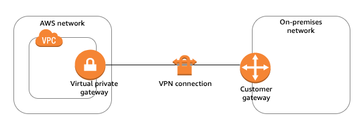

# AWS Practitional examtopics 문제 풀이

> AWS Practitional 자격증 취득을 위한 덤프 문제 풀이

## Question #51

Which AWS service uses machine learning to help discover, monitor, and protect sensitive data that is stored in Amazon S3 buckets?  

A. AWS Shield  
B. Amazon Macie  
C. AWS Network Firewall  
D. Amazon Cognito  

[번역]  
기계 학습을 사용하여 Amazon S3 버킷에 저장된 민감한 데이터를 검색, 모니터링 및 보호하는 AWS 서비스는 무엇입니까?  

A. AWS Shield  
B. Amazon Macie  
C. AWS Network Firewall  
D. Amazon Cognito  

> ✅

정답 보기

정답은: B

A. AWS Shield  
  
- 방화벽(Firewall)
- DDos 공격 방지
  - standard: 기본 DDos 설정 가능
  - advanced 옵션: 디테일 설정 가능

B. Amazon Macie  

- 기계 학습(Machine Learning)을 사용하여 Amazon S3 버킷에 저장된 민감 데이터를 `검색`, `모니터링`, `보호` 하는 서비스
- 개인정보 식별와 같은 민감 데이터 감지, 이를 보호하기 위한 통찰 제공
  - AWS access_key, secret_key
  - 개인정보 등등

C. AWS Network Firewall  

- `VPC`에서 `네트워크 트래픽을 모니터링`하고 `네트워크 보안 정책`을 적용하는 서비스

D. Amazon Cognito

- `사용자 인증` 및 `엑세스 제어`를 위한 서비스
  - 인증/인가 관리 서비스?

## Question #52

A company wants to improve the overall availability and performance of its applications that are hosted on AWS.  
Which AWS service should the company use?  

A. Amazon Connect  
B. Amazon Lightsail  
C. AWS Global Accelerator  
D. AWS Storage Gateway  

[번역]  
회사는 AWS에서 호스팅되는 애플리케이션의 전반적인 가용성과 성능을 개선하려고 합니다.  
회사는 어떤 AWS 서비스를 사용해야 합니까?  

A. Amazon Connect  
B. Amazon Lightsail  
C. AWS Global Accelerator  
D. AWS Storage Gateway  

> ✅

정답 보기

정답은: C

A. Amazon Connect  

- 클라우드 기반 콜센터

B. Amazon Lightsail  

- `소규모 애플리케이션`을 쉽게 배포할 수 있는 `저비용 가상 서버`

C. AWS Global Accelerator  

- `AWS 글로벌 네트워크`를 통해 애플리케이션의 `가용성`과 `성능` 개선하는 서비스
- `사용자 위치`에 따라 `가장 가까운 엣지 로케이션`을 통해 `트래픽 라우팅`
- `정적 IP 주소` 사용하여 AWS 리전으로 트래픽 분산, 장애 발생 시 다른 리전으로 리다이렉션 가능

D. AWS Storage Gateway

- `온프라미스 스토리지`를 `AWS 클라우드에 통합`하는 `하이브리드 스토리지 서비스`

## Question #53

Which AWS service or feature identifies whether an Amazon S3 bucket or an IAM role has been shared with an external entity?  

A. AWS Service Catalog  
B. AWS Systems Manager  
C. AWS IAM Access Analyzer  
D. AWS Organizations  

[번역]  
Amazon S3 버킷 또는 IAM 역할이 외부 엔터티와 공유되었는지 식별하는 AWS 서비스 또는 기능은 무엇입니까?  

A. AWS Service Catalog  
B. AWS Systems Manager  
C. AWS IAM Access Analyzer  
D. AWS Organizations  

> ❌

정답 보기

정답은: C

A. AWS Service Catalog  

- `IT 서비스 카탈로그 관리`를 위한 서비스

B. AWS Systems Manager  

- `AWS 리소스` + `애플리케이션` `중앙 관리 서비스
- 시스템 운영과 관련됨

C. AWS IAM Access Analyzer  

`IAM Access Analyzer`는 AWS `S3 버킷`, `IAM 역할`, `KMS 키`, `Lambda 함수`, `SQS 큐` 등이 `외부 엔티티와 공유`되었는지 `식별`할 수 있는 서비스.  
Access Analyzer는 리소스 정책을 분석하여 `외부로의 공유 여부를 감지`, 이를 통해 `보안 상태 평가`에 도움을 준다.

D. AWS Organizations  

- `AWS 계정`을 `중앙`에서 `관리`하는 `서비스`
- `계정 관리` 및 `관련 정책 설정`하는데 사용

## Question #54

A company does not want to rely on elaborate forecasting to determine its usage of compute resources.  
Instead, the company wants to pay only for the resources that it uses.  
The company also needs the ability to increase or decrease its resource usage to meet business requirements.  
Which pillar of the AWS Well-Architected Framework aligns with these requirements?  

A. Operational excellence  
B. Security  
C. Reliability  
D. Cost optimization  

[번역]  
회사는 컴퓨팅 리소스 사용량을 결정하기 위해 정교한 예측에 의존하기를 원하지 않습니다.  
대신 회사는 사용하는 리소스에 대해서만 비용을 지불하기를 원합니다.  
회사는 또한 비즈니스 요구 사항을 충족하기 위해 리소스 사용량을 늘리거나 줄일 수 있는 능력이 필요합니다.  
AWS Well-Architected 프레임워크의 어떤 요소가 이러한 요구 사항에 부합합니까?  

A. 운영 우수성  
B. 보안  
C. 신뢰성  
D. 비용 최적화  

> ✅

정답 보기

정답은: D

## Question #55

A company wants to launch its workload on AWS and requires the system to automatically recover from failure.  
Which pillar of the AWS Well-Architected Framework includes this requirement?  

A. Cost optimization  
B. Operational excellence  
C. Performance efficiency  
D. Reliability  

[번역]  
회사는 AWS에서 워크로드를 시작하고 시스템이 장애로부터 자동으로 복구되도록 요구합니다.  
AWS Well-Architected 프레임워크의 어떤 요소에 이 요구 사항이 포함되어 있습니까?  

A. 비용 최적화  
B. 운영 우수성  
C. 성능 효율성  
D. 신뢰성  

>

정답 보기

정답은: D

## Question #56

A large enterprise with multiple VPCs in several AWS Regions around the world needs to connect and centrally manage network connectivity between its VPCs.  
Which AWS service or feature meets these requirements?  

A. AWS Direct Connect  
B. AWS Transit Gateway  
C. AWS Site-to-Site VPN  
D. VPC endpoints  

[번역]  
전 세계 여러 AWS 리전에 여러 VPC가 있는 대기업은 VPC 간의 네트워크 연결을 연결하고 중앙에서 관리해야 합니다.  
이러한 요구 사항을 충족하는 AWS 서비스 또는 기능은 무엇입니까?  

A. AWS Direct Connect  
B. AWS Transit Gateway  
C. AWS Site-to-Site VPN  
D. VPC endpoints  

> ✅

정답 보기

정답은: B

A. AWS Direct Connect  

`AWS Direct Connect`은 온프레미스와 AWS간의 전용 물리적 네트워크 연결을 제공하는 서비스  

B. AWS Transit Gateway  

`AWS Transit Gateway`는 `VPC`와 `온프레미스` `네트워크 간의 연결`을 `중앙`에서 `관리`할 수 있는 서비스.  
Transit Gateway를 사용하면 `여러 리전`, `여러 VPC`를 `하나의 중앙 허브`로 연결하여  
네트워크 트래픽을 효율적으로 관리 할 수 있다.

C. AWS Site-to-Site VPN  

`Site-to-Site VPN`은 `온프레미스`와 `AWS` 간의 `암호화된 연결을 설정`하는 서비스

D. VPC endpoints  

`VPC endpoints`는 VPC private subnet 대역에서 AWS 제공하는 네트워크 통신을 통해 AWS 서비스에 접근하기 위한 엔드포인트.

## Question #57

Which AWS service supports the creation of visual reports from AWS Cost and Usage Report data?  

A. Amazon Athena  
B. Amazon QuickSight  
C. Amazon CloudWatch  
D. AWS Organizations  

[번역]  
AWS 비용 및 사용 보고서 데이터에서 시각적 보고서 생성을 지원하는 AWS 서비스는 무엇입니까?  

A. Amazon Athena  
B. Amazon QuickSight  
C. Amazon CloudWatch  
D. AWS Organizations  

> ✅

정답 보기

정답은: B

A. Amazon Athena  

- S3에 저장된 데이터를 쿼리하기 위한 서비스
- 비용 및 사용 데이터 분석 가능하지만 시각적 보고서 생성 기능은 없음

B. Amazon QuickSight  

- AWS 비용 및 사용 보고서 데이터를 사용하여 시각적 보고서 및 대시보드 생성 가능

C. Amazon CloudWatch  

- AWS 리소스 모니터링 및 로깅 서비스

D. AWS Organizations  

- 여러 계정을 중앙에서 관리하는 서비스

## Question #58

Which AWS service should be used to monitor Amazon EC2 instances for CPU and network utilization?  

A. Amazon Inspector  
B. AWS CloudTrail  
C. Amazon CloudWatch  
D. AWS Config  

[번역]  
CPU 및 네트워크 사용률에 대해 Amazon EC2 인스턴스를 모니터링하려면 어떤 AWS 서비스를 사용해야 합니까?  

A. Amazon Inspector  
B. AWS CloudTrail  
C. Amazon CloudWatch  
D. AWS Config  

> ✅

정답 보기

정답은: C

A. Amazon Inspector  

- EC2 인스턴스 보안 취약성을 분석하는 서비스

B. AWS CloudTrail  

> 직원이 나한테 한 말을 기억해보자, 선임님 CloudTrail 사용해서 API 호출 가능할까요?

- AWS API 호출을 로깅하여, 누가 어떤 작업을 했는지 추적하는 서비스

C. Amazon CloudWatch  

- 리소스 모니터링

D. AWS Config

- 리소스 구성 상태 추적 및 변경 상태 모니터링

## Question #59

A company is preparing to launch a new web store that is expected to receive high traffic for an upcoming event. The web store runs only on AWS, and the company has an AWS Enterprise Support plan.  
Which AWS resource will provide guidance about how the company should scale its architecture and operational support during the event?  

A. AWS Abuse team  
B. The designated AWS technical account manager (TAM)  
C. AWS infrastructure event management  
D. AWS Professional Services  

[번역]  
한 회사가 다가오는 이벤트를 위해 많은 트래픽을 받을 것으로 예상되는 새로운 웹 스토어를 시작하려고 준비하고 있습니다. 웹 스토어는 AWS에서만 실행되며 회사에는 AWS Enterprise Support 계획이 있습니다. 이벤트 기간 동안 회사가 아키텍처 및 운영 지원을 확장하는 방법에 대한 지침을 제공하는 AWS 리소스는 무엇입니까?  

A. AWS Abuse team  
B. The designated AWS technical account manager(TAM)  
C. AWS infrastructure event management  
D. AWS Professional Services  

> ❌

정답 보기

정답은: C(B도 정답에 가까움)

A. AWS Abuse team  

`AWS Abuse team`은 `악의적인 활동`이나 `보안 문제`에 관련된 사항을 처리하는 팀  
아키텍처 확장과는 연관이 없는 팀임

B. The designated AWS technical account manager(TAM)  

`TAM`도 일상적인 기술적 조언을 제공하지만, 특정 이벤트에 대한 아키텍처 확장에 대한 구체적인 지원은  
AWS Infrastructure Event Management가 더 적당하다

C. AWS infrastructure event management  

`AWS infrastructure event management`은 대규모 이벤트동안 AWS 리소스를 확장하고 관리하는데 컨설팅 제공해주는 서비스.  
특히 고 트래픽이 예상되는 경우 AWS 리소스 최적화를 안정적으로 운영할 수 있게 도와줌.

D. AWS Professional Services  

`AWS Professional Services`는 장기적인 아키텍처 설계 및 마이그레이션을 위한 컨설팅 서비스로,  
이벤트에 대한 즉각적인 지원보다는 장기 적인 지원이 맞음  

## Question #60

A user wants to deploy a service to the AWS Cloud by using infrastructure-as-code (IaC) principles.  
Which AWS service can be used to meet this requirement?  

A. AWS Systems Manager  
B. AWS CloudFormation  
C. AWS CodeCommit  
D. AWS Config  

[번역]  
사용자는 코드형 인프라(IaC) 원칙을 사용하여 AWS 클라우드에 서비스를 배포하려고 합니다.  
이 요구 사항을 충족하는 데 사용할 수 있는 AWS 서비스는 무엇입니까?  

A. AWS Systems Manager  
B. AWS CloudFormation  
C. AWS CodeCommit  
D. AWS Config  

> ✅

<detail>

정답 보기

정답은: B

</detail>

## Question #61

A company that has multiple business units wants to centrally manage and govern its AWS Cloud environments.  
The company wants to automate the creation of AWS accounts, apply service control policies (SCPs), and simplify billing processes.  
Which AWS service or tool should the company use to meet these requirements?  

A. AWS Organizations  
B. Cost Explorer  
C. AWS Budgets  
D. AWS Trusted Advisor  

[번역]  
여러 사업부가 있는 회사는 AWS 클라우드 환경을 중앙에서 관리하고 통제하기를 원합니다.  
이 회사는 AWS 계정 생성을 자동화하고 서비스 제어 정책(SCP)을 적용하고 청구 프로세스를 간소화하기를 원합니다.  
회사에서 이러한 요구 사항을 충족하려면 어떤 AWS 서비스 또는 도구를 사용해야 합니까?  

A. AWS 조직  
B. 비용 탐색기  
C. AWS 예산  
D. AWS 신뢰할 수 있는 조언자  

> ✅

정답 보기

정답은: A

## Question #62

Which IT controls do AWS and the customer share, according to the AWS shared responsibility model?  
(Choose two.)  

A. Physical and environmental controls  
B. Patch management  
C. Cloud awareness and training  
D. Zone security  
E. Application data encryption  

[번역]  
AWS 공유 책임 모델에 따라 AWS와 고객이 공유하는 IT 제어는 무엇입니까? (두 가지를 선택하세요.)  

A. 물리적 및 환경적 통제  
B. 패치 관리  
C. 클라우드 인식 및 교육  
D. 영역 보안  
E. 애플리케이션 데이터 암호화  

> ✅

정답 보기

정답은: B, C

A. 물리적 및 환경적 통제  
물리적  및 환경적 통제는 AWS의 단독 책임이다.  
AWS는 자사 데이터 센터의 물리적 보안 및 온도, 습도, 전력 같은 환경 제어를 수행한다.

B. 패치 관리  
패치 관리는 공유 책임이다. AWS는 H/W와 관리형 서비스 같은 인프라를 패치하고 유지하는 책임을 지지만,  
고객은 자신의 EC2 인스턴스에 배포한 운영체제나 애플리케이션을 패치하는 역할을 진다.

C. 클라우드 인식 및 교육  
클라우드 인식은 고객의 몫이고, 교육은 AWS의 몫 아닌가? 이건 좀 애매함

D. 영역 보안
AWS는 가용 영역에 보안을 책임 지지만, 고객은 그 영역 내에서 애플리케이션과 데이터를 보호할 책임이 있음.  
하지만 "영역 보안" 이라는 용어는 AWS의 인프라 보안과 관련이 있음

E. 애플리케이션 데이터 암호화  
AWS가 KMS와 같은 도구를 제공하여 데이터 암호화를 지원하지만, 고객도 애플리케이션 데이터 암호화 해야함

## Question #63

A company is launching an application in the AWS Cloud. The application will use Amazon S3 storage.  
A large team of researchers will have shared access to the data.  
The company must be able to recover data that is accidentally overwritten or deleted.  
Which S3 feature should the company turn on to meet this requirement?  

A. Server access logging  
B. S3 Versioning  
C. S3 Lifecycle rules  
D. Encryption in transit and at rest  

[번역]  
회사가 AWS 클라우드에서 애플리케이션을 시작하고 있습니다. 애플리케이션은 Amazon S3 스토리지를 사용합니다.  
대규모 연구원 팀이 데이터에 대한 공유 액세스 권한을 갖게 됩니다.  
회사는 실수로 덮어쓰거나 삭제한 데이터를 복구할 수 있어야 합니다.  
이 요구 사항을 충족하려면 회사에서 어떤 S3 기능을 켜야 합니까?  

A. 서버 접속 로깅  
B. S3 버전 관리  
C. S3 수명 주기 규칙  
D. 전송 및 미사용 암호화  

> ✅

정답 보기

정답은: B

## Question #64

A manufacturing company has a critical application that runs at a remote site that has a slow internet connection.  
The company wants to migrate the workload to AWS. The application is sensitive to latency and interruptions in connectivity.  
The company wants a solution that can host this application with minimum latency.  
Which AWS service or feature should the company use to meet these requirements?  

A. Availability Zones  
B. AWS Local Zones  
C. AWS Wavelength  
D. AWS Outposts  

[번역]  
제조 회사에는 인터넷 연결 속도가 느린 원격 사이트에서 실행되는 중요한 응용 프로그램이 있습니다.  
회사는 워크로드를 AWS로 마이그레이션하려고 합니다. 애플리케이션은 대기 시간과 연결 중단에 민감합니다.  
회사는 대기 시간을 최소화하면서 이 애플리케이션을 호스팅할 수 있는 솔루션을 원합니다.  
이러한 요구 사항을 충족하기 위해 회사에서 사용해야 하는 AWS 서비스 또는 기능은 무엇입니까?  

A. 가용 영역  
B. AWS 로컬 영역  
C. AWS 파장  
D. AWS 전초기지  

> ❌

정답 보기

정답은: B(D가 41%)

A. 가용 영역  

가용 영역(Availibility zone)은 HA(가용성) 유지를 위한 서비스이지, 대기 시간 최소화를 위한 개념은 아니다.  
또한 가용 영역은 물리적으로 떨어져있는 데이터센터의 위치를 의미하는 것으로, 원격 사이트에서 애플리케이션을 실행하려면  
인터넷을 통해 연결해야 하기에 대기 시간 문제를 해소할 수 없다.

B. AWS 로컬 영역  

`AWS Local Zones`는 `AWS 리전`에서 `떨어진` `도시 근처에 배치된 인프라`로,  
`특정 도시`에서 `낮은 대기 시간`의 `컴퓨팅 리소스를 제공`하기 위한 솔루션이다.  
또한 OutPosts는 고객 사이트(`IDC`)에 직접 설치되는 반면, Local Zones는 특정 도시(`region 안의 특정 도시`)에 위치하는 차이가 존재.

C. AWS 파장  

- `AWS Wavelength`는 `5G 네트워크`에서 `매우 낮은 대기 시간`으로 APP 실행 가능한 서비스
- `5G 네트워크에 의존`하며, `느린 인터넷 연결에는 적합하지 않음`

D. AWS 전초기지

- `AWS Outposts`는 AWS 인프라 자원을 고객의 IDC 센터내의 물리 장비에 설치하는 것
- 인터넷 연결 속도에 의존하지 않고, AWS 서비스 사용을 위한 인터넷 연결도 따로 필요없음

## Question #65

A company wants to migrate its applications from its on-premises data center to a VPC in the AWS Cloud.  
These applications will need to access on-premises resources.  
Which actions will meet these requirements?  
(Choose two.)  

A. Use AWS Service Catalog to identify a list of on-premises resources that can be migrated.  
B. Create a VPN connection between an on-premises device and a virtual private gateway in the VPC.  
C. Use an Amazon CloudFront distribution and configure it to accelerate content delivery close to the on-premises resources.  
D. Set up an AWS Direct Connect connection between the on-premises data center and AWS.  
E. Use Amazon CloudFront to restrict access to static web content provided through the on-premises web servers.  

[번역]  
회사는 온프레미스 데이터 센터에서 AWS 클라우드의 VPC로 애플리케이션을 마이그레이션하려고 합니다.  
이러한 애플리케이션은 온프레미스 리소스에 액세스해야 합니다.  
이러한 요구 사항을 충족하는 조치는 무엇입니까?  
(두 가지를 선택하세요.)  

A. AWS Service Catalog를 사용하여 마이그레이션할 수 있는 온프레미스 리소스 목록을 식별합니다.  
B. 온프레미스 장치와 VPC의 가상 프라이빗 게이트웨이 간에 VPN 연결을 생성합니다.  
C. Amazon CloudFront 배포를 사용하고 온프레미스 리소스에 가까운 콘텐츠 전송을 가속화하도록 구성합니다.  
D. 온프레미스 데이터 센터와 AWS 간에 AWS Direct Connect 연결을 설정합니다.  
E. Amazon CloudFront를 사용하여 온프레미스 웹 서버를 통해 제공되는 정적 웹 콘텐츠에 대한 액세스를 제한합니다.  

> ✅

정답 보기

정답은: B, D

A. AWS Service Catalog를 사용하여 마이그레이션할 수 있는 온프레미스 리소스 목록을 식별합니다.  

- AWS Service Catalog는 위 내용과 상관이 없음
- AWS에서 `제품`을 `배포` 및 `관리`하는 `도구`

B. 온프레미스 장치와 VPC의 가상 프라이빗 게이트웨이 간에 VPN 연결을 생성합니다.  

> Site to Site VPN

- `온프레미스`와 `AWS 네트워크`를 `연결`하기 위한 서비스
- Virtual private gateway <--> VPN connection <--> Customer gateway
- `AWS Site-to-Site VPN`은 네트워크와 VPC 또는 Transit Gateway 사이에 `암호화`된 `2개의 터널`을 `생성`
- `암호화`된 `터널`을 생성하여 `트래픽`이 `인터넷`을 통해 `전송`됨
- Virtual private gateway 대신 Transit Gateway 사용 가능

C. Amazon CloudFront 배포를 사용하고 온프레미스 리소스에 가까운 콘텐츠 전송을 가속화하도록 구성합니다.  

- CloudFront는 CDN로 마이그레이션이랑은 상관이 없음

D. 온프레미스 데이터 센터와 AWS 간에 AWS Direct Connect 연결을 설정합니다.

- `온프레미스`와 `AWS 네트워크`를 `연결`하기 위한 서비스
- `온프레미스`와 `AWS`간의 `물리적인 전용 네트워크 연결`을 설정하는 서비스
- Site-to-Site VPN 비교?
  - 안정적이고 지연 시간 적음
  - 데이터 전송 속도 더 빠름
  - 구성 복잡함
  - 비용도 더 비쌈

E. Amazon CloudFront를 사용하여 온프레미스 웹 서버를 통해 제공되는 정적 웹 콘텐츠에 대한 액세스를 제한합니다.  

- CloudFront는 CDN로 마이그레이션이랑은 상관이 없음

## Question #66

A company wants to use the AWS Cloud to provide secure access to desktop applications that are running in a fully managed environment.  
Which AWS service should the company use to meet this requirement?  

A. Amazon S3  
B. Amazon AppStream 2.0  
C. AWS AppSync  
D. AWS Outposts  

[번역]  
회사는 AWS 클라우드를 사용하여 완전히 관리되는 환경에서 실행되는 데스크톱 애플리케이션에 대한 보안 액세스를 제공하려고 합니다.  
회사에서 이 요구 사항을 충족하려면 어떤 AWS 서비스를 사용해야 합니까?  

A. Amazon S3  
B. Amazon AppStream 2.0  
C. AWS AppSync  
D. AWS Outposts  

> ❌

정답 보기

정답은: B(A가 정답으로 선택되어 있기는함?)

A. Amazon S3

- AWS S3는 데이터 저장 스토리지 서비스
- 데스크톱 애플리케이션을 실행하거나 관리하는 데 필요한 기능 제공 안함

B. Amazon AppStream 2.0  

- `완전 관리형 애플리케이션 스트리밍 서비스`
- 사용자는 클라우드에서 애플리케이션을 실행하고, 스트리밍을 통해 데스크톱 애플리케이션에 안전하게 엑세스 가능
- 사용자는 어디서나 브라우저를 통해 데스크톱 어플리케이션에 접근 가능, 데이터는 클라우드에 안전하게 유지됨

C. AWS AppSync  

- `GraphQL API`를 `사용`하여 애플리케이션 `데이터`를 `동기화` 및 `실시간 업데이트` 하는 서비스

D. AWS Outposts  

- `AWS 인프라`를 `온프레미스 환경에 설치`하여 `로컬`에서 `클라우드 서비스를 사용`하는 서비스

## Question #67

A company wants to implement threat detection on its AWS infrastructure. However, the company does not want to deploy additional software.  
Which AWS service should the company use to meet these requirements?  

A. Amazon VPC  
B. Amazon EC2  
C. Amazon GuardDuty  
D. AWS Direct Connect  

[번역]  
회사는 AWS 인프라에서 위협 탐지를 구현하려고 합니다. 그러나 회사는 추가 소프트웨어 배포를 원하지 않습니다.  
회사에서 이러한 요구 사항을 충족하려면 어떤 AWS 서비스를 사용해야 합니까?  

A. Amazon VPC  
B. Amazon EC2  
C. Amazon GuardDuty  
D. AWS Direct Connect  

> ✅

정답 보기

정답은: C

## Question #68

Which AWS service uses edge locations?  

A. Amazon Aurora  
B. AWS Global Accelerator  
C. Amazon Connect  
D. AWS Outposts  

[번역]  
엣지 로케이션을 사용하는 AWS 서비스는 무엇입니까?  

A. Amazon Aurora  
B. AWS Global Accelerator  
C. Amazon Connect  
D. AWS Outposts  

> ✅

정답 보기

정답은: B

A. Amazon Aurora  

- 데이터베이스 서비스(DB)
- 엣지 로케이션이랑 상관 없음

B. AWS Global Accelerator  

- `AWS Global Accelerator`는 `엣지 로케이션`(edge location)을 통해 `사용자에게 가장 가까운 네트워크 경로`를 통해 `트래픽 라우팅`
- `글로벌 사용자`에 대해서 `애플리케이션` `성능` 밎 `가용성` 개선 가능
- `엣지 로케이션` 통해 `지연 시간 줄이고` `네트워크 속도 최적화`

C. Amazon Connect  

- `AWS 클라우드 기반 콜센터 서비스`
- 음성 통화 서비스에 특화되어 있음

D. AWS Outposts  

- AWS 리소스를 온프레미스에 설치하여 인터넷 연결없이 AWS 리소스를 사용하는 서비스
- 엣지 로케이션이랑 상관 없음

## Question #69

A company needs to install an application in a Docker container.  
Which AWS service eliminates the need to provision and manage the container hosts?  

A. AWS Fargate  
B. Amazon FSx for Windows File Server  
C. Amazon Elastic Container Service (Amazon ECS)  
D. Amazon EC2  

[번역]  
회사는 Docker 컨테이너에 애플리케이션을 설치해야 합니다.  
컨테이너 호스트를 프로비저닝하고 관리할 필요가 없는 AWS 서비스는 무엇입니까?  

A. AWS Fargate  
B. Amazon FSx for Windows File Server  
C. Amazon Elastic Container Service (Amazon ECS)  
D. Amazon EC2  

> ✅

정답 보기

정답은: A

AWS Fargate는 완전 관리형 컨테이너 오케스트레이션 서비스로,  
인스턴스를 프로비저닝 하는 과정없이 컨테이너르 운영이 가능함.

## Question #70

Which AWS service or feature checks access policies and offers actionable recommendations to help users set secure and functional policies?  

A. AWS Systems Manager  
B. AWS IAM Access Analyzer  
C. AWS Trusted Advisor  
D. Amazon GuardDuty  

[번역]  
액세스 정책을 확인하고 사용자가 안전하고 기능적인 정책을 설정하는 데 도움이 되는 실행 가능한 권장 사항을 제공하는 AWS 서비스 또는 기능은 무엇입니까?  

A. AWS Systems Manager  
B. AWS IAM Access Analyzer  
C. AWS Trusted Advisor  
D. Amazon GuardDuty  

> ❌

정답 보기

정답은: B

A. AWS Systems Manager  

- `AWS System Manager`는 `인프라 관리를 위한 통합관리 도구`
- EC2 인스턴스, 애플리케이션 관리 및 자동화에 중점

B. AWS IAM Access Analyzer  

- `엑세스 정책 분석`
- 리소스가 외부 엔터티와 공유 될 수 있는지 여부 확인

C. AWS Trusted Advisor  

- AWS 계정에서 `비용 절감`, `성능 최적화`, `보안 문제` 등을 검사 및 권장 사항 제공
- IAM 정책 분석에는 맞지 않음

D. Amazon GuardDuty  

- 위협 탐지 서비스
- 악의적인 활동 감지

## Question #71

A company has a fleet of cargo ships. The cargo ships have sensors that collect data at sea, where there is intermittent or no internet connectivity.  
The company needs to collect, format, and process the data at sea and move the data to AWS later.  
Which AWS service should the company use to meet these requirements?  

A. AWS IoT Core  
B. Amazon Lightsail  
C. AWS Storage Gateway  
D. AWS Snowball Edge  

[번역]  
한 회사에 화물선 함대가 있습니다. 화물선에는 인터넷 연결이 간헐적이거나 없는 바다에서 데이터를 수집하는 센서가 있습니다.  
회사는 바다에서 데이터를 수집, 형식 지정 및 처리하고 나중에 데이터를 AWS로 이동해야 합니다.  
회사에서 이러한 요구 사항을 충족하려면 어떤 AWS 서비스를 사용해야 합니까?  

A. AWS IoT Core  
B. Amazon Lightsail  
C. AWS Storage Gateway  
D. AWS Snowball Edge  

> ❌

정답 보기

정답은: D

A. AWS IoT Core

- `IOT 장치 데이터`를 `실시간`으로 `처리`하는데 적합
- `인터넷 없는 환경` -> 사용 못함

B. Amazon Lightsail

- `가상 서버`, 스토리지, 네트워크 등 웹 애플리케이션 구축을 위한 서비스
- 데이터 전송과는 무관

C. AWS Storage Gateway
  
- `온프레미스`와 `AWS 클라우드 간` `데이터 전송`을 위한 스토리지 서비스
- 로컬에서 데이터 처리 하는 기능은 제공 안함
- `하이브리드 클라우드 환경`
  - 클라우드 완전 이관 없이, 일부 데이터 온프라미스에 유지 + 필요 데이터 AWS 전송 가능
- `데이터 전송 최적화`
  - 데이터 압축 + 효율적으로 전송하여 비용을 줄이고 전송 시간 최소화

D. AWS Snowball Edge  

- `인터넷 연결이 없거나` `제한된 환경`에서 `데이터`를 `수집`, `처리` 및 `저장` 하도록 설계된 `물리적 장치`
- `On-premise`에서 `AWS`로 `대규모 데이터를 이관`할 때 사용되는 `Snowball`
- `대규모 데이터`를 `전용선`이나, `VPN`로 옮길 경우 -> `비용`과 `시간`이 어마 무시하게 발생한다

## Question #72

A retail company needs to build a highly available architecture for a new ecommerce platform.  
The company is using only AWS services that replicate data across multiple Availability Zones.  
Which AWS services should the company use to meet this requirement?  
(Choose two.)  

A. Amazon EC2  
B. Amazon Elastic Block Store (Amazon EBS)  
C. Amazon Aurora  
D. Amazon DynamoDB  
E. Amazon Redshift  

[번역]  
소매 회사는 새로운 전자 상거래 플랫폼을 위한 고가용성 아키텍처를 구축해야 합니다.  
이 회사는 여러 가용 영역에서 데이터를 복제하는 AWS 서비스만 사용하고 있습니다.  
회사는 이 요구 사항을 충족하기 위해 어떤 AWS 서비스를 사용해야 합니까? (두 가지를 선택하세요.)  

A. Amazon EC2  
B. Amazon Elastic Block Store (Amazon EBS)  
C. Amazon Aurora  
D. Amazon DynamoDB  
E. Amazon Redshift  

> ❌

정답 보기

정답은: C, D

A. Amazon EC2  

- `EC2` 자체는 `고가용성`을 `제공하지 않음`
- EC2를 여러 가용영역에 배치는 가능하나, EC2 자체가 데이터를 복사하지는 않음

B. Amazon Elastic Block Store (Amazon EBS)  

- `EBS`는 기본적으로 `단일 가용 영역`에서 `작동`
- `EBS 스냅샷 사용`을 통해 `백업 가능`하나, 가용성이랑은 상관 없음

C. Amazon Aurora  

- `다중 가용 영역`(AZ)에 `데이터 자동 복제`하여 가용성 보장
- DB 인스턴스의 AZ에 장애가 생겨도 다른 AZ에 복제된 데이터를 통해 가용성 보장
- Aurora는 데이터 손실 없이 자동으로 장애 복구

D. Amazon DynamoDB  

- `다중 가용 영역`(AZ)에 `데이터 자동 복제`하는 `NoSQL DB`
- DB 인스턴스의 AZ에 장애가 생겨도 다른 AZ에 복제된 데이터를 통해 가용성 보장

E. Amazon Redshift

- `데이터웨어하우스 서비스`로, 다중 AZ 복제 및 고가용성 기능 제공 안함
- 고가용성 필요한 경우, 클러스터를 다중 노드로 구성 가능하나 위 내용과 맞지 않음

## Question #73

Which characteristic of the AWS Cloud helps users eliminate underutilized CPU capacity?  

A. Agility  
B. Elasticity  
C. Reliability  
D. Durability  

[번역]  
사용자가 활용도가 낮은 CPU 용량을 제거하는 데 도움이 되는 AWS 클라우드의 특성은 무엇입니까?  

A. 민첩성  
B. 신축성  
C. 신뢰성  
D. 내구성  

> ✅

정답 보기

정답은: B

## Question #74

Service control policies (SCPs) manage permissions for which of the following?  

A. Availability Zones  
B. AWS Regions  
C. AWS Organizations  
D. Edge locations  

[번역]  
서비스 제어 정책(SCP)은 다음 중 어떤 것에 대한 권한을 관리합니까?  

A. 가용 영역  
B. AWS Regions  
C. AWS 조직  
D. Edge locations  

> ✅

정답 보기

정답은: C

## Question #75

Which AWS service can be used to encrypt data at rest?  

A. Amazon GuardDuty  
B. AWS Shield  
C. AWS Security Hub  
D. AWS Key Management Service (AWS KMS)  

[번역]  
미사용 데이터를 암호화하는 데 사용할 수 있는 AWS 서비스는 무엇입니까?  

A. Amazon GuardDuty  
B. AWS 쉴드  
C. AWS 보안 허브  
D. AWS 키 관리 서비스(AWS KMS)  

> ✅

정답 보기

정답은: D

A. Amazon GuardDuty  

- 이상 동작 탐지

B. AWS 쉴드  

- DDOs 방지를 위해 사용

C. AWS 보안 허브  

- `AWS 계정` `전반`의 `보안 상태` `중앙 모니터링` 및 `분석` 서비스
- AWS 보안 서비스를 통합하여 보안 상태 평가

D. AWS 키 관리 서비스(AWS KMS)  

> Key Management Service

- `데이터`를 `암호화` 하고 `관리`하는 `완전 관리형 키 관리 서비스`
- `미사용 데이터`를 `암호화` 하는데 `사용할 키`를 `생성`, `관리`, `제어` 할 수 있음
- 즉, 데이터 암호화를 위해 사용

## Question 76

Which characteristics are advantages of using the AWS Cloud? (Choose two.)

A. A 100% service level agreement (SLA) for all AWS services  
B. Compute capacity that is adjusted on deman  
C. Availability of AWS Support for code developmen  
D. Enhanced security  
E. Increases in cost and complexity

AWS 클라우드 사용의 장점은 무엇입니까? (두 가지를 선택하세요.)  

A. 모든 AWS 서비스에 대한 100% 서비스 수준 계약(SLA)  
B. 필요에 따라 조정되는 컴퓨팅 용량  
C. 코드 개발을 위한 AWS 지원 가용성  
D. 보안 강화
E. 비용 및 복잡성 증가

> ✅

정답 보기

정답은: B, D

## Question 77

A user is storing objects in Amazon S3. The user needs to restrict access to the objects to meet compliance obligations.
What should the user do to meet this requirement?

A. Use AWS Secrets Manager.  
B. Tag the objects in the S3 bucket.  
C. Use security groups.  
D. Use network ACLs.

사용자가 Amazon S3에 객체를 저장하고 있습니다. 사용자는 규정 준수 의무를 충족하기 위해 개체에 대한 액세스를 제한해야 합니다.  
이 요구 사항을 충족하려면 어떻게 해야 하나요?  

> ✅

정답 보기

정답은: B

A. Use AWS Secrets Manager.  

- `비밀번호`, `API 키`, `DB 자격증명` 같은 내용을 `관리`하는 서비스
- 객체 접근 권한 제한과 상관 없음

B. Tag the objects in the S3 bucket.  

- `S3 객체`에 `태그 지정` 후 `해당 태그 기반`으로 `정책 설정`하여 `엑세스 제어 가능`
- IAM 정책이나 S3 버킷 정책에서 태그 활용해, 특정 객체 접근 제어 가능

C. Use security groups.  

- 상관 없음, EC2의 방화벽

D. Use network ACLs.

- Subnet 수준의 방화벽
- 낮은 번호 순서대로, 규칙 평가

## Question 78

A company wants to convert video files and audio files from their source format into a format that will play on smartphones, tablets, and web browsers.
Which AWS service will meet these requirements?

A. Amazon Elastic Transcoder  
B. Amazon Comprehend  
C. AWS Glue  
D. Amazon Rekognition

[번역]
한 회사가 비디오 파일과 오디오 파일을 원본 형식에서 스마트폰, 태블릿 및 웹 브라우저에서 재생할 수 있는 형식으로 변환하려고 합니다.
이 요구 사항을 충족할 AWS 서비스는 무엇입니까?

A. Amazon Elastic Transcoder  
B. Amazon Comprehend  
C. AWS Glue  
D. Amazon Rekognition

> ✅

정답 보기

정답은: A

A. Amazon Elastic Transcoder  

- 미디어 파일(비디오 or 오디오) -> 포맷 변환(스마트폰, 태블릿, web 실행 가능한) -> AWS 서비스
- `미디어 파일` -> `다양한 출력 형식으로 자동 변환` -> `호환성 보장`

B. Amazon Comprehend  

- `자연어 처리 서비스`
- 텍스트에서 의미를 분석하는데 사용

C. AWS Glue  

- `ETL 작업 자동화`하는 `데이터 통합 서비스`
- 데이터 전/후처리에 사용

D. Amazon Rekognition

- `이미지` 및 `비디오` `분석 서비스`
- 객체 인식, 얼굴 인식

## Question 79

Which of the following are benefits of Amazon EC2 Auto Scaling? (Choose two.)

A. Improved health and availability of applications  
B. Reduced network latency  
C. Optimized performance and costs  
D. Automated snapshots of data  
E. Cross-Region Replication

[번역]
다음 중 Amazon EC2 Auto Scaling의 장점은 무엇입니까? (두 개를 선택하세요.)

A. 애플리케이션의 건강 및 가용성 개선  
B. 네트워크 대기 시간 감소  
C. 성능 및 비용 최적화  
D. 데이터의 자동화된 스냅샷  
E. 교차 리전 복제

> ✅

정답 보기

정답은: A, C

## Question 80

A company has several departments. Each department has its own AWS accounts for its applications.  
The company wants all AWS costs on a single invoice to simplify payment, but the company wants to know the costs that each department is incurring.
Which AWS tool or feature will provide this functionality?

A. AWS Cost and Usage Reports  
B. Consolidated billing  
C. Savings Plans  
D. AWS Budgets

[번역]
한 회사에 여러 부서가 있습니다. 각 부서는 자체 애플리케이션에 대한 별도의 AWS 계정을 가지고 있습니다.  
회사는 결제를 간소화하기 위해 모든 AWS 비용을 단일 청구서에 포함하길 원하지만, 각 부서에서 발생하는 비용을 알고 싶어 합니다.  
이 기능을 제공하는 AWS 도구 또는 기능은 무엇입니까?

A. AWS 비용 및 사용 보고서  
B. 통합 청구  
C. Savings Plans  
D. AWS 예산

정답 보기

정답은: B

## Question 81

A company runs its workloads on premises. The company wants to forecast the cost of running a large application on AWS.  
Which AWS service or tool can the company use to obtain this information?  

A. AWS Pricing Calculator  
B. AWS Budgets  
C. AWS Trusted Advisor  
D. Cost Explorer  

[번역]  
한 회사가 온프레미스에서 워크로드를 실행하고 있습니다. 회사는 AWS에서 대규모 애플리케이션을 실행하는 비용을 예측하고 싶어 합니다.  
이 정보를 얻기 위해 사용할 수 있는 AWS 서비스 또는 도구는 무엇입니까?  

A. AWS 비용 계산기  
B. AWS 예산  
C. AWS Trusted Advisor  
D. 비용 탐색기  

> ✅  

  

정답 보기
  

  
정답은: A

  

## Question 82

A company wants to eliminate the need to guess infrastructure capacity before deployments.  
The company also wants to spend its budget on cloud resources only as the company uses the resources.  
Which advantage of the AWS Cloud matches the company's requirements?  

A. Reliability  
B. Global reach  
C. Economies of scale  
D. Pay-as-you-go pricing  

[번역]  
한 회사는 배포 전에 인프라 용량을 추측할 필요성을 없애고 싶어 합니다.  
또한 회사는 클라우드 리소스를 사용할 때만 비용을 지불하기 원합니다.  
이 회사의 요구 사항에 맞는 AWS 클라우드의 이점은 무엇입니까?  

A. 신뢰성  
B. 글로벌 범위  
C. 규모의 경제  
D. 사용한 만큼 지불하는 가격 책정  

> ✅  

  

정답 보기
  

  
정답은: D

  

## Question 83

Which AWS service supports a hybrid architecture that gives users the ability to extend AWS infrastructure,  
AWS services, APIs, and tools to data centers, co-location environments, or on-premises facilities?  

A. AWS Snowmobile  
B. AWS Local Zones  
C. AWS Outposts  
D. AWS Fargate  

[번역]  
사용자가 AWS 인프라, 서비스, API 및 도구를 데이터 센터, 공동 배치 환경 또는 온프레미스 시설로 확장할 수 있는 하이브리드 아키텍처를 지원하는 AWS 서비스는 무엇입니까?  

A. AWS Snowmobile  
B. AWS Local Zones  
C. AWS Outposts  
D. AWS Fargate  

> ✅

  

정답 보기
  

  
정답은: C

A. AWS Snowmobile

- 대용량 데이터 AWS 이관 시 사용
- 전용 회선, VPN 사용하면 시간 + 비용 어마무시하게 걸림

B. AWS Local Zones  

- `특정 지역`에서 `AWS 서비스`를 `저지연`으로 `제공하기 위한 인프라`
- 특정 도시나 지역에 있는 사용자를 위한 것으로, `온프레미스와의 직접 연결은 아님`
- `실시간 온라인 게임`, `실시간 스트리밍 VR/AR`, `실시간 금융 거래 시스템`

C. AWS Outposts  

- `AWS 서비스`를 `온프레미스`에서 `Public 환경과 일관되게 제공`하기 위한 `인프라 환경`
- `AWS`에서 `설치`, `모니터링`, `패치`, `업데이트` `지원`하는 완전 관리형 인프라
- AWS 컴퓨팅, 스토리지, DB 등 서비스가 온프레미스에 있는 Outposts 로컬에서 실행
  - Compute: EC2, ECS, EKS
  - Storage: EBS, S3
  - DB: RDS
  - 분석: EMR
- 초기 42U의 랙 형태로 제공(최대 96개 랙)
  - 랙: 서버 장비를 수납하는 선반 같은 구조물
  - 42U랙: 높이가 42U인 랙 의미
- 21년에 제한된 장소에서 필요한 용량에 맞춰 제공 가능하도록 1U/2U 랙 마운트 가능한 서버(소형 폼팩터: 최대 6대)로도 제공 예정
- 결론은 On-Premise에서 AWS 서비스를 사용하기 위해 OutPosts 랙 사용?

D. AWS Fargate  

- Serverless 컴퓨팅 서비스로, 사용자가 직접 프로비저닝 및 서버 관리 필요없음
- Application에 좀 더 집중하고, 인프라의 관리는 AWS에 위임하는 경우 사용

  

## Question 84

A company has a physical tape library to store data backups. The tape library is running out of space.  
The company needs to extend the tape library's capacity to the AWS Cloud.  
Which AWS service should the company use to meet this requirement?  

A. Amazon Elastic Block Store (Amazon EBS)  
B. Amazon S3  
C. Amazon Elastic File System (Amazon EFS)  
D. AWS Storage Gateway  

[번역]  
한 회사가 데이터 백업을 저장하기 위해 물리적 테이프 라이브러리를 사용하고 있습니다.  
테이프 라이브러리의 공간이 부족해졌습니다. 회사는 AWS 클라우드로 테이프 라이브러리의 용량을 확장해야 합니다.  
이 요구 사항을 충족하기 위해 회사에서 사용해야 하는 AWS 서비스는 무엇입니까?  

A. Amazon Elastic Block Store (Amazon EBS)  
B. Amazon S3  
C. Amazon Elastic File System (Amazon EFS)  
D. AWS Storage Gateway  

> ✅

  

정답 보기
  

  
정답은: D

D. AWS Storage Gateway  

- `온프레미스 스토리지`와 `AWS`의 `스토리지를 연동`하는 서비스
- 특히 `테이프 라이브러리의 용량`을 `클라우드`로 `확장`하는 `기능 제공`
- `테이프 가상화 기능`을 통해 `기존 온프레미스 테이프 백업`을 `AWS 클라우드 가상 테이프로 확장 가능`

  

## Question 85

An online retail company has seasonal sales spikes several times a year, primarily around holidays.  
Demand is lower at other times. The company finds it difficult to predict the increasing infrastructure demand for each season.  
Which advantages of moving to the AWS Cloud would MOST benefit the company? (Choose two.)  

A. Global footprint  
B. Elasticity  
C. AWS service quotas  
D. AWS shared responsibility model  
E. Pay-as-you-go pricing  

[번역]  
한 온라인 소매 회사는 1년에 여러 차례 주로 휴일에 계절별 판매 급증이 있습니다. 다른 시기에는 수요가 더 낮습니다.  
회사는 각 시즌마다 증가하는 인프라 수요를 예측하는 것이 어렵다고 생각합니다.  
AWS 클라우드로 이동하는 것의 어떤 장점이 이 회사에 가장 큰 도움이 될까요? (두 개를 선택하세요.)  

A. 글로벌 범위  
B. 탄력성  
C. AWS 서비스 할당량  
D. AWS의 공동 책임 모델  
E. 사용한 만큼 지불하는 가격 책정  

> ❌

  

정답 보기
  

  
정답은:B, E

A. Global footprint  

- AWS 데이터 센터가 전세계에 분포해 있는 것을 의미
- 계절별 인프라 수요 변동에는 영향이 없음

C. AWS service quotas  

- AWS에서 사용할 수 있는 리소스의 한계 정의
- 계절별 인프라 수요 변동에는 영향이 없음

D. AWS shared responsibility model  

- AWS와 고객이 각각 보안과 규정 준수에 대한 책임 분담 의미
- 계절별 인프라 수요 변동에는 영향이 없음

  

## Question 86

Which AWS service can be used to turn text into lifelike speech?  

A. Amazon Polly  
B. Amazon Kendra  
C. Amazon Rekognition  
D. Amazon Connect  

[번역]  
어떤 AWS 서비스를 사용하여 텍스트를 실감 나는 음성으로 변환할 수 있습니까?  

A. Amazon Polly  
B. Amazon Kendra  
C. Amazon Rekognition  
D. Amazon Connect  

> ✅

  

정답 보기
  

  
정답은: A

A. Amazon Polly  

- `Amazon Polly`는 `텍스트`를 `실감나는 음성으로 변환`해주는 서비스
- `음성 합성 기능`인 TTS(Text-To-Speech)를 통해 `텍스트를 읽어주는 서비스` 만들 수 있음

B. Amazon Kendra  

- `엔터프라이즈 검색 엔진`
- 문서 및 데이터 검색 가능
- OpenSearch도 있고, Kendra도 있고

C. Amazon Rekognition  

- `이미지` 및 `비디오 분석 서비스`
- `객체 인식`, `얼굴 인식`

D. Amazon Connect  

- `클라우드 기반 고객 센터` 서비스
- 전화 통화 및 고객 지원 제공

  

## Question 87

Which AWS service or tool can be used to capture information about inbound and outbound traffic in an Amazon VPC?  

A. VPC Flow Logs  
B. Amazon Inspector  
C. VPC endpoint services  
D. NAT gateway  

[번역]  
Amazon VPC에서 인바운드 및 아웃바운드 트래픽에 대한 `정보를 캡처`하는 데 사용할 수 있는 AWS 서비스 또는 도구는 무엇입니까?  

A. VPC 흐름 로그  
B. Amazon Inspector  
C. VPC 엔드포인트 서비스  
D. NAT 게이트웨이  

> ✅

  

정답 보기
  

  
정답은: A

A. VPC 흐름 로그(VPC Flow Log)

- `AWS VPC`의 `인바운드` 및 `아웃바운드` `트래픽`에 대한 `정보 캡처`
- 이 로그는 VPC ENI(Elastic Network Interface)에 흐르는 트래픽의 메타 데이터 기록
- 이를 통해 `보안 분석` 및 `문제 해소` 가능

B. Amazon Inspector

- AWS 리소스 `보안 취약점 분석` 및 `모범 사례 검토`

  

## Question 88

A company wants to ensure that two Amazon EC2 instances are in separate data centers with minimal communication latency between the data centers.  
How can the company meet this requirement?  

A. Place the EC2 instances in two separate AWS Regions connected with a VPC peering connection.  
B. Place the EC2 instances in two separate Availability Zones within the same AWS Region.  
C. Place one EC2 instance on premises and the other in an AWS Region. Then connect them by using an AWS VPN connection.  
D. Place both EC2 instances in a placement group for dedicated bandwidth.  

[번역]  
한 회사는 두 개의 Amazon EC2 인스턴스가 서로 다른 데이터 센터에 있으며, 데이터 센터 간의 통신 지연 시간이 최소화되도록 보장하고 싶어 합니다.  
회사는 이 요구 사항을 어떻게 충족할 수 있습니까?  

A. VPC 피어링 연결로 연결된 두 개의 별도 AWS 리전에 EC2 인스턴스를 배치합니다.  
B. 동일한 AWS 리전 내의 두 개의 별도 가용 영역에 EC2 인스턴스를 배치합니다.  
C. 하나의 EC2 인스턴스를 온프레미스에, 다른 하나를 AWS 리전에 배치한 후, AWS VPN 연결을 사용하여 연결합니다.  
D. 두 EC2 인스턴스를 전용 대역폭을 위한 배치 그룹에 배치합니다.  

> ❌

  

정답 보기
  

  
정답은: B

  

## Question 89

In which situations should a company create an IAM user instead of an IAM role? (Choose two.)  

A. When an application that runs on Amazon EC2 instances requires access to other AWS services  
B. When the company creates AWS access credentials for individuals  
C. When the company creates an application that runs on a mobile phone that makes requests to AWS  
D. When the company needs to add users to IAM groups  
E. When users are authenticated in the corporate network and want to be able to use AWS without having to sign in a second time  

[번역]  
회사가 IAM 역할 대신 IAM 사용자를 생성해야 하는 상황은 언제입니까? (두 개를 선택하세요.)  

A. Amazon EC2 인스턴스에서 실행되는 애플리케이션이 다른 AWS 서비스에 액세스해야 할 때  
B. 회사가 개인에게 AWS 액세스 자격 증명을 생성할 때  
C. AWS에 요청하는 모바일 폰에서 실행되는 애플리케이션을 회사가 생성할 때  
D. 회사가 사용자를 IAM 그룹에 추가해야 할 때  
E. 사용자가 회사 네트워크에서 인증되고 두 번째로 로그인하지 않고 AWS를 사용하고 싶을 때

> ✅

  

정답 보기
  

  
정답은: B, D

  

## Question 90

Which AWS services should a company use to read and write data that changes frequently? (Choose two.)  

A. Amazon S3 Glacier  
B. Amazon RDS  
C. AWS Snowball  
D. Amazon Redshift  
E. Amazon Elastic File System (Amazon EFS)  

[번역]  
회사가 자주 변경되는 데이터를 읽고 쓰기 위해 사용해야 하는 AWS 서비스는 무엇입니까? (두 개를 선택하세요.)  

A. Amazon S3 Glacier  
B. Amazon RDS  
C. AWS Snowball  
D. Amazon Redshift  
E. Amazon Elastic File System (Amazon EFS)  

> ❌

  

정답 보기
  

  
정답은: B, E

A. Amazon S3 Glacier  

- `장기 보관용 아카이브 스토리지`
- 자주 접근하지 않는 데이터 저장에 적합

B. Amazon RDS  

- 자주 변경되는 데이터 읽고 쓰는 기능 제공

C. AWS Snowball  

- 온프레미스 대량 데이터 AWS 마이그레이션 시 사용
- 데이터 빈번한 I/O와는 상관 없음

D. Amazon Redshift  

- `데이터 웨어하우스 서비스`
- `대량 데이터` `분석` 및 `처리` 적합
- 즉, 데이터 분석에 적합

E. Amazon Elastic File System (Amazon EFS)  

- 자주 변경되는 파일을 읽고 쓰는 기능 제공
- 다중 EC2 동시 접근 가능
- 자동 확장 및 고가용성 지원

  

## Question 91

Which AWS service is used to provide encryption for Amazon EBS?  

A. AWS Certificate Manager  
B. AWS Systems Manager  
C. AWS KMS  
D. AWS Config  

[번역]  
어떤 AWS 서비스를 사용하여 Amazon EBS의 암호화를 제공합니까?  

A. AWS Certificate Manager  
B. AWS Systems Manager  
C. AWS KMS  
D. AWS Config  

> ✅

  

정답 보기
  

  
정답은: C

A. AWS Certificate Manager  

- SSL/TLS 인증서 관리 및 배포 서비스

B. AWS Systems Manager  

- 리소스 관리 및 자동화 서비스

C. AWS KMS  

- 암호화 키를 생성 및 관리하는 서비스
- 데이터를 암호화하기 위해 사용하는 서비스

D. AWS Config  

- `AWS 리소스 구성 변경 추적` 및 `평가`하는 서비스

  

## Question 92

Which AWS services make use of global edge locations? (Choose two.)  

A. AWS Fargate  
B. Amazon CloudFront  
C. AWS Global Accelerator  
D. AWS Wavelength  
E. Amazon VPC  

[번역]  
다음 중 어떤 AWS 서비스가 글로벌 엣지 로케이션을 사용합니까? (두 개를 선택하세요.)  

A. AWS Fargate  
B. Amazon CloudFront  
C. AWS Global Accelerator  
D. AWS Wavelength  
E. Amazon VPC  

> ✅

  

정답 보기
  

  
정답은: B, C

  

## Question 93

A company is operating several factories where it builds products.  
The company needs the ability to process data, store data, and run applications with local system interdependencies that require low latency.  
Which AWS service should the company use to meet these requirements?  

A. AWS IoT Greengrass  
B. AWS Lambda  
C. AWS Outposts  
D. AWS Snowball Edge  

[번역]  
한 회사가 여러 공장에서 제품을 제작하고 있습니다.  
회사는 데이터를 처리하고, 데이터를 저장하며, 낮은 지연 시간이 필요한 로컬 시스템 상호 의존성을 가진 애플리케이션을 실행할 수 있는 능력이 필요합니다.  
이 요구 사항을 충족하기 위해 회사에서 사용해야 하는 AWS 서비스는 무엇입니까?  

A. AWS IoT Greengrass  
B. AWS Lambda  
C. AWS Outposts  
D. AWS Snowball Edge  

> ❌ : snowball Edge인 줄 알았는데?

  

정답 보기
  

  
정답은: C

  

## Question 94

Which of the following is a recommended design principle for AWS Cloud architecture?  

A. Design tightly coupled components.  
B. Build a single application component that can handle all the application functionality.  
C. Make large changes on fewer iterations to reduce chances of failure.  
D. Avoid monolithic architecture by segmenting workloads.  

[번역]  
다음 중 AWS 클라우드 아키텍처에 권장되는 설계 원칙은 무엇입니까?  

A. 긴밀하게 결합된 구성 요소를 설계합니다.  
B. 모든 애플리케이션 기능을 처리할 수 있는 단일 애플리케이션 구성 요소를 만듭니다.  
C. 실패 가능성을 줄이기 위해 적은 반복으로 큰 변화를 만듭니다.  
D. 워크로드를 분할하여 단일체 아키텍처를 피합니다.  

> ✅

  

정답 보기
  

  
정답은: D

  

## Question 95

A company is designing its AWS workloads so that components can be updated regularly and so that changes can be made in small, reversible increments.  
Which pillar of the AWS Well-Architected Framework does this design support?  

A. Security  
B. Performance efficiency  
C. Operational excellence  
D. Reliability  

[번역]  
한 회사가 AWS 워크로드를 설계하여 구성 요소를 정기적으로 업데이트하고 작은, 되돌릴 수 있는 증분으로 변경할 수 있도록 하고 있습니다.  
이 설계가 지원하는 AWS Well-Architected Framework의 기둥은 무엇입니까?  

A. 보안  
B. 성능 효율성  
C. 운영 우수성  
D. 신뢰성  

> ❌

  

정답 보기
  

  
정답은: C

Operational excellence:
운영 우수성은 지속적인 개선과 운영의 효율성을 강조합니다. 이 기둥은 구성 요소의 정기적 업데이트와 작고 되돌릴 수 있는 변경을 통해  
운영 프로세스를 최적화하고, 위험을 줄이며, 운영 효율성을 향상시키는 것을 목표로 합니다. 이를 통해 문제 발생 시 신속한 복구와 지속적인 개선이 가능해집니다.

  

## Question 96

Which of the following acts as an instance-level firewall to control inbound and outbound access?  

A. Network access control list  
B. Security groups  
C. AWS Trusted Advisor  
D. Virtual private gateways  

[번역]  
다음 중 인스턴스 수준 방화벽으로 인바운드 및 아웃바운드 액세스를 제어하는 것은 무엇입니까?  

A. 네트워크 액세스 제어 목록  
B. 보안 그룹  
C. AWS Trusted Advisor  
D. 가상 사설 게이트웨이  

> ✅

  

정답 보기
  

  
정답은: B

  

## Question 97

A company has a workload that will run continuously for 1 year. The workload cannot tolerate service interruptions.  
Which Amazon EC2 purchasing option will be MOST cost-effective?  

A. All Upfront Reserved Instances  
B. Partial Upfront Reserved Instances  
C. Dedicated Instances  
D. On-Demand Instances  

[번역]  
한 회사가 1년 동안 지속적으로 실행될 워크로드를 가지고 있습니다. 이 워크로드는 서비스 중단을 견딜 수 없습니다.  
가장 비용 효율적인 Amazon EC2 구매 옵션은 무엇입니까?  

A. 선불 예약 인스턴스 전체  
B. 선불 예약 인스턴스 일부  
C. 전용 인스턴스  
D. 주문형 인스턴스  

> ✅

  

정답 보기
  

  
정답은: A

A. All Upfront Reserved Instances  

- `예약 인스턴스`
- 장기간 EC2 인스턴스 예약 + 비용 절감
- 전체 예약 비용 선불 지불

B. Partial Upfront Reserved Instances  

- `부분 예약 인스턴스`
- 일부 비용 선불 나머지 시간당 요금 지불
- 전체 예약보다는 비용 비쌈

C. Dedicated Instances  

- 전용 호스트 인스턴스, 가상화 서버가 아닌 호스팅 서버 자체 대여
- 상당히 비쌈

D. On-Demand Instances  

- 온디멘드, 사용한 만큼 비용 지불

  

## Question 98

Which AWS service helps protect against DDoS attacks?  

A. AWS Shield  
B. Amazon Inspector  
C. Amazon GuardDuty  
D. Amazon Detective  

[번역]  
어떤 AWS 서비스가 DDoS 공격으로부터 보호하는 데 도움을 줍니까?  

A. AWS Shield  
B. Amazon Inspector  
C. Amazon GuardDuty  
D. Amazon Detective  

> ✅

  

정답 보기
  

  
정답은: A

  

## Question 99

Using AWS Config to record, audit, and evaluate changes to AWS resources to enable traceability is an example of which AWS Well-Architected Framework pillar?  

A. Security  
B. Operational excellence  
C. Performance efficiency  
D. Cost optimization  

[번역]  
AWS Config를 사용하여 AWS 리소스의 변경 사항을 기록하고 감사하며 평가하여 추적 가능성을 활성화하는 것은 AWS Well-Architected Framework의 어느 기둥의 예입니까?  

A. 보안  
B. 운영 우수성  
C. 성능 효율성  
D. 비용 최적화  

> ✅

  

정답 보기
  

  
정답은: A

  

## Question 100

Which AWS tool or feature acts as a VPC firewall at the subnet level?  

A. Security group  
B. Network ACL  
C. Traffic Mirroring  
D. Internet gateway  

[번역]  
다음 중 어떤 AWS 도구 또는 기능이 서브넷 수준에서 VPC 방화벽으로 작동합니까?  

A. 보안 그룹  
B. 네트워크 ACL  
C. 트래픽 미러링  
D. 인터넷 게이트웨이  

> ✅

  

정답 보기
  

  
정답은: B

  

## 99. 참고 자료

- [[AWS] Cloud Practitioner 덤프 문제 풀이 - 4/59](https://hagsig.tistory.com/125)
- [[AWS] examtopics](https://www.examtopics.com/exams/amazon/aws-certified-cloud-practitioner/view/2/)
