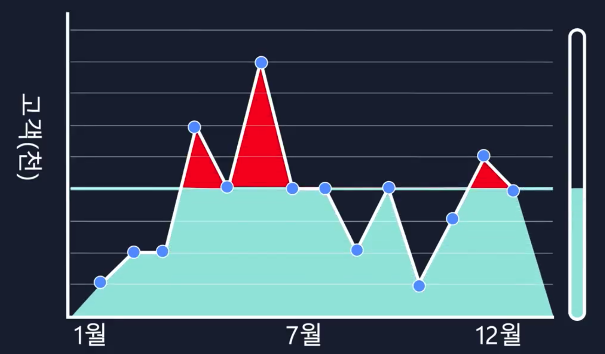

# 클라우드 컴퓨팅?

## 모듈 2 소개

> Amazon Elastic Compute Cloud는 어떤 서비스인지 알아보자

카페 예시에서 클라이언트와 서버 예시를 든 적이 있다.  
클라이언트가 서버에 요청을 보내면 서버가 작업을 수행하고 다시 클라이언트에게 응답을 보내는 모델이다.

여기서는 카페를 예로 들었지만, 동일한 개념이 다양한 분야에서 서버 - 클라이언트 모델이 사용된다.  
의료 서비스, 제조 서비스, 보험 서비스 등을 포함하여 전 세계에 있는 수백만명에게 동영상 컨텐츠를 제공하는 서비스도 제품, 리소스, 데이터를 사용자에게 전달 한다.

`서비스`를 `운영`하기 위해서는 `서버`라는 것이 필요하다.  
이러한 서버를 통해 웹 애플리케이션을 호스팅하고 기업에 필요한 리소스를 제공한다.

AWS에서 사용하는 서버는 물리적인 서버가 아닌, `인터넷을 통해 접근 가능한 가상화된 서버`다.  
이렇듯 `가상화된 서버에 엑세스 하는 서비스를 EC2`라 한다.

EC2는 온프레미스 리소스를 사용하는 것보다 상당히 유용한데 아래 비교군을 보자.

- `온프레미스를 통해 서버를 구축한다면?`
  - 구매할 `서버 유형` 및 `대수`를 검토
  - `H/W 비용 선 결제`
  - 제공 업체에 요청 후 몇달을 기다려야함
  - 데이터 센터에 전선 연결 및 서버 설치 필요
  - 보안 및 전원 연결 확인
  - 단점
    - `사용하든 안하든 구매한 서버 무조건 보유`
- `EC2를 사용하게 된다면?`
  - `AWS`는 이미 `데이터 센터`를 구축하여 `보안` 유지하고 있음
  - 또한 `AWS`는 이미 `서버`를 `모두 구매`해두었음
  - `해당 서버`는 바로 사용 가능한 `온라인 상태`
  - 사용자가 원하는 EC2 인스턴스를 요청, 원하지 않으면 바로 종료 가능
  - `사용한 만큼만 비용 지불`(중지, 종료 -> 비용 안나감)

기본적으로 `EC2`는 `가상화`를 통해 `AWS에서 관리`하고 있다. 또한 `AWS`에서 `관리`하는 `물리적`인 `호스트`에서 `실행`되고 있기 때문에, EC2 인스턴스를 실행할 때 전체 호스트 시스템을 소유할 필요는 없다. 대신 호스트를 다른 사용자와 공유해서 사용한다. (가상머신)

`호스트 머신`에서 실행하는 `하이퍼바이저`라는 것이 가상머신끼리 물리적 리소스를 공유하도록 책임을 진다. 이렇듯 `여러 가상 머신이 기본 하드웨어를 공유`하는 것을 `멀티 테넌시`라 한다. 또한 하이퍼바이저에 의해 각 EC2 인스턴스는 `격리` 된다.

또한 EC2 인스턴스는 `크기 조정` -> `수직 확장`이 가능하며, 네트워크(`보안그룹`)도 제어 가능하다.

## Amazon EC2 인스턴스 유형

> 지금까지는 EC2에 대해 알아보았는데, 이번에는 유형에 대해 알아본다

앞서 카페를 예로 들었는데 EC2 인스턴스는 직원에 해당하며 클라이언트의 요청을 처리한다는 것을 알 수 있다. 수 많은 고객을 상대하려면 직원이 여러명이 필요하다. 여기서 모든 직원이 카운터를 담당하지 않아도 되며 직원들은 각각 맡은 역할을 담당하면 된다.

AWS에는 목적에 따라 `다양한 유형의 EC2 인스턴스를 제공`한다. 각 EC2 유형은 `인스턴스 패밀리`로 구분이 되며, 인스턴스 유형에 따라 `CPU`, `Memory`, `스토리지`, `네트워크 용량` 등 선택 가능.

- AWS EC2 인스턴스 패밀리
  - 범용
    - CPU, Memory, Network 리소스 균형있음
    - 웹서버
  - 컴퓨팅 최적화
    - CPU 관련 작업
    - 게임 서버
  - 메모리 최적화
    - 메모리 관련 작업
  - 엑셀러레이티드 컴퓨팅
    - 그래픽 처리
    - 머신러닝 모델 학습 적합
  - 스토리지 최적화
    - 대규모 데이터 처리
    - Hadoop or 배치 서비스

## Amazon EC2 요금

> AWS는 얼마나 비용이 발생할까? EC2 인스턴스는 다양한 비용 옵션을 가지고 있는데,  
> 옵션은 아래와 같이 구성이 된다.

- `온디멘드`
  - `인스턴스 실행한 기간 만큼 비용 지불`
  - 선택한 `인스턴스 유형` 및 `OS` 타입에 따라 `시간/초단위`로 과금
  - `선 결재` or `약정` -> 필요 x
- `Savings Plan`
  - `일정한 사용량`을 `약정(1년, 2년)`하는 대가로, `EC2 비용 감축`(72%)
  - 이렇게 되면 `인스턴스 패밀리`, `크기`, `OS`, `테넌시`, `리전` 상관 없이 `비용 감소` 가능
- `Reserved Instance`
  - 꾸준한 상태의 워크로드, 시용량 예측 가능한 워크로드에 적합
  - 온디멘드 대비 -> 75% 저렴
  - 1년 or 3년 약정 -> 할인 가능
- `Spot Instance`
  - AWS의 `여분 인스턴스` 용량 사용
  - 최대 `95%` 할인
  - AWS가 언제든 리소스 가져갈 수 있음, 알람은 줌
  - 주로 배치에서 사용
- `전용 호스트`
  - EC2가 동작하는 `물리적 호스트`를 `전용`으로 사용
  - `다른 사용자`와 `서버 머신을 공유 안함`

## Amazon EC2 크기 조정

> AWS의 확장성 및 탄력성에 대해 기술

- 온프레미스 데이터 센테의 딜레마
  - `고객의 워크로드`는 `유동적`이다
  - IDC 구축의 경우 H/W를 얼마나 구매할지가 중요하다
  - `하지만 고객의 수요에 맞게 H/W 장비를 셋팅하는 것은 거의 불가능`하다
- AWS는 어떻게 해소할까?
  - `고객의 워크로드`에 맞게 `유동적 리소스 Scaling` 가능
  - H/A(고가용성) 시스템 구축 가능
- `증가하는 수요의 2가지 처리 방안`
  - 수직 확장
    - 장치의 성능 추가
    - `Scale Up`
  - 수평 확장
    - 장치의 대수를 추가
    - `Scale Out`

## Elastic Load Balancing을 사용하여 트래픽 리다이렉션

> 이번 시간에는 트래픽에 대한 문제가 있는 경우에 대해 알아보자

- ELB(Elastic Load Blancer)
  - `EC2 인스턴스가 여러개 있을 때, 워크로드를 균등하게 분배하기 위해 사용`
    - 서버에 트래픽 몰림 방지를 위해, 부하 분산 처리를 해주는 기술
    - `라운드 로빈`, `가중치 기반 부하 분산`, `IP 해싱 기반 알고리즘` 존재
    - 대표적으로 `ALB:L7`, `NLB:L4`, `CLB` 존재
- 트래픽을 적적할게 분산하기 위해 필요한 것?
  - ELB를 사용하자!
    - 고성능
    - 비용 효율성
    - 고가용성
    - 자동 확장 기능 제공

### ELB는 리전 수준에서 실행

- `ELB`는 `리전 수준` 구조이다
- `리전 수준`에서 `실행`되므로 `자동`으로 `고가용성 서비스`가 된다
- `ELB`는 `자동`으로 `확장` 한다?
  - 트래픽이 증가하면 시간당 비용 변경 없이, 추가 트래픽을 처리하도록 설계
  - 여기서 AutoScaling 서비스는 ELB에 온라인 상태가 가능하다는 신호를 보내고
  - 트래픽이 줄어들면 다시 축소가 되는 구조를 갖는다

### ELB는 외부 트래픽에만 사용하지 않는다

- ELB는 외부 통신에만 사용이 되지 않고, 내부 통신에도 사용이 된다
- 위와 같이 ELB가 없으면 내부 통신이 복잡해진다

- 하지만 ELB를 중간에 둠으로써 네트워크가 간단해진다

## 메시징 및 대기열

> 이번 시간에는 메시징 및 대기열에 대해 알아본다  
> SQS는 사용자 요청에 즉각 응답하지 않아도 되는 경우 사용하는게 좋다

커피숖에서 계산원은 고객의 주문을 맡고 바리스타는 음료를 제작한다.  
현재는 계산원이 주문을 받고 종이에 기록한 다음에 주문을 바리스타에게 전달한다.  
바리스타는 주문서를 통해 음료 제작을 시작한다.

이러한 작업은 계산원과 바리스타의 손발이 잘 맞아야 일이 진행된다.  
만약 바리스타가 없다면 계산원은 아무것도 할 수 가 없을 것이다.

이 프로세스는 중대한 결함이 존재한다. 만약 계산원과 바리스타의 손발이 맞지 않으면  
프로세스가 저하되어 주문 속도가 느려지고 주문을 완료하지 못한다.

이렇듯 시스템에 일종의 버퍼나 대기열을 도입하면 프로세스가 훨씬 개선이 된다.  
예를 들어 계산원은 주문만 받고 주문판(버퍼)에 개시한다.

계산원이 바리스타에게 주문서를 전달하는 것은, 애플리케이션이 메시지를 다른 애플리케이션과 통신하는 것과 마찬가지임.  
애플리케이션이 직접 소통 한다면 `밀결합된 상태` 라고 할 수 있다. `밀겹합된 상태`의 아키텍처는 `구성 요소 중 1개`라도  
`장애가 발생`하면 `나머지 서비스에도 영향`을 미칠 수 있다.

예를 들어 애플리케이션 A가 B에 메시지를 직접 보내는 경우, B에 오류가 발생하게 되면  
A 애플리케이션도 장애가 발생하게 된다. `이렇듯 밀겹한된 상태보다는 소결합된 상태인 경우 연속적인 장애를 막을 수 있다`.

> 소결합된 구조로 만들면 다음과 같은 구조가 된다  
> 대표적인 서비스로는 SQS(Amazon Simple Queue Service), SNS(Amazon Simple Notification Service)가 존재한다

우선 A 애플리케이션과 B 애플리케이션 사이에 메시지 대기열(Queue)을 구성한다.  
이러한 경우 B 애플리케이션에 문제가 발생해도 장애로 이어지지 않고, 대기열에 메시지를 보관할 수 있다.

### AWS SQS 사용?

> AWS SQS(Simple Queue Service)는 메시지 대기열 서비스이다.  
> Amazon SQS를 사용하면 메시지 손실이나 다른 서비스 사용 없이 요소 간의,  
> 메시지를 전송, 저장, 수신 할 수 있다.

- SQS를 이용하면 `규모`에 상관없이 S/W 구성 요소 간의 `메시지`를 `전송`, `저장`, `수신` 가능
- `다중화`가 구현되어 있음, 메시지를 잃어버리거나 서비스 중단 가능성 낮음
- 메시지: 커피 주문
- 주문판: SQS 대기열
- `메시지`에 `포함된 데이터`는 `페이로드`라 지칭

### AWS SNS 사용?

> AWS SNS(Simple Notification Service)는 게시 및 구독 서비스이다.  
> 게시자는 Amazon SNS 주제를 사용하여 구독자에게 메시지를 게시한다.  
> 구독자는 웹 서버, 이메일 주소, AWS Lambda 함수 등이 될 수 있다.

- 메시지를 서비스에 전달한다는 점에서 SQS와 비슷
- 알림을 최종 사용자에게 전송 할 수 있다
  - 웹 서버
  - 이메일
  - Lambda Function
- 게시(pub) / 구독(sub)
- `사용자`는 `메시지를 전달`하는 `채널`인 `SNS 주제` 생성 가능
- 후에 주제에 대한 구독자를 구성하고, 구독자에게 메시지를 개시
- 모바일 PUSH, SNS, 이메일을 사용하여 알림을 최종 사용자에게 전달 가능

## 추가 컴퓨팅 서비스

EC2 인스터스는 최소한의 손실로 프로비저닝해서 AWS에서 가동하고 실행할 수 있는 `가상머신`이다.  
이러한 EC2는 기본 웹 서버 실행부터 고성능 컴퓨팅 클러스터까지 다양한 사용사례에 적합하게 사용 가능하다.

이러한 EC2는 놀라울정도로 `유연`하고 `안정적`이며 `확장성`을 가지지만,  
사용 사례에 따라서 대안을 찾아야 할 수 있다. EC2를 사용하면 시간에 따라서 인스턴스 플랫을 직접 설정하고 관리해야 한다.  
또한 사용자가 `인스턴스 패치`도 해야 한다.

많은 관리가 필요하지는 않지만 `어느정도 사용자가 관리`를 해야 한다는 의미다.  
그렇다면 AWS가 제공하는 관리하기 편리한 다른 컴퓨팅 관련 서비스가 있는지 알아보자.  
AWS는 다양한 `서버리스` 컴퓨팅 옵션을 제공해준다.

`서버리스`는 `애플리케이션을 호스팅하는 기본 인프라` or `인스턴스를` 마치 서버가 없는 것처럼 `관리할 필요가 없다`.  
필요한 프로비저닝, 고가용성 등에 대한 모든 것을 AWS가 대신 처리를 한다. 사용자는 애플리케이션만 신경 쓰면 됨.

### AWS Lambda

> AWS Lambda는 이러한 서버리스 컴퓨팅 옵션 중 대표적인 서비스라 볼 수 있다.

이 Lambda는 사용자가 코드를 Lambda Functions에 업로드 할 수 있게 도와주는 서비스이다.  
먼저 트리거를 구성하면 Lambda 함수는 트리거를 기다린다. 트리거가 감지되면 Lambda 안의 코드가 자동으로 실행된다.

또한 `Lambda`는 `코드`가 `15분 미만`로 `실행` 되도록 설계가 되어있다.  
따라서 Deep Learning과 같은 서비스에는 맞지 않고, 웹 서비스 백엔드에 적합하다.  

하지만 `아직 서버리스를 이용할 준비가 되지 않았거나`, 혹은 `기본 환경에 엑세스` 해야 하며  
`효율성`을 `증대`시켜야 하는 경우 `ECS`, `EKS`를 사용 할 수 있다.

### ECS & EKS

> 완전 관리형 컨테이너 오케스트레이션 서비스

두 서비스 모두 컨테이너 오케스트레이션 도구이지만 여기서 말하는 컨테이너는 Docker Container를 의미한다.  
Docker는 많은 서비스에서 사용되는 플랫폼으로 `운영체제 수준`에서의 `가상화`를 지원하고 `커널`을 `공유`한다는 특징을 가지고 있다.

여기서 말하는 `컨테이너`는 `애플리케이션` + `애플리케이션 실행을 위한 모든 구성 요소`를 의미한다.  
이러한 `컨테이너`는 `EC2 인스턴스에서 실행`이 되고 `가상머신`이 `작동`되는 방식과 비슷하게 서로 `격리`가 되어서 실행이 된다. 하지만 이러한 경우 Host는 EC2 인스턴스가 된다. 이렇게 AWS에서 Docker Container를 사용할때는 단일 인스턴스 뿐만 아니라 `클러스터`라고 하는 `인스턴스의 모음`에서 실행을 하게 되는 컨테이너도 실행, 중지, 관리 하는 등에 대한 프로세스가 필요하다.

이러한 작업을 수행해주는 프로세스를 컨테이너 오케스트레이션이라 한다.  
`오케스트레이션 도구`는 `컨테이너 관리를 지원할 목적`으로 만들어졌다.

ECS는 자체 컨테이너 오케스트레이션 S/W를 관리하는 번거로움 없이도,  
컨테이너 인스턴스를 대규모로 실행 가능 하도록 설계 되었다.

EKS는 비슷한 작업을 수행하지만, 다른 도구와 기능을 사용한다.  

ECS, EKS는 EC2에서 실행이 가능하다, 하지만 직접 엑세스 하거나 관리하지 않아도 되는 경우  
AWS Fargate 플랫폼을 사용하는것이 좋다. (Serverless)

## 모듈 2 요약

### 클라우드 컴퓨팅?

- IT 리소스를 인터넷을 통해 온디멘드로 제공하고, 사용자는 사용한 만큼만 비용을 지불(가불)한다
- 또한 `종량 과금제 요금제`를 사용한다. 월말에 요금을 지불한다

### Amazon EC2

- 가상화된 서버를 동적으로 가동 및 중지 가능
- 인스턴스 시작 시 인스턴스 패밀리 정해야함, 이 때 H/W 결정됨
- 인스턴스 패밀리
  - 범용
  - 컴퓨팅 최적화
  - 메모리 최적화 
  - 엑셀러레이티드 컴퓨팅
  - 스토리지
- 인스턴스 확장
  - Auto Scaling 사용
  - 수직 확장: Scale Up
  - 수평 확장: Scale Out
- ELB 통해 분산
- 결제 옵션
  - 온디멘드
  - Saving Plans
  - Reserved Instance
  - Spot Instance
  - Hosted Instance
  - `예약 인스턴스 약정 기간 옵션`
    - `1년 / 3년`

### Amazon SQS & SNS

- SQS(Simple Queue Service)
  - 메시지는 소비 혹은 삭제 전 대기열에 남아있음
- SNS(Simple Notification Service)
  - 메시지 게시 및 구독

### Serverless

- Lambda, ECS, EKS.. 등등
- Fargate 통해 프로비저닝 없이 서버가 없는 것처럼 애플리케이션에만 집중 가능

## 99. 참고 자료

- [[AWS] AWS Cloud Practitional Essentials](https://explore.skillbuilder.aws/learn/course/13522/play/107682/aws-cloud-practitioner-essentials-korean-na-hangug-eo-gang-ui)
