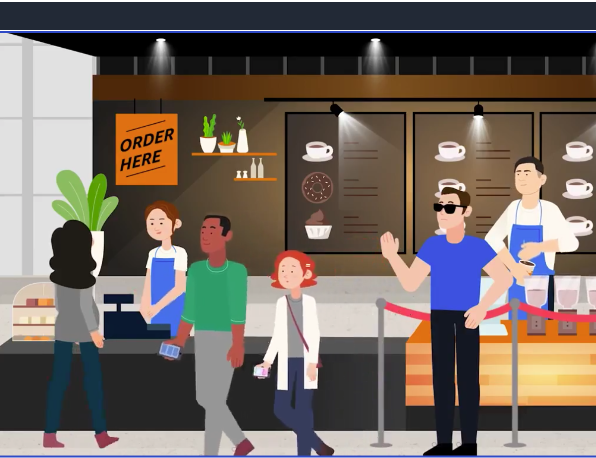
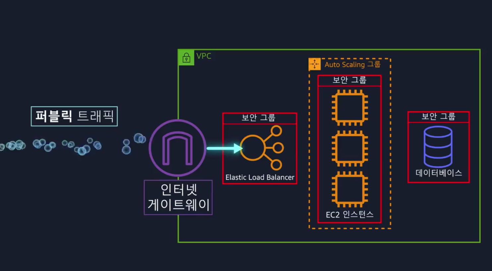
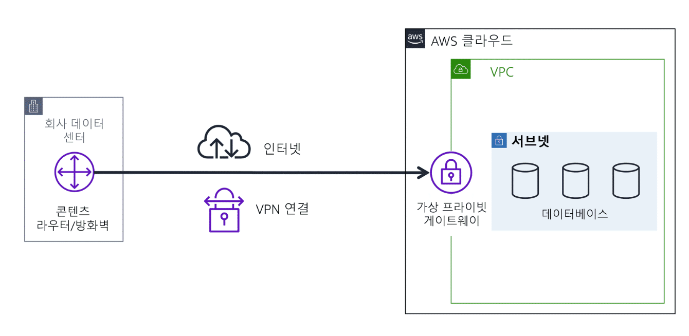
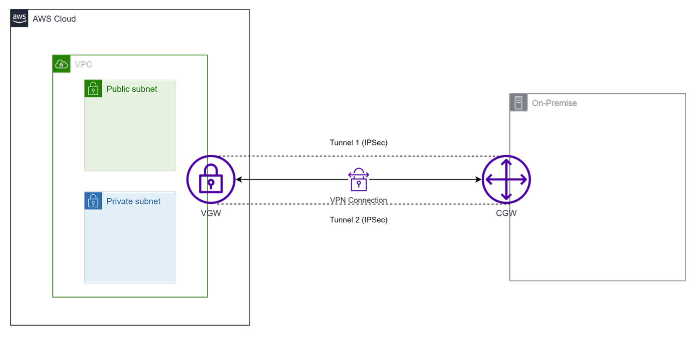
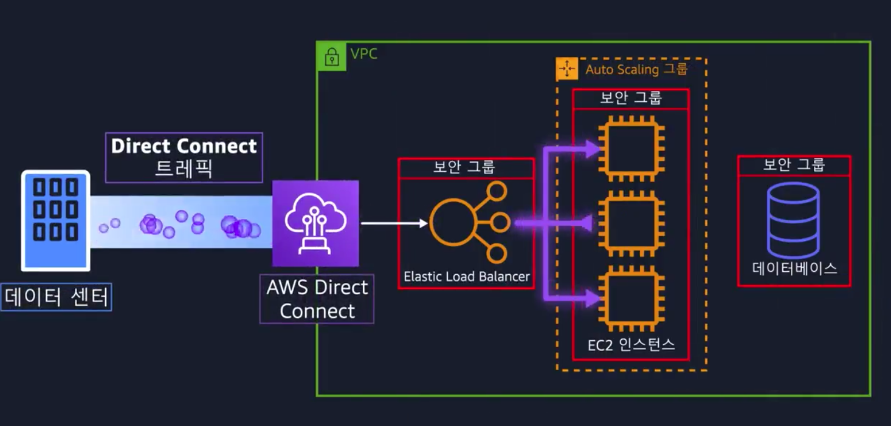
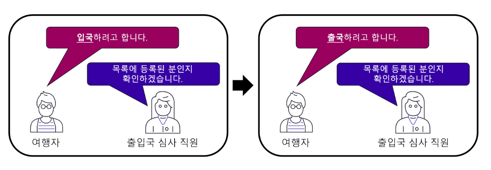
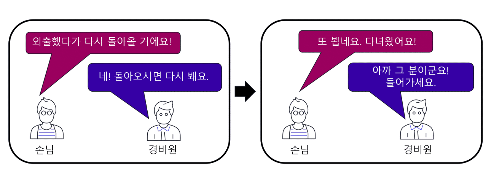
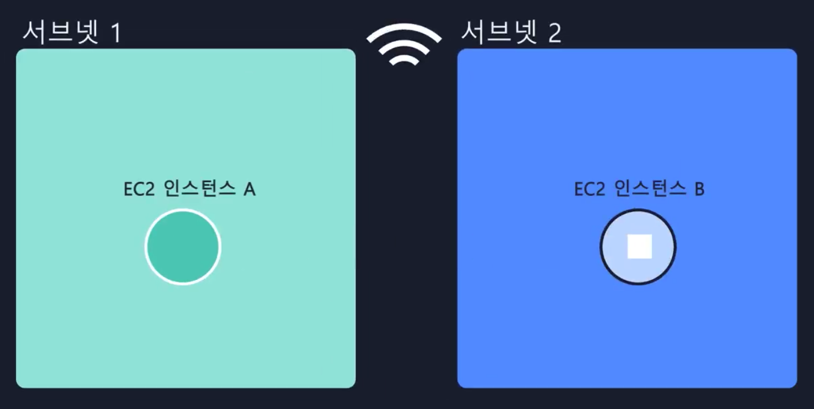
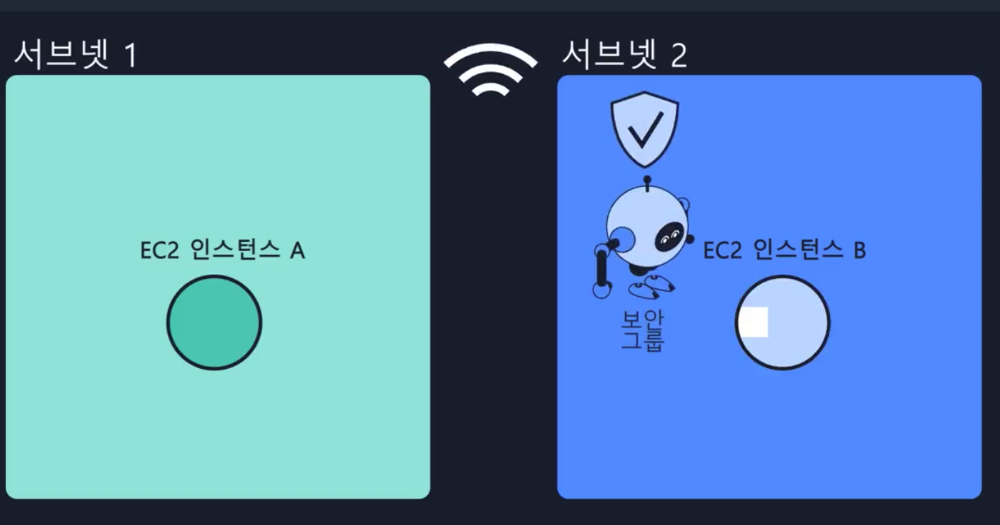
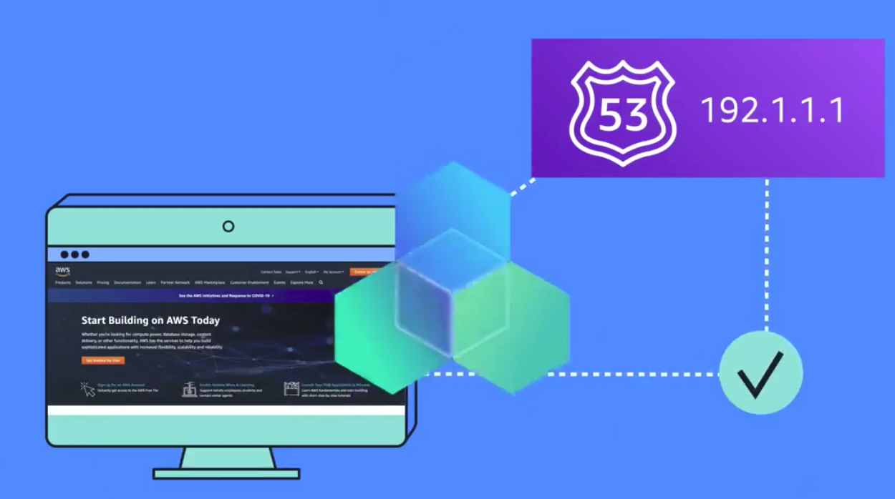

# 네트워킹

> 학습 목표

- `네트워킹 기본 개념` 설명 가능
- `퍼블릭`, `프라이빗 네트워킹 차이` 설명 가능
- 실제 시나리오 기반 `가상 프라이빗 게이트웨이` 설명 가능
- 실제 시나리오 기반 `VPN` 설명 가능
- `AWS Direct Connect` 이점 설명 가능
- `하이브리드 배포` 이점 설명 가능
- IT 전략의 `보안 계층` 설명 가능

## 모듈 4 소개

이전에 카페에서 주문원은 고객으로부터 주문을 받고, 바리스타는 주문판(SQS)을 통해 커피를 제조하도록 하였다.  
하지만 만약 주문원이 아닌 바리스타에게 직접 주문을 하려고 하는 고객이 있으면 어떻게 해야 할까??
당연히 바리스타에게 주문을 하는 행위는 막아야 한다.  

AWS는 `VPC`(Virtual Private Cloud)라는 `가상 사설망`을 제공한다.  
`VPC`를 `사용`하게 되면 `사용자`가 `정의`한 `가상 네트워크망`에 AWS 리소스를 실행할 수 있는,
`논리적`으로 `격리`되어 있는 네트워크 환경에서 AWS 클라우드 섹션(리소스)을 프로비저닝 할 수 있다.

기본적으로 이러한 `VPC`는 `인터넷 연결이 가능`한 `공인 서브넷`(public subnet)과,  
`인터넷 연결이 직접적으로 불가능`한 `사설 서브넷`(private subnet) 대역으로 구분이 되어있다.

> 계산원은(public subnet), 바리스타는(private subnet)이라 생각하면 된다  
> private subnet에는 백엔드 시스템 or DB와 같은 서비스를 배치 한다

## AWS와의 연결

`VPC`(Virtual Private Network)는 `AWS에서 사용 가능`한 `격리`된 `가상 사설망`을 의미한다.  
이러한 VPC를 사용하게 되면 `AWS 리소스`에 대해 `Private IP범위`를 `지정`할 수 있다(CIDR).  
이러한 VPC에 EC2나 ELB와 같은 리소스를 배치하여 사용 할 수 있다.

하지만 이러한 VPC에 리소스를 바로 배치하는 것은 아니다. VPC가 아닌 Subnet이라는 단위에 리소스를 배치하게 되는데,  
Subnet은 `VPC 내`의 `'IP 주소 모음'`으로 `'리소스를 그룹화'`하는 것을 도와준다.

또한 이러한 `Subent`은 `리소스`를 `공개할지, 공개하지 않을지 제어`하며,  
`VPC`에 들어갈 수 있는 `인바운드 트래픽`을 `제어`하는 `방법도 다양`하다.

- 일부 VPC에는 공개적으로 접근 가능(인터넷 연결)한 리소스 존재
- 일부 VPC에는 비공개적으로 접근 불가능한 리소스 존재

### 인터넷 게이트웨이

`공개 인터넷 트래픽`이 `VPC`에 `접근`하는 것을 `허용`하려면, `IGW`(Internet Gateway)를 특정 `VPC`에 `연결`해야 한다.  
또한 이러한 IGW는 외부 요청을 허용하기 위한 진입점 혹은 정문으로, 카페에 출입하기 위한 정문과 비유할 수 있다.

이에 반해 누구도 리소스에 접근해서는 안되는 경우, `IGW는 VPC에 연결되어 있으면 안된다`.  
하지만 `승인된 네트워크 트래픽`(Private Network)의 경우에는 `트래픽`이 `허용`되어야 하는데,  
`이러한 경우` `사용`하는 것이 `프라이빗 게이트웨이`(Private Gateway)이다.

이러한 프라이빗 게이트웨이는 온프레미스 or 사내 네트워크와 AWS VPC의 연결(Connect)를 만들 수 있으며,  
주로 Customer Gateway == VPN Connection == Private Gateway:VPC 와 같이 연결이 된다.

이와같이 비공개 연결을 만들 때 VGW(Virtual Gateway)를 사용하면 된다.  
하지만 VGW를 사용할 때 아래와 같은 단점이 존재한다.

- VPN 연결 시 비공개 + 암호화 이지만 인터넷을 사용하는 사용자와 동일한 네트워크 대역 공유
- 즉, 인터넷을 통해 온프레미스와 AWS 간 연결을 수행한다는 단점이 존재

> 🤔 음 나는 다른 사람들이랑 인터넷 대역 공유 안하고, 속도도 빠르면 좋을 것 같은데?  
> 이 때 사용하는 것이 바로 AWS Direct Connect 서비스이다

### AWS Direct Connect

`AWS Direct Connect`를 사용하면, IDC에서 AWS로 이어지는 `완전 비공개인 전용 광섬유 회선` 구축이 가능하다.  
AWS Direct Connect는 네트워크와 AWS VPC를 연결하는 물리적 회선을 제공하기 때문에 네트워크 속도나 신뢰성이 뛰어나다.

## 서브넷 및 네트워크 엑세스 제어 목록

AWS VPC는 명시적 허가 없이 출입이 불가능한 강화된 요소라 보면 된다.  
이러한 VPC에는 IGW가 존재하는데, IGW는 경계에만 머무르는 개념이다.

- AWS의 보안
  - 네트워크 강화
  - 애플리케이션 보안
  - 사용자 자격 증명
  - 인증 및 권한 부여
  - 분산 서비스 거부 방지
  - 데이터 무결성
  - 암호화

### 서브넷 사용 이유?

> 서브넷을 왜 사용하는가? -> GW 수준의 엑세스 제어

`VPC`에서 `서브넷`을 `사용하는 이유`는 `게이트웨이`(IGW)에 대한 `엑세스 제어` 및 관리를 수행하기 위함이다.  
기본적으로 퍼블릭 서브넷(public subnet)은 IGW를 통해 인터넷에 연결이 가능하다. 하지만 프라이빗 서브넷(private subnet)은 인터넷 연결이 불가능하다.  

이 뿐만이 아니라 `Subnet`은 `패킷`에 대한 `권한 제어도 수행`한다. 여기서 패킷은 인터네에 보내는 메시지를 의미한다.  
기본적으로 서브넷 수준에서 패킷의 엑세스를 제어하기 위해 `NACL`을 사용한다.

### NACL 사용 이유?

> NACL을 왜 사용하는가? -> 서브넷 수준의 패킷 권한 제어

NACL은 서브넷 수준에서 인바운드, 아웃바운드 패킷의 권한을 검증하는 서비스다.  
기본적으로 초기에는 인바운드, 아웃바운드가 모두 허용되어 있으며, 가장 중요한 부분은  
NACL은 상태를 기억하지 않는 `stateless`라는 것을 잊으면 안된다.

### 보안그룹 사용 이유?

> 보안그룹을 왜 사용하는가? -> 인스턴스 수준의 권한 제어

기본적으로 NACL은 인스턴스 수준의 엑세스 제어가 불가능하다.  
하여 AWS는 보안그룹이라는 개념을 도입하여, EC2 인스턴스 수준의 패킷 제어를 수행한다.  
기본적으로 초기에 보안그룹은 인바운드는 전부 허용하지 않고, 아웃바운드만 전부 허용한다.  
또한 EC2가 시작되면 보안그룹으로 이동하게 된다(ex. 경비원한테 보안 검사 받으러)
보안그룹은 상태를 기억하는 `stateful`라는 것을 잊으면 안된다.

### NACL vs 보안그룹 차이 정리

> 보안그룹: Stateful(상태 기억)  
> NACL: Stateless(상태 기억 안함)

1. VPC는 같지만 서브넷이 다른 A -> B 인스턴스로 메시지 전송
2. 1차적으로 A가 B로 패킷을 보내면 A의 보안그룹 경계 확인
3. 후에 서브넷 1 경계를 나가기전 NACL 검사를 진행
4. 서브넷 2 경계로 들어간다, 다시한번 NACL 검사를 진행
5. 서브넷 2의 NACL 통과 후 인스턴스의 보안그룹 경계 확인

1. 보안그룹은 stateful이기에 보안그룹 검사 안함
2. 서브넷 2 나가기전 NACL 검사 진행
3. 서브넷 1 들어가기 전 NACL 검사 진행
4. 인스턴스 A에 메시지 도달
   1. 보안그룹 -> 상태 저장하기에 허용함

## 글로벌 네트워킹

AWS에서 호스팅하는 웹 사이트가 있으면, 고객은 자신의 브라우저에서 웹 사이트에 접속한다.  
그런데 브라우저에 URL 입력만으로, 어떻게 접속이 가능한걸까?

### AWS Route 53

AWS `Route 53`은 `AWS`에게 `제공`하는 `DNS 서비스`이며, `가용성`과 `확장성`이 뛰어나다.  
여기서 `DNS`(Domain Name System)은 일종의 `번역 서비스`로, `도메인 주소`를 `IP주소`로 `변경`하거나 `IP주소`를 `도메인 주소`로 변경해주는 역할을 한다.

- `AWS Route 53의 라우팅 정책`
  - 지연 시간 기반 라우팅
  - 지리적 위치 DNS
  - 지리 근접 라우팅
  - 가중치 기반 라운드 로빈

### AWS CloudFront

CDN은 엣지에 있는 컨텐츠를 사용자의 지리적 위치 기반으로 전달하는 전달 네트워크이다.  
CloudFront도 엣지를 사용하여 정적 컨텐츠를 사용자에게 빠르게 전송.

## 모듈 4 요약

- VPC(Virtual Private Cloud)
- GW, NACL, 보안그룹
- VPN 및 Direct Connect
- DNS Route53, Edge Location CloudFront

## 99. 참고 자료

- [[AWS] 모듈 4. 네트워킹](https://explore.skillbuilder.aws/learn/course/13522/play/107682/aws-cloud-practitioner-essentials-korean-na-hangug-eo-gang-ui)
- [[AWS] VGW와 CGW를 사용하여 Site-to-Site VPN 구성하기](https://yoo11052.tistory.com/171)