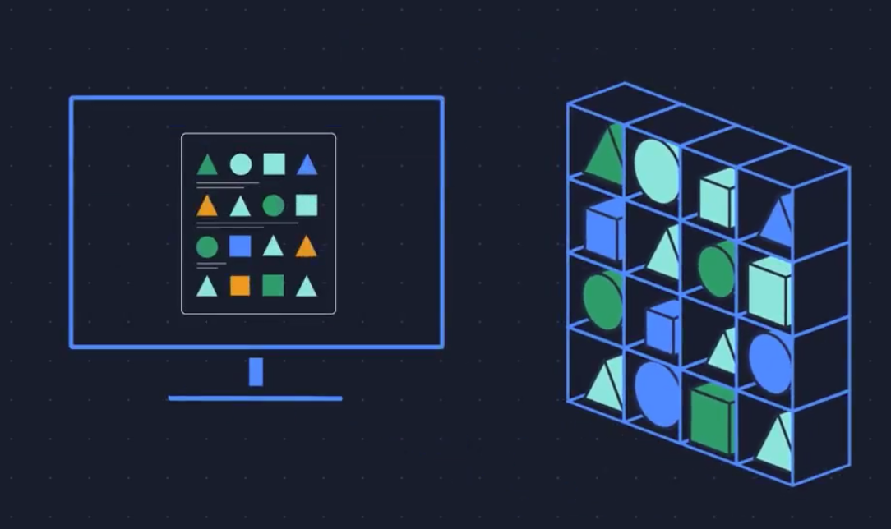
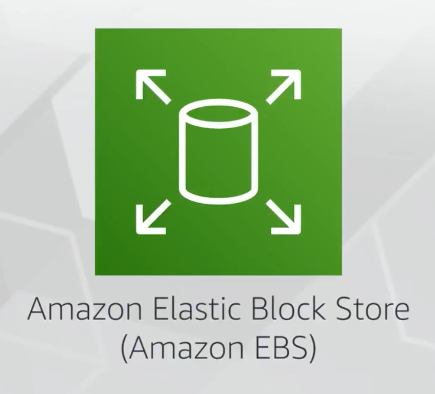
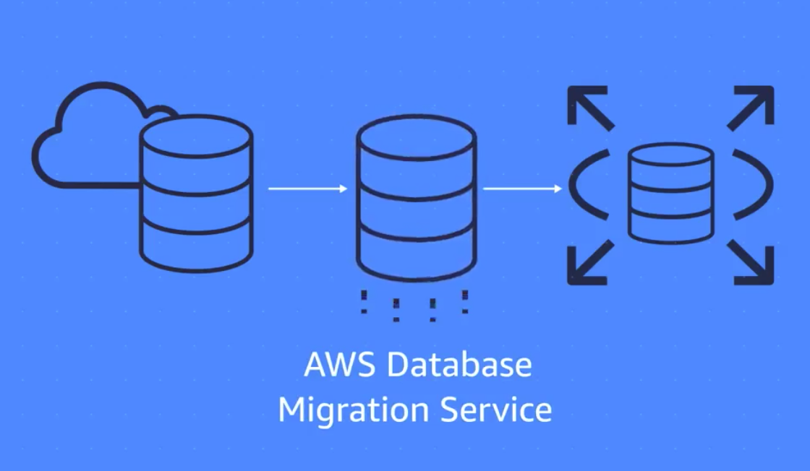

# 스토리지 및 데이터베이스

## 인스턴스 스토어 및 EBS(Elastic Block Storage)

> 휘발성 or 비휘발성 데이터 저장 방식

`AWS` `EC2`를 `사용`하게 되면 `CPU`, `Mem`, `Network`, `Storage`에 접근(Access) 할 수 있다.  
하지만 이번 시간에는 다른 자원이 아닌 `Storage의 접근`(`Access`)하는 부분에 대해 알아보자.

기본적으로 `Application`이 EC2에서 `실행`이 되면, 반드시 `블록 수준 스토리지`에 `접근`(Access) 해야 한다.  
`블록 수준 스토리지`란 `파일을 저장하는 장소`를 의미하며, 이러한 파일들은 `바이트`(Byte) 기반으로 `저장`된다.  
또한 파일에 수정이 있는 경우에는 전체가 아닌 `수정된 부분만 업데이트` 하는 특징도 있다.

주로 `DB`, `Enterprise S/W`, `파일 시스템`과 같이 `I/O가 자주 발생하는 서비스`에서 사용하면 `효율적`이다.  
또한 EC2도 HDD와 SDD를 가지고 있으며, EC2 유형에 따라 `내장 인스턴스 스토리지`와 `EBS`로 구분한다.

### 내장 인스턴스 스토리지

- `내장 인스턴스 스토리지`은 `Host`에 `물리적 연결 수행`
- EC2 재시작 시 다른 Host에서 실행 될 가능성이 있기에, `종료` 및 `중지` 시 해당 EC2의 데이터 날라감
- 내장 스토리지 EC2 유형은 휘발되어도 되는 데이터를 사용하는 경우만 사용해야 함

### EBS(Elastic Block Storage) 사용

- `EBS`는 `Host의 물리 장비가 아닌`, `Network`로 `연결`된 스토리지
- `EBS`를 사용하면 `EC2`가 `중지` or `종료` 되어도 `데이터 유지` 가능
- `EBS`를 사용하면 `스냅샷`을 통해 정기적 `백업 데이터 생성 가능`

## Amazon Simple Storage Service(Amazon S3)

> S3 객체 오브젝트 기반 스토리지 서비스  
> 객체: HDD의 파일, 버킷: 파일 디렉토리

- `AWS S3`를 이용하면 `거의 무한대`의 `데이터`를 `저장`하고 `검색` 가능한 저장소
  - `데이터`는 `객체`로 저장
  - `객체`를 `버킷`에 저장
  - `업로드 최대 객체 크기`: `5TB`
  - 객체 `버전 관리 가능`하여 `롤백 가능`
  - 여러 버킷 생성 가능

> 자주 엑세스해야 하는 데이터, 수년간 유지해야 하는 감사 데이터 존재하는데,  
> S3는 스토리지 클래스를 통해 이러한 부분을 제어한다

### AWS S3 Standard

- `99.999999999%의 내구성`을 가진다
- `1년 후 데이터가 존재 가능성 높음`
- S3 `데이터`는 `3개 이상`의 시설에 저장

### AWS S3 정적 웹 사이트 호스팅

- `정적 웹 사이트`는 `HTML 파일의 모음이며`, `각 파일`은 `실제 사이트의 물리적 페이지`와 `비슷함`
- 모든 HTML 파일들을 포함한 정적 자원 -> 버킷 업로드 -> 정적 웹사이트 호스팅 가능

### AWS S3 Standard-Infrequent Access(S3 Standard-IA)

- `자주 엑세스`(`Access`)`하지 않지만`, `필요한 경우 빠르게 접근이 가능해야 하는 경우 사용`
- `백업`, `재해 복구`를 위한 파일, `장기 보관`이 필요한 `모든 객체에 적합`

### AWS S3 Glacier Flexible Retrieval

- `아카이브 형태`로 저장 가능
- `감사`를 위해 `데이터`가 `수년간 유지`되어야 하는 경우 사용(자주 검색 안됨)
- `저장소 잠금 정책`을 통해, `저장소`를 `잠글 수 있음`

### AWS S3 수명 주기 관리: 계층 사이 데이터 자동 이동

- `AWS S3 수명 주기 정책을 생성`하면 `데이터`는 `여러 계층 자동 이동` (예시 참고)
  - 객체를 S3 Standard에서 `90일` 유지
  - 다음 `30일`동안 S3 Standard-IA로 옮기고
  - `150일` 지나면 S3 Glacier로 옮겨야 한다
- AWS S3 수명 주기를 사용하면 이러한 이동 작업을 자동으로 수행할 수 있음

## AWS EBS와 S3 비교

> EBS와 S3 중 어떤 서비스를 사용해야 하는가?

### AWS EBS

- EBS의 특징
  - `EC2 인스턴스`에 `네트워크 연결`하여 사용
  - `단일 볼륨`은 `최대 16TiB`의 크기 제공
  - `EC2` 인스턴스 `종료` 후에도 `데이터 유지`
  - `SSD`와 `HDD` 옵션 제공
- EBS 사용 사례
  - `파일 일부` `자주 수정`하는 경우
  - `EC2`와 `연결`된 `저장소`가 필요한 경우

### AWS S3

- S3 특징
  - `거의 무제한`의 `크기` 제공
  - 최대 `5TB`의 개별 객체 `업로드` 가능
  - 한 번 쓰기/여러 번 읽기
  - `99.999999999%` 내구성 제공
- S3 사용 사례
  - 파일 일부 수정 불가, 전체 파일 업로드 해야함
  - `대용량 파일`(이미지, 동영상, 로그) 저장하는 경우
  - `장기 데이터` 보관하는 경우
  - EC2와 `무관한 독립된 저장소` 사용하는 경우

## Amazon Elastic File System(Amazon EFS)

- EFS(Elastic File System)은 관리형 파일 시스템을 의미한다
- 대부분의 기업의 애플리케이션은 이러한 파일 시스템(EFS, NAS?)을 공유해서 사용한다

> 대부분의 기업이 파일 시스템을 공유 한다?
> 
> ex) 예를 들어 대량의 데이터가 1개의 파일 시스템에 존재하는 상황이고,  
> 이러한 데이터를 분석하는 N개의 서버 애플리케이션이 존재하는 상황

- 지금까지 온프레미스에서 파일시스템을 관리할 때 신경 쓴 부분은 아래와 같다
  - 서버별 파일 시스템 용량이 부족한지 않은지?
  - 파일에 중복이 없고 고유한지?
  - 파일 백업이 정상적으로 이루어지고 있는지?
- AWS EFS를 사용하면 이러한 부분들을 AWS에게 모두 위임하여 관리할 수 있다
  - 자세한 내용은 아래 내용을 살펴보자

> EBS(Elastic Block Storage) 사용하면 되는데 굳이 EFS..?? 돈도 많이 나가는데??  
> 왜 EFS를 사용하자고 하는건데요??

### EBS(Elastic Block Storage)

> 가용 영역 레벨의 서비스, 디스크는 수동으로 확장 및 축소

- EBS는 가용 영역 수준 레벨의 블록 스토리지 서비스로, EC2에 연결하기 위해 동일한 AZ에 EC2가 존재해야 한다
  - 이를 통해 다른 가용 영역에 존재하는 EC2는 해당 볼륨에 Access가 불가능
- EBS는 최초 생성 시 볼륨의 사이즈(최대 16Tib)를 지정해야 한다
  - EFS와 다르게 디스크 용량이 다 차는 경우, 자동으로 확장 혹은 축소를 지원하지 않음

### EFS(Elastic File System)

- EFS는 가용영역 수준 레벨이 아닌 `리전 수준`의 서비스로, `여러 가용영역`에 존재하는 `EC2`가 `동시`에 `읽기/쓰기` 작업을 할 수 있다
- EFS는 `Linux`를 위한 `완전 파일 시스템` 이라 볼 수 있다
- EFS는 EBS와 다르게 용량이 부족한 경우 `자동`으로 `디스크`를 `확장` 및 `축소`하는 기능도 제공한다

## Amazon Relational Database(Amazon RDS)

- 관계형 데이터베이스란?
  - `연관성`을 갖는 `데이터 형태`로 `데이터`를 `저장`한다
  - `RDB`는 `정형 쿼리 언어`(SQL)를 통해 `데이터`를 `저장`하고 `쿼리` 가능
- 리프트 앤 시프트 마이그레이션
  - 클라우드 DB 마이그레이션
- AWS RDS(AWS Relational Database)란?
  - AWS RDS는 `클라우드`에서 `관계형 DB를 실행`할 수 있는 서비스
    - Amazon Aurora
    - PostgreSQL
    - MySQL
    - MariaDB
    - Oracle Database
    - Microsoft SQL Server
- AWS RDS가 지원하는 `일반 옵션`은?
  - 자동 업데이트
  - 백업
  - 이중화
  - 장애 조치
  - 재해 복구
- `AWS RDS`가 지원하는 `보안 옵션`은?
  - 데이터 저장 시 암호화(데이터 저장되는 동안 데이터 보호)
  - 데이터 전송 시 암호화(데이터 전송 및 수신 할때 데이터 보호)
- `Amazon Aurora?`
  - 엔터프라이즈 관계형 DB
  - `MySQL & PostgreSQL 2가지 제공`
  - `상용 DB 비용의 1/10`
  - `3개`의 `AZ`에 `복제본 6개` 복제
  - 표준 MySQL보다 `5배` 빠름
  - PostgreSQL보다 `3배` 빠름

## Amazon DynamoDB

- `DynamoDB`는 `서버리스`로, 직접 `인프라`를 `관리할 필요가 없다`
- `DynamoDB`는 `NoSQL`로, `비정형 SQL`을 `사용`해야 한다
- `DynamoDB`는 `테이블`이라는 개념이 존재하며, 테이블은 `항목:key`, `속성:value`로 구성 된다
- `DynamoDB`는 `사용자`를 `대신`하여 동일한 `데이터`를 `여러 위치`에 `복제` 및 `저장`한다
  - 여러 AZ(가용 영역) 대상 복제
  - 여러 드라이브 대상 복제
- `DynamoDB`의 `응답 시간`은 `밀리 초 단위 응답`

## RDS vs DynamoDB

### RDS(Relational Database System)

- 관계형 데이터베이스
- 정규화된 데이터 구조(테이블 관계 중요)
- 고정된 스키마 필요
- 자동 고가용성 + 복구 제공

### DynamoDB

- NoSQL 데이터베이스
- 비정형 데이터
- 스키마 없이 사용 가능
- 자동 고가용성 + 복구 제공

## Amazon Redshift

> 데이터 웨어하우스

- 빅 데이터 분석에 사용

## AWS Database Migration Service(DMS)

- `기존 DB`를 `AWS`로 `마이그레이션 가능`
- `마이그레이션 진행 중` `원본 DB는 정상 동작`
- DB 애플리케이션 다운타임 최소화
- `원본 DB`와 `대상 DB`가 `달라도` `마이그레이션 가능`

### 동종 마이그레이션

> 동일한 DB 유형 마이그레이션

- `동종 DB 유형 이관`
  - MySQL -> AWS RDS for MySQL
  - Microsoft SQL Server -> AWS RDS for SQL Server
  - Oracle -> AWS RDS for Oracle
- `동종 마이그레이션이 간단한 이유는?`
  - `스키마 구조`가 같음
  - `데이터 유형`도 같음
  - `데이터베이스 코드`도 같음

### 이종 마이그레이션

> 원본 DB와 대상 DB의 유형이 다른 마이그레이션

- `이종 마이그레이션`은 `2단계 프로세스`로 `진행`
- `1단계`는 `원본`과 `대상`의 `'스키마 구조'`, `'데이터 유형'`, `'데이터베이스 코드'`가 다른 경우 진행
  - `Amazon Schema Conversion Tool`(`SCT`)를 `툴`을 `사용`하여 변환해야 한다
  - 원본 스키마 + 데이터베이스 코드(SP)도 변환 된다
- `2단계`는 `DMS`를 통해 원본 DB의 데이터를 대상 DB로 마이그레이션

### DMS의 다른 사례

- `개발 및 테스트 DB 마이그레이션`
  - PROD 사용자에게 영향 주지 않고, 개발자가 PROD 데이터에서 애플리케이션을 테스트할 수 있도록 지원
- `데이터베이스 통합`
  - 여러 DB를 단일 DB로 결합
- `연속 복제`
  - 1회성 마이그레이션 수행이 아닌 데이터의 진행 중 복제본을 다른 대상 원본으로 전송  

## 추가 데이터베이스 서비스

- AWS DocumentDB(Mongo DB 호환 가능)
  - 문서 DB
- AWS Neptune
  - 그래프(Graph) DB
- AWS Managed Blockchain
  - 블록 체인 서비스
- AWS ElasticCache
  - DB 위에 캐싱 계층 추가