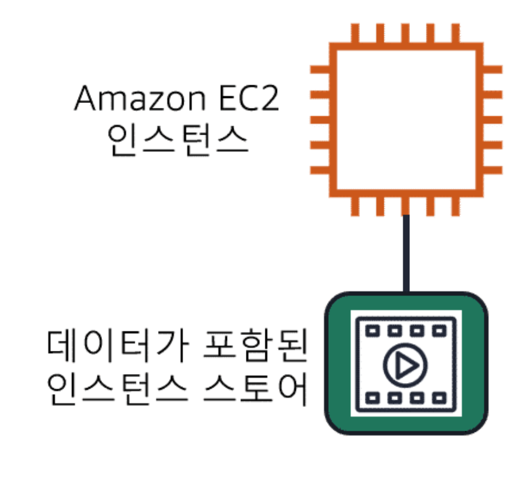
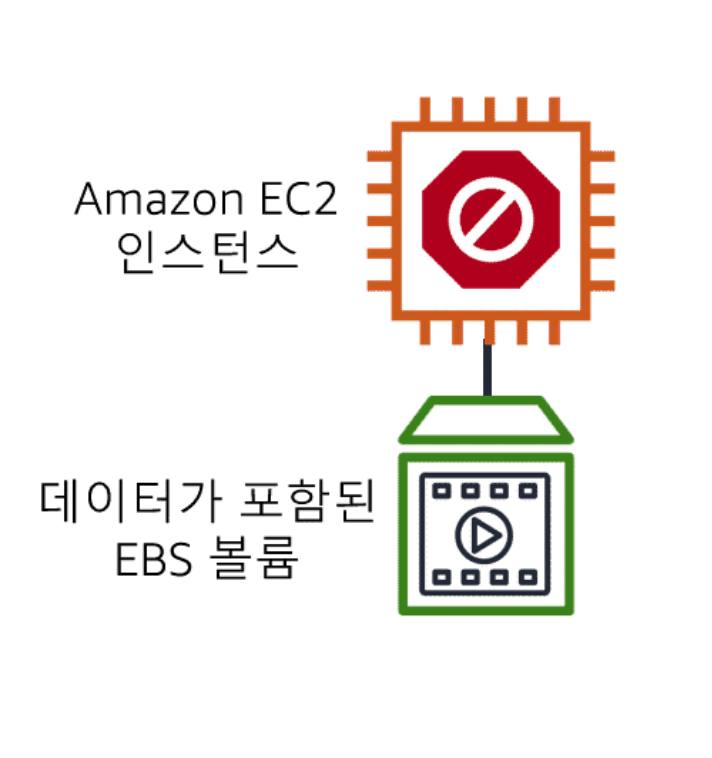

# 스토리지 및 데이터베이스

## 인스턴스 스토어 및 EBS(Elastic Block Storage)

> 휘발성 or 비휘발성 데이터 저장 방식

AWS `EC2`를 `사용`하게 되면 CPU, Mem, Network, Storage에 접근(Access) 할 수 있다.  
하지만 이번 시간에는 다른 자원이 아닌 `Storage의 접근`(`Access`)하는 부분에 대해 알아보자.

기본적으로 `Application`이 EC2에서 `실행`이 되면, 반드시 `블록 수준 스토리지`에 `접근`(Access) 해야 한다.  
`블록 수준 스토리지`란 `파일을 저장하는 장소`를 의미하며, 이러한 파일들은 `바이트`(Byte) 기반으로 `저장`된다.  
또한 파일에 수정이 있는 경우에는 전체가 아닌 `수정된 부분만 업데이트` 하는 특징도 있다.

주로 DB, Enterprise S/W, 파일 시스템과 같이 I/O가 자주 발생하는 서비스에서 사용하면 효율적이다.  
또한 EC2도 HDD와 SDD를 가지고 있으며, EC2 유형에 따라 `내장 인스턴스 스토리지`와 `EBS`로 구분한다.

### 내장 인스턴스 스토리지

- `내장 인스턴스 스토리지` -> `로컬 저장소 볼륨 제공`
- `내장 인스턴스 스토리지`은 `Host`에 `물리적 연결 수행`
- EC2 재시작 시 다른 Host에서 실행 될 가능성이 있기에, 종료 및 중지 시 해당 EC2의 데이터 날라감
- 내장 스토리지 EC2 유형은 휘발되어도 되는 데이터를 사용하는 경우만 사용해야 함

### EBS(Elastic Block Storage) 사용

- EBS는 Host의 물리 장비가 아닌, Network로 연결된 스토리지
- EBS를 사용하면 EC2가 중지 or 종료 되어도 데이터 유지 가능
- EBS를 사용하면 `스냅샷`을 통해 정기적 백업 데이터 생성 가능

## Amazon Simple Storage Service(Amazon S3)

> S3 객체 오브젝트 기반 스토리지 서비스  
> 객체: HDD의 파일, 버킷: 파일 디렉토리

- `AWS S3`를 이용하면 `거의 무한대`의 `데이터`를 `저장`하고 `검색` 가능한 저장소
  - 데이터는 객체로 저장
  - 객체를 버킷에 저장
  - `업로드 최대 객체 크기`: `5TB`
  - 객체 `버전 관리 가능`하여 `롤백 가능`
  - 여러 버킷 생성 가능

> 자주 엑세스해야 하는 데이터, 수년간 유지해야 하는 감사 데이터 존재하는데,  
> S3는 스토리지 클래스를 통해 이러한 부분을 제어한다

### AWS S3 Standard

- `99.999999999%의 내구성`을 가진다
- `데이터 손실 가능성 적음`
- `1년 후 데이터 존재 가능성 높음`

### AWS S3 정적 웹 사이트 호스팅

- `정적 웹 사이트`는 `HTML 파일의 모음`이며, `각 파일`은 `실제 사이트의 물리적 페이지`와 `비슷함`
- 모든 HTML 파일들을 포함한 정적 자원 -> 버킷 업로드 -> 정적 웹사이트 호스팅 가능

### AWS S3 Standard-Infrequent Access(S3 Standard-IA)

- `자주 엑세스`(`Access`)`하지 않지만`, `필요한 경우 빠르게 접근이 가능해야 하는 경우 사용`
- `백업`, `재해 복구`를 위한 파일, `장기 보관`이 필요한 `모든 객체에 적합`

### AWS S3 Glacier Flexible Retrieval

- `감사`를 위해 `데이터`가 `수년간 유지`되어야 하는 경우 사용(자주 검색 안됨)
- `아카이브 형태`로 저장 가능
- `저장소 잠금 정책`을 통해, 저장소를 잠글 수 있음

### AWS S3 수명 주기 관리: 계층 사이 데이터 자동 이동

- `AWS S3 수명 주기 정책을 생성`하면 `데이터`는 `여러 계층 자동 이동` (예시 참고)
  - 객체를 S3 Standard에서 90일 유지
  - 다음 30일동안 S3 Standard-IA로 옮기고
  - 150일 지나면 S3 Glacier로 옮겨야 한다
- AWS S3 수명 주기를 사용하면 이러한 이동 작업을 자동으로 수행할 수 있음

## Amazon Elastic File(Amazon EFS)

## Amazon Relational Database(Amazon RDS)

## Amazon DynamoDB

## Amazon Redshift

## AWS Database Migration Service

## 추가 데이터베이스 서비스

## 모듈 5 요약