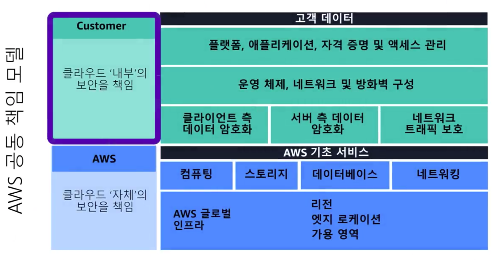
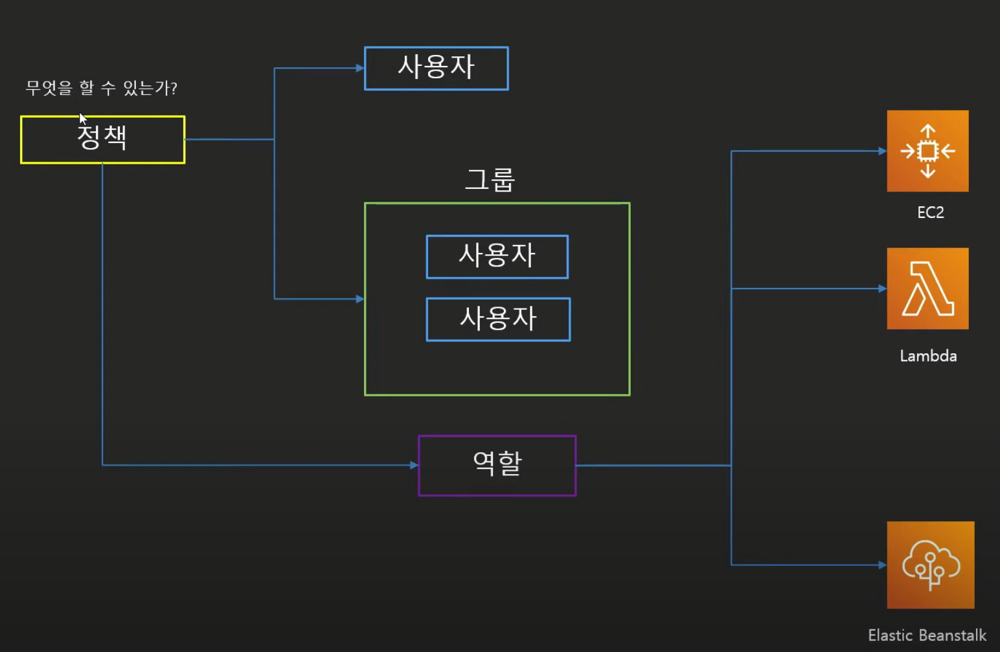
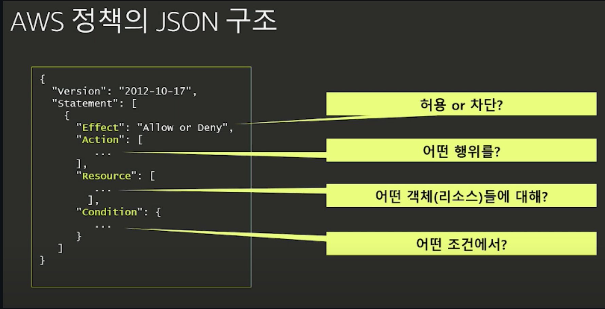
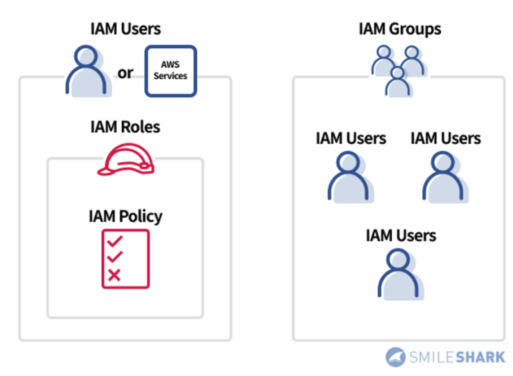
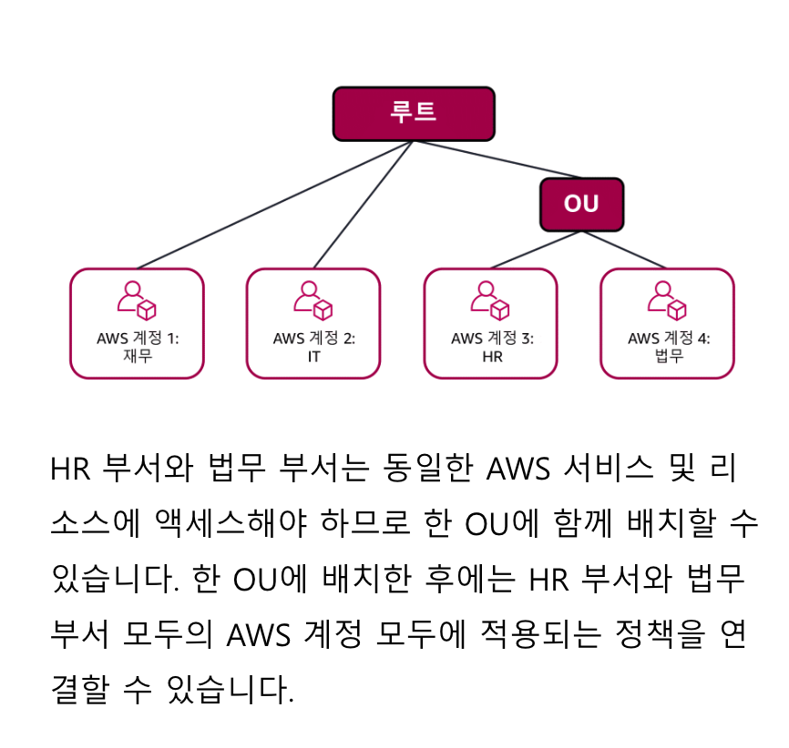

# 보안

## 공동 책임 모델



AWS에서 `비즈니스 보안`을 다룰때는 다음과 같은 질문을 해야 한다.  
`보안의 최종 책임자`는 누구인가?  

책임자는 A: `고객`인가?  
아니면 B: `AWS`인가?

- `보안 유지`는 `고객`, `AWS` `모두의 책임`
- `공동 책임 모델`
  - `클라우드`의 `보안 책임`
    - 컴퓨팅, 스토리지, 네트워킹, 데이터베이스
    - 리전(Region), 가용 영역(AZ), 엣지 로케이션(Edge Location)
  - `고객`의 `보안 책임`
    - 운영체제(OS), 네트워크/방화벽 구성
    - 클라이언트, 서버 측 데이터 암호화
    - 네트워킹 트래픽 보호
    - 애플리케이션, IAM(Identity and Access Management)

## IAM(Identity and Access Management)



> 사용자, 사용자 그룹, 역할, 정책  
> 정책(Policy) ==> attach to 사용자  
> 정책(Policy) ==> attach to 사용자 그룹  
> 정책(Policy) ==> attach to 역할(역할을 AWS 서비스에 붙는다)  
>
> [IAM 기초 참고 링크](https://github.com/ym1085/TIL-Category/blob/master/AWS/iam_basic/README.md)

- `AWS 계정 생성 시` `루트 사용자 자격`이 `부여`
  - `루트 계정`은 `관리자 권한`
  - `루트 계정`은 `모든 리소스 제어 가능`
  - `루트 계정`은 `무적`이기에 `MFA`(Multi-factor authentication) `활성화 필요`
  - 루트 계정 사용하는 것은 위험, IAM 사용자 쓰는게 좋음
- `IAM`(Identity and Access Management) `사용` -> `세부 리소스 제어 가능`
  - `루트 사용자`는 `IAM 사용자 생성 가능`
  - `최초 IAM 사용자`는 `아무 권한 없음`
  - `최초 IAM 사용자`는 `로그인도 불가능`
- 최소 권한의 원칙 적용
  - 사용자에게 `필요한 엑세스만 부여`

### IAM Policy 예시



```json
{
    "Version": "2012-10-17",
    "Statement": {
        "Effect": "Allow",
        "Action": "s3:ListBucket",
        "Resource": "arn:aws:s3:::coffee_shop_reports"
    }
}
```

> 특정 리소스(Resource)에 대해 어떤 행위(Action)를 제한 혹은 허용(Effect)한다  
> 조건(Condition)은 부가적인 Optional이다

- Version: AWS 정책 버전
- Statement
  - Effect: [허용 or 차단?] Allow, Deny만 존재
  - Action: [어떤 행위?] AWS API 호출
  - Resource: [어떤 리소스?] 특정 API 호출이 필요한 AWS 리소스 나열
  - Condition: [어떤 조건?] 조건 걸어줌

### IAM 그룹(User Group)



> 이미지 참고 링크 : <https://www.smileshark.kr/post/aws-iam-for-beginners-part-1>

- 다수의 사용자(User)가 모여있는 그룹(User Group)
- 해당 그룹에 포함되어 있는 사용자는 동일한 권한을 갖는다
- ex) 개발팀, 운영팀, 보안팀 등으로 그룹 생성 가능

### 역할(Role)

> 역할(Role)이라 하는 것은 스파이더맨, 슈퍼맨, 울버린 으로 잠시 변할 수 있는 마법이 있다 가정하자.  
> 내가 여기서 스파이더맨으로 잠시 변하게 된다면, 손목에서 거미줄을 쏠 수 있고 벽을 탈수고 있을 것이다.  
> 이런것처럼 역할은 일시적으로 그런 포지션(역할?)이 되어 능력을 발휘하는 것과 동일한다.

- `역할`(`Role`)은 `AWS 리소스 or 사용자에게 부여`되며, `무엇을 할 수 있는지 정의`
- `역할`(`Role`)은 `일시적인` `임시 권한 부여 가능`
  - `AWS 리소스`가 역할을 부여(Assume)받아 사용 가능
  - `AWS 사용자`가 역할을 부여(Assume)받아 사용 가능

## AWS Organization

AWS Cloud를 처음 사용하면 대부분 하나의 AWS 계정으로 시작한다.  
또한 해당 계정 안에 모든 리소스(EC2, RDS)가 존재한다.

하지만 이런 계정들이 수도없이 많아지면 점점 관리가 힘들어진다.  
AWS는 `"중앙 집중식 관리"`를 통해 `AWS의 모든 계정을 관리`할 수 있는 `Organization 서비스`를 제공한다.

`AWS Organization`은 `특정 AWS 계정`에서 `특정 작업을 수행`하는 `사람`을 `지정`하는 방법 중 하나다.  
AWS Organization이 제공하는 특징은 아래 4가지가 존재한다.

1. `모든 AWS 계정`을 `중앙 집중식 관리`를 통해 관리
2. `모든 AWS 계정`의 `결제 제어`, `엑세스`, `규정 준수`, `보안` 등 관리
3. `모든 AWS 계정`의 `통합 결제` 가능(할인 들어감)
4. `모든 AWS 계정`의 `계층적 그룹화` 가능(조직도 생각)

`조직`을 생성하면 AWS Organization는 `모든 계정`에 대한 `상위 컨테이너 루트`를 `자동`으로 `생성`한다.  
또한 Organization에서는 `서비스 제어 정책`(`SCP`)을 통해 모든 계정을 관리한다.

> 서비스 제어 정책(SCP)은 IAM의 정책(Policy)과 유사하게 이해해도 괜찮음

```json
{
  "Version": "2012-10-17",
  "Statement": [
    {
      "Effect": "Allow",
      "Action": [
        "s3:GetObject",
        "s3:ListBucket"
      ],
      "Resource": "*"
    },
    {
      "Effect": "Deny",
      "Action": "s3:*",
      "Resource": "*"
    }
  ]
}
```

서비스 제어 정책(SCP)를 사용하면 `각 계정`(aws account)의 `사용자` 및 `역할`이 `엑세스` 할 수 있는,  
`AWS 서비스`, `개별 API 작업` `제한`이 가능해진다.

### 조직 단위 OU?



조직 단위 OU는 여러 AWS 계정(account)를 그룹화 하기 위한 개념으로써,  
사용자 그룹처럼 그룹 안에 포함되어 동일한 권한과 제어를 상속하게 된다.

## 규정 준수

`모든 산업`에는 반드시 `준수`해야 하는 `구체적인 표준`이 `존재`한다.  
또한 `감사`를 통해 `표준`에 `충족` 되는지 여부를 확인 한다.

- AWS Artifact: 다양한 규정 준수 보고서 확인 가능

## 서비스 거부 공격

### DDOS(분산 서비스 거부 공격)

> 분산 서비스 거부 공격

DDOS는 공격 목표가 작동하지 않을때까지 시스템에 과부하를 걸어서 Application을 정지시키는 공격을 의미한다.  
해커는 좀비 로봇을 만들어서 서비스의 대량 요청 공격을 진행한다.

### UDP FLOOD

> 기상청과 같은 대량 데이터를 기반으로 공격

UDP FLOOD는 기상청과 같은 대량 데이터를 기반으로 공격한다.  
해커는 기상청에 데이터를 요청하고 수신자를 특정 서버 주소로 지정한다.  
이렇게 되면 모든 응답이 해당 서버로 가게되고 서버는 터지게 된다.  
이러한 부분은 AWS의 `보안 그룹`으로 커버 가능.

### HTTP 수준 공격

> HTTP 요청을 지속적으로 공격

HTTP 수준 공격은 좀비 로봇 여러대가 일반적인 요청을 지속적으로 보내는 것을 의미.  
좀비 로봇에 의해 사용자는 웹 사이트 접근조차 불가능.

### SLOWLORIS 공격

> 커피 맨 앞 사람이 주문을 10분간 지속한다..

SLOWLORIS 공격은 요청자가 응답이 느린것처럼 속이는 행위다.  
이로 인해 다음 요청에 대해 응답을 하지 못하는 공격이다.  
AWS에서는 `ELB`를 통해 커버 가능.

### AWS WAF

- AWS WAF는 `웹 애플리케이션 방화벽`을 `사용`하고, `수신 트래픽`을 `필터링`하여 `해커의 서명`을 찾는다
- SQL Injection, XSS 등 방어

### AWS Shield

AWS Shield는 DDOs 공격을 방지하기 위한 AWS 서비스이다.  
`AWS Shield`는 `Standard[무료]`, `Advanced[유료]`로 구분된다.

## 추가 보안 서비스

### AWS Key Management Service(AWS KMS)

`AWS KMS`(Key Management Service)를 사용하면 `암호화 키`를 사용하여 `암호화 작업 수행`을 할 수 있다.  
`암호화 키`는 `데이터 암호화`(잠금) 및 `데이터 복호화`(잠금 해제)에 사용되는 `임의의 숫자 문자열`이다.  

`AWS KMS`(Key Management Service)를 사용하면 `암호화 키`를 `생성` 및 `관리` 가능.  
또한 `다양한 서비스`에서의 `키 사용`을 `제어` 할 수 있다.

### AWS Inspector

`AWS Inspector`는 `EC2` or `ECR 이미지`에 대한 `자동 보안 평가`를 진행한다.  

### AWS GuardDuty

`AWS GuardDuty`는 지속적으로 `이상 탐지` 및 `분석`을 진행한다.  
대표적으로 `AWS CloudTrail 이벤트`, `AWS VPC Flow Logs`, `DNS 로그에서 발생한 네트워크 활동 분석`.  
다양한 리소스에서 이상 탐지 및 분석을 진행한다.

### WAF

AWS `WAF`는 네트워크 요청에 대한 `애플리케이션 방화벽`이다.  
AWS `WAF`는 `CloudFront` or `ELB`와 `함께 작동`되며 `웹 엑세스 제어 목록`(ACL)을 사용한다.

## 99. 참고 자료

- [[AWS] AWS IAM 초보자 가이드: 10분 안에 마스터하는 핵심 개념(1/2)](https://www.smileshark.kr/post/aws-iam-for-beginners-part-1)
