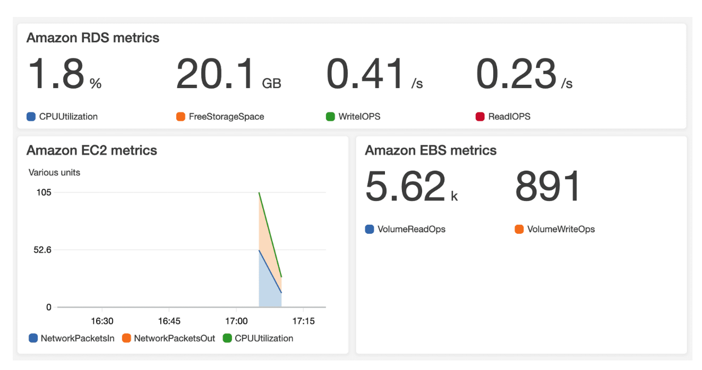
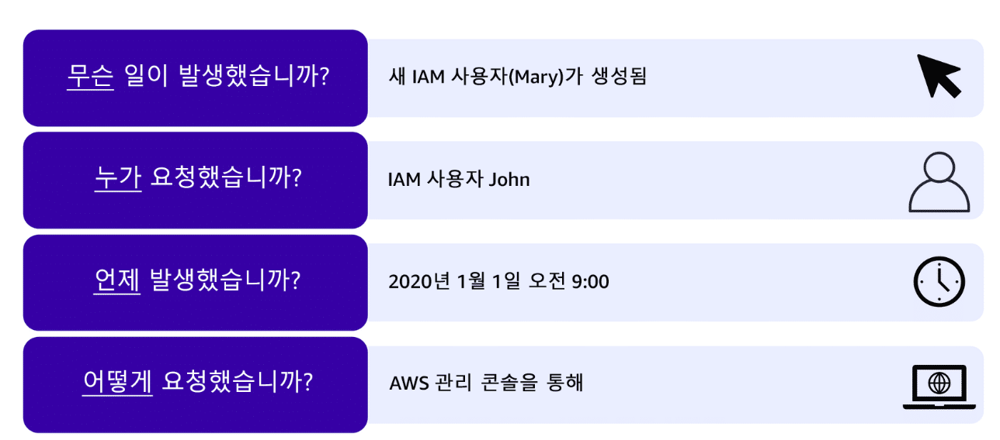
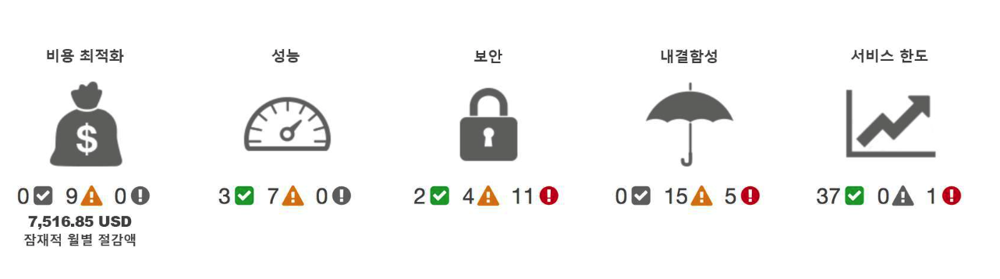

# 모니터링 및 분석

> Cloudwatch, CloudTrail, AWS Trusted Advisor

## Amazon CloudWatch

- Amazon CloudWatch
  - `다양한 지표`를 `모니터링` 및 `관리`하는 `웹 서비스`이다
  - `해당 지표를 기반`으로 `경보 시스템을 구축 가능`
  - `지표`를 `사용`하여 `리소스의 데이터 포인트`를 나타낸다
- AWS 서비스 -> 지표 전달 -> Cloudwatch
  - AWS 서비스가 Cloudwatch에게 지표를 전달하고, Cloudwatch는 해당 지표를 통해 그래프를 작성한다

### Amazon Cloudwatch 경보

- `지표`에 따른 `경보 생성이 가능`하다
  - ex) 개발자가 테스트 EC2를 종료하지 않은 경우, 경보를 통해 해당 EC2 종료도 가능하다
- 이러한 `경보`는 `Amazon SNS`와 통합이 된다
- `대시보드` 제공을 통해 `그래프 생성` 가능

> Cloudwatch를 사용하는 이점?

- 전반적인 `애플리케이션의 리소스 상태`에 대해 한눈에 `인사이트`를 얻을 수 있는 장점 존재
- 위에서 말했다시피 경보 시스템 도입을 통해 24/7 서비스 운영 가능
- MTTR(Mean Time to Repair) `평균 복구 시간` 절감
- TTO(Total Cost to Ownership) `총 소유 비용` 개선

## Amazon CloudTrail

> CloudTrail : API 감사 도구  
> AWS 상에서 어떤 리소스(AWS Management Console, AWS SDK, CLI 등)를 통해 API가 호출되는지 감사

- `AWS CloudTrail`은 AWS 계정(account)에서 발생한 모든 API 요청에 대한 자동 추적을 제공하는 API 감사 서비스
  - AWS 계정(account)에서 발생하는 모든 API 요청은 CloudTrail 엔진에 저장됨
- AWS CloudTrail의 기록 정보는 아래와 같음
  - API 호출자의 ID
  - API 호출자의 소스 IP
  - API 호출 시간
- AWS CloudTrail의 이벤트의 경우 API 호출 후 15분 이내에 업데이트 된다

> ✅ 정리하자면 API 요청에 대해 원래 추적할 방법이 없는데,  
> AWS에서는 아래와 같이 CloudTrail을 통해 추적을 해준다는 부분이다.

- 위 사진과 같이 API 호출에 대한 추적 가능

### AWS CloudTrail Insights

> API 호출에 대한 자동 추적 제공

- `CloudTrail`에서 `CloudTrail Insights` `활성화 가능`
- `해당 옵션 사용 시` `CloudTrail`이 `AWS 계정의 비정상적인 API 활동 자동 감지 가능`

## AWS Trusted Advisor

> 사업을 운영하다보면 외부(컨설턴트)의 자문을 구할 수 있다.  
> 이러한 컨설턴트 비용은 상당히 비싼 경우가 많으며, 피드백을 통해 좋은 방향성을 정할 수 있다.  
> 이렇듯 AWS에서는 Trusted Advisor를 통해 비용, 보안, 리소스 최적화 등에 대한 권장사항을 제공해준다.

- `AWS 환경`을 `검사`하고 AWS 모범 사례에 따라 실시간 권장사항을 제공하는 서비스
- `비용`, `성능`, `보안`, `내결함성`, `서비스 한도` `5개 범주`에서 모범 사례 제공
- `일부 무료`, 다른 부분은 `Support 수준에 따라 달라짐`

## 99. 참고 자료

- [[AWS] 모듈 7 소개](https://explore.skillbuilder.aws/learn/course/13522/play/107682/aws-cloud-practitioner-essentials-korean-na-hangug-eo-gang-ui)