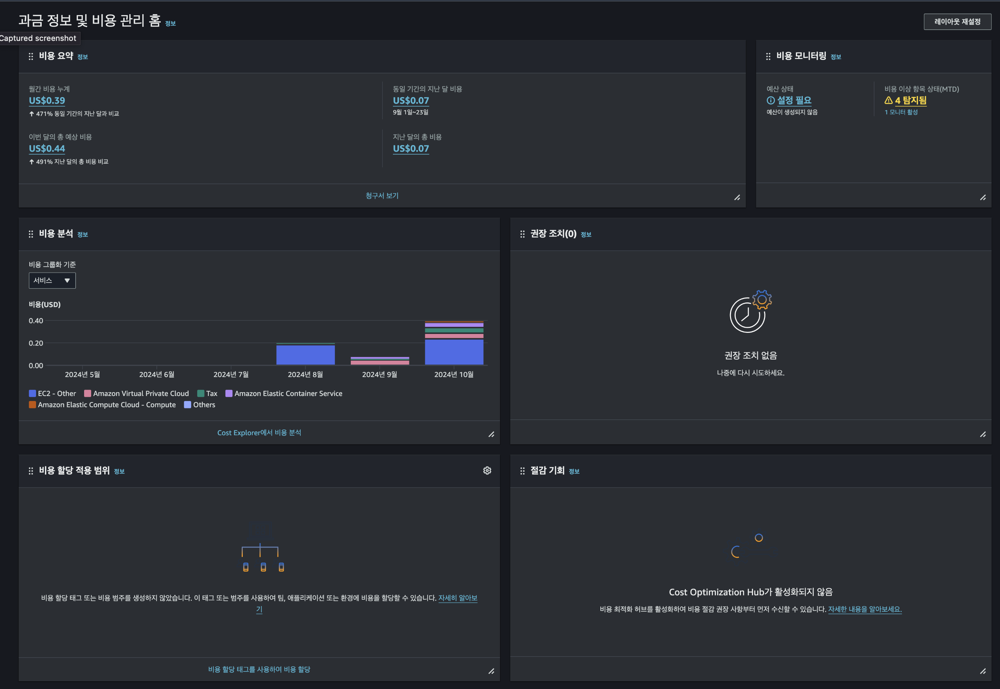
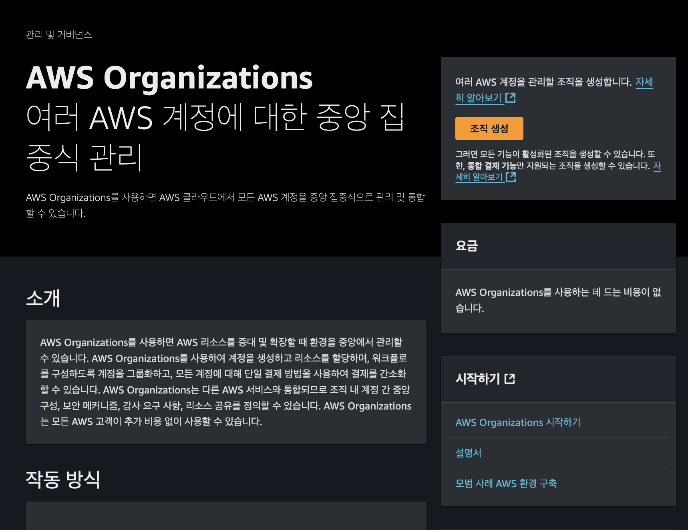

# 모듈8: 요금 및 지원

## AWS 프리티어

- AWS 프리티어를 통해 비용 없이 서비스 사용 가능
  - `상시 무료`: 모든 AWS 고객에게 `특정 서비스`를 `무료 제공`
  - `12개월 무료`: 처음 `가입한 시점`부터 `12개월 서비스 사용 가능`
  - `평가판`: `일부 서비스`에서 `단기 평가판 제공`
- AWS Lambda
  - 매월 `100만건 무료 호출 허용`
- AWS S3
  - 최대 `5GB`까지 `12개월 무료 사용 가능`, 이후 유료
- Lightsail
  - 최대 `750시간` `1개월 평가판` 제공

## AWS 요금 개념

> AWS는 `종량제 요금`으로 서비스 제공  
> AWS 요금 계산기를 사용하면 AWS 특정 서비스의 비용을 미리 예측 할 수 있다.  
> CPU, Mem 등등 입력 후 비용 예측 - https://calculator.aws/#/

- `실제 사용한 만큼만 지불`
  - 서비스에서 실제 사용한 양만 지불
- `예약하는 경우 비용 감소`
  - 예약 인스턴스, 스팟 인스턴스
  - 온디멘드 요금에 비해 72% 절약 가능
- `많이 사용`할수록 `할인 적용`되어 `비용 감소`
- `AWS Lambda`
  - `함수 요청 수`와 `함수 호출 시간`에 따라 `요금 청구`
  - AWS Lambda는 매월 100만건, 320만 초의 컴퓨팅 시간 사용 가능
- `AWS EC2`
  - AWS EC2 사용 시 `EC2가 실행되는 동안의 비용 지불`
  - `스팟 인스턴스` 사용을 통해 `비용 절감 가능`
  - `Saving Plan`, `예약 인스턴스`를 통해 `비용 추가 절감 가능`
- `AWS S3`
  - 스토리지: 저장한 데이터 크기, 스토리지 클래스, 저장 기간에 따라요금 부과
  - 데이터 검색: 조회 요청 시 요금 발생
  - 데이터 전송: 동일 리전 내 무료, 외부 전송 시 요금 부과

## 결제 대시보드

- `AWS 계정`의 `결제 정보 확인` 시 `결제 대시보드 사용`
- 이미지 참고하면 될 것으로 보임

## 통합 결제

- `AWS Organization 기능`을 사용하면, `AWS`에 `존재`하는 `모든 계정`을 `중앙`에서 `통합 관리 가능`
- AWS Organization은 위 기능뿐만 아니라, 모든 AWS 계정에서 발생하는 비용을 중앙에서 관리하는 기능 제공
  - `AWS Organization`의 `통합 결제` 기능 사용
    - `조직의 모든 AWS 계정`에 대한 `단일 청구서`를 받을 수 있음
      - 청구 프로세스 간소화
    - `조직`에서 `허용`되는 `최대 계정 수`는 `4개`지만, AWS Support 문의를 통해 할당량 증설 가능
    - `조직 계정 전체`에서 `대량 할인 요금`, `Savings Plans`, `예약 인스턴스` `공유 가능`
      - 계정 간 절감 효과 공유

## AWS Budgets(예산)

- `AWS Budgets`을 `생성`하여 `서비스 사용`, `서비스 비용`, `인스턴스 예약`을 `계획`할 수 있다
- `AWS Budgets`은 하루 `3번` `업데이트` 되며, `사용량`이 `예산 금액` 또는 `프리티어 한도`에 `얼마나 근접한진 파악 가능`
- `AWS Budgets`은 `사용량`이 `예산 금액을 초과`하면, `사용자 지정 알림` 설정 가능

## AWS Cost Explore

- `AWS Cost Explore`는 `시간 경과`에 따라 AWS `비용` 및 `사용량`을 `시각화`해주는 도구
  - `12개월 과거 데이터`를 `제공`하기에 `시간`에 따른 `비용 추적 가능`
  - `사용자 지정 보고서` 작성 가능

## AWS Support 플랜

> Basic, Developer, Business, Enterprise 4가지 Support 제공

- `모든 고객`에게 `AWS Basic Support` 지원(`무료`)
  - 24/7 고객 서비스
  - 설명서, 백서, 지원 포럼
  - AWS Trusted Advisor (기본 기능 제공)
  - AWS Personal Health Dashboard 사용 가능
- `Developer Support`
  - Basic Support 수준의 모든 지원 포함
  - 이메일 고객 지원, `24시간` 이내 응답
  - 시스템 장애 시, `12시간` 이내 응답
  - 시스템 다운 시, `별도 응답 없음`
- `Business Support`
  - Basic Support + Developer Support 포함
  - AWS Trusted Advisor 전체 모범 사례 검사 제공
  - 클라우드 `SAA`와 `직접 통화 가능`
  - 시스템 장애 시, `4시간 이내` 응답
  - 시스템 다운 시, `1시간 이내` 응답
- `Enterprise Support`
  - Basic, Developer, Business 포함
  - 전담 TAM(Technial Account Manager) 지원
  - 시스템 장애 시, `1시간 이내` 응답
  - 시스템 다운 시, `15분 이내` 응답

## AWS Marketplace

- AWS `Marketplace`는 `AWS 아키텍처`에서 `실행`되는 `타사 S/W`를 `검색` 및 `관리` 해주는 기능
- `고객`이 `Marketplace`에서 제공하는 `타사 APP을 실행`하는데 `필요한 기본 인프라를 원클릭 배포`로 제공