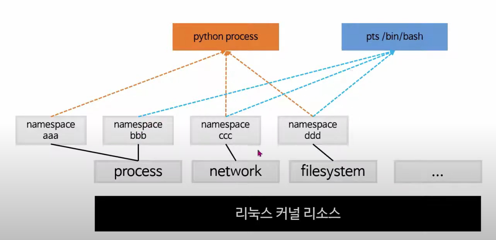
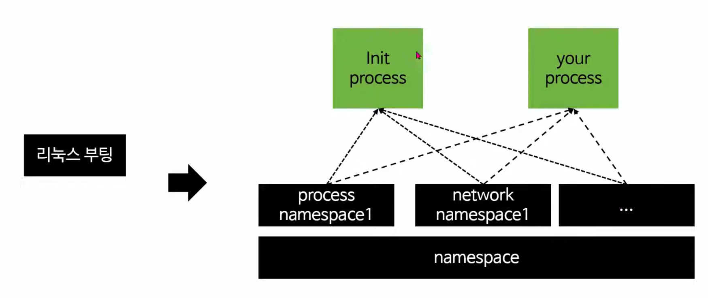
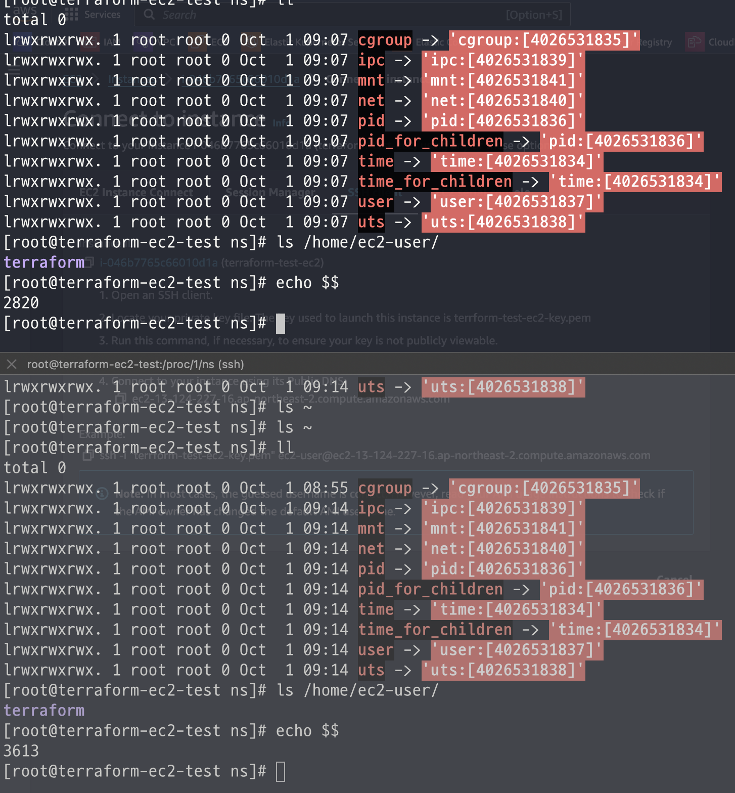
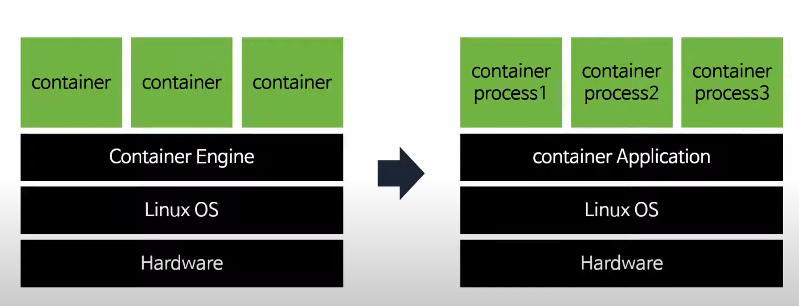
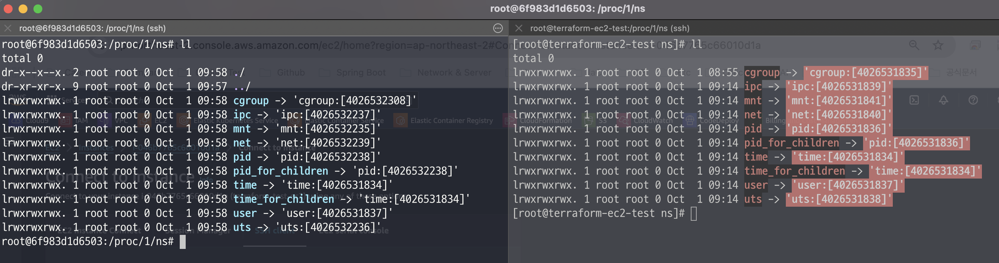
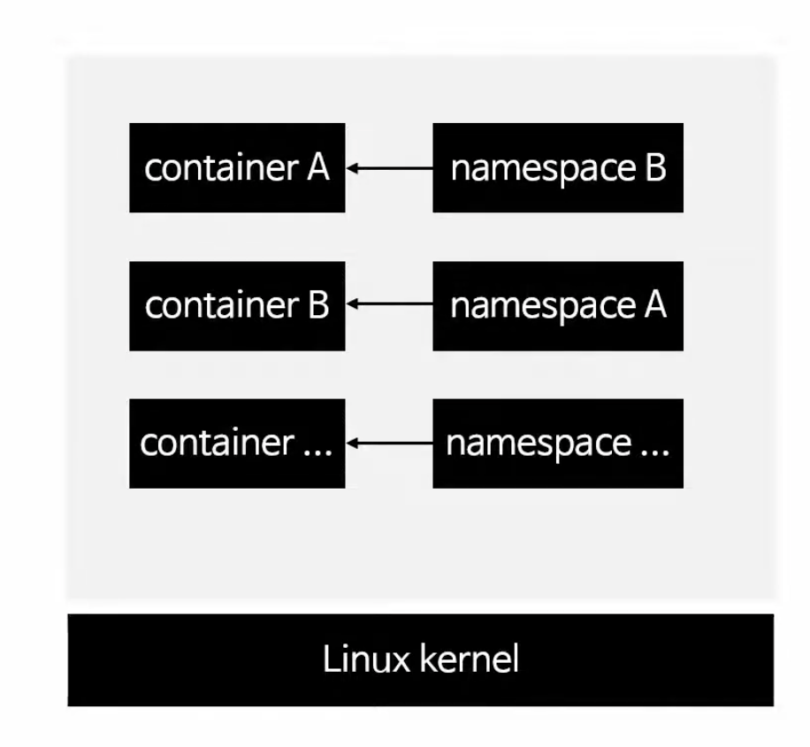
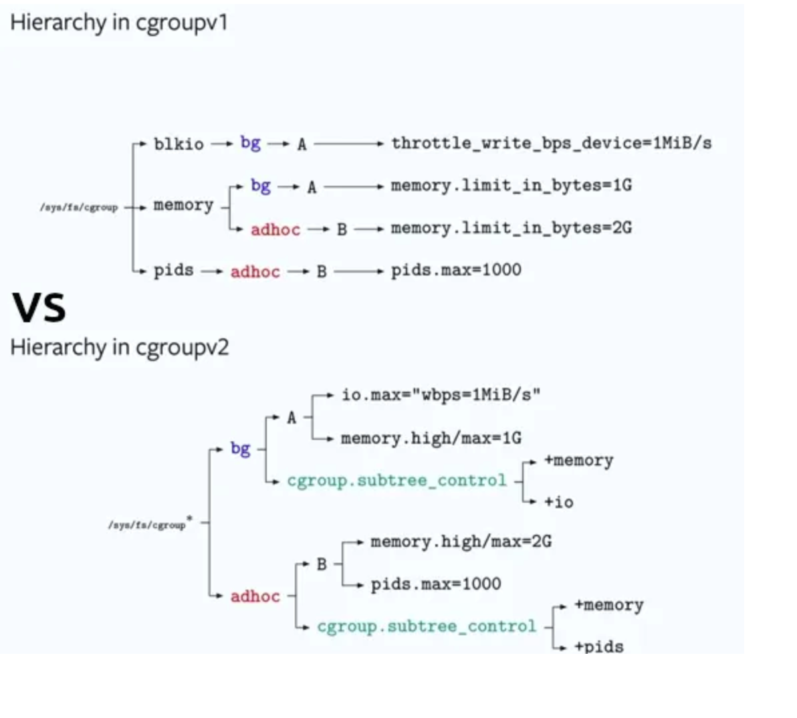

# Linux namespace, cgroup 정리

> Linux의 namespace와 cgroup은 커널의 기능이다. 커널의 기능에 대해 깊게 아는것은 당장은 힘들지만, 2개의 기능(namespace, cgroup)이 어떤 개념과 원리로 사용되는지 간략히 정리해본다.

## namespace(자원 격리)

`VM`(Virtual Machine)에서는 `각 Guest 머신`(Guest OS)별로 `독립적인 공간`이 `제공`된다.  
이로 인해 `Guest 머신 끼리` `서로 충돌하지 않는 기능`을 `제공`된다.



`리눅스`에서 `이와 동일한 역할`을 하는 `namespace` 기능이 `커널`에 `내장`되어 있다.  
`namespace`는 `리눅스 커널의 리소스`를 `논리적`으로 `분리`하는 `역할`을 한다.

- namespace aaa는 process에 포함
- namespace bbb도 process에 포함
- namespace ccc는 network에 포함
- namespace ddd는 filesystem에 포함
  - Python + /bin/bash 도 각각 namespace에 맞춰서 포함됨



`리눅스`가 `부팅`이 되면 `여러 namespace`가 `생성`이 된다.  
`제일 처음 실행`되는 `init process`가 `생성 된 namespace`와 `연결`이 된다.  
또한 우리가 `실행`하는 `프로세스는` `init 프로세스와 연결된 namespace를 같이 사용`한다.

### 리눅스 커널 namespace 종류

> `리눅스 커널`에서는 `아래 6가지 namespace`를 지원한다.

| 네임스페이스 종류     | 설명                                                                 |
|-----------------------|----------------------------------------------------------------------|
| mnt(파일시스템 마운트) | 호스트 파일시스템에 구애받지 않고 독립적으로 파일시스템 `마운트` or `언마운트` |
| pid(프로세스)          | 독립적인 프로세스 공간 할당                                          |
| net(네트워크)          | namespace 간 네트워크 충돌 방지 (중복 포트 바인딩 등)                |
| ipc(SystemV IPC)       | 프로세스 간 독립적인 통신 통로 할당                                  |
| uts(hostname)          | 독립적인 hostname 할당                                               |
| user(UID)              | 독립적인 사용자 할당                                                 |

### namespace 테스트

```shell
# 현재 bash shell의 PID 확인
$ echo $$
2820
```

- 현재 프로세스의 PID는 `2820`를 갖는다
- 다음으로 해당 PID의 namespace를 찾기 위해 /proc/2820 경로로 이동하자

```shell
# 프로세스 정보를 가지고 있는 DIR로 이동
# cd /proc/2820 임
$ cd /proc/$$
```

```shell
# 해당 프로세스에 대한 정보를 아래와 같이 전부 확인 가능
$ ls
arch_status  clear_refs       cwd      gid_map   map_files  mountstats  oom_score      projid_map  setgroups     statm           timers
attr         cmdline          environ  io        maps       net         oom_score_adj  root        smaps         status          timerslack_ns
autogroup    comm             exe      latency   mem        ns          pagemap        sched       smaps_rollup  syscall         uid_map
auxv         coredump_filter  fd       limits    mountinfo  numa_maps   patch_state    schedstat   stack         task            wchan
cgroup       cpuset           fdinfo   loginuid  mounts     oom_adj     personality    sessionid   stat          timens_offsets
```

```shell
# namespace dir로 이동
$ cd ns
$ ll
total 0
lrwxrwxrwx. 1 root root 0 Oct  1 09:07 cgroup -> 'cgroup:[4026531835]'
lrwxrwxrwx. 1 root root 0 Oct  1 09:07 ipc -> 'ipc:[4026531839]'
lrwxrwxrwx. 1 root root 0 Oct  1 09:07 mnt -> 'mnt:[4026531841]'
lrwxrwxrwx. 1 root root 0 Oct  1 09:07 net -> 'net:[4026531840]'
lrwxrwxrwx. 1 root root 0 Oct  1 09:07 pid -> 'pid:[4026531836]'
lrwxrwxrwx. 1 root root 0 Oct  1 09:07 pid_for_children -> 'pid:[4026531836]'
lrwxrwxrwx. 1 root root 0 Oct  1 09:07 time -> 'time:[4026531834]'
lrwxrwxrwx. 1 root root 0 Oct  1 09:07 time_for_children -> 'time:[4026531834]'
lrwxrwxrwx. 1 root root 0 Oct  1 09:07 user -> 'user:[4026531837]'
lrwxrwxrwx. 1 root root 0 Oct  1 09:07 uts -> 'uts:[4026531838]'
```

`위 경로`에서 `namespace 관련 정보`를 확인이 가능하다.  
해당 PID(2820)에 매핑된 namespace의 ID[4026531835, 4026531839..]를 확인할 수 있는데,  
그렇다면 init process와 동일한 namespace를 쓰는건 맞는지 확인 해보자.

```shell
# 관리자 전환
$ sudo su
```

```shell
# init process의 namespace 경로로 이동
$ cd /proc/1/ns
```

```shell
# init process의 namespace 확인
$ ll
total 0
lrwxrwxrwx. 1 root root 0 Oct  1 08:55 cgroup -> 'cgroup:[4026531835]'
lrwxrwxrwx. 1 root root 0 Oct  1 09:14 ipc -> 'ipc:[4026531839]'
lrwxrwxrwx. 1 root root 0 Oct  1 09:14 mnt -> 'mnt:[4026531841]'
lrwxrwxrwx. 1 root root 0 Oct  1 09:14 net -> 'net:[4026531840]'
lrwxrwxrwx. 1 root root 0 Oct  1 09:14 pid -> 'pid:[4026531836]'
lrwxrwxrwx. 1 root root 0 Oct  1 09:14 pid_for_children -> 'pid:[4026531836]'
lrwxrwxrwx. 1 root root 0 Oct  1 09:14 time -> 'time:[4026531834]'
lrwxrwxrwx. 1 root root 0 Oct  1 09:14 time_for_children -> 'time:[4026531834]'
lrwxrwxrwx. 1 root root 0 Oct  1 09:14 user -> 'user:[4026531837]'
lrwxrwxrwx. 1 root root 0 Oct  1 09:14 uts -> 'uts:[4026531838]'
```

init process의 ns를 확인한 결과 이전 Bash의 PID와 동일한 namespace ID 사용중이다.  
여기서 `중요`한건 `"같은 namespace를 쓰는건 같은 리소스를 사용"` 한다는 점을 알아야 한다.  
즉, `서로 같은 파일`, `네트워크`, `프로세스 정보`에 `접근 가능`.

```shell
$ ls /home/ec2-user
terraform
```



2개의 터미널 창에서 위 명령어를 치면 동일한 내용을 출력 된다.  
이게 가능한 이유는 2개의 프로세스가 동일한 namespace(filesystem + PID)를 공유하기 때문이다.

> 💡 이번 장에서 가장 중요한 키워드

- 1) (중요) `Docker`는 `init process`의 `namespace를 사용하지 않는다`
- 2) (중요) `Docker 컨테이너`는 `리눅스`의 `프로세스`라는 점이다



- 1) 컨테이너 엔진 관점
  - H/W > 리눅스 OS > Docker Engine > Container가 존재
- 2) Linux OS 입장 관점
  - H/W > 리눅스 OS > container application(이거를 Linux는 1개의 process<PID>로 바라본다) > container process 1 + process 2 + process 3
  - Linux OS 입장에서는 Container Application 1개 떠있는거임
  - 그 Container Application process를 만들어서 관리하는걸로 본다

> EC2 > Docker Ubuntu container 구동 후 sleep 테스트

```shell
root@bdad3d9d3376:/# sleep 10000 &
[1] 10

root@bdad3d9d3376:/# ps
    PID TTY          TIME CMD
      1 pts/0    00:00:00 bash
     10 pts/0    00:00:00 sleep
     11 pts/0    00:00:00 ps
```

- `EC2 서버`에서 `Ubuntu Container 구동` 후 `sleep 함수 실행`
- 그렇다면 위 sleep 프로세스는 누가 관리를 하게 될까?
  - (중요) `위 프로세스`는 `해당 컨테이너를 구동한 Linux에서 관리`한다
  - (중요) 위에서 말했다시피 `Docker Container`는 `Linux의 프로세스`(process)이기 때문이다

### Docker Container의 namespace?

결과적으로 `Docker Container`는 `init process`의 `namespace`를 `사용하지 않는다`.  
`Docker Container Engine`이 `namespace` `생성 후` `docker container에 연결`한다.



각 서버에서 /proc/1/ns 경로로 이동한 후의 사진이며, namespace가 다르다는 것을 확인할 수 있다.  
결국 `이러한 부분`은 호스트 시스템과 Docker의 namespace는 `논리적으로 다른 자원을 사용`한다 봐야 한다.

### 정리



정리하면 `컨테이너 자체`는 `Linux 프로세스`이고 `같은 리눅스 커널`에서 돌아간다.  
이걸 분리 시킨 개념은 `리눅스 namespace를 개별적으로 같게`해서 `마치 자기만의 Linux 리소스를 가진 것처럼 착각을 만들게 할 수 있다`.

아래와 같이 `다른 ns를 가진것도 있고 같은 ns를 가진 부분도 존재`한다.

```shell
# 1번째 ubuntu container
root@43c4234ae89c:/proc/1/ns# ls -l
total 0
lrwxrwxrwx. 1 root root 0 Oct  1 10:22 cgroup -> 'cgroup:[4026532308]'
lrwxrwxrwx. 1 root root 0 Oct  1 10:22 ipc -> 'ipc:[4026532237]'
lrwxrwxrwx. 1 root root 0 Oct  1 10:22 mnt -> 'mnt:[4026532235]'
lrwxrwxrwx. 1 root root 0 Oct  1 10:22 net -> 'net:[4026532239]'
lrwxrwxrwx. 1 root root 0 Oct  1 10:22 pid -> 'pid:[4026532238]'
lrwxrwxrwx. 1 root root 0 Oct  1 10:22 pid_for_children -> 'pid:[4026532238]'
lrwxrwxrwx. 1 root root 0 Oct  1 10:22 time -> 'time:[4026531834]'
lrwxrwxrwx. 1 root root 0 Oct  1 10:22 time_for_children -> 'time:[4026531834]'
lrwxrwxrwx. 1 root root 0 Oct  1 10:22 user -> 'user:[4026531837]'
lrwxrwxrwx. 1 root root 0 Oct  1 10:22 uts -> 'uts:[4026532236]'
```

```shell
# 2번째 ubuntu container
root@e5a41f1ef391:/proc/1/ns# ls -l
total 0
lrwxrwxrwx. 1 root root 0 Oct  1 10:22 cgroup -> 'cgroup:[4026532383]'
lrwxrwxrwx. 1 root root 0 Oct  1 10:22 ipc -> 'ipc:[4026532312]'
lrwxrwxrwx. 1 root root 0 Oct  1 10:22 mnt -> 'mnt:[4026532310]'
lrwxrwxrwx. 1 root root 0 Oct  1 10:22 net -> 'net:[4026532314]'
lrwxrwxrwx. 1 root root 0 Oct  1 10:22 pid -> 'pid:[4026532313]'
lrwxrwxrwx. 1 root root 0 Oct  1 10:22 pid_for_children -> 'pid:[4026532313]'
lrwxrwxrwx. 1 root root 0 Oct  1 10:22 time -> 'time:[4026531834]'
lrwxrwxrwx. 1 root root 0 Oct  1 10:22 time_for_children -> 'time:[4026531834]'
lrwxrwxrwx. 1 root root 0 Oct  1 10:22 user -> 'user:[4026531837]'
lrwxrwxrwx. 1 root root 0 Oct  1 10:22 uts -> 'uts:[4026532311]'
```

## cgroups(Control Groups)

`cgroups`(Control Groups)은 `리소스`(resources) `제어를` 수행하는 `커널`의 `기능`이다.  
`컨테이너 기술`은 `namespace`를 통해 `자원을 격리`하고, `해당 프로세스가 사용하는 자원`은 `cgroups`를 통해 `제어`한다.  
cgroups(Control Groups)은 아래 리소스 제어가 가능하다.

- CPU
- Mem
- I/O
- Network
- device 노드(/dev/)

## cgroup 서브 시스템

| **서브시스템** | **설명**                                                                                          |
| -------------- | ------------------------------------------------------------------------------------------------- |
| **CPU**        | - CPU 사용량 제어 <br> - 각 그룹에 CPU 시간 할당                                                    |
| **cpuacct**    | - CPU 사용량 모니터링 <br> - 각 그룹의 CPU 사용량 통계 제공                                         |
| **Memory**     | - 메모리 사용량 제어 <br> - 메모리 사용량 통계 제공 <br> - OOM 시 특정 그룹 프로세스 종료 가능        |
| **blkio**      | - 블록 장치 I/O 사용량 제어 <br> - 디스크 읽기/쓰기 속도 제한                                       |
| **net_cls**    | - 네트워크 트래픽 분류 및 제어 <br> - 각 그룹에 고유 클래스 ID 할당하여 트래픽 관리                  |
| **devices**    | - 특정 장치에 대한 접근 권한 제어 <br> - 각 그룹의 장치 접근 허용 및 차단                            |
| **freezer**    | - 프로세스 일시 중단/재개 <br> - 시스템 관리 작업 중에 프로세스 중단 가능                            |
| **cpuset**     | - 개별 CPU 메모리 노드를 cgroup에 할당                                                              |
| **ns**         | - Namespace 서브시스템, 프로세스의 이름 공간 관리                                                    |

## cgroup v1 vs cgroup v2



- cgroupv1: 각 리소스별로 따로 관리한다. 예를 들어 CPU, Mem, I/O같은 자원을 각각 따로 나눠서 제어한다.
즉, CPU 그룹, 메모리 그룹처럼 자원을 기준으로 그룹을 나누는 방식을 의미한다.
- cgroupv2: 여러 자원을 하나의 그룹에서 통합적으로 관리한다. CPU, 메모리, I/O 같은 자원을
하나의 그룹에 묶어서 프로세스 단위로 관리한다. 즉, 하나의 그룹이 여러 리소스 동시 제어.

## 99. 참고 자료

- [[Docker] Docker(container)의 작동 원리: namespaces and cgroups](https://tech.ssut.me/what-even-is-a-container/)
- [[Docker] vagrant namespace github repo](https://github.com/choisungwook-vagrant/docker)
- [[Docker] 리눅스 namespace](https://www.youtube.com/watch?v=EV4LyUJrw5E&t=1089s)
- [[Linux] TLDR Understanding the new cgroups v2 API by Rami Rosen](https://medium.com/some-tldrs/tldr-understanding-the-new-control-groups-api-by-rami-rosen-980df476f633)