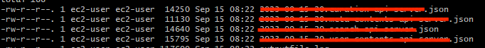

# 01. Linux 파일 삭제 후 용량 확보 안되는 경우 (feat. Logstash & Shell Script)

> shell script를 통해 EC2 서버상의 특정 경로에 있는 파일을 실시간으로 압축 후 S3로 올리는 프로세스가 존재하였다.  
> 이 때 Linux 서버상의 파일은 존재하지 않으나 디스크 사용량이 지속적으로 증가하는 이슈가 발생하였다.  
> 이러한 이슈에 대해 간단히 정리를 진행 해보자.

## 01-1. 시스템 현황


현재 ECS의 Container로 떠있는 filebeat가 마운트 경로에서 파일을 읽어서 EC2의 구동되고 있는 Logstash로 파일을 전달한다.  
후에 Logstash는 실시간으로 파일을 읽어 특정 경로에 저장 및 ES에 로그를 저장한다. 이때 정각 10분마다 shell scripts를 사용하여  
S3에 압축처리(tar.gz)된 파일을 업로드 하는 프로세스로 이어진다.

```shell
# 현재 디스크 사용률 확인
df -h
```

```shell
# Logstash가 현재 열고 있는 파일 목록을 확인
lsof -p <logstash pid>
```

```shell
# lsof를 통해 Logstash 프로세스가 열고 있는 파일 목록 출력 결과
java    5366 ec2-user  249u      REG              259,1  16230589 499129624 /mnt/data/api_logs/2023-08-23.xxx-xxx.log (deleted)
java    5366 ec2-user  250u      REG              259,1   2551649 499129625 /mnt/data/api_logs/2023-08-23.xxx-api-server.json (deleted)
java    5366 ec2-user  251u      REG              259,1    347039 499129626 /mnt/data/api_logs/2023-08-23.AAA-contents-api-server.json (deleted)
java    5366 ec2-user  252u      REG              259,1  36004587 499129627 /mnt/data/api_logs/2023-08-23.BBB-contents-api-server.log (deleted)
java    5366 ec2-user  253u      REG              259,1  28171789 499129628 /mnt/data/api_logs/2023-08-23.CCC-api-server.json (deleted)
...중략
```

10분 주기로 파일을 압축하여 S3에 올리는 프로세스 였기에 특정 경로에는 파일이 존재하지 않았다.  
하지만 당시에 디스크 용량이 `점진적으로 늘어나는 추세`를 보이고 있었다. 임시 조치로 Logstash를 재기동하여 디스크를 확보하고  
후에 Logstash 설정(conf) 그리고 shell script의 수정을 통해 이슈를 해소 하였다.

## 01-2. 문제 정의

- 플랫폼 및 도구: ECS Container(Filebeat), EC2(Logstash)
- 문제 상황: 로그스테시가 특정 로그 파일에 실시간으로 로그를 기록하고 있는 상황
- S3 로그 적재 프로세스: 10분마다 shell script가 실행되어, /mnt/data/app_logs/ 경로에서 /mnt/tmp/ 로 로그 파일을 이동 -> 후에 해당 로그 파일을 압축 후 S3 업로드
- 로그스테시가 계속 파일 핸들을 열고 있는 상태에서 배치 스크립트가 실행될 경우, (`deleted`) 표시가 나타나는 문제 발생
- 로그 파일이 이동되더라도 로그스테시는 해당 파일의 핸들을 여전히 참조하고 있어서 문제 발생

## 01-3. 방안 검토

- (`deleted`) 상태 없이 로그 파일을 안전하게 배치 스크립트로 처리하도록 시스템 구성 변경
- 로그 데이터 손실 없이 로그 처리를 실시간으로 계속 진행할 수 있는 방법 구상
  - 매 10, 20, 30, 40, 50분 마다 Logstash의 파일 핸들을 변경 한다
  - ex) 00 - 09 -> 

## 01-4. 해소 방안

1. 로그스테시의 파일 핸들을 잠시 닫게 만들고, 파일이 이동된 후에 다시 핸들을 열게 만듬
    1. 재기동이 필요하고, 정확한 타이밍에 열고 닫아야 하기에 사실상 불가능
2. s3_file_upload 배치 주기마다 로그스테쉬에서 새로운 파일에 로그를 저장, 배치에서는 이전 파일 로그를 사용
3. 로그스테쉬 재기동하는 배치를 실행

## 01-5. Logstash 설정 수정

```shell
# 로그스태시 설정 파일 확인
vi /home/ec2-user/apps/logstash/logstash.conf
```

```shell
# AS-IS Logstash Configuration 형상
input {
  beats {
    port => 5044
    host => "0.0.0.0"
  }
}

filter {
  # ..중략

  # 로그 파일을 현재 날짜로 설정, 해당 날짜를 기반으로 실제 파일을 쓴다
  ruby {
    code => "
      event.set('[@metadata][date]', event.timestamp.time.localtime.strftime('%Y-%m-%d'))
    "
  }
}

output {
  # ..중략

  if [@metadata][type] == "xxx_xxx_req" {
    elasticsearch {
      hosts => ["172.21.50.xxx:xxx", "172.21.60.xxx:xxx", "172.21.70.xxx:xxx"]
      index => "%{[@metadata][index_name]}-xxx.log.%{[@metadata][date]}"
      document_type => "_doc"
    }

    # 로그 파일을 현재 날짜로 설정, 해당 날짜를 기반으로 실제 파일을 쓴다
    file {
      path => "/mnt/data/api_logs/%{[@metadata][date]}.xxx-xxx-api-server.json"
      codec => "json_lines"
    }
  }
}
```

AS-IS 형상에서는 분 단위로 파일명을 구분하지 않고 오늘 날짜를 기준으로 Logstash가 파일을 쓰도록 하였다.  
하지만 이렇게 되면 파일이 S3로 이동되는 순간 Logstash는 기존 참조하는 파일을 지속적으로 참조하고 있기에 문제가 된다.  
하여 다음과 같이 파일명에 '분'을 추가하고 매 정각 10, 20.. 50분전에 Logstash의 파일 참조를 변경 한다.

```shell
# TO-BE Logstash Configuration 형상
input {
  beats {
    port => 5044
    host => "0.0.0.0"
  }
}

filter {
  # ..중략

  # 로그스테시가 파일 핸들을 열고 있는 상태에서 스크립트 실행 방지를 위해 시간대별 파일 생성
  ruby {
    code => "
      minute = Time.now.min
      if minute < 10 # 현재 시간이 0 - 9분이면 파일명에 00 추가
        event.set('[@metadata][filedate]', event.timestamp.time.localtime.strftime('%Y-%m-%d-00'))
      elsif minute < 20 # 현재 시간이 10 - 19분이면 파일명에 10 추가
        event.set('[@metadata][filedate]', event.timestamp.time.localtime.strftime('%Y-%m-%d-10'))
      elsif minute < 30 # 현재 시간이 20 - 29분이면 파일명에 20 추가
        event.set('[@metadata][filedate]', event.timestamp.time.localtime.strftime('%Y-%m-%d-20'))
      elsif minute < 40 # 현재 시간이 30 - 39분이면 파일명에 30 추가
        event.set('[@metadata][filedate]', event.timestamp.time.localtime.strftime('%Y-%m-%d-30'))
      elsif minute < 50 # 현재 시간이 40 - 49분이면 파일명에 40 추가
        event.set('[@metadata][filedate]', event.timestamp.time.localtime.strftime('%Y-%m-%d-40'))
      else # 현재 시간이 50 - 59분이면 파일명에 50 추가
        event.set('[@metadata][filedate]', event.timestamp.time.localtime.strftime('%Y-%m-%d-50'))
      end
    "
  }
}

output {
  # ..중략

  if [@metadata][type] == "xxx_xxx_req" {
    elasticsearch {
      hosts => ["172.21.50.xxx:xxx", "172.21.60.xxx:xxx", "172.21.70.xxx:xxx"]
      index => "%{[@metadata][index_name]}-xxx.log.%{[@metadata][date]}"
      document_type => "_doc"
    }

    # 로그 파일을 현재 날짜로 설정, 해당 날짜를 기반으로 실제 파일을 쓴다
    file {
      path => "/mnt/data/api_logs/%{[@metadata][date]}.xxx-xxx-api-server.json"
      codec => "json_lines"
    }
  }
}
```

위와 같이 처리하여 정각에 shell script가 실행되기 전 Logstash가 참조하고 있는 파일명을 변경 한다.  
실제 분에 따라 생성되는 파일명은 아래와 같다.

| 분 (minute) 범위 | 파일명 형식                                     |
|------------------|--------------------------------------------------|
| 0 - 9            | `2024-07-17-00.xxx-xxx-api-server.json` |
| 10 - 19          | `2024-07-17-10.xxx-xxx-api-server.json` |
| 20 - 29          | `2024-07-17-20.xxx-xxx-api-server.json` |
| 30 - 39          | `2024-07-17-30.xxx-xxx-api-server.json` |
| 40 - 49          | `2024-07-17-40.xxx-xxx-api-server.json` |
| 50 - 59          | `2024-07-17-50.xxx-xxx-api-server.json` |

## 01-6. S3 업로드 shell script 수정

```shell
# S3 업로드 shell script 확인
vi /home/ec2-user/apps/logstash/upload-s3.sh
```

```shell
# S3 업로드 shell script

#!/bin/bash

# EC2 서버의 IP 추출 -> filebeat에서 전송되는 로그는 하나의 파일로 합쳐지는데, 해당 파일을 Logstash 별로 구분하기 위해 IP명 사용
HOST_IP=$(/sbin/ip -o -4 addr list eth0 | awk '{print $4}' | cut -d/ -f1)

# EBS 로그 파일 경로
LOG_PATH_NGINX=/mnt/data/nginx
LOG_PATH_SERVICE=/mnt/data/api_logs

# EBS 임시 디렉토리, 압축 처리를 하기 위함
LOG_ZIP_PATH_NGINX=/mnt/tmp/nginx
LOG_ZIP_PATH_SERVICE=/mnt/tmp/api_logs

# 현재 시간에서 YYYY-MM-DD만 추출하여 저장 -> 파일명을 YYYY-MM-DD 형식으로 구분
LOG_DATE=`date +'%Y-%m-%d'`

# 현재 시간에서 분만 추출하여 저장
MINUTE=`date +'%M'`

# 분에 따라 파일명에 붙일 인터벌을 결정
# 실행 주기 => */10 * * * * /home/ec2-user/cron/u_ec2_upload_s3.sh 
# LOG_DATE_INTERVAL -> 13:00분 실행 -> YYYY-MM-DD-00 변수에 저장
# LOG_DATE_INTERVAL -> 13:10분 실행 -> YYYY-MM-DD-10 변수에 저장
# ...
# LOG_DATE_INTERVAL -> 13:50분 실행 -> YYYY-MM-DD-50 변수에 저장

if [ $MINUTE -lt 10 ]; then
  LOG_DATE_INTERVAL="${LOG_DATE}-00"
elif [ $MINUTE -lt 20 ]; then
  LOG_DATE_INTERVAL="${LOG_DATE}-10"
elif [ $MINUTE -lt 30 ]; then
  LOG_DATE_INTERVAL="${LOG_DATE}-20"
elif [ $MINUTE -lt 40 ]; then
  LOG_DATE_INTERVAL="${LOG_DATE}-30"
elif [ $MINUTE -lt 50 ]; then
  LOG_DATE_INTERVAL="${LOG_DATE}-40"
elif [ $MINUTE -lt 60 ]; then
  LOG_DATE_INTERVAL="${LOG_DATE}-50"
fi

# AWS S3 버킷명
BUCKET_NAME=xxx-xxx-search

# 서비스 구분을 위한 디렉토리명
SERVICE_DIR=api_logs

#파일명을 YYMMDDHHMMSS 형식으로 구분
LOG_DATE_TIME=`date '+%Y%m%d-%H%M%S'`

# S3 압축 처리를 위하여 nginx, 서비스 로그 tmp 경로에 복사
mv $LOG_PATH_NGINX/* $LOG_ZIP_PATH_NGINX/
mv $LOG_PATH_SERVICE/* $LOG_ZIP_PATH_SERVICE/

# 해당 PATH에 파일이 존재하는 경우에 .gz 형태로 압축 후 S3 업로드 진행
# S3 업로드의 경우 IAM 권한을 통해 업로드 진행
FILE_PATH=$LOG_ZIP_PATH_NGINX/$LOG_DATE_INTERVAL.nginx.access.log
if [ -f $FILE_PATH ] ; then
    tar -czvf "$LOG_ZIP_PATH_NGINX/$LOG_DATE_TIME-$HOST_IP.nginx.access.json.tar.gz" -C "$LOG_ZIP_PATH_NGINX" $LOG_DATE_INTERVAL.nginx.access.log
    aws s3 mv $LOG_ZIP_PATH_NGINX/$LOG_DATE_TIME-$HOST_IP.nginx.access.json.tar.gz s3://$BUCKET_NAME/$SERVICE_DIR/$LOG_DATE/nginx/$LOG_DATE_TIME-$HOST_IP.nginx.access.json.tar.gz
fi

# tar -czvf
# -c: 새로운 tar 아카이브 생성
# -z: gzip으로 압축
# -v: 압축 과정 상세 출력
# -f: 생성할 압축 파일 이름 지정
# 
# tar -zxvf [파일명.tar.gz] -C [디렉토리 위치]
# -C: 압축할 파일이 특정 디렉토리에 있는 경우 해당 디렉토리 이동 후 압축 진행
FILE_PATH=$LOG_ZIP_PATH_SERVICE/$LOG_DATE_INTERVAL.xxx-api-server.json
if [ -f $FILE_PATH ] ; then
    tar -czvf "$LOG_ZIP_PATH_SERVICE/$LOG_DATE_TIME-$HOST_IP.xxx-api-server.json.tar.gz" -C "$LOG_ZIP_PATH_SERVICE" $LOG_DATE_INTERVAL.xxx-api-server.json
    aws s3 mv $LOG_ZIP_PATH_SERVICE/$LOG_DATE_TIME-$HOST_IP.xxx-api-server.json.tar.gz s3://$BUCKET_NAME/$SERVICE_DIR/$LOG_DATE/xxx/service/$LOG_DATE_TIME-$HOST_IP.xxx-api-server.json.tar.gz
fi

# 중략

#tmp 폴더 비우기
rm -f /mnt/tmp/nginx/2024-*
rm -f /mnt/tmp/app_logs/2024-*
```

## 01-7. 테스트 진행


- lsof -p <logstash pid> 명령어를 통해 현재 참조하고 있는 파일 목록 확인
- 자세히 보면 (deleted)로 표시된 부분이 보인다



- 로그스테쉬 중지 후 config파일 수정 및 재기동 진행
- S3 Upload를 수행하는 shell script의 crontab 중단 후 수정 (10분 단위로 10분 전 로그를 s3에 업로드)


- lsof -p <logstash pid> 명령어로 파일 참조 관련 모니터링
- (deleted) 부분 해소 + df -h 를 통해 디스크 점유율도 해소된 부분 확인

## 참고 자료

- [disk full 상태 인데 du로 때려봐도 추적이 안돼면..](https://udong.co/m/entry/disk-full-%EC%83%81%ED%83%9C-%EC%9D%B8%EB%8D%B0-du%EB%A1%9C-%EB%95%8C%EB%A0%A4%EB%B4%90%EB%8F%84-%EC%B6%94%EC%A0%81%EC%9D%B4-%EC%95%88%EB%8F%BC%EB%A9%B4)
- [df와 du 용량 문제](https://blog.naver.com/kamagod/150154886269)