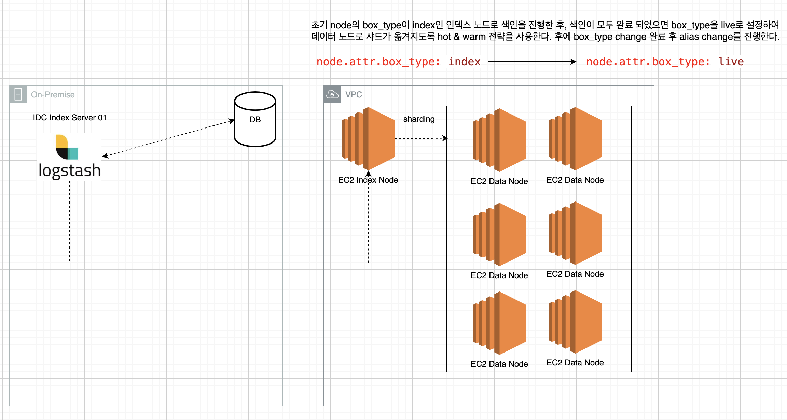

# 01. ES 색인 속도 증대를 위한 EC2 인스턴스 타입 변경 중 사용한 iostat 명령어

> 최근 AWS에 구동되고 있는 검색 엔진 인덱스 노드(node-i: 색인 시 사용되는 노드)의 인스턴스 유형을 변경해야 했다.  
> 기존 c6g.8xlarge를 사용하던 EC2 인스턴스 타입을 c6gd.8xlarge로 변경해야 했다. 이유는 c6g.8xlarge의 경우 EBS Only로 EBS의 경우 네트워크로 연결이 되어 있지만
> 내장 스토리지를 사용하는 c6gd.8xlarge 유형을 사용하기에 색인(인덱싱) 속도를 높히기에는 내장 스토리지를 사용하는 것이 좋다고 판단하였기 때문이다. 

## 01-1. 현재 AWS EC2 인덱스 노드 아키텍처

> 현재 인덱스 노드에 데이터 색인 후 데이터 노드로 샤드를 분배하는 과정은 아래와 같다.



현재 `풀 색인`의 경우 새벽 05:00에 Logstash가 구동 되어 DB의 값을 조회(프로시저)하여 AWS EC2(index Node)에 색인을 진행한다.  
후에 풀색인이 완료되면 box_type change(hot & warm) 전략을 통해 node.attr(index : 인덱스 노드) -> node.attr(live : 라이브 서비스 데이터 노드) 샤딩을 수행한다. 이 때, 데이터 노드의 `node.attr`가 `live`로 선언이 되어 있기에 `모든 샤드`가 `데이터 노드`로 `분배`가 되어진다.

## 01-2. c6g.8xlarge vs c6gd.8xlarge 차이

> 위에서 말했다시피 내장 스토리지 타입도 지원하는 c6gd.8xlarge 스펙은 아래와 같다.

- **c6g.8xlarge**: `고속 로컬 스토리지`가 필요하지 않고, `네트워크를 통한 EBS 스토리지가 충분`한 경우 적합
- **c6gd.8xlarge**: `고속 로컬 스토리지`가 필요한 애플리케이션, 예를 들어 `캐싱`이나 `빠른 임시 저장소가 필요한 경우`에 `적합`

| Feature                | c6g.8xlarge                     | c6gd.8xlarge                     | Desc                             |
|------------------------|---------------------------------|----------------------------------|----------------------------------|
| vCPUs                  | 32                              | 32                               | 동일한 수의 가상 CPU            |
| Memory (GiB)           | 64                              | 64                               | 동일한 메모리 크기              |
| Instance Storage       | EBS-Only                        | 1 x 1900 NVMe SSD                | EBS만 사용 가능 vs. NVMe SSD 추가|
| Network Bandwidth (Gbps)| 12                              | 12                               | 동일한 네트워크 대역폭          |
| EBS Bandwidth (Mbps)   | 9000                            | 9000                             | 동일한 EBS 대역폭               |
| Enhanced Networking    | Yes                             | Yes                              | 동일한 향상된 네트워킹 지원     |
| Processor              | AWS Graviton2                   | AWS Graviton2                    | 동일한 프로세서 사용            |
| Price (On-Demand, Linux)| $1.0344 per hour               | $1.2288 per hour                 | c6gd.8xlarge가 더 비쌈          |

> AWS EC2 인덱스 노드의 역할은 임시적으로 데이터를 들고 있다가, 해당 데이터를 데이터 노드로 분배하는 역할을 하기 위해 존재하는 서버다. 이러한 특징으로 인하여 해당 서버는 영구적으로 데이터를 들고 있지 않아도 되며, 색인 속도를 높히기 위에서는 내장 스토리지를 지원하는 EC2 인스턴스를 사용하는게 더 좋다는 생각을 하였다.

- **c6g.8xlarge**
  - EBS(Elastic Block Store)만 사용하여 스토리지를 제공
  - `EBS`는 `네트워크`를 통해 연결된 `스토리지`로, 높은 신뢰성과 유연성 제공
  - `하지만 내장 고속 로컬 스토리지 포함 안함`
- **c6gd.8xlarge**
  - EBS 외에도 `1 x 1900 NVMe SSD`를 포함
  - `NVMe SSD`는 매우 높은 입출력 속도를 제공하는 로컬 스토리지
  - `캐시`나 `일시적인 데이터 저장소`로 매우 유용합니다.
  - AWS EC2 인스턴스 c6gd.8xlarge의 로컬 NVMe SSD의 기본 IOPS와 쓰루풋 값
    - 기본 IOPS(Input/Output Operations Per Second): `20,000 IOPS`
    - 기본 쓰루풋(Throughput): `1,187.5` MB/s

> 위에서 EC2 인스턴스 타입을 살펴보았다. 현재 c6gd.8xlarge 타입으로 인스턴스 유형을 변경하고 이제 실제 내장 스토리지를 사용하는지 확인이 필요하였다. 찾아본 결과 Linux에서는 iostat 이라는 명령어를 통해 실제 사용중인 CPU/Disk 사용량을 확인할 수 있었다. iostat에 대해 간략히 알아보자. 

## 01-2. iostat

- `iostat`은 `디스크 입출력`(Disk I/O)에 대한 `통계`를 보고한다
- Disk, CPU `처리량`, `사용률`, `대기열 길이`, `트랜잭션 비율` 및 `서비스 시간`에 대한 측정 결과 획득 가능
- 즉, CPU와 Disk Device의 input/output 통계 정보 확인 가능하다
- 설치 방법은 다음과 같다

```shell
yum install sysstat # 센토스 설치
sudo apt install sysstat # 우부투 설치
```

필자의 EC2 환경에는 sysstat이 자동으로 설치가 되어 있었는데, 혹시 깔려있지 않은 경우 위 명령어를 통해 설치하면 된다.

```shell
iostat [옵션] [인터벌] [횟수]
```

`iostat`의 옵션에는 `인터벌` 그리고 `횟수`가 나온다. `인터벌`은 몇초마다 디스크 디바이스 정보를 출력할지,  
`횟수`는 몇번 수집 할 것인지 지정하는 명령어다.  실제 명령어를 치게 되면 아래와 같이 결과값이 출력이 된다.

```shell
# 5초마다 확장 정보를 출력해라
iostat -x 5

# 출력 결과
Linux 5.xxx.xxx-xxx.xxx.amzn2.aarch64 (xxx-xxx-xxx-d01)         06/30/2024      _aarch64_       (2 CPU)

avg-cpu:  %user   %nice %system %iowait  %steal   %idle
          10.04    0.00    1.09    0.38    0.00   88.50

Device:         rrqm/s   wrqm/s     r/s     w/s    rkB/s    wkB/s avgrq-sz avgqu-sz   await r_await w_await  svctm  %util
nvme0n1           0.00     0.42    0.01   19.24     0.50  1881.00   195.56     0.03    1.63    1.88    1.63   1.06   2.04
```

| Option   | Description                               | ETC |
|----------|-------------------------------------------|--|
| %user    | `CPU`가 `User 모드`에서 `사용`된 `시간`의 `비율` | User 모드란 |
| %nice    | 작업 우선순위 정책에 의해 우선순위가 바뀐 프로세스가 사용한 시간의 비율 | |
| %system  | `CPU`가 `System 모드(커널 모드)`에서 `사용`된 `시간`의 `비율` | |
| %iowait  | `CPU`가 `디스크 입출력`을 `기다리는데` `사용`된 `시간`의 `비율` | |
| %steal   | `가상화 환경`에서 `가상 CPU`가 `다른 가상 머신 작업 기다리느라` `사용`된 `시간 비율` | |
| %idle    | `CPU`가 `유휴 상태`로 있는 `시간 비율`, 이 `값`이 `높을수록` `CPU가 대부분 쉬고 있음`을 의미 | |

| Option     | Description                                                                                  |
|------------|----------------------------------------------------------------------------------------------|
| rrqm/s     | 디바이스 `큐`에 `대기`중인 `초당 읽기 요청 건수` |
| wrqm/s     | 디바이스 `큐`에 `대기`중인 `초당 쓰기 요청 건수` |
| r/s        | 디바이스에 요청한 `초당 읽기 요청 건수` |
| w/s        | 디바이스에 요청한 `초당 쓰기 요청 건수` |
| rkB/s      | 디스크에서 `초당 읽어들인 데이터 크기` (kb 단위) |
| wkB/s      | 디스크에 `초당 쓰기한 데이터 크기` (kb 단위) |
| avgrq-sz   | 디스크에 보낸 I/O 요청의 평균 크기 |
| avgqu-sz   | 디스크 I/O 요청이 대기 중인 평균 길이 |
| await      | I/O 요청이 완료되기까지 걸리는 평균 시간(ms) |
| r_await    | 읽기 요청이 완료에 걸리는 평균 시간 |
| w_await    | 쓰기 요청이 완료에 걸리는 평균 시간 |
| svctm      | 디스크가 I/O 요청을 처리하는 데 걸리는 평균 시간 |
| %util      | 디스크 사용률, 디스크가 얼마나 바쁜지(활성화 상태인지)를 나타냄. 100%에 가까울수록 디스크가 바쁘다는 의미 |

### iostat 옵션

> 옵션은 필요할 때 찾아서 사용하자.

| 옵션 | 설명 |
|-----|------|
| -c  | CPU 사용량 출력 |
| -d  | 디스크 사용량 출력 |
| -k  | 블록 단위에서 킬로바이트로 정보 출력 |
| -m  | 블록 단위에서 메가바이트로 정보 출력 |
| -p  | 파티션 당 통계 포함 |
| -t  | 타임스탬프 출력 |
| -x  | 확장 정보 |
| -z  | 사용량이 0인 정보는 제외 |

## 99. 참고 자료

- [[LINUX] 📚 디스크 명령어 정리 (df / du / iostat)](https://inpa.tistory.com/entry/LINUX-%F0%9F%93%9A-%EB%94%94%EC%8A%A4%ED%81%AC-%EB%AA%85%EB%A0%B9%EC%96%B4-%EC%A0%95%EB%A6%AC-df-du-%EC%9A%A9%EB%9F%89-%EA%B5%AC%ED%95%98%EA%B8%B0)
- [[Linux] iostat 명령어 사용법 - 디스크 사용량 모니터링](https://hbase.tistory.com/324)
- [[Linux] IO 부하를 예측하는 명령어 두가지 iotop 와 iostat](https://devkingdom.tistory.com/233)
- [Linux iostat](https://brunch.co.kr/@lars/7)
