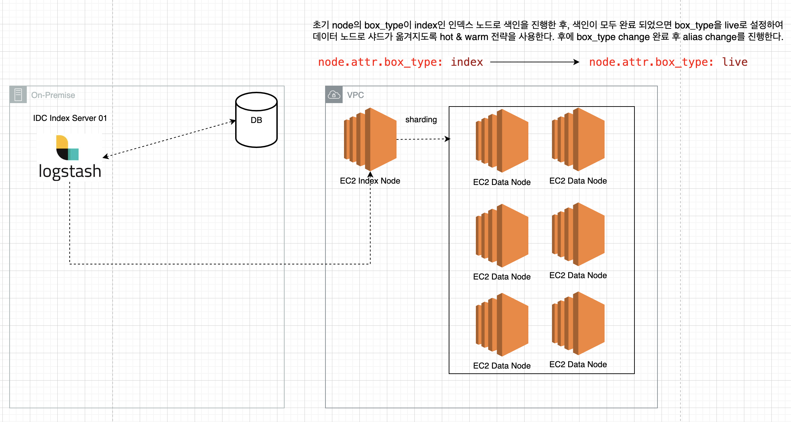

# 01. ES 색인 속도 증대를 위한 EC2 인스턴스 타입 변경, 그리고 iostat 명령어로 디스크 I/O 확인하기

> 최근의 AWS 상에 구동되고 있는 검색 엔진 인덱스 노드(node-i: 색인 시 사용되는 노드)의 인스턴스 유형을 변경해야 하는 경우가 있었다.  
> 기존 c6g.8xlarge를 사용하던 EC2 인스턴스 타입을 c6gd.8xlarge로 변경해야 했다. 이유는 c6g.8xlarge의 경우 EBS Only로 EBS의 경우 네트워크로 연결이 되어 있지만
> 내장 스토리지를 사용하는 c6gd.8xlarge 유형을 사용하기에 색인(인덱싱) 속도를 높히기에는 내장 스토리지를 사용하는 것이 좋다고 판단하였다.

## 01-1. AWS EC2 인덱싱 노드 구성



현재 풀 색인의 경우 특정 시간(새벽 05:00)에 Logstash가 구동이 되어 DB의 값을 조회(프로시저 사용)하여 AWS EC2(index Node)에 먼저 색인을 진행한다.  
후에 색인이 모두 완료되면 box_type change(hot & warm) 전략을 통해 node.attr(index : 인덱스 노드) -> node.attr(live : 라이브 서비스 데이터 노드) 샤딩을 수행한다.  
이 때, 데이터 노드의 node.attr가 live로 선언이 되어 있기에 모든 샤드가 데이터 노드로 분배가 되어진다.

## 01-2. c6g.8xlarge vs c6gd.8xlarge 차이

- **c6g.8xlarge**: `고속 로컬 스토리지`가 필요하지 않고, `네트워크를 통한 EBS 스토리지가 충분`한 경우 적합
- **c6gd.8xlarge**: `고속 로컬 스토리지`가 필요한 애플리케이션, 예를 들어 `캐싱`이나 `빠른 임시 저장소가 필요한 경우`에 `적합`

| Feature                | c6g.8xlarge                     | c6gd.8xlarge                     | Desc                             |
|------------------------|---------------------------------|----------------------------------|----------------------------------|
| vCPUs                  | 32                              | 32                               | 동일한 수의 가상 CPU            |
| Memory (GiB)           | 64                              | 64                               | 동일한 메모리 크기              |
| Instance Storage       | EBS-Only                        | 1 x 1900 NVMe SSD                | EBS만 사용 가능 vs. NVMe SSD 추가|
| Network Bandwidth (Gbps)| 12                              | 12                               | 동일한 네트워크 대역폭          |
| EBS Bandwidth (Mbps)   | 9000                            | 9000                             | 동일한 EBS 대역폭               |
| Enhanced Networking    | Yes                             | Yes                              | 동일한 향상된 네트워킹 지원     |
| Processor              | AWS Graviton2                   | AWS Graviton2                    | 동일한 프로세서 사용            |
| Price (On-Demand, Linux)| $1.0344 per hour               | $1.2288 per hour                 | c6gd.8xlarge가 더 비쌈          |

> 필자의 서비스에서 AWS ECS 인덱스 노드의 역할은 임시적으로 데이터를 들고 있다가, 각각의 데이터 노드로 샤드를 분배하는 역할을 하는 서버다.  
> 이 서버는 영구적인 데이터를 사용하지 않아도 되기에 색인 속도를 높히기 위에서는 내장 스토리지를 사용하는 것이 좋다는 생각을 하였다.

- **c6g.8xlarge**
  - EBS(Elastic Block Store)만 사용하여 스토리지를 제공
  - EBS는 네트워크를 통해 연결된 스토리지로, 높은 신뢰성과 유연성 제공
  - `하지만 내장 고속 로컬 스토리지 포함 안함`
- **c6gd.8xlarge**
  - EBS 외에도 `1 x 1900 NVMe SSD`를 포함
  - `NVMe SSD`는 매우 높은 입출력 속도를 제공하는 로컬 스토리지
  - `캐시`나 `일시적인 데이터 저장소`로 매우 유용합니다.
  - AWS EC2 인스턴스 c6gd.8xlarge의 로컬 NVMe SSD의 기본 IOPS와 쓰루풋 값
    - 기본 IOPS(Input/Output Operations Per Second): `20,000 IOPS`
    - 기본 쓰루풋(Throughput): `1,187.5` MB/s

> 색인 프로세스의 큰 그림은 위와 같은데, AWS EC2의 인스턴스 유형을 변경 한 후 나는 마운팅 된 DISK 사용량을 실시간으로 보고 싶었다.  
> 찾아보던 중 iost 란 Linux 명령어에 대해 알게 되었고 실시간으로 사용하는 CPU, DISK IO에 대한 확인을 할 수 있었다.

## 01-2. iostat

- `iostat`은 `디스크 입출력`(Disk I/O)에 대한 `통계`를 보고한다
- Disk, CPU `처리량`, `사용률`, `대기열 길이`, `트랜잭션 비율` 및 `서비스 시간`에 대한 측정 결과 획득 가능
- 즉, CPU와 Disk Device의 input/output 통계 정보 확인 가능

```shell
yum install sysstat # 센토스 설치
sudo apt install sysstat # 우부투 설치
```

필자의 EC2 환경에는 sysstat이 자동으로 설치가 되어 있었는데(자동 설치 아닐 수 있음) 혹시 깔려있지 않은 경우 위 명령어를 통해 설치하면 된다.

```shell
iostat [옵션] [인터벌] [횟수]
```

`iostat`의 옵션에는 `인터벌` 그리고 `횟수`가 나온다. `인터벌`은 몇초마다 디스크 디바이스 정보를 출력할지, `횟수`는 몇번 수집 할 것인지 지정하는 명령어다.  
실제 명령어를 치게 되면 아래와 같이 결과값이 출력이 된다.

```shell
# 5초마다 확장 정보를 출력해라
iostat -x 5

# 출력 결과
Linux 5.xxx.xxx-xxx.xxx.amzn2.aarch64 (xxx-xxx-xxx-d01)         06/30/2024      _aarch64_       (2 CPU)

avg-cpu:  %user   %nice %system %iowait  %steal   %idle
          10.04    0.00    1.09    0.38    0.00   88.50

Device:         rrqm/s   wrqm/s     r/s     w/s    rkB/s    wkB/s avgrq-sz avgqu-sz   await r_await w_await  svctm  %util
nvme0n1           0.00     0.42    0.01   19.24     0.50  1881.00   195.56     0.03    1.63    1.88    1.63   1.06   2.04
```

| Option   | Description                               |
|----------|-------------------------------------------|
| %user    | `CPU`가 `User 모드`에서 사용된 시간의 비율 |
| %nice    | 작업 우선순위 정책에 의해 우선순위가 바뀐 프로세스가 사용한 시간의 비율 |
| %system  | `CPU`가 `System 모드`에서 사용된 시간의 비율 |
| %iowait  | `디스크 입출력`을 `기다리는데` 사용된 시간의 비율 |
| %steal   | `가상화 환경`에서 `가상 CPU`가 `다른 가상 머신 작업 기다리느라` 사용된 시간 비율 |
| %idle    | `CPU`가 `유휴 상태`로 있는 시간 비율, 이 값이 높을수록 CPU가 대부분 쉬고 있음을 의미 |

> TODO: 위 옵션 좀 더 디테일하게 정리, Device 쪽 정리

## 99. 참고 자료

- [[LINUX] 📚 디스크 명령어 정리 (df / du / iostat)](https://inpa.tistory.com/entry/LINUX-%F0%9F%93%9A-%EB%94%94%EC%8A%A4%ED%81%AC-%EB%AA%85%EB%A0%B9%EC%96%B4-%EC%A0%95%EB%A6%AC-df-du-%EC%9A%A9%EB%9F%89-%EA%B5%AC%ED%95%98%EA%B8%B0)
- [[Linux] iostat 명령어 사용법 - 디스크 사용량 모니터링](https://hbase.tistory.com/324)
- [[Linux] IO 부하를 예측하는 명령어 두가지 iotop 와 iostat](https://devkingdom.tistory.com/233)
- [Linux iostat](https://brunch.co.kr/@lars/7)
