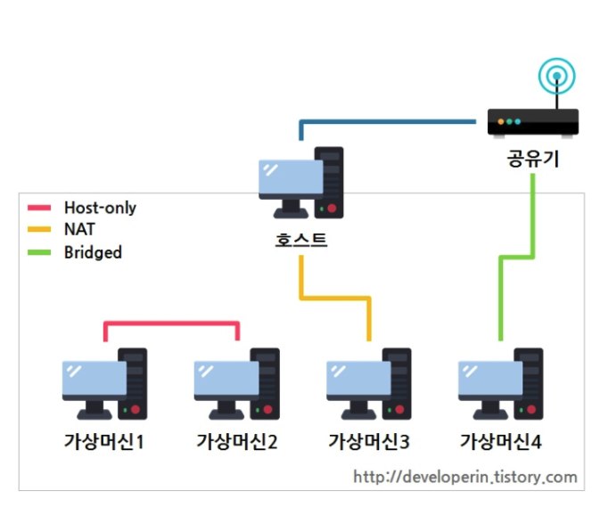
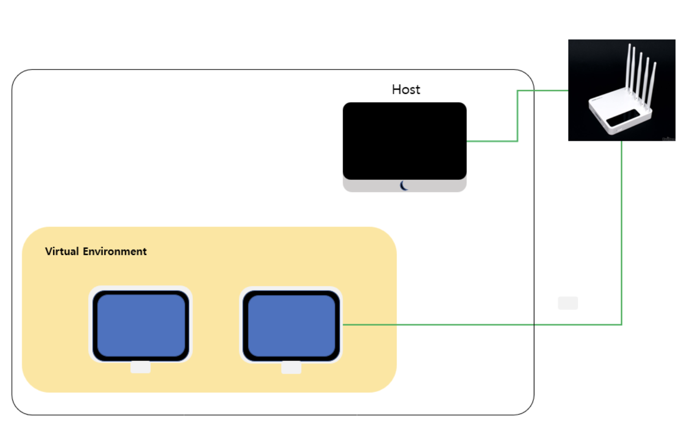
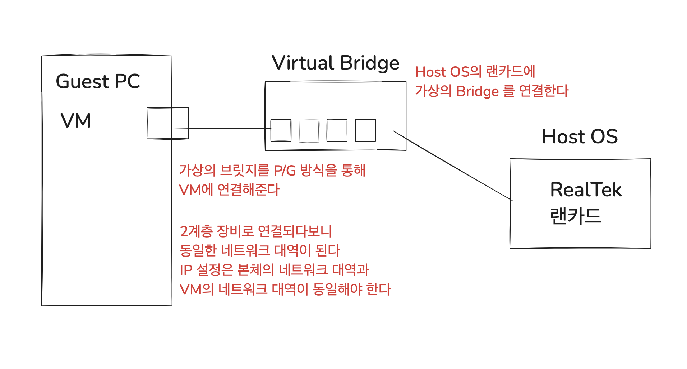
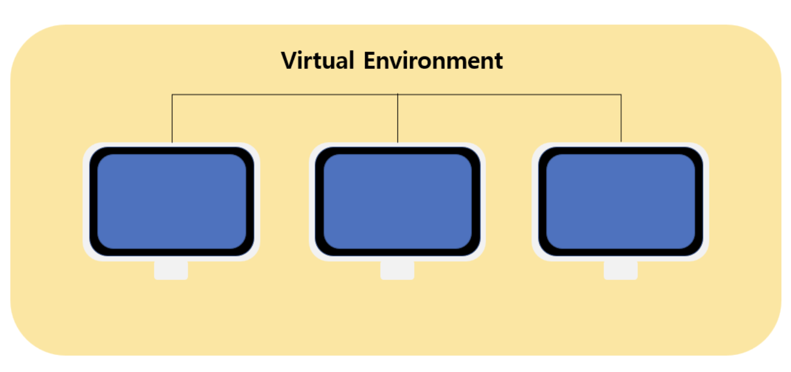
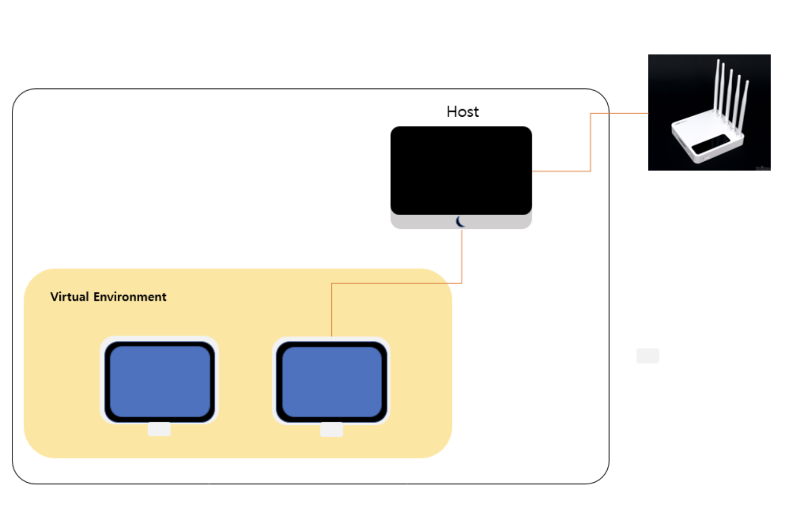
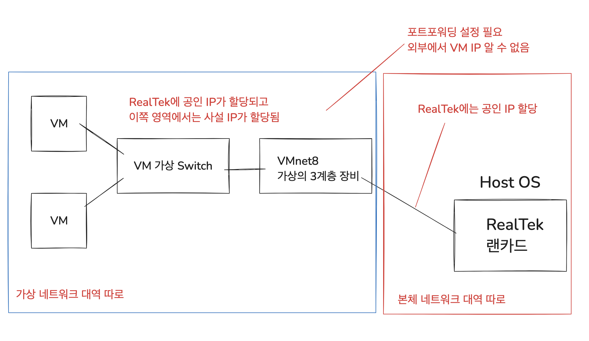

# VM Bridged, Host-Only, NAT 차이

> 가상머신 네트워크 방식의 종류로는 'Bridged', 'Host-Only', 'NAT'가 존재한다  
> 참고 : https://cholink.tistory.com/206

## Bridged

> Host의 PC의 네트워크 대역과 동일한 네트워크 대역을 사용하는 가상의 네트워크 장치

- `Bridged 방식`은 `공유기`로부터 `IP`를 `할당`받는다
- `Host PC`와 `동일한 네트워크 대역 IP`를 갖는다
- `공유기`를 통해 `외부 네트워크 통신 가능`

## Host-Only

> 실제 랜선에 물려있는 실제 네트워크 장치에 연결되는게 아닌  
> Host PC의 가상의 랜 카드 VMnet1번에 연결된다

- `Host-Only` 모드에서는 `Host-Only 방식`을 `사용`하는 `VMWare` 끼리만 `통신 가능`
- `VMWare`끼리 `별도`의 `네트워크 대역` `따로 구축`
  - 외부 네트워크, 호스트 PC와 통신 불가능, VM끼리만 통신 가능
- `외부 네트워크`나 `인터넷`에 `접근` 불가능
  - `네트워크 분리`가 `필요`하거나, `외부`와의 `연결 없이` `테스트 환경 구축` 시 유용

## NAT

> Host PC의 IP를 공인 IP로 사용하는 사설 네트워크 대역을 만드는 가상 네트워크 장치

- `NAT 방식`은 `호스트 PC`로부터 `IP`를 `할당` 받는다
  - `호스트 PC`는 `공유기`로부터 `IP`를 `할당` 받는다
- `가상머신`은 `자체 DHCP 서버`를 `활성화`하여 `내부 네트워크 대역`을 `할당` 및 `통신 역할 수행`
- 해당 `호스트 PC`를 통해 `외부 네트워크 통신 가능`
  - NAT 네트워크에 속한 VM은 외부 네트워크에 직접 접근 불가능
  - `VM`은 `호스트 내부`의 `사설 IP 대역`을 가지고, 외부 네트워크에서는 VM들의 IP를 알 수 없음
  - 호스트의 IP:특정 포트를 통해서만 접근 가능
  - `외부는 공인 IP 사용, VM은 사설 IP 대역 사용`

## 99. 참고 자료

- [[VMware] 네트워크 방식 Host-Only, Bridge, NAT 구성](https://cholink.tistory.com/206)
- [[VMware] Bridge, Host-Only, NAT의 차이](https://this-circle-jeong.tistory.com/215)
- [[VMware] Host-only, NAT, Bridged 차이](https://developerin.tistory.com/18)
- [[VMware] 가상 네트워크의 종류(Host-only, NAT, Bridged)](https://velog.io/@duck-ach/Network-%EA%B0%80%EC%83%81-%EB%84%A4%ED%8A%B8%EC%9B%8C%ED%81%AC%EC%9D%98-%EC%A2%85%EB%A5%98Host-only-NAT-Bridged)
- [06. VMware의 3가지 네트워크 타입](https://www.youtube.com/watch?v=pWSPdobYMeQ)