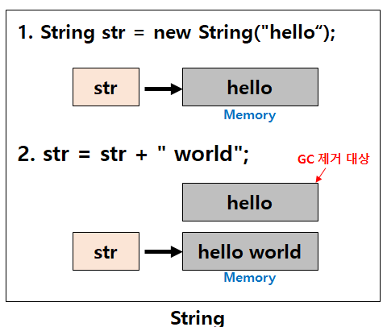
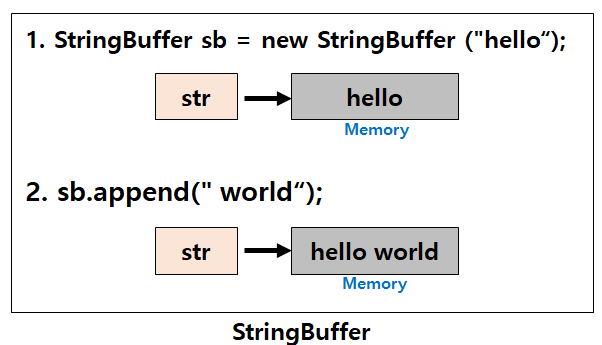

# [Java] String / StringBuffer / StringBuilder 차이

# 01. 서론

- 자바에서 대표적으로 문자열을 다루는 자료형 클래스로 `String`, `StringBuffer`, `StringBuilder` 자료형 제공
- 세가지 모두 문자열을 다루는데 사용하지만 목적에 따라 쓰임새가 달라짐
- String, StringBuffer, StringBuilder의 차이점에 대해 간략히 알아보고, 상황에 맞는 사용법 숙지
- **연산이 많지 않을때**는 어떤 클래스를 사용해도 이슈가 발생하지 않으나 **연산횟수가 많아지거나** 
**멀티쓰레드**, **Race condition** 상황이 자주 발생하면 각 상황에 맞게 클래스를 선택해야 함

# 02. String vs StringBuffer/StringBuilder

```java
String str = "hello" // String str = new String("hello"); 와 동일
str = str + "world"; // [ hello world ]
```



- String과 StringBuffer/StringBuilder 의 가장 큰 **차이점**은 **String**은 **불변(immutable)** 이라는 점
- 위 예시를 보면 hello 값을 가지고 있던 String 클래스의 참조변수 str이 가리키는 곳에 저장된 hello에 world를
더해 hello world가 된 것으로 착각 할 수 있음
- 실제로는 기존 str은 새로운 참조(메모리)를 가르키게 되고 해당 메모리 공간에 “hello world” 라는 문자가 저장된다
- 즉, **String**은 문자열을 **수정**, **삭제**, **추가** 하는 경우 새로운 String 객체를 만들어서 처리한다

# 03. StringBuffer / StringBuilder 클래스

```java
StringBuffer sb = new StringBuffer("hello");
sb.append("world");
```



- **StringBuffer**, **StringBuilder**는 **가변성(mutable)** 을 가진다
- StringBuffer / StringBuilder 클래스는 **문자열을 연산(추가, 삭제, 수정)** 할 때 주로 사용하는 자료형
- String 자료형만으로 **+, concat()** 통해 문자열 사용 가능
    - 하지만 덧셈(+) 연산자를 이용해 String 인스턴스의 문자열을 결합하면 새로운 String 인스턴스를 생성
    - 문자열을 결합하면 결합할수록 공간 낭비와 속도 또한 매우 느려지게 된다
- StringBuilder는 StringBuffer에 비해 연산 성능이 우수하지만, thread none safe 하다는 특징이 있음
- StringBuffer는 StringBuilder에 비해 연산 성능이 떨어지지만, thread safe 하다는 특징이 있음

# 04. 정리

|  | String | StringBuffer | StringBuilder |
| --- | --- | --- | --- |
| 가변 여부 | 불변 | 가변 | 가변 |
| 스레드 세이프 | O | O | X |
| 연산 속도 | 느림 | 빠름 | 아주 빠름 |
| 사용 시점 | - 문자열 추가 연산이 적은 경우 <br> - 스레드 세이프 환경에서 | - 문자열 추가 연산이 많은 경우 <br> - 스레드 세이프 환경에서 | - 문자열 추가 연산이 많고, 빠른 연산 필요시 <br>- 단일 스레드 환경에서 |

# 99. 참고 자료

- [[JAVA] ☕ String / StringBuffer / StringBuilder 차이점 & 성능 비교](https://inpa.tistory.com/entry/JAVA-☕-String-StringBuffer-StringBuilder-차이점-성능-비교)