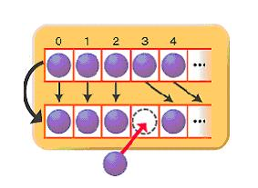
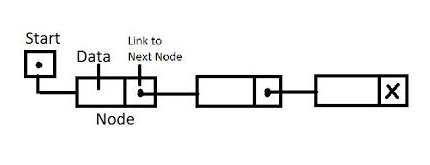

# [Java] Vetor vs ArrayList vs LinkedList 간단 정리

# 01. Vetor vs ArrayList vs LinkedList

- List는 모든 프로그래밍 언어에서 가장 **유용한 자료구조**이다
- **List**는 **기존 Array(배열)** 자료구조의 **단점, 한계**를 극복하기위해 나온 자료구조다
- Array(배열) 자료구조를 기반으로 만들어졌다 봐도 무방하다

## 01. Vetor

```java
public class VectorTest {
  
	public String [] Array = new String[10];
 	public Vector<String> vector = new Vector<Strign>();

 	@Test
 	public void collectionTest() {
   		System.out.println("Array = " + array.length);
   		System.out.println("Vector = " + vector.capacity());
 	}
}
```

- **Java 1.0** 부터 지원되며, **Java 1.2** 이상부터는 **이전 버전**과의 **호환**을 위해서 주로 사용된다
- Vetor는 다수의 Thread에 대한 동기화 처리를 보장하기에, 한 번에 하나의 스레드만 작업이 가능하여 안정성이 보장됩니다.
  - 모든 메서드에 **synchronized** 가 붙어있음
- Vector의 경우 공간이 모자를 때는 모자른 공간의 **2배 공간을 확보**하기 때문에, **메모리를 많이 잡아먹는다**는 단점 역시 존재

## 02. ArrayList



[https://www.holaxprogramming.com/2014/02/12/java-list-interface/](https://www.holaxprogramming.com/2014/02/12/java-list-interface/)

- **Array**라는 이름이 있는 것 처럼 인덱스를 가지고 있어 **조회에 용이**하다는 장점을 가지고 있습니다.
- 하지만 데이터를 추가/삭제 하는 경우에는 빠진 공간만큼 한칸씩 당기거나 뒤로 밀어야 한다는 단점을 가지고 있습니다.
- 다수 Thread에 대해 동기화 보장하지 않으며, **개발자가 Thread-safe에 대한 고려**를 해야합니다.
- 공간이 모자른 경우 **임시 배열**을 만들어 데이터를 **복사**한다는 특징을 가지고 있습니다.

## 03. LinkedList



- LinkedList는 **노드의** **연결 리스트 구조**를 가지고 있습니다.
- **데이터 조회**의 경우 헤드(Head) 노드부터 테일(Tail) 노드까지 순회를 해야 하기에 속도가 떨어진다
- **데이터 추가/삭제**의 경우 노드가 가르키는 다음 노드의 주소만 변경하면 되기에 추가/삭제 성능은 좋다
- ArrayList와 마찬가지로 쓰레도 동기화를 보장하지 않으며, 개발자가 Thread-safe에 대한 고려를 해야한다

## 04. 동기화

- 멀티 스레드 환경에서 동기화 처리는 중요한 부분
- 동기화란 **복수의 쓰레드**로부터 **데이터**의 **추가** 혹은 **삭제**가 일어났을 때 **내부 데이터는 안전하게 처리**되도록 하는 것

# 참고 자료

- [Java의 LinkedList와 ArrayList에 대한 비교](https://www.holaxprogramming.com/2014/02/12/java-list-interface/)
- [[JAVA]Vector vs ArrayList vs LinkedList](https://languagefight.tistory.com/83)
- [자바 ArrayList와 LinkedList는 무엇인가? 성능 비교 (+ Vector..?)](https://7357.tistory.com/91)
