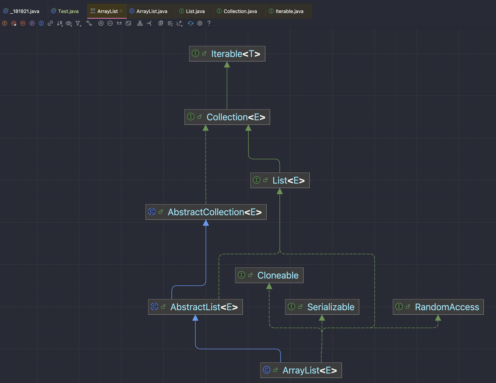
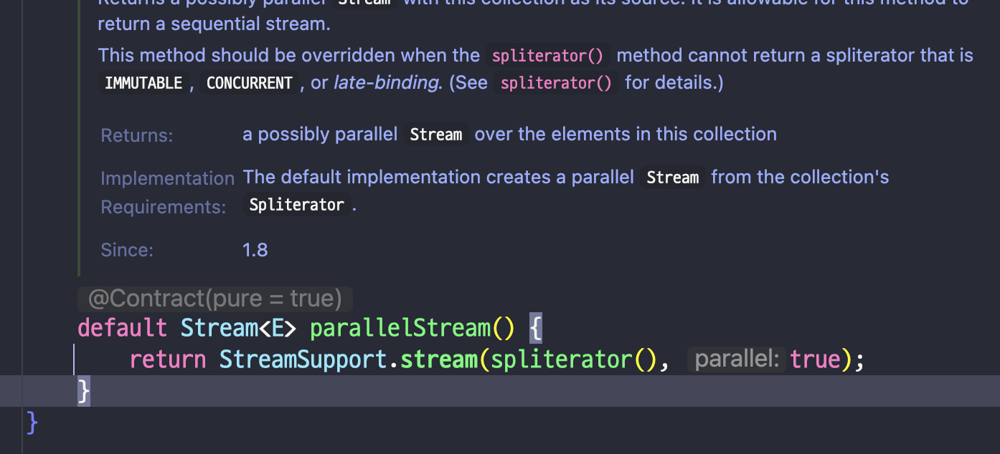
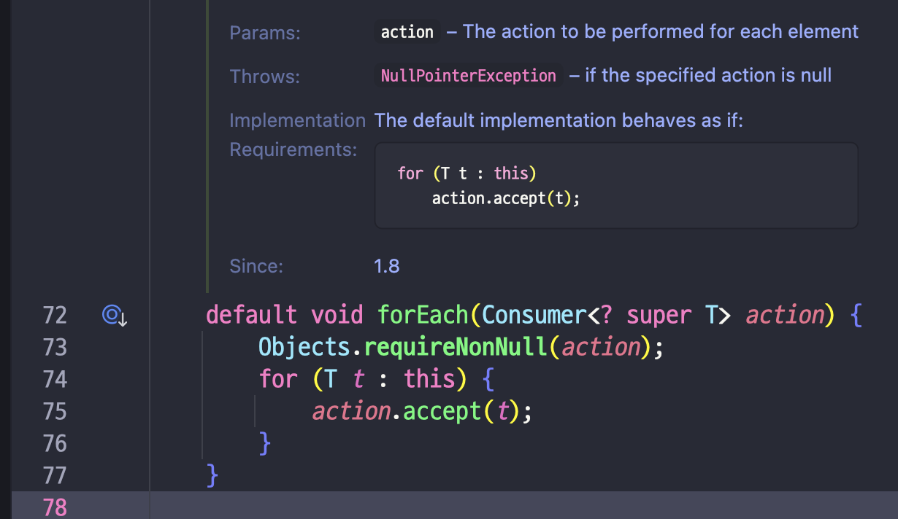
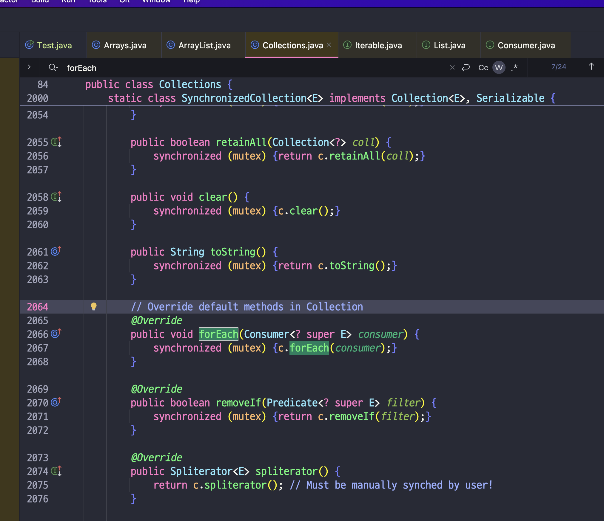

# 01. Java Collection.forEach vs Stream.forEach 차이점 정리

```java
public class Test {
    
    public static void main(String[] args) {
        List<Integer> t1 = Arrays.asList(1,2,3,4,5);
        t1.forEach(System.out::print);
        System.out.println();

        // stream으로 하나 만들어봐
        List<Integer> t2 = Arrays.asList(1,2,3,4,5);
        t2.stream().forEach(System.out::print);
    }
}
```

```shell
# 결과
12345
12345
```

> Java에서는 Stream.forEach와 Collection.forEach가 제공이 된다  
> 이렇게 동일한 역할을 하는 함수가 제공이 되는 이유가 궁금하여 정리한다  
> 결론부터 말하자면 Collection.forEach와 Stream.forEach는 기능적으로 큰 차이가 없다

## 01-1. Collection.stream()

```java
List<Integer> collection = Arrays.asList(1,2,3,4,5);
collection.stream().forEach(System.out::print);
```

```java
// Collection 인터페이스 내의 stream 함수
default Stream<E> stream() {
    return StreamSupport.stream(spliterator(), false);
}
```

> 우선 Collection.forEach vs Collection.stream().forEach() 객체 생성 여부에 대해 알아본다  
> 그 전에 Collection.stream() 함수의 특징이 무엇인지 간단히 보자

- `Collection.stream()` `함수`는 내부적으로 `Stream 객체를 만드는 함수`이며 특징은 아래와 같다
  - `일회성 객체`를 생성
  - 원본(Stream 객체의 부모) 값은 변경하지 않음
    - 즉, 원본 값을 변경하는 것이 아닌 `별도의 Stream 신규 객체 생성`
    - for-each 구문의 경우 원본 객체의 값을 변경 한다

## 01-2. 객체 생성 여부의 차이

```java
public void print(List<Integer> nums) {
    nums.forEach(System.out::println);
    nums.stream().forEach(System.out::println);
}
```

```java
public interface Iterable<T> {

    // Iterable 객체의 default 함수 -> forEach
    default void forEach(Consumer<? super T> action) {
        Objects.requireNonNull(action);
        for (T t : this) { // 향상된 for문 -> 내부적 Iterator 사용??
            action.accept(t);
        }
    }
    ...
}

public interface Collection<E> extends Iterable<E> {
    ...
}
```



> Collection.forEach() : 객체 생성 안함  
> Collection.stream().forEach() : 객체 생성(Stream obj) 한다

Collection.forEach 함수는 `별도의 객체를 생성하지 않고` `forEach 함수를 호출`한다.  
`forEach 함수`는 `Iterable 인터페이스의 default 함수`인데, Collection 인터페이스에서  
Iterable 인터페이스를 상속하고 있기에 바로 호출이 가능한다.

```java
public interface Collection<E> extends Iterable<E> {

    // Collection.stream() 함수 -> Stream 객체를 반환
    default Stream<E> stream() {
        return StreamSupport.stream(spliterator(), false);
    }
}
```

반면에 `Colletion.stream().forEach()` 함수는 `Collection 인터페이스`의 `default 메서드 stream() 함수`로써  
Stream 객체를 생성하지 않고서는 forEach 함수 호출이 불가능하다.

> stream() 함수를 호출하면 신규 Stream 객체가 생성이 되는데, 이 객체는 즉시 버려지기 때문에 불필요한 오버헤드가 발생

추가적으로 `단순 반복 목적`이라면 Stream.forEach()는 stream()로 `생성된 Stream 객체가 버려지는 오버헤드`가 있기에,  
filter, map 등의 기능들과 함께 사용할때만 Stream.forEach()를 사용하고 나머지는 Collection.forEach() 사용을 추천한다.

## 01-3. 순서의 차이

```java
public class Test {

    public static void main(String[] args) {
        // collection.forEach
        List<Integer> t1 = Arrays.asList(1,2,3,4,5);
        t1.forEach(System.out::print);
        System.out.println();

        // stream.forEach
        List<Integer> t2 = Arrays.asList(1,2,3,4,5);
        t2.stream().forEach(System.out::print);
        System.out.println();

        // parallelStream.forEach
        List<Integer> t3 = Arrays.asList(1,2,3,4,5);
        t3.parallelStream().forEach(System.out::print);
    }
}
```

```shell
# 결과
collection.forEach -> 12345 // 기본적으로 순서 보장 한다
stream.forEach -> 12345 // 기본적으로 순서 보장 안함..
parallelStream.forEach -> 31245 // 이 친구도 순서 보장 절대 안됨..
```

이전에 Collection.forEach와 Stream.forEach의 차이점을 비교 하였을 때 Stream 신규 객체가 생성된다는 부분을 제외하고는  
미미한 차이점이 존재하는 것을 확인 하였다. 하지만 위와 같이 `Stream.parallelStream`을 사용 하는 경우 `순서가 보장이 되지 않는다`.



Collection.parallelStream() 함수 호출 시 위와 같이 병렬 처리 옵션이 true로 지정되어 있다.  
하여 `parallelStream 메서드`로 `생성`한 `Stream 객체`는 `여러 스레드`에서 스트림 작업을 실행하기 때문에  
forEach를 수행하면 `실행 순서가 매번 달라지며` `예측 불가능`하다.



반면에 `Collection.forEach 함수`는 위와 같이 `내부적으로 for-each Loop`를 `사용`하기 때문에 `일정한 순서`를 `보장`한다.

> 🤔 정리를 해보자면 Collection.forEach, Stream.forEach, ParallelStream.forEach의 차이점은 아래와 같다

| 메서드                  | 순서 보장 여부     | 처리 방식          | 주요 특징                                                  |
|-------------------------|-------------------|--------------------|------------------------------------------------------------|
| `Collection.forEach`    | **순서 보장**     | 단일 스레드에서 순차적 처리 | 컬렉션 요소 순차 반복, 컬렉션 순서 보장 |
| `Stream.forEach`        | **순서 보장 안 함** | 단일 스레드에서 순차적 처리 | 스트림 요소 순차로 처리, 순서 보장 |
| `parallelStream.forEach`| **순서 보장 안 함** | 멀티 스레드에서 병렬 처리 | 스트림 요소 병렬로 처리, 순서 보 |

## 01-4. 동시성 문제

> 😃 동시성 문제에 대해서는 추후 정리를 이어나갈 예정

Collection.forEach의 경우 수정을 감지하는 경우 `ConcurrentModificationException`이 발생한다.  
여기서 `ConcurrentModificationException` 예외의 경우 `하나의 오브젝트에 대해 허가되지 않은 변경이 동시`에 이루어질 때 발샌한다고 한다.  
대표적으로는 `Collection 순회` 중 해당 `Collection`을 `수정`할 때 `발생`한다.

```java
public static void main(String[] args) {
    // 신규 Collection 생성
    List<Integer> nums = new ArrayList<>(Arrays.asList(1,2,3,4,5));
    Consumer<Integer> removeIfEven = num -> {
        System.out.println(num);
        if (num % 2 == 0) {
            nums.remove(num);
        }
    };
    nums.forEach(removeIfEven);
}
```

예시를 한번 살펴보자, 1-5 사이의 값을 가진 List 객체를 생성하고 후에 Collection.forEach 함수를 통해 값을 순회 해보자.  
조건으로는 원소가 `짝수` 인 경우 해당 `원소를 제거` 하는 구문을 추가 하였다.

```shell
# 결과
1
2
Exception in thread "main" java.util.ConcurrentModificationException
 at java.base/java.util.ArrayList.forEach(ArrayList.java:1543)
 at com.test.Test.main(Test.java:47)
```

List 객체의 짝수 2를 지우자마자 ConcurrentModificationException이 발생한다.  
Stream.forEach의 경우에는 어떻게 결과가 출력될까?

```java
public static void main(String[] args) {
    List<Integer> nums = new ArrayList<>(Arrays.asList(1, 2, 3, 4, 5, 6));
    Consumer<Integer> removeIfEven = num -> {
        System.out.println("숫자 -> " + num);
        if (num % 2 == 0) {
            nums.remove(num);
        }
    };
    nums.stream().forEach(removeIfEven);
}
```

```shell
# 결과
숫자 -> 1
숫자 -> 2
숫자 -> 4
숫자 -> 6
숫자 -> null
Exception in thread "main" java.lang.NullPointerException
 at com.test.Test.lambda$main$0(Test.java:43)
 at java.base/java.util.ArrayList$ArrayListSpliterator.forEachRemaining(ArrayList.java:1655)
 at java.base/java.util.stream.ReferencePipeline$Head.forEach(ReferencePipeline.java:658)
 at com.test.Test.main(Test.java:47)
```

Stream.forEach의 경우 `Collection이 수정되자마자 예외를 던지지 않고` `무조건 리스트를 끝까지 돌고 예의를 던진다`.  
또 발생한 예외를 보면 `ConcurrentModificationException` 예외가 아니라 `NullPointerException`을 던지는 `차이점`이 존재한다.



```java
// Collections.java
@Override
public void forEach(Consumer<? super E> consumer) {
    synchronized (mutex) {c.forEach(consumer);}
}

@Override
public Spliterator<E> spliterator() {
    return c.spliterator(); // Must be manually synched by user!
}
```

`Collection.forEach`는 해당 Collection의 `Iterator`를 사용하고 `Stream.forEach`는 해당 Collection의 `spliterator`를 사용한다.  
`Collections.java`를 보면 아래 코드처럼 `Collection.forEach`에는 `synchronized 키워드`가 붙어있고, `Stream.forEach`를 위해 필요한 `spliterator`  
메서드는 안 붙어있는 것을 확인할 수 있다고 한다.

즉, `동기화된(synchronized)` `Collection.forEach`는 `락`이 걸려있기에 `멀티쓰레드에 안전`하고, `Stream.forEach`는 `멀티스레드`에서 `안전하지 않다고 한다`.

## 99. 참고 자료

- [[Java] SynchronizedCollections vs ConcurrentCollections](https://deepblue28.tistory.com/entry/Java-SynchronizedCollections-vs-ConcurrentCollections)
- [Collection.forEach와 Stream.forEach는 뭐가 다를까?](https://tecoble.techcourse.co.kr/post/2020-09-30-collection-stream-for-each/)
- [Stack Overflow - What is difference between Collection.stream().forEach() and Collection.forEach()?](https://stackoverflow.com/questions/23218874/what-is-difference-between-collection-stream-foreach-and-collection-foreach)
- [geeksforgeeks - Java의 Collection.stream().forEach()와 Collection.forEach()의 차이점](https://www.geeksforgeeks.org/difference-between-collection-stream-foreach-and-collection-foreach-in-java/)