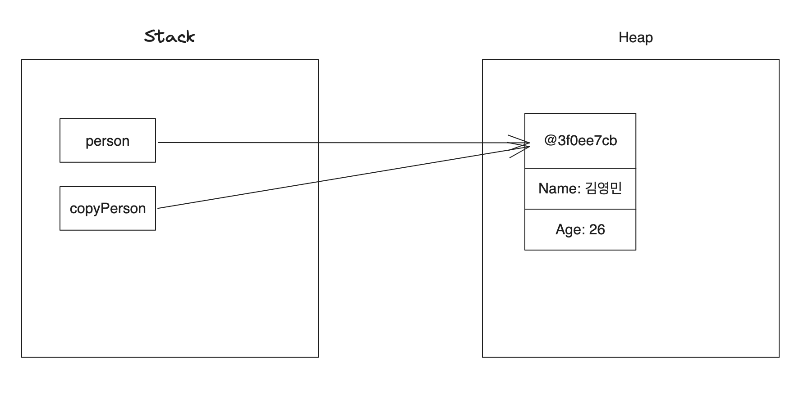

# 01. 깊은 복사 vs 얕은 복사 차이?

> 👍 이번 시간에는 Java의 깊은 복사 그리고 얕은 복사에 대해 알아보자.

## 01-1. 깊은 복사와 얕은 복사란?

> 얕은 복사와 깊은 복사를 알아야 하는 이유는 primitive type(int, short..)의 경우는 얕은 복사로 사용 가능하지만,  
> reference type(Array, object..)은 깊은 복사를 사용해야 객체의 실제 데이터 저장이 가능하다.

- 깊은 복사: 메모리(memory) 상에 새로운 공간을 할당하고 해당 메모리에 값을 복사하는 것을 의미
- 얕은 복사: 기존 A 객체가 바라보고 있는 메모리(memory)의 주소값(reference value)를 복사하는 것을 의미

> 🤔 그러면 해당 키워드에 대해서는 정리를 했으니 소스 레벨에서 2가지의 차이점을 한번 보자

## 01-2. 얕은 복사

```java
package com.test;

class Person {
    private String name;
    private int age;

    public Person() {
    }

    public Person(String name, int age) {
        this.name = name;
        this.age = age;
    }

    public String getName() {
        return name;
    }

    public void setName(String name) {
        this.name = name;
    }

    public int getAge() {
        return age;
    }

    public void setAge(int age) {
        this.age = age;
    }

    @Override
    public String toString() {
        return "Person{" +
                "name='" + name + '\'' +
                ", age=" + age +
                '}';
    }
}

public class Test {

    public static void main(String[] args) {
        // given
        Person person = new Person("홍길동", 26);
        Person copyPerson = person;

        // when
        copyPerson.setName("김영민");
        copyPerson.setAge(26);

        // then
        System.out.println(person); // Person{name='김영민', age=26}
        System.out.println(copyPerson); // Person{name='김영민', age=26}
    }
}
```

> Java 프로그래밍을 하다보면 배열이나, 컬렉션(List, Set..)을 복사할 일이 자주 발생하는데,  
> 얕은 복사, 깊은 복사에 대한 개념 없이 마구잡이로 복사하지말자... 이슈로 이어질수도 있다.

- `얕은 복사`는 `주소에 의한 참조`, `call by reference`와 유사한 개념을 갖는다
- `복사`하려는 `원본 객체`에 대해서 `새로운 단일 객체`를 만들고 `원본 객체 참조`

위 예시를 보면 현재 name, age를 인스턴스 변수로 가지고 있는 Person 클래스가 존재한다.  
main 함수에서 생성자를 통해 신규 Person 객체를 만들고 후에 copyPerson 변수에 얕은 복사를 하였다.  

기대한 부분은 person 변수는 '홍길동', 26 이라는 값이 나오고, copyPerson 변수는 '김영민', '26'이 나올 것이라 예상하지만  
실제 결과에서는 `2개의 객체 모두 아래와 같이 '김영민', 26이라는 값을 응답`하게 된다.

```java
// 콘솔 결과
Person{name='김영민', age=26}
Person{name='김영민', age=26}

Process finished with exit code 0
```

> ❓ 왜 2개의 객체가 동일한 값을 반환하는 것일까?

2개의 객체가 동일한 값을 반환한 이유는 person 변수의 객체 참조 값을 copyPerson 변수에 얕은 복사 하였기 때문이다.  
아마 실제 메모리 구조 상에서는 다음과 같은 그림으로 생성이 될 것 이다. (같은 메모리 주소 번지 참조)

> 🤔 왜 굳이 얕은 복사를 해야 할까? 그리고 어떠한 경우에 주로 사용할까?



만약 객체의 주소값 복사가 아닌 실제 값을 복사하고자 한다면 깊은 복사(deep copy)를 수행해야 한다.  
다음은 깊은 복사에 대해 알아본다.

## 01-3. 깊은 복사

> 깊은 복사(deep copy)란 객체의 주소값이 아닌 새로운 메모리 공간에 값을 복사하여 저장하는 것을 의미한다.  
> 깊은 복사를 구현하는 방법은 대표적으로 3가지 존재한다.

1. `복사 생성자` 또는 `복사 팩토리` 이용하여 복사
2. `직접 객체 생성` 후 `복사`
3. `Clonable 인터페이스` 구현하여 `clone() 함수 오버라이딩` 후 복사

### ✅ 복사 생성자 또는 복사 팩토리 사용

```java
package com.test;

class CopyObject {
    private String name;
    private int age;

    /* NoArgsConstructor */
    public CopyObject() {
    }

    /* 복사 생성자 */
    public CopyObject(CopyObject copyObject) {
        this.name = copyObject.getName();
        this.age = copyObject.getAge();
    }

    /* 복사 팩토리 */
    public static CopyObject copy(CopyObject copyObject) {
        CopyObject copy = new CopyObject(copyObject.getName(), copyObject.getAge()); // 기본 생성자 호출
        return copy;
    }

    /* 생성자 */
    public CopyObject(String name, int age) {
        this.name = name;
        this.age = age;
    }

    public String getName() {
        return name;
    }

    public void setName(String name) {
        this.name = name;
    }

    public int getAge() {
        return age;
    }

    public void setAge(int age) {
        this.age = age;
    }
}

public class Test {

    public static void main(String[] args) {
        CopyObject original = new CopyObject("YM", 30); // 원본
        CopyObject copyConstructor = new CopyObject(original); // 생성자 복사
        CopyObject copyFactory = CopyObject.copy(original); // 팩토리 복사

        System.out.println("[변경 전] original = " + original.getName()); // [변경 전] original = YM
        System.out.println("[변경 전] copyConstructor = " + copyConstructor.getName()); // [변경 전] copyConstructor = YM
        System.out.println("[변경 전] copyFactory = " + copyFactory.getName() + "\n"); // [변경 전] copyFactory = YM

        copyConstructor.setName("KIM");
        copyFactory.setName("JUNE");

        System.out.println("[변경 후] original = " + original.getName()); // [변경 후] original = YM
        System.out.println("[변경 후] copyConstructor = " + copyConstructor.getName()); // [변경 후] copyConstructor = KIM
        System.out.println("[변경 후] copyFactory = " + copyFactory.getName()); // [변경 후] copyFactory = JUNE
    }
}
```

```java
// 콘솔 결과
[변경 전] original = YM
[변경 전] copyConstructor = YM
[변경 전] copyFactory = YM

[변경 후] original = YM
[변경 후] copyConstructor = KIM
[변경 후] copyFactory = JUNE
```

- `복사 생성자` 그리고 `복사 팩토리`는 `깊은 복사`

### ✅ 직접 객체 생성 후 복사

```java
public class Test {

    public static void main(String[] args) {
        CopyObject c1 = new CopyObject("AAA", 40);
        CopyObject c2 = new CopyObject(c1.getName(), c1.getAge());
        c2.setName("변경하지롱");
        c2.setAge(3333);
        //System.out.println(c1);
        //System.out.println(c2);
        System.out.println(c1.getName());
        System.out.println(c2.getName());
    }
}
```

```java
// 콘솔 결과
//com.test.CopyObject@3796751b
//com.test.CopyObject@67b64c45

AAA
변경하지롱
```

- 메모리 주소가 서로 다르며, 데이터도 다름

### ✅ Clonable 인터페이스 구현하여 clone() 함수 오버라이딩 후 깊은  복사

```java
// Object.java
// Java Doc... 주석 중략
@HotSpotIntrinsicCandidate
protected native Object clone() throws CloneNotSupportedException;
```

```java
// Cloneable.java
// Java Doc... 주석 중략
public interface Cloneable {
}
```

> clone은 Object에 정의되어 있다, 쓰고 싶으면 'Cloneable 인터페이스 구현' 후 쓰라고 한다? 🤔  
> 근데 Cloneable 인터페이스를 열어보면 본문이 비어있는 인터페이스이다(실제로는 마커 인터페이스)  
> 참고 : [Java: Cloneable에 대한 고찰](https://velog.io/@suky/Java-Cloneable%EC%97%90-%EB%8C%80%ED%95%9C-%EA%B3%A0%EC%B0%B0)

실제 `Object 클래스`에 들어가보면 위와 같이 `clone()` 메서드가 `protected native` 로 선언되어 있는걸 확인 할 수 있다.  
`clone()` 메서드를 호출하려면 `Cloneable 인터페이스를 구현`해야 하며, 만약 구현하지 않으면 `CloneNotSupportedException`이 발생하게 된다. 

> native 키워드?

`native 키워드`는 `자바가 아닌 언어`(C, C++)로 `구현 후 자바에서 사용하려고 할 때 이용하는 키워드`이다.  
자바로 구현하기 까다로운 것을 다른 언어로 구현 후 자바에서 사용한다. 구현할때 JNI(Java Native Interface)를 사용한다.  
실제로 Cloneable을 구현했는지 판단하는 부분은 [jvm.cpp 소스](https://github.com/openjdk/jdk/blob/3f41fdecdb6d131a5afe6e0a39d7414c222fe4fb/src/hotspot/share/prims/jvm.cpp#L636) 안에서 확인이 가능하다고 한다.

```java
package com.test;

class CloneableObject implements Cloneable {
    private String name; // 이름
    private int age; // 나이

    // Constructor
    public CloneableObject(String name, int age) {
        this.name = name;
        this.age = age;
    }

    public String getName() {
        return name;
    }

    public void setName(String name) {
        this.name = name;
    }

    public int getAge() {
        return age;
    }

    public void setAge(int age) {
        this.age = age;
    }

    // Object 클래스의 clone 메서드를 오버라이딩
    @Override
    public CloneableObject clone() {
        try {
            return (CloneableObject) super.clone();
        } catch (CloneNotSupportedException e) {
            throw new AssertionError();
        }
    }
}

public class Clone {

    public static void main(String[] args) {
        // 신규 객체 생성
        CloneableObject cloneableObject1 = new CloneableObject("KKK", 13);
        
        // 다른 객체에 깊은 복사(Deep Copy 수행)
        CloneableObject cloneableObject2 = cloneableObject1.clone();

        // 결과 출력
        System.out.println(cloneableObject1);
        System.out.println(cloneableObject2);
        System.out.println(cloneableObject1.hashCode());
        System.out.println(cloneableObject2.hashCode());
        System.out.println(cloneableObject1.getName());
        System.out.println(cloneableObject2.getName());
    }
}
```

복사를 하고자 하는 Obj(CloneableObject)에서 Cloneable 인터페이스를 구현하고 Object.clone() 메서드를 오버라이딩한다.  
후에 해당 객체의 clone() 메서드를 실행하기 되면 아래와 같은 결과가 출력이 된다.

```java
// 출력 결과
cloneableObject1 => com.test.CloneableObject@7e0ea639
cloneableObject2 => com.test.CloneableObject@3d24753a
cloneableObject1.hashCode() => 2114889273
cloneableObject2.hashCode() => 1025799482
cloneableObject1.getName => KKK
cloneableObject2.getName() => KKK
```

## 99. 참고 자료

- [최블랙의 개발로그 - Java shallow copy와 Deep Copy](https://choiblack.tistory.com/41)
- [java :) 얕은복사와 깊은복사, Arrays.copyOf()와](https://kimeuncheol.tistory.com/98)
- [Java - 깊은 복사(Deep Copy) vs 얕은 복사(Shallow Copy)](https://zzang9ha.tistory.com/372)
- [Java-Cloneable에-대한-고찰](https://velog.io/@suky/Java-Cloneable%EC%97%90-%EB%8C%80%ED%95%9C-%EA%B3%A0%EC%B0%B0)
