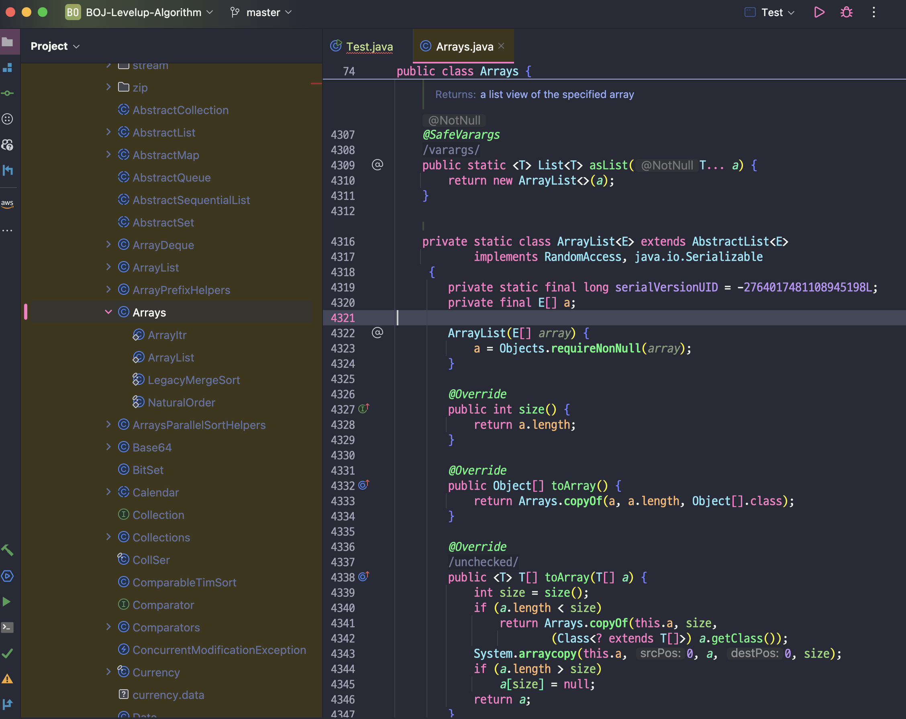

# 01. new ArrayList<>()와 Arrays.asList()와 List.of() 차이

> 이번 시간에는 Java에서 아무 생각없이 리스트를 만들 때 사용하였던 3가지 방법에 대한 차이점을 정리한다.  
> 아래에서 설명하겠지만 크게 3가지 new ArrayList, Arrays.asList, List.of가 존재한다. 😃 

## 01-1. 자바에서 리스트를 만드는 대표적인 3가지 방법

```java
public static void main(String[] args) {
    // 01. 생성자 방식 리스트 생성
    List<Integer> list = new ArrayList<>();
    list.add(1);
    list.add(2);
    list.add(3);

    // 02. Arrays 클래스의 asList 함수 기반 리스트 생성, 배열 -> 리스트 변환
    List<Integer> list2 = Arrays.asList(1,2,3);

    // 03. List 인터페이스 of 함수(jdk 9), List 인터페이스 default method -> 정적 팩토리 메서드
    List<Integer> list3 = List.of(1,2,3);
}
```

`자바`에서 `List`를 `만드는 방법`은 총 `3가지` 정도가 `존재`한다고 보면 된다.  
생성자 기반 생성 `new ArrayList`, Arrays 클래스의 `Arrays.asList()` 그리고 List 인터페이스의 `List.of()` 함수가 존재한다.  

여기서 `Arrays.asList()` 함수의 경우 `배열`을 `리스트로 변환`하는 함수이고,  
`List.of()` 함수의 경우 `List 인터페이스`의 `default method`인 `정적 팩토리 메서드`이다.

> new ArrayList는 불변이 아니며 값을 추가/삭제 할 수 있다.  
> 하여 지금부터는 Arrays.asList와 List.of에 focus를 맞춰서 진행한다.

## 01-2. Arrays.asList와 List.of 차이점과 리스트 변경 가능 여부

```java
// 해당 클래스 패키지명
import java.util.ArrayList; // new ArrayList<>()
import java.util.Arrays; // Arrays.asList()
import java.util.List; // List.of()
```

```java
package com.test;

import java.util.ArrayList;
import java.util.Arrays;
import java.util.List;

public class Test {

    public static void main(String[] args) {
        // 01. 불변 객체 아님
        List<Integer> A = new ArrayList<>();
        A.add(1);
        A.add(2);
        A.add(3);

        System.out.println("[Before] A = " + A);
        A.remove(0); // 1번째 원소 삭제
        A.remove(1); // 2번째 원소 삭제
        System.out.println("[After] A = " + A + "\n");

        // 02. Arrays.asList로 생성된 List -> 불변 리스트(수정/삭제 불가능)
        List<Integer> B = Arrays.asList(1, 2, 3);
        //B.remove(0); // java.lang.UnsupportedOperationException
        //B.remove(1); // java.lang.UnsupportedOperationException
        B.set(0, 3); // OK
        System.out.println("B = " + B + "\n");

        // 03. List.of -> 불변 객체
        List<Integer> C = List.of(1, 2, 3);
        //C.remove(0); // [삭제] java.lang.UnsupportedOperationException
        //C.remove(1); // [삭제] java.lang.UnsupportedOperationException
        //C.set(0, 2); // [수정] java.lang.UnsupportedOperationException
        System.out.println("C = " + C + "\n");
    }
}
```

> 🔥 생성자로 리스트(List)를 만드는것과 메서드로 리스트를 만드는 건 엄연히 다르다.  
> 메서드 기반으로 만들면 수정/삭제가 불가능해진다. 하지만 Arrays.asList의 경우 set()은 가능하다.  
> 이러한 특성을 봤을 때 Arrays.asList는 '반만 불변', List.of()는 '완전 불변'이라 볼 수 있다

`생성자`로 `리스트를 만드는 것`과 달리 `메서드`로 `리스트를 만드는 경우` 반환하는 리스트는 모두 `불변 리스트`가 된다.  
이렇듯 메서드 기반 `불변 리스트`로 만드는 경우 `추가/삭제`가 `불가능`해진다.

하지만 Arrays.asList의 경우 `수정`(`set`)은 가능하지만 List.of의 경우 `수정`(`set`)도 허용하지 않는다.  
`List.of`의 경우 `UnsupportedOprationException` 예외 발생.

| 생성 방법          | 원소 추가/삭제 | `set` 사용 가능 |
|---------------------|----------------|-----------------|
| `new ArrayList<>()` | 가능           | 가능            |
| `Arrays.asList()`   | 불가능         | 가능            |
| `List.of()`         | 불가능         | 불가능          |

## 01-3. Arrays.asList 함수 살펴보기

> 🔥 Arrays.asList에서 반환하는 리스트는 java.util.ArrayList 객체가 아니라고 한다?

지금까지 `Arrays.asList`가 반환하는 함수는 java.util.ArrayList 클래스로 알고 있었다.  
하지만 `실제로 반환하는 객체`는 `가짜 ArrayList 객체`를 반환한다고 하는데 아래 함수를 한번 보자.

```java
// Arrays.java
@SafeVarargs
@SuppressWarnings("varargs")
public static <T> List<T> asList(T... a) {
    return new ArrayList<>(a);
}
```

분명히 `new ArrayList`를 `반환`하고 있는데 `가짜 ArrayList`라니? 이해가 되지 않는다.  
자세히 보면 `해당 객체`는 java.utils.ArrayList 패키지의 객체가 아니라 Arrays 클래스의 `static inner class`이다.



또한 `Arrays.asList`로 `생성`한 `리스트`는 `추가/삭제`가 불가능하다고 하였다.  
그 이유도 보면 간단한데 가짜 ArrayList 객체(inner class) 안에 add, remove 함수가 없고 set() 함수만 존재한다.

추가적으로 `List.of`로 `반환`되는 `리스트`도 `ArrayList`가 아니다.  
ImmutableCollections 객체 내부 클래스인 ListN 객체를 생성하며 이 ListN 클래스에도 add, remove, set 함수가 없기에 사용이 불가능한 것이다.

## 01-4. Arrays.asList와 List.of는 왜 불변인가?

```java
package com.test;

import java.util.HashSet;
import java.util.List;
import java.util.Set;

public class Test {

    public static void main(String[] args) {
        // Set로 변환 가능
        Set<Integer> set = new HashSet<>(List.of(1, 2, 3));
        System.out.println(set);
    }
}
```

> new ArrayList()는 불변이 아닌데...?? 왜 저것들은 불변인가?

- `Arrays.asList`와 `List.of`가 `추가, 삭제가 불가능한 불변 객체로 구성된 이유`
  - 불변 객체만의 이점 이용하여 `다른 컬렉션 자료구조로 변환 용이`하게 하기 위함
- 불변 객체 이점?
  - `스레드 안정성`
    - `불변 객체`는 `동기화 없이도` `여러 스레드`에서 안전하게 `공유` 및 `엑세스` 가능
  - `코드 간소화`
    - `동시성`을 위한 `설계 필요 X`, 코드 간소화 됨

## 01-5. 리스트 내부 배열 참조 여부

```java
package com.test;

import java.util.Arrays;
import java.util.List;

public class Test {

    public static void main(String[] args) {
        Integer[] array = { 1, 2, 3 };

        // Arrays 클래스 asList
        List<Integer> A = Arrays.asList(array);

        // List 인터페이스 of
        List<Integer> B = List.of(array);

        array[1] = 0;

        System.out.println(A);
        System.out.println(B);
        System.out.println();

        A.set(0, 77777); // 1번지 변경
        System.out.println(Arrays.toString(array));
        System.out.println(A);
    }
}
```

- `List.of`
  - 내부적으로 배열 원소 일일이 순회 -> `불변성`
  - 참조한 원본 배열의 값이 바뀌어도 리스트의 값 변경 안됨
- `Arrays.asList`
  - 내부적으로 `얕은 복사` 수행 -> `불변성 X`
  - 참조한 원본 배열의 값이 바뀌면, 리스트 값 변경 됨
  - 반대로 리스트 값 수정해도 원본 값 바뀜

## 01-6. NULL 값 가질 수 있음?

```java
// Arrays.asList
Integer[] arr = { null };
List<Integer> A = Arrays.asList(arr);
System.out.println(A);  // 출력: [null]
```

```java  
Integer[] arr = {null};
List<Integer> A = List.of(arr);
System.out.println(A);
```

- `List.of`
  - [참고: ImmutableCollections.java](https://github.com/AdoptOpenJDK/openjdk-jdk11/blob/19fb8f93c59dfd791f62d41f332db9e306bc1422/src/java.base/share/classes/java/util/ImmutableCollections.java#L423)
  - null값 -> `불가능(X)`
  - 배열 순회하면서 내부 요소 전부 NULL 검증
- `Arrays.asList`
  - [참고: Arrays.class](https://github.com/openjdk/jdk11/blob/37115c8ea4aff13a8148ee2b8832b20888a5d880/src/java.base/share/classes/java/util/Arrays.java#L4323)
  - null값 -> `가능(O)`
  - obj 검증만 하고, 내부 요소 NULL 검증 안함

## 01-7. 메모리 점유

- `List.of`
  - `불변`이기에 `메모리 적게 씀`, `JVM`내 `캐싱`도 가능
- `Arrays.asList`
  - `반불변`이기에 `List.of`에 비해서는 메모리 씀, JVM 캐싱 불가

## 간단 정리

- new ArrayList()와는 다르게 Arrays.asList와 List.of는 불변이므로 추가/삭제 불가 Arrays.asList set은 가능
- Arrays.asList 변경 가능 -> 쓰레드 세이프 하지않음, 이에 반해 List.of -> 불변 -> 쓰레드 세이프
- Arrays.asList는 null 객체를 가질 수 있음, List.of는 null 허용 안함
- Arrays.asList는 메모리 점유 적지만 List.of에 비해서 적지 않음 그리고 List.of만 JVM 내 캐싱 됨

## 99. 참고 자료

- [Arrays.asList() 와 List.of() 차이 한방 정리](https://inpa.tistory.com/entry/JAVA-%E2%98%95-ArraysasList-%EC%99%80-Listof-%EC%B0%A8%EC%9D%B4-%ED%95%9C%EB%B0%A9-%EC%A0%95%EB%A6%AC)
- [new ArrayList<>()와 Arrays.asList()와 List.of()](https://giron.tistory.com/98)