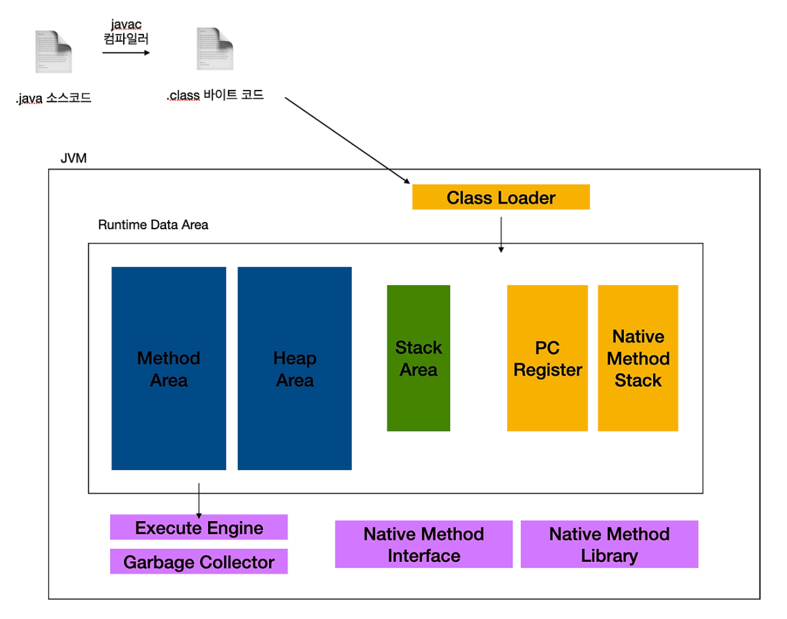
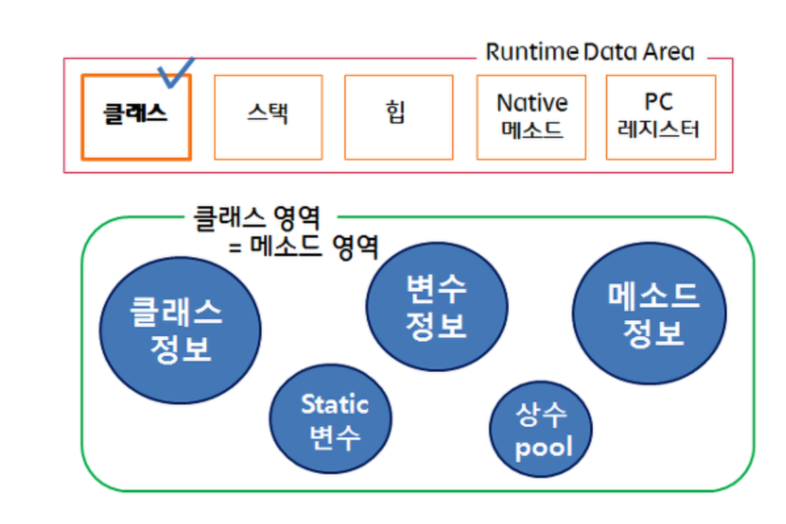

# 01. static 변수, 메서드의 차이와 자바 메모리 영역 간단 정리

> Java에서 static을 사용한다는건 시스템 시작 시 메모리에 한번 할당되어 프로그램이 종료될 때 해제되는 것을 의미  
> 참고 : https://mangkyu.tistory.com/47

- 일반적으로 우리가 만든 `클래스`는 `static`(`메서드`)`영역`에 `생성` 됨
  - `static 키워드` 통해 `static 영역에 할당된 메모리`는 `모든 객체가 공유하는 메모리`
  - GC(Garbage Collector)의 관리 영역 밖에 존재함, `static 키워드` 남발 지양
- new 연산을 통해 생성한 객체는 heap (힙)영역에 생성 됨
  - `Heap` 영역 메모리는 `GC`(`Garbage Collector`)가 `수시로 관리`

## 01-1. Static 변수(정적 변수)

```java
// 인스턴스 변수 사용
package com.test;

class MyClass {

    // 인스턴스 변수
    int count;

    public MyClass() {
        this.count++;
        System.out.println("count => " + count);
    }
}

public class Test {

    public static void main(String[] args) {
        MyClass myClass = new MyClass();
        MyClass myClass2 = new MyClass();
    }
}

// 결과
count => 1
count => 1
```

```java
// 클래스 변수 사용하는 경우
package com.test;

class MyClass {

    // 클래스 변수
    static int count = 0;

    public MyClass() {
        this.count++;
        System.out.println("count => " + count);
    }
}

public class Test {

    public static void main(String[] args) {
        MyClass myClass = new MyClass();
        MyClass myClass2 = new MyClass();
    }
}

// 결과
count => 1
count => 2
```

- `클래스 변수`는 **해당 클래스가 로드되는 시점에 딱 한 번 메모리에 할당**, 프로그램 종료 시 해제 된다
  - 메모리 효율성 증대
- 메모리에 한번 할당 되므로 여러 객체가 해당 메모리 공유
  - static final 선언이 없으면 여러 객체(해당 클래스)가 값을 공유하기에 동기화 보장 - x

## 01-2. Static 메서드(정적 메서드)

```java
// statis method -> 유틸리티 함수
public final class CommonUtils {

    // 오늘 날짜 기준 포맷 후 반환
    public static String getCurrentDate() {
        Date date = new Date();
        SimpleDateFormat dateFormat = new SimpleDateFormat("yyyy-MM-dd");
        return dateFormat.format(date);
    }

    // 이메일 유효성 여부
    public static boolean isValidEmail(String email) {
        return Patterns.EMAIL_ADDRESS.matcher(email).matches();
    }
}
```

> static method는 유틸리티 함수 만들 때 사용하면 좋을 것 같습니다

- `static method`는 `객체 생성 없이` `호출 가능`
- `객체`에서도 `호출 가능` -> 지양 필요
- `유틸리티 관련 함수` -> `다양한 곳에서 여러 번 사용` -> `static method 적합`
- `static method에서 접근`하기 위한 `변수`는 반드시 -> `statis 변수`(클래스 변수)

## 01-3. 정리

- `인스턴스`에서 `공통`으로 `사용` 해야 할 부분에는 `static` 사용
  - 인스턴스 생성(new 클래스명())시 각 인스턴스는 서로 다른 메모리 주소 할당
  - 이러한 인스턴스들은 각자 다른 값을 유지한다, 하지만 공유되어야 하는 값은 static로 선언
- `전역으로 자주 사용하는 메서드`에는 `static 사용`
  - 여러 곳에서 주로 사용하는 메서드에는 static 사용
  - 굳이 new 클래스명().메서드명() 이런식으로 호출 안해도 됨

# 02. 자바 메모리 영역 간단 정리



> 😃 추후 JVM 정리 진행 할 때 다시 정리할 예정이지만, 말이 나온 김에 간단히 정리하고 넘어간다  
> Java의 메모리 구조는 크게 메서드(static), 힙(heap), 스택(stack) 3가지 영역으로 구분된다

`자바 가상 머신`(JVM)이란 `JAVA 애플리케이션`을 `클래스 로더`(class loader)로 읽어서 `자바 API와 함께 실행하는 가상머신`이다.  
또한 JAVA와 운영체제(OS) 사이에서 중계자 역할을 수행하여 `OS`에 `구애받지 않고` 사용 할 수 있으며, 메모리 관리를 자동으로 수행해주는 스택 기반의 가상머신이다.

## 02-1. 메서드(static)



> static 영역은 Method, Class 영역이라고도 불린다(동일)

- `JVM` `동작`하여 `클래스`가 `로딩`될 때 `값 생성`
  - 클래스(class) 정보
  - 메서드(method)
  - 클래스 변수(static variable), 클래스 메서드(static method)
  - 생성자(constructor)
- 메서드 영역(method area) 데이터, 프로그램 끝날 때까지 남아있음
- 언제 어디서든 사용 가능(메모리에 존재)

## 02-2. 힙(Heap)

```java
// 참조 주소(myclass)는 스택(stack)에 존재
MyClass myclass = new MyClass(); -> heap에 존재
```

```text
---------------------------
|        Heap Area        |
|-------------------------|
| - Objects               |
| - Arrays                |
---------------------------
```

- 인스턴스 생성 시(new 키워드) 생성되는 메모리 영역
- `스택` `영역`과 다르게 `단 1개의 heap 영역`만 생성
- `주소 값`은 `스택`에 저장
- 참조 타입 값 저장
  - class(클래스)의 인스턴스
    - 인스턴스 변수(instance variable)
    - 인스턴스 메서드(instance method)
  - array(배열)
  - interface(인터페이스)
  - enum(상수)
- GC 정리 대상

## 02-3. 스택(Stack)

```text
---------------------------
|       Stack Area        |
|-------------------------|
| - Thread 1 Stack        |
|   - Local Variables     |
|   - Method Calls        |
|-------------------------|
| - Thread 2 Stack        |
|   - Local Variables     |
|   - Method Calls        |
---------------------------
```

- `메서드의` `기본 자료형`(primitive Type) 값을 저장하는 공간
  - `매개변수`
  - `지역 변수`
  - `리턴 값`
- 각 스레드별 독립적인 스택(Stack) 공간 가짐
- 메서드 실행 -> 스택 프레임 생성 -> Stack 영역 안의 메서드 호출
- 메서드 호출 -> 메모리 할당 -> 메서드 종료 -> 메모리에서 소멸

## 99. 참고 자료

- [[Java] static변수와 static 메소드](https://mangkyu.tistory.com/47)
- [[Java] static 변수와 static 메소드](https://dev-coco.tistory.com/23)
- [[JAVA] Static Keyword 와 Method Area (메소드 영역)](https://ict-nroo.tistory.com/19)
- [[Java] JVM 구조와 메모리 영역 - Method, Heap, Stack Area](https://tape22.tistory.com/28)
- [[Java] JVM 메모리 구조 파헤쳐 보기 (Static, Stack, Heap)](https://hstory0208.tistory.com/entry/Java-JVM-%EB%A9%94%EB%AA%A8%EB%A6%AC-%EA%B5%AC%EC%A1%B0-%ED%8C%8C%ED%97%A4%EC%B3%90-%EB%B3%B4%EA%B8%B0-Static-Stack-Heap)