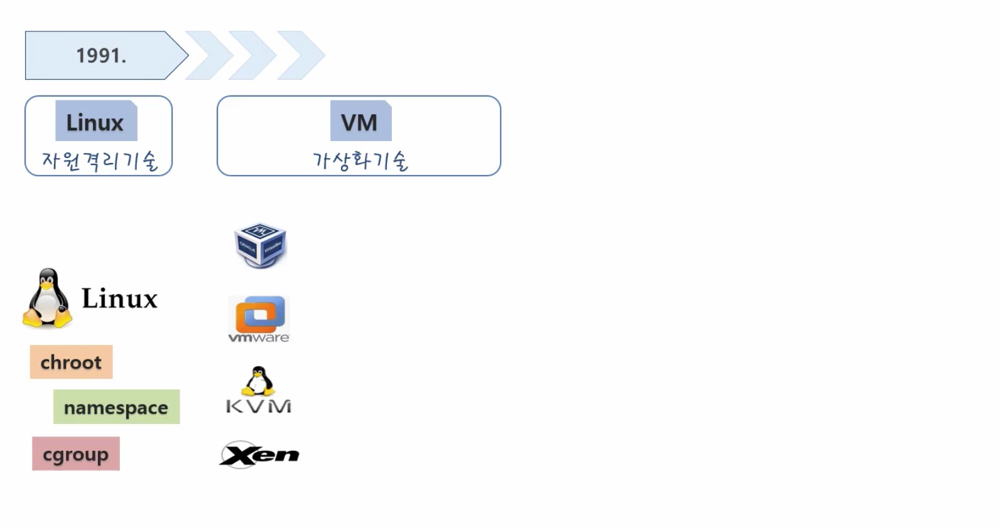
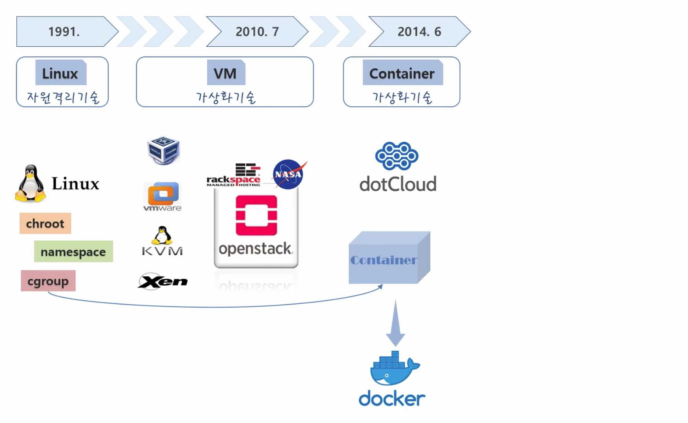
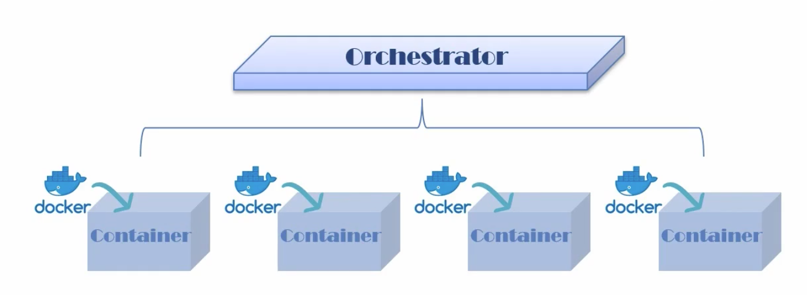
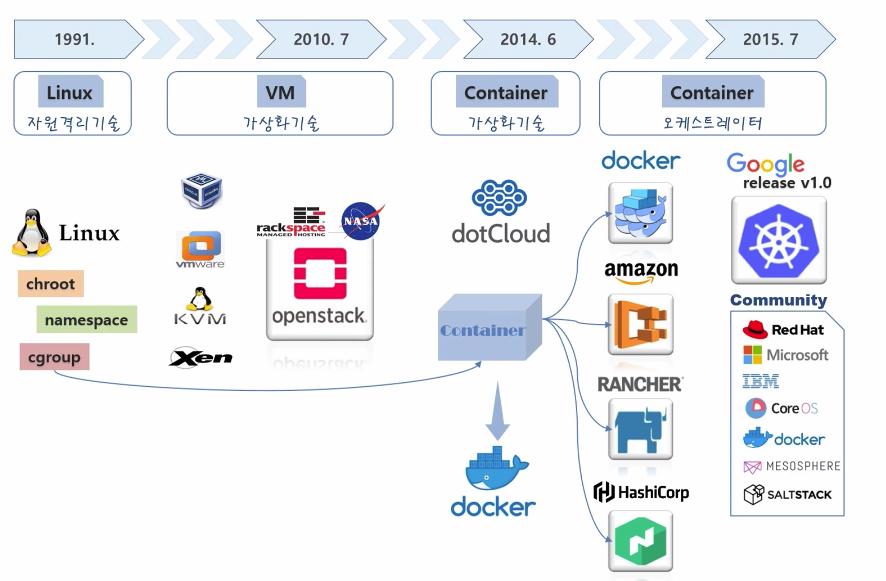
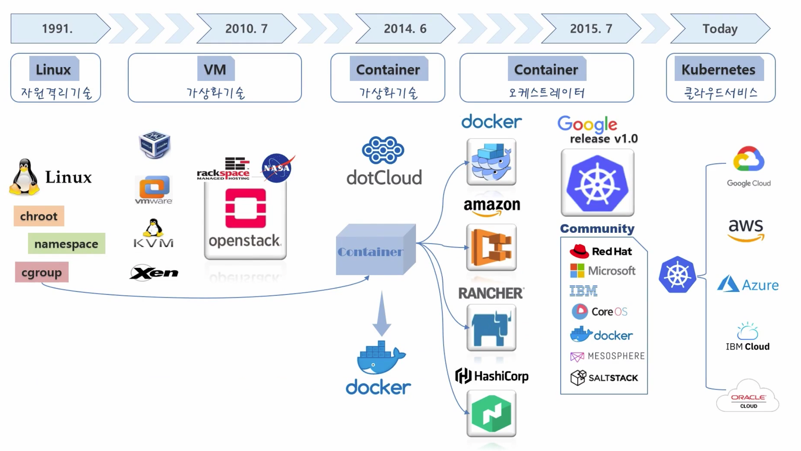

# Introduction

> 🤔 실무에서 ECS에 관련된 부분은 어느정도 감을 잡았다고 생각한다.  
> 하지만 아직 Kubernetes에 대한 지식은 조금 부족하다고 느낀 것은 물론이며,  
> 조만간 Elasticsearch를 EKS로 전환해야 할수도 있기에 Kubernetes 공부를 진행한다.

## Google Trend

개발자라면 누구나 한번쯤은 `Docker`, `Kubernetes`에 대해 들어보았을 것이다.  
`Kubernetes`는 `컨테이너 오케스트레이션 도구` 중 하나로써 위 이미지와 같이 전 세계에서 관심을 갖고,  
해당 기술을 사용하는 점유율도 점점 올라가고 있는것을 확인할 수 있다.

> 🤔 쿠버네티스를 메이저 기업(네이버, 카카오, 배민, 당근마켓 등)에서 사용하는 이유?

`큰 기업`은 `자원`을 `효율`적으로 `사용`하여 `비용`을 `절약`해야 한다.  
그러므로 `서버 자원`을 `효율`적으로 사용하기 위해 `가상화 기술`에 관심을 가질 수 밖에 없다.  

쿠버네티스를 잘 이해하려면 가상화 기술의 히스토리를 아는게 좋다.  
`왜 이 기술이 나왔는지?` or `왜 이 기술을 도입해야 하는지?`

## 가상화 도입 과정

### 1991년 경

최초의 리눅스가 나온 시점부터 꾸준한 개발을 통해서,
리눅스에서는 자원을 격리하여 프로세스가 독립적인 환경에서 돌아가게 해주는 기술이 있었다.

하지만 이러한 기술들은 사용하기 어려워 대중들은 사용을 하지 않았다.  
이 기술과는 별개로 VM 가상화 기술은 기업은 물론이고 일반인들도 쉽게 사용할 수 있을 정도로 발전하였다.

### 2010년 7월 경

그러다 `2010년 7월` 경에 락 스페이스라는 클라우드 기업과 미국 나사의 오픈스택이라는 VM을 가상화 시켜주는 오픈 소스가 등장한다.  
당시 오픈스택에 대한 개발 및 스폰서 활동이 활발하였기에 기업들은 자신의 운영 환경을 자동화 시키는 시도를 하였다.

> ❌ 하다보니 자동화는 되는 것 같은데, 시스템 효율(무거움)이 나지 않는다?

- 원인은 `VM 가상화`를 하기 위해서는 무거운 OS(Guest OS)를 띄워야 하였다
- 가벼운 서비스 하나 구동하기 위해 Host OS위에 또 OS 올려야 한다고??....

### 2014년 6월 경

2014년 6월 경에 dotCloud라는 회사는 리눅스의 어려운 자원 격리 기술을 기반으로,
컨테이너라는 개념을 도입하였으며 회사명을 Docker로 변경하는 것은 물론이며 이 기술을 오픈소스로 공개해버렸다.

컨테이너 가상화 기술은 서비스를 격리시켜주는것은 물론이며 별도의 OS를 구동할 필요가 없다.  
또한 OS를 구동하지 않기에 속도가 엄청 빠르고, 자원 효율적이다.

하지만 도커는 하나의 서비스를 컨테이너로 가상화 시켜서 배포를 해주는 역할을 하는거지,  
이렇게 배포된 수 많은 서비스들을 일일이 배포 하거나 운영하는 역할을 해주는 것은 아니다.

수 많은 서비스를 일일이 배포 + 운영해주는 개념을 컨테이너 오케스트레이션 이라고 한다.  
여러 컨테이너를 관리해주는 솔루션이라 보면 된다.

많은 회사들은 저마다의 오케스트레이터를 출시한다.  
Kubernetes는 여러 기업이 합류하여 Kubernetes에 녹여냈다.  
그래서 쿠버네티스는 거의 표준이 되었다.

## 99. 참고 자료

- [[Kubernetes] KUBETM BLOG](https://kubetm.github.io/k8s/03-beginner-basic-resource/service/)