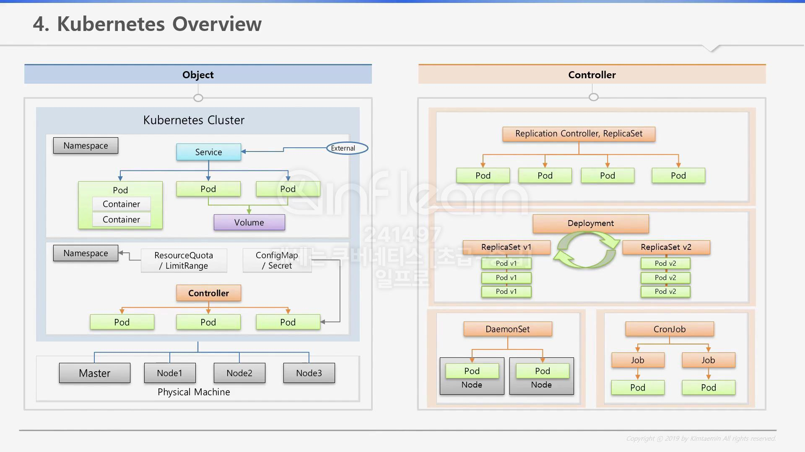
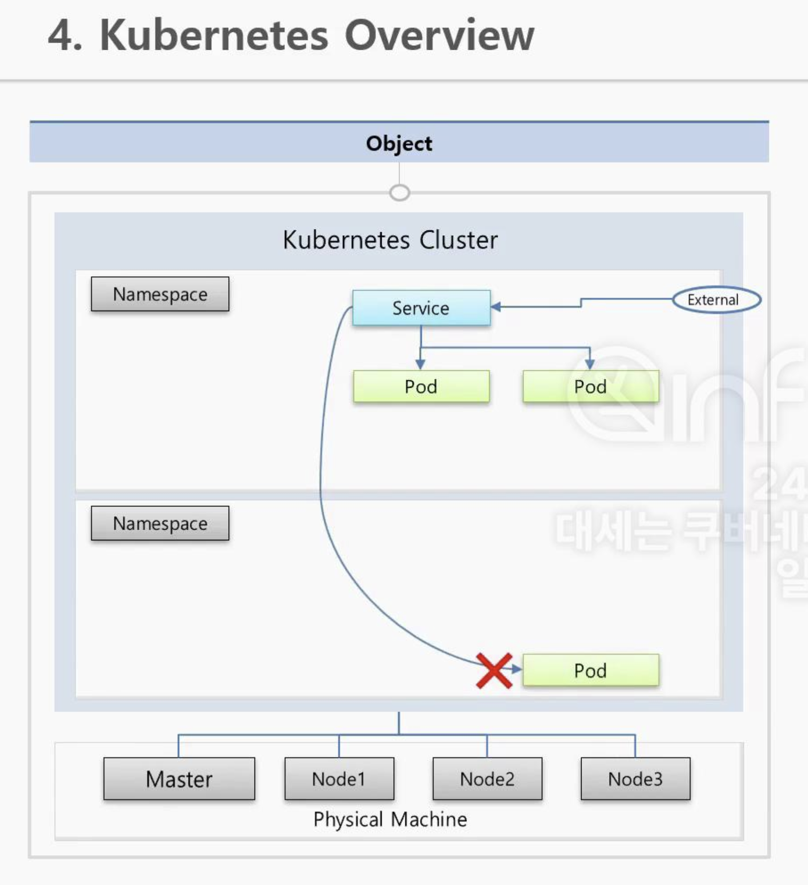
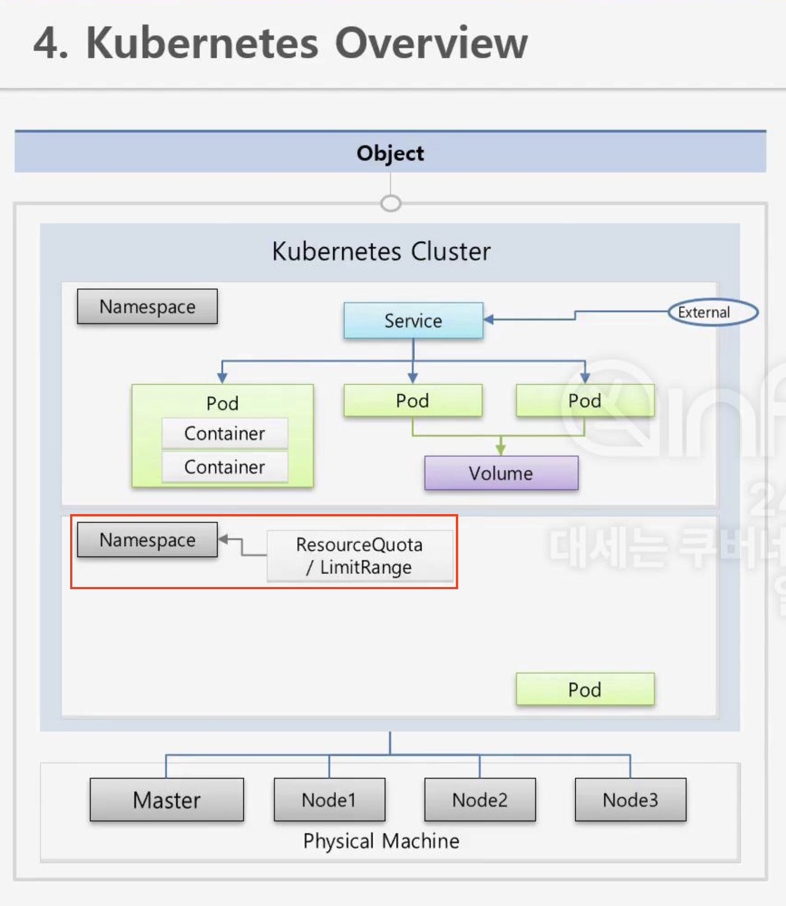
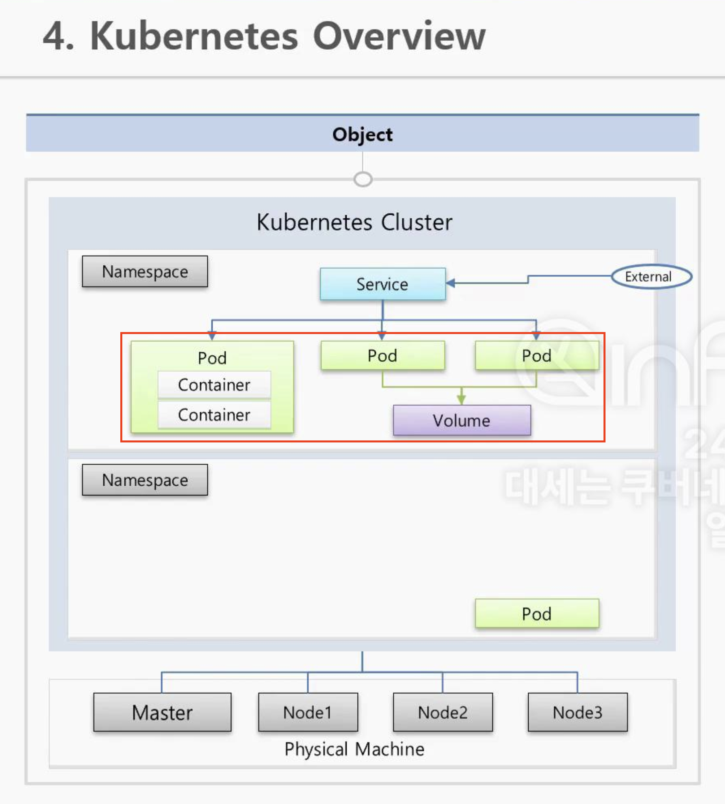
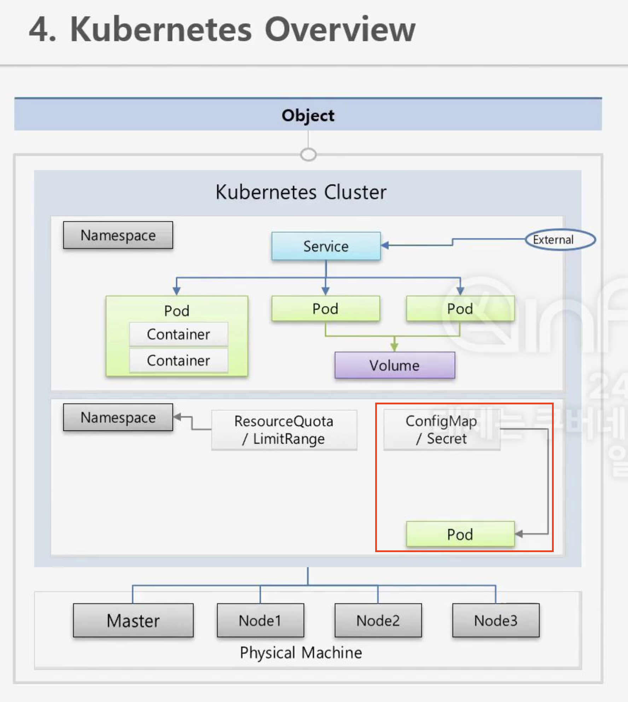
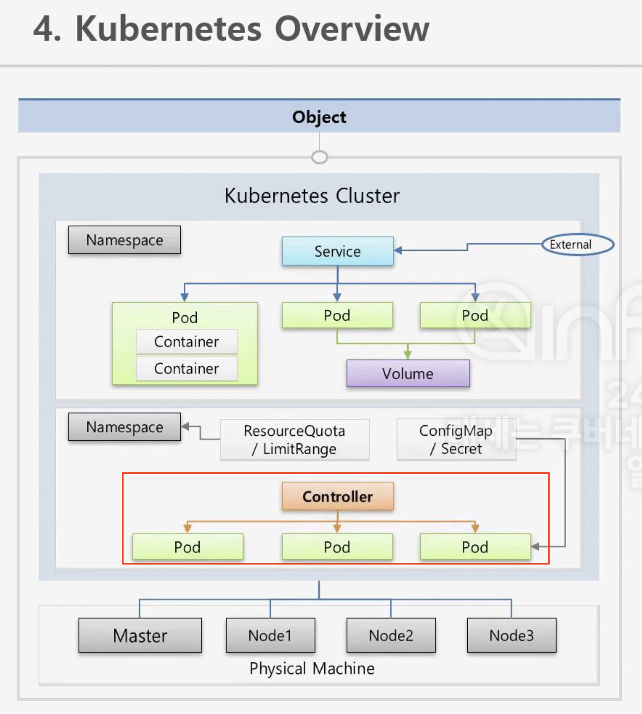
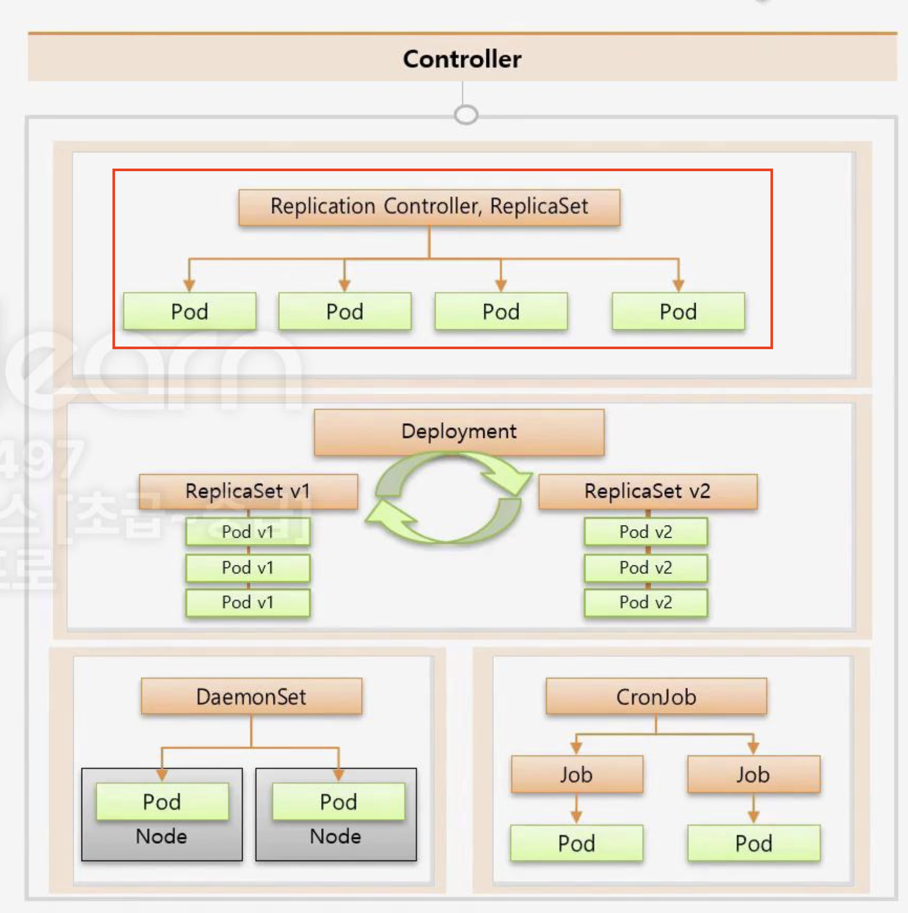
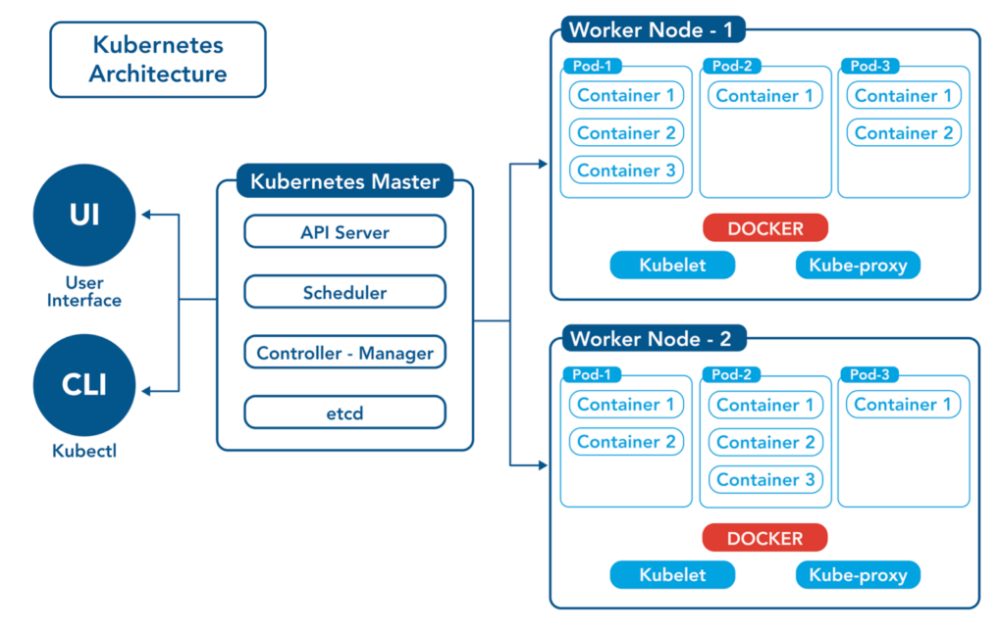

# Kubernetes Overview

## 쿠버네티스 전반 구성도 확인



Kubernetes는 `1대의 서버`에는 `Master Node`, `이외 서버`에는 `Data Node`로 구성한다.  
Master노드는 주로 클러스터 전반의 관리 및 제어를 담당하고, Data Node는 실제 서비스가 구동되는 노드이다.  
또한 master노드 + data노드를 클러스터로 구성할 수 있다.

또한 Cluster 안에 namespace 기능을 통해 k8s 오브젝트를 독립된 공간으로 분리한다.  

### ✅ 1. namespace



1. namespace에는 k8s의 최소 배포 단위인 파드(Pod)가 존재
2. 이 `파드`(`Pod`)들의 `외부 연결`이 가능하도록, `IP를 할당`해주는 `서비스`(Service)를 통해 `외부 통신`
   1. ClusterIP: `클러스터 내부 통신`
   2. NodePort: 외부 IP + 포트 통해 접근 가능
   3. LoadBalancer: 클라우드 제공자 로드 밸런서를 통한 외부 접근
3. 하지만 다른 namespace에 있는 파드와의 통신은 불가능



```yaml
apiVersion: v1
kind: ResourceQuota
metadata:
  name: rq-1
  namespace: nm-3
spec:
  hard:
    requests.memory: 1Gi
    limits.memory: 1Gi
```

1. ResourceQuota(클러스터 자원 고갈 방지)
   1. `네임스페이스별 총 리소스 사용량` 제한

```yaml
apiVersion: v1
kind: LimitRange
metadata:
  name: lr-1
spec:
  limits:
  - type: Container
    min:
      memory: 0.1Gi
    max:
      memory: 0.4Gi
    maxLimitRequestRatio:
      memory: 3
    defaultRequest:
      memory: 0.1Gi
    default:
      memory: 0.2Gi
```

1. LimitRange(파드, 컨테이너 리소스 제한)
   1. `네임스페이스`에서 `움직이는` `포드 하나하나`의 `리소스 사용량 제한`

### ✅ 2. 파드(Pod) 관련 내용



1. 이러한 Pod 안에 1개 이상의 컨테이너 동작 가능
2. 컨테이너가 재기동되는 경우를 대비하여 Volume 기능 제공



1. `Pod 생성` 시 `컨테이너 안`에 `환경 변수 값`을 넣거나 `파일`을 `마운트` 할 수 있음
   1. ConfigMap: 민감하지 않은 정보를 저장하는 오브젝트(환경 변수, 설정 파일)
   2. Secret: 민감한 정보를 저장하는 오브젝트(보안을 위해 암호화된 데이터 다룸)
   3. ConfigMap, Secret는 파일 형태로 컨테이너 특정 경로에 마운트 가능

### ✅ 3. 컨트롤러(Controller)



1. 컨트롤러를 통해 파드(Pod) 관리 가능하며, 각 구성요소는 아래와 같다

### Replication Controller, ReplicaSet



1. Replication Controller, ReplicaSet이 가장 기본 컨트롤러
2. `Pod`가 `죽으면` `자동 복구` + Pod의 개수를 자동으로 Scale-in/out 수행

### Deployment

1. 배포 후 Pod를 새로운 버전으로 업그레이드
2. 업그레이드 도중 문제 발생 시 롤백 지원

### DaemonSet

1. 1개의 노드에 1개의 Pod가 유지되도록 지원

### CronJob

1. 특정 작업 진행 후 종료되어야 하는 Pod 실행 시 사용

### ✅ 4. 정리



> 위에서 정리하였지만 각 구성요소에 대해 더 자세히 알아보자.

- 클러스터(Cluster)
  - `1개 이상`의 `노드`로 `구성`된 `논리적인 그룹`
  - `클러스터 내부`는 `Master Node`와 `Data Node`로 구분
    - `Master Node`는 클러스터 전반 `관리` 및 `제어`를 담당
    - `Data Node`는 실제 `Application`이 `호스팅`되는 `물리적 서버 공간`
- 마스터 노드(Master Node)
  - API Server(`클러스터 내 모든 요청 처리르 위한 인터페이스`)
    - `클러스터`와 `외부` 간의 `중앙 제어 인터페이스`이며 `모든 송수신 요청` 처리
    - 클러스터의 모든 구성 요소는 API Server를 통해 통신한다
  - etcd(`클러스터 상태 데이터 저장`)
    - `클러스터 상태 데이터`(`노드 상태`, `설정 정보`)를 `분산 저장`(key-value)하는 `DB`
    - `데이터 일관성`, `HA 보장` + `클러스터 복구`에 `중요한 역할`
  - Sheduler(`리소스 관리 및 파드 배치`)
    - 새로운 파드가 어떤 노드에 배치될지 결정 -> 스케쥴링 작업 수행
    - 각 노드 리소스 상태 파악, 적합한 노드에 Pod 배치
  - Controller(`클러스터 상태 모니터링 및 자동 복구`)
    - 클러스터 상태 지속적인 모니터링
    - 원하는 상태 <--> 실제 상태 일치하도록 관리
    - Pod or Node 문제 발생 -> 자동 복구
- 데이터 노드(Data Node)
  - 노드(Node)
    - 물리적 가상 서버 + 실제 APP 호스팅 공간
    - 각 노드(Node)는 1개 이상의 Pod 구동
  - 파드(Pod)
    - 하나 이상의 컨테이너로 구성, k8s의 최소 실행 단위
    - 실제 애플리케이션이 동작하는 공간
  - Kubelet
    - 각 노드에서 실행되는 에이전트(agent)
    - API Server와 통신하여 노드에서 파드가 정상 실행 되도록 관리
  - Kube-Proxy
    - 클러스터 네트워킹 관리
    - API Server와 통신하여 노드와 파드 간 네트워크 트래픽 라우팅
    - 파드 간 통신 지원

## 99. 참고 자료

- [[Kubernetes] KUBETM BLOG](https://kubetm.github.io/k8s/03-beginner-basic-resource/service/)
- [[Kubernetes] Namespace, ResourceQuota, LimitRange](https://kimjingo.tistory.com/130)