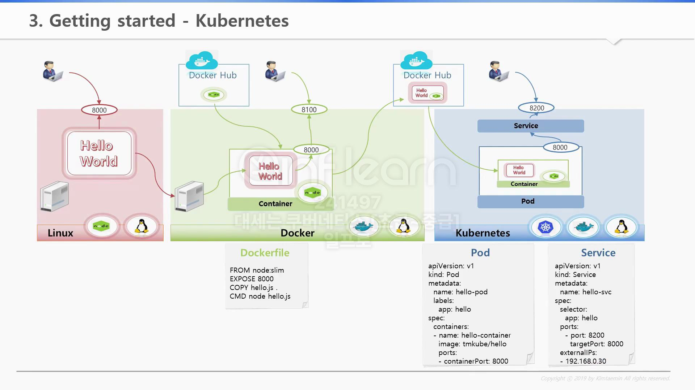

# Getting started - Kubernetes(1/2)

> 실제 도커 + 쿠버네티스 환경에서 Application을 배포하는 방법을 알아본다.

## 시나리오

1. Linux 서버에서 Hello World라는 node.js APP을 구동
   1. 해당 Linux 서버에는 node.js가 설치되어 있기에 실행 가능
2. Docker가 깔려있는 다른 서버에 와서 앞에서 만든 Hello World APP을 그대로 가지고 온다
   1. 해당 Linux 서버에는 node.js가 설치되어 있지 않기에 실행 불가
3. Docker와 Docker Hub를 사용하여 node.js 이미지를 다운로드
   1. Hello World APP을 컨테이너로 구동(Dockerfile 사용)
   2. Docker 8100:8080 포트로 컨테이너 실행
4. Kubernetes 클러스터에 배포
   1. 앞에서 만든 Docker hub 이미지 기반으로 Pod 구동

## 99. 참고 자료

- [[Kubernetes] KUBETM BLOG](https://kubetm.github.io/k8s/03-beginner-basic-resource/service/)