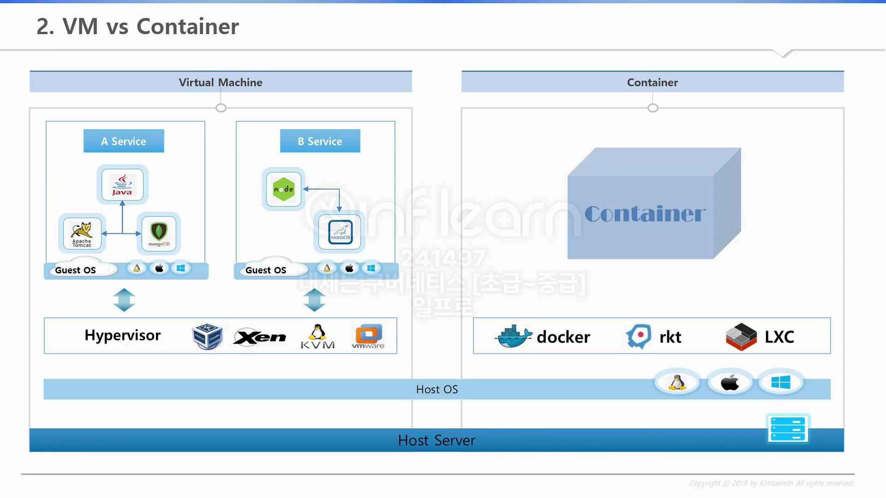

# VM vs Container

> VM과 Container의 차이에 대해 짚고 넘어간다.

## VM vs Container?

컨테이너는 운영 체제(OS) 수준에서의 가상화를 지원하며, 운영 체제의 리소스를 사용하고 커널을 공유한다는 특징을 가지고 있다.  
대표적인 VM(Virtual Machine)과 Container의 차이는 아래 표와 같다.

`운영체제/성능`, `보안`, `이식성`, `사용 사례` 등등 존재.

| 항목 | Docker (컨테이너) | 가상 머신 (VM) |
|---------------------|---------------------------------------------------------------------------------|----------------------------------------------------|
| 운영체제/성능 | 호스트 운영 체제의 커널을 공유하므로 매우 가볍고 빠르게 실행 | 각기 다른 게스트 운영 체제(OS) 필요, 전체 가상 하드웨어를 `에뮬레이트` -> 무겁고 느림 |
| 보안 | `커널 공유`, 하나의 컨테이너가 침해당하면 전체 시스템 위험 | 운영 체제와 커널은 분리됨, 각 가상 머신은 독립적으로 동작 -> `보안 안전` |
| 이식성 | `컨테이너` `크기`가 `작고` `이식성`이 `높음`, 다양한 환경에서 쉽게 배포 가능 | `OS`가 `포함된 이미지 전송` 필요, `크기 크고` `이식성` `떨어짐` |
| 가상화 방식 | `컨테이너`는 간단히 보면 `filesystem 가상화만`을 이룸  | `VM`의 `Hypervisor`는 `OS + 커널`을 `통째`로 `가상화` |
| 사용 사례 | `MSA`, `DevOps 환경`의 `경량화된 애플리케이션` `배포` 및 `확장` 필요한 경우 적합 | 여러 운영 체제를 동시에 실행 or 강력한 격리와 보안이 필요한 환경 |

### VM(Virtual Machine)

기본적으로 VM(Virtual Machine)은 H/W 위에 운영체제가 설치되고 그 위에 Hypervisor가 설치된다.  
이후 Hypervisor 위에 게스트 OS가 설치가 되고 이 위에 애플리케이션이 실행되게 된다.

하지만 VM을 쓰는것은 Hypervisor 위에 독립적인 Guest OS를 설치하는 것이기에 무겁고 느리다.  
그렇다면 컨테이너는 어떨까?

### Container

Container도 H/W 위에 Host OS가 설치되는 부분까지는 동일하다. 하지만 Container는 Host OS 위에  
Hypervisor가 아닌 Container Engine(Docker, rkt.. 등)이 설치된다. 후에 해당 Container Engine 위에  
애플리케이션이 실행되는 구조다.

> Docker는 Container라는 것을 만들게 되는데 아래는 Container에 대한 설명이다

Linux마다 버전(6, 7)이 존재하고, 이 버전에 따라 기본적으로 설치되는 라이브러리(lib)가 다르다.  
만약 Linux 6버전에서 개발을 하다 보면, Linux 6버전의 OpenJdk 1.6 버전을 사용하게 된다.  
후에 개발 완료 후 Linux 7버전에서 띄우면 버전 차이에 따른 문제가 발생하게 된다.

Docker를 설치하면 Container 이미지를 만들 수 있다.  
이러한 이미지에는 서비스와 필요한 라이브러리(lib)가 포함되어 있어  
Linux 버전에 상관없이 Docker만 설치되어 있으면 안정적으로 작동한다.

또한 Docker가 해주는것이 자원의 격리와 제한을 해주는데, namespace와 cgroup을 통해 구현이 가능하다.  
namespace와 cgroup은 [다음 링크](https://github.com/ym1085/TIL/blob/master/Docker/Linux_namespace_cgroup/README.md)를 참고하자.

### VM vs Container

> 모놀리틱 아키텍처와 마이크로서비스 아키텍처

일반적으로 우리는 서비스를 만들 때 1가지 언어를 사용해 여러 모듈이 1개의 서비스로 돌아간다.  
만약 A, B 모듈은 괜찮은데 C 모듈에 문제가 있으면 VM을 하나 더 띄워야 하기에 자원 낭비로 이어진다.

반면 컨테이너는 서비스를 만들 때 모듈별로 쪼개서 컨테이너별로 만드는것을 권장한다. 또한 그 모듈에 맞는 언어를 사용하는것이 효율적이다. 여기서 Kubernetes는 1개 이상의 컨테이너를 Pod에 담을 수 있으며, 이러한 1개의 Pod가 Kubernetes의 최소 배포 단위가 된다.

## 99. 참고 자료

- [[Kubernetes] KUBETM BLOG](https://kubetm.github.io/k8s/01-beginner-index/)