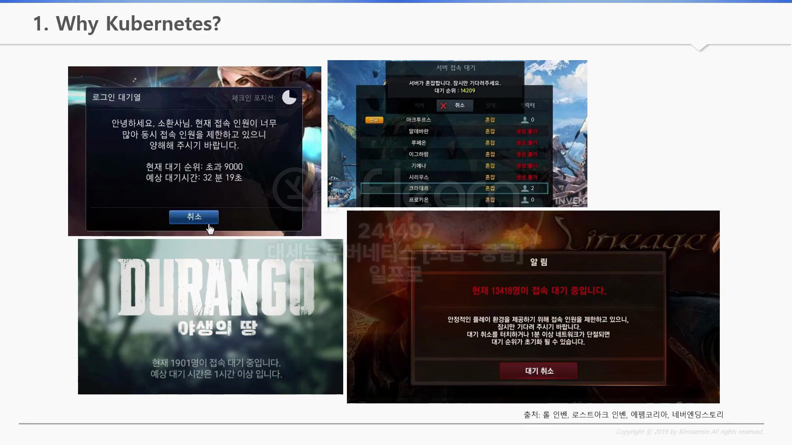
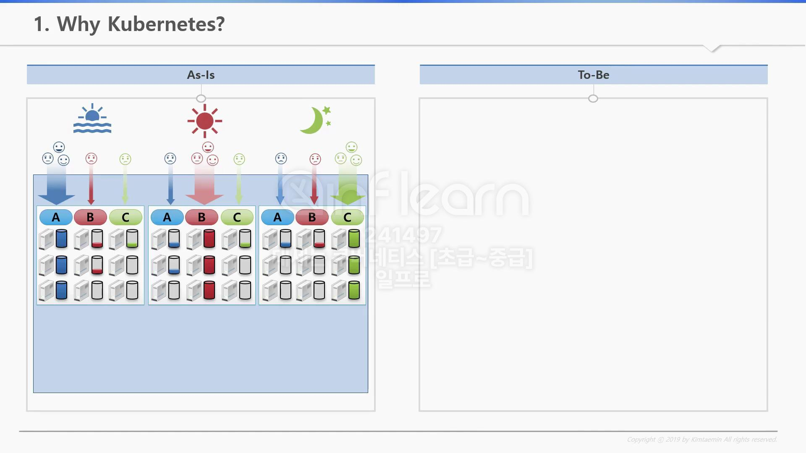
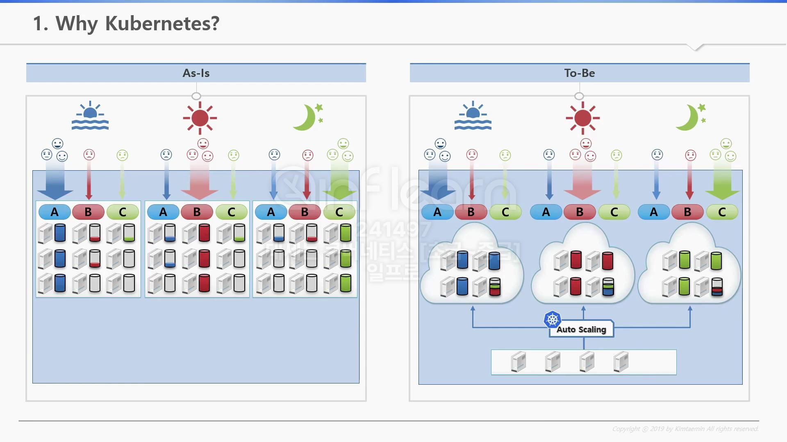
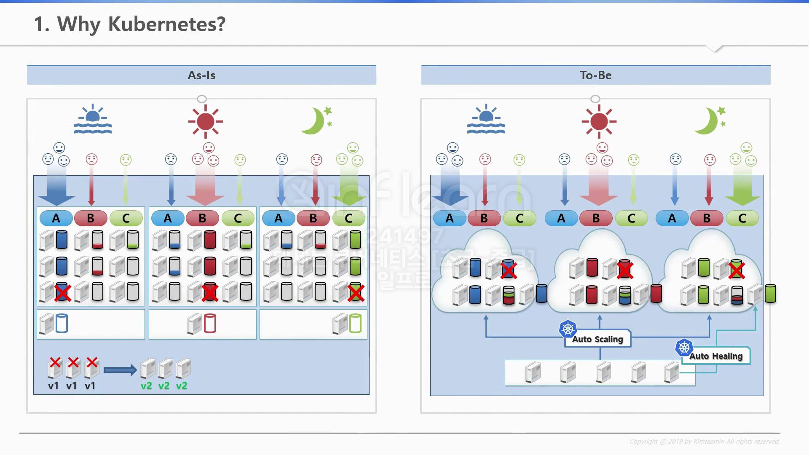

# Why Kubernetes?

> 왜 쿠버네티스를 사용해야 하는가?  
> 이번에는 쿠버네티스가 서비스 운영에서 어떤 부분을 자동화해주는지 알아본다

## 대량 트래픽으로 인한 서버 지연?

서버 자원이 안정적일 때 우리는 좋은 서비스를 제공해줄 수 있다.  
하지만 대부분의 사용자는 위 이미지와 같이 지연을 경험한 적이 있을 것이다.

## 일반적인 서버의 처리 방법

> 9대의 고정적인 서버 리소스 필요

- 한 회사에서 3개의 서비스(Application)을 운영중
- A 서비스는 아침에만 점유율이 높고, B 서비스는 정오, C 서비스는 저녁에 점유율이 높다
- 결국 `A, B, C 서버`의 `리소스`를 `동적`으로 `제어`하지 못한다
- 또한 이슈 대응을 위해 항상 `백업 서버`를 준비해야 한다
  - 기존 9대 + 3대 서버 추가

## Kubernetes의 트래픽 처리 방법

- 쿠버네티스는 리소스 점유율에 따라 AG(Auto Scailing Group)사용하여 동적 리소스 관리 지원
- 최초에는 4대이지만 트래픽에 따라 리소스를 유연하게 조정 가능
- 또한 이슈 대응을 위해 `Auto Healing` 사용 가능
  - `Kubernetes`의 `Auto Healing` `기능`을 통해 `장애 해결 가능`

### 업데이트 방식 비교

- 서비스 중단 허용 되는 경우
  - 모든 서버 내리고, 업데이트 진행
- 서비스 중단 허용 안되는 경우
  - 1대의 서버씩 작업 진행
- `쿠버네티스`
  - `deployment 오브젝트`를 통해 업데이트 처리

### 왜 Kubernetes를 사용해야 하는가?

`Kubernetes`는 `컨테이너화`된 `애플리케이션`의 `배포`, `확장` 및 `관리`를 `자동화`하는 `오픈소스 플랫폼`이다  
`Google`에 의해 개발되었으며, 클라우드 환경에서 `애플리케이션`을 `효율적`으로 `운영`하도록 `설계`되었다.

`Kubernetes`는 `복잡한 컨테이너 관리`를 `자동화` 함으로써 `개발자`와 `운영자`는,  
`인프라`에 대한 `걱정`보다 `애플리케이션 레벨에 좀 더 집중` 할 수 있다.

`Kubernetes`는 `여러 컨테이너 배치`, `스케일링` 및 `네트워킹 관리`를 `지원`한다.  
또한 이를 통해 `고가용성`, `확장성`, `장애복구`와 같은 `기능`을 지원한다.

> 🔥 Kubernetes를 사용하는 대표적인 이유  
> 👉 애플리케이션의 배포 및 운영을 자동화하고 개발 및 운영 효율성 증대를 위함

1. ✅ 컨테이너화된 애플리케이션 배포
   1. 컨테이너로 패키징된 애플리케이션을 여러대의 컴퓨터에 쉽게 배포 가능
2. ✅ 자동 스케일링(Auto Scailing)
   1. 애플리케이션 부하에 따라 자동 확장/축소 가능
   2. 간단한 명령으로 애플리케이션 수평 확장 가능
3. ✅ 고가용성(High Availability)
   1. 애플리케이션을 여러 서버에 복제, 하나의 서버에 장애 발생하여도 시스템 동작 가능
4. ✅ 장애복구(Self-healing)
   1. 애플리케이션 문제 발생 시 자동으로 복구 및 롤백 지원
   2. 지속적인 Health Checking을 통해 자동으로 복구 및 롤백 지원
5. ✅ 자동 컨테이너 배치(Automatic container placement)
   1. CPU/MEM 기반 적절한 노드에 컨테이너 자동 배치를 통해 비용 절감 가능
6. ✅ 서비스 발견 및 LB(Service Discovery and LB)
   1. 각 컨테이너에 고유 IP 부여 + DNS 통해 서비스 간 통신 간소화
   2. 트래픽 증가 시 LB를 통해 안정적 서비스 운영 지원
7. ✅ 스토리지 오케스트레이션(Storage Orchestration)
   1. 로컬 or 클라우드 기반의 storage 자동 마운트 및 관리 지원

## 99. 참고 자료

- [[Kubernetes] KUBETM BLOG](https://kubetm.github.io/k8s/01-beginner-index/)
- [[F-Lab] 쿠버네티스(Kubernetes)의 기본 개념과 도입 이유](https://f-lab.kr/insight/basic-concepts-and-reasons-for-adopting-kubernetes)
- [[goormblog] {개발자}로 자라기 – 쿠버네티스, 왜 배워야 할까?](https://blog.goorm.io/kdt_kubernetes/)