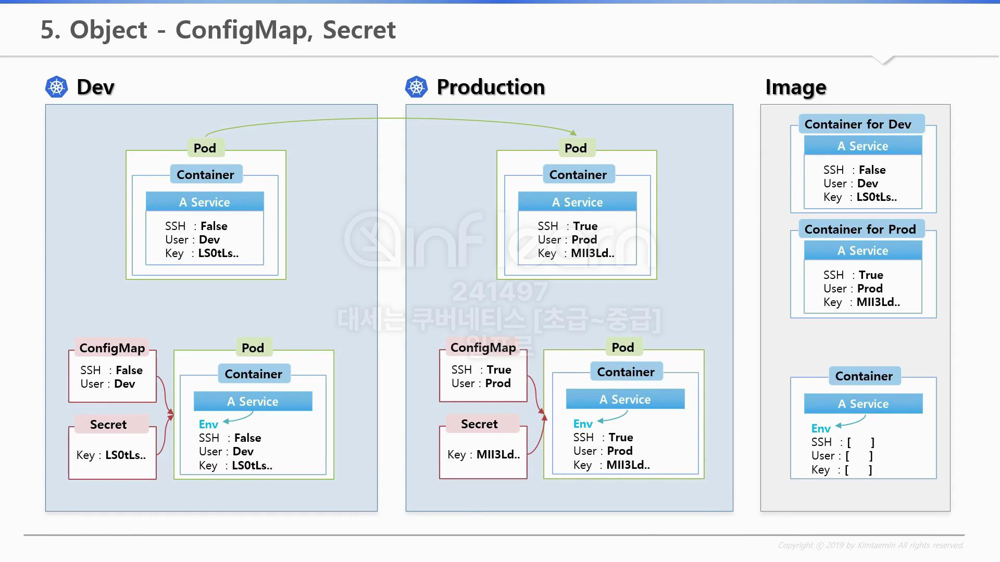
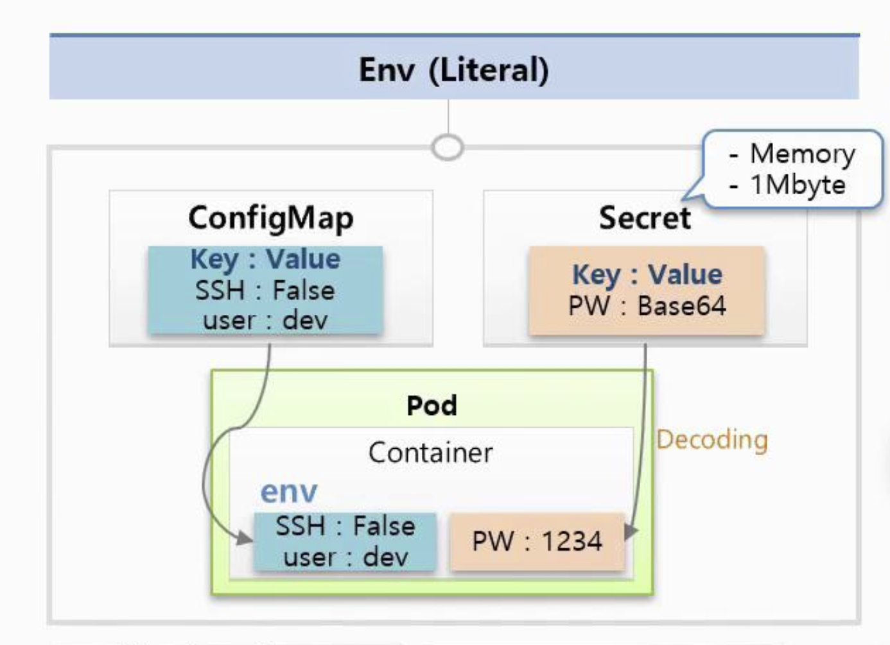
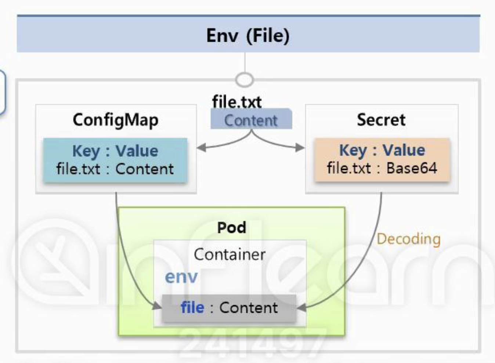
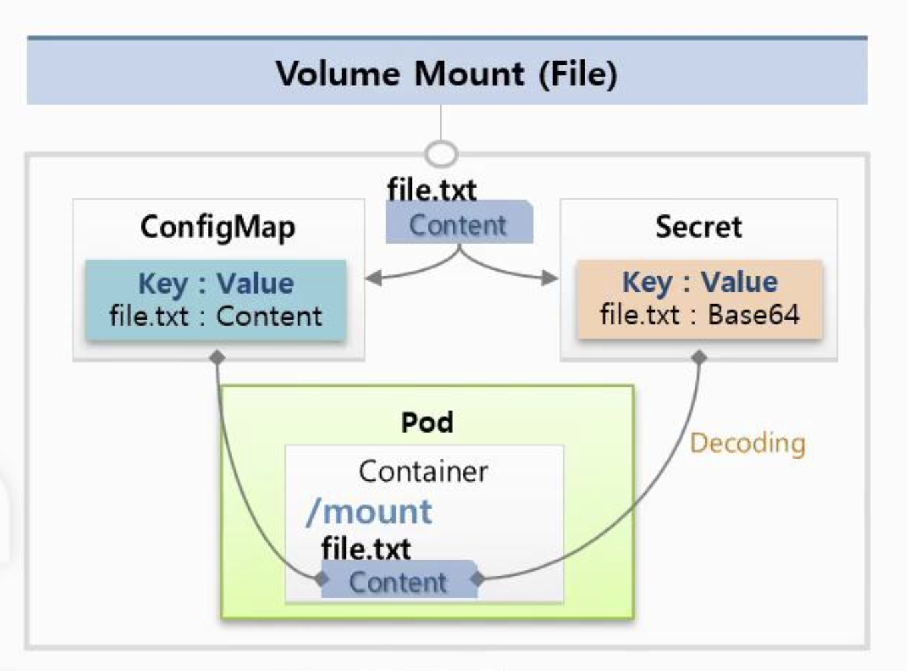

# ConfigMap, Secret - Env, Mount

> 우선 ConfigMap, Secret을 사용해야 하는 경우에 대해 알아보자

## Object - ConfigMap, Secret



개발 환경(DEV)와 상용 환경(PROD)가 있다고 가정 한다.  
우선 개발 환경(DEV)에서는 SSH: False, User: Dev, Key: LS0tls..로 설정이 되어 있으며,  
상용 환경에서는 SSH: True, User: Prod, Key: MII3LD.. 로 설정이 되어 있다.

이러한 부분만 보았을때 서비스의 환경변수를 각각 설정하기 위해서는 2개의 Docker Image가 필요한 상황이다.  
근데 너무 비효율적이지 않은가(이미지 내용은 동일하니까)? 그래서 개발 환경에서 사용할 환경 변수(ENV)와  
상용 환경에서 사용할 환경 변수(ENV)를 설정할 수 있는 방법이 필요하다.

k8s에서 제공하는 ConfigMap, Secret 기능을 사용하면 외부에서 이러한 환경 변수(ENV)를  
동적으로 Pod가 구동되는 시점에 환경 변수로 넣어줄 수 있다.

ConfigMap은 환경(DEV, PROD, STG)별로 구분이 되어야 하는 상수 값을 Key/Value 형태로 저장해주고,  
Secret은 외부에 노출되면 안되는 중요한 값을 저장할 때 사용이 되는 저장소라 생각하면 된다.

> 😀 파드 생성 -> ConfigMap or Secret 연동 -> 환경 변수를 Pod 내에서 사용 가능  
> 결론은 환경에 따라 구분되어야 하는 환경변수를 동적으로 Container에 할당할 때 사용

## Object - ConfigMap, Secret 사용 방법

`ConfigMap`을 통해 환경 변수(ENV)를 넣을 수 있는 방법은 총 아래 `3가지` 이다.

1. Env(Literal : 수동 주입)
2. Env(File : 파일 주입)
3. Env(Volume Mount : 파일 마운트)

### Env(Literal : 수동 주입)



> ConfigMap: key, value를 무한대로 넣을 수 있음  
> Secret: Mem을 사용하기 때문에 -> key, value 만드는데 1MB까지만 사용 가능

```yaml
# ConfigMap
apiVersion: v1
kind: ConfigMap
metadata:
  name: cm-dev
data:
  SSH: False
  User: dev
---
# Secret
apiVersion: v1
kind: Secret
metadata:
  name: sec-dev
data:
  Key: MTIZzNA==
---
# Pod
apiVersion: v1
kind: Pod
metadata:
  name: pod-1
spec:
  containers:
    - name: container
      image: tmkube/init
      envFrom: # Env 환경 변수 읽기
        - configMapRef:
          name: cm-dev
        - secretRef:
          name: sec-dev
```

ConfigMap은 Key와 Value로 구성이 되어 있다. 그렇기에 ConfigMap에 필요한 상수들을 정의한 후  
Pod가 구동될 때 해당 ConfigMap을 사용하면, 환경 변수(ENV)가 자동으로 Container에 할당된다.

Secret도 마찬가지로 Key와 Value로 구성이 되어 있다.  
ConfigMap과 다른점은 Value 값을 넣을 때 Base64 Encoding을 해서 값을 만들어야 한다는 차이가 존재하며,  
Pod로 Secret 값이 주입될 때는 자동으로 Decoding이 되어서 환경변수(ENV)에서는 평문 값이 보이게 된다.  
또한 `일반적인 오브젝트`들의 값들은 `k8s`의 `DB`에 저장이 되는데, `Secret`은 `Mem`(메모리)에 저장이 된다.

### Env(File : 파일 주입)



```shell
# configMap 생성
k create configMap cm-file --from-file=./file.txt

# secret 생성
k create secret generic sec-file --from-file=./file.txt
```

```yaml
# Pod 생성 - configMap 사용
apiVersion: v1
kind: Pod
metadata:
  name: file
spec:
  containers:
    - name: container
      image: tmkube/init
      env:
        - name: file
          valueFrom:
            configMapKeyRef:
              name: cm-file
              key: file.txt
```

```yaml
# Pod 생성 - secret 사용
apiVersion: v1
kind: Pod
metadata:
  name: file
spec:
  containers:
    - name: container
      image: tmkube/init
      env:
        - name: file
          valueFrom:
            secretKeyRef:
              name: sec-file # 생성한 Secret 이름
              key: file.txt # Secret의 키 이름 (파일명)
```

위 이미지와 같이 특정 파일(File)을 통으로 ConfigMap에 담을 수 있다.  
이럴때 파일 이름이 Key가 되고, 파일 안의 내용이 Value가 되어 ConfigMap이 생성이 된다.

여기서는 파일명이 Key가 되면 이상하니, Key 이름은 새로 정의해서 Value만 컨텐츠로 들어가도록 정의한다.  
주의할 부분은 위 커멘드(CLI)를 사용하면 내용(Value)이 Base64로 변경되기에, 파일 안의 내용이 이미 Base64인 경우  
2번 인코딩이 될 수 있기에 유의 하여야 한다.

### Env(Volume Mount : 파일 마운트)



```yaml
# Pod 생성 - 환경 변수 파일 마운트
apiVersion: v1
kind: Pod
metadata:
  name: mount
spec:
  containers:
    - name: container
      image: tmkube/init
      volumeMounts:
        - name: file-volume
          mountPath: /mount
  volumes:
    - name: file-volume
      configMap:
        name: cm-file
```

파일 마운트 역시, 위에서 파일을 주입하는 방식과 모든 부분이 동일하다.  
하지만 Pod를 만들 때 Container 안에 Mount Path를 정의하고 해당 Path에 파일을 마운트하면 된다.

> 😃 중요한 부분!
>
> 여기서 중요한 부분은 파일 주입의 경우 ConfigMap에 수정이 있어도 이미 할당된 환경변수(ENV)에는 영향을 주지 않는다.  
> 이에 반해 환경변수(ENV)를 파일 마운트 한 경우에는 ConfigMap을 수정하게 되면 기존 Container의 ENV에도 영향을 미친다.
