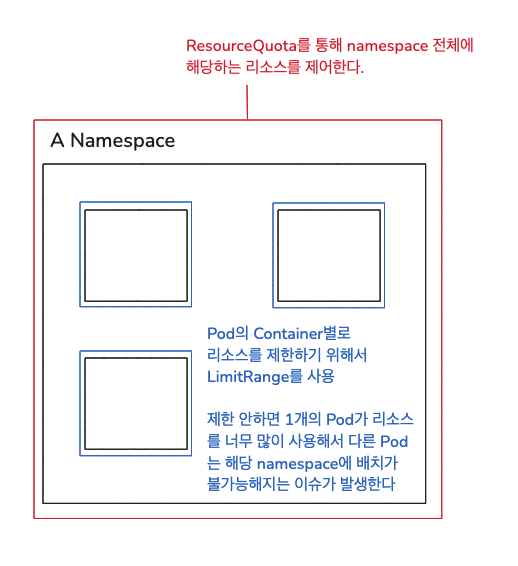

# Namespace, ResourceQuota, LimitRange

> 우선 Namespace, ResourceQuota, LimitRange을 왜 사용해야 하는지 알아보자

쿠버네티스 클러스터에서 전체 사용 가능한 리소스(CPU, MEM)이 존재한다.  

이러한 클러스터 안에는 여러 네임스페이스(namespace)들을 만들 수 있으며,  
이러한 네임스페이스(namespace) 안에는 여러개의 파드를 생성할 수 있다.

각각의 파드는 필요한 자원을 클러스터 자원을 공유하여 사용을 하게 되는데,  
만약 한 네임스페이스(namespace) 안의 파드(Pod)가 클러스터 안의 남은 자원을 모두 사용해버리면  
다른 Pod에서 자원이 필요할 때 문제가 발생할 수 있다.

> 이러한 문제를 해결하기 위해 나온 개념이 ResourceQuota, LimitRange  
> `ResourceQuota`  
> => 네임스페이스 전체에서 총합으로 사용할 수 있는 리소스를 제한
>
> `LimitRange`
> => 네임스페이스 내 각 컨테이너가 사용할 수 있는 리소스를 제한



`ResourceQuota`를 `namespace마다 설정`하면, `namespace마다` `최대 한계`를 설정할 수 있다.  
그래서 파드의 자원이 ResourceQuota에서 설정한 한계치를 넘을 수 없으며, 파드에 문제가 생길지 언정  
다른 namespace에 존재하는 파드에는 영향을 주지 않는다.

또한 하나의 파드가 자원을 너무 많이 사용하는 경우, 다른 파드가 namespace에 배치되지 못하는 현상이 발생한다.  
이러한 부분을 방지하기 위해 `LimitRange`를 사용하는데, `LimitRange`를 사용하게 되면 `Pod`에 배치된 `Container`가  
`LimitRange`에 `설정된 값`(`조건`)에 `부합`되어야 `해당 Pod가 namespace에 배치`될 수 있다.

> 조금 와닿지 않을수도 있을 것 같은데, 일상 생활의 헬스장을 예로 들어보자.  

ResourceQuota는 헬스장 전체에서 기구의 수와 회원 수를 제한하는 규칙이라 봐도 좋다.  
예를 들면 헬스장 전체에서 총 10개의 기구와 100명의 회원만 들어올 수 있도록 제한 형태.

LimitRange는 회원이 사용하는 기구의 수와 시간을 제한하는 규칙이라 봐도 좋다.  
예를 들면 1명의 회원당 1개의 기구와 최소 10분, 최대 2시간까지만 허용하는 형태.

## Namespace

```yaml
# namespace-01
apiVersion: v1
kind: Namespace
metadata:
  name: nm-1
---
apiVersion: v1
kind: Pod
metadata:
  name: pod-1
  namespace: nm-1
  labels:
    nm: pod1
spec:
  container:
  ...중략
```

```yaml
# namespace-2
apiVersion: v1
kind: Namespace
metadata:
  name: nm-2
---
apiVersion: v1
kind: Service
metadata:
  name: svc-1
  namespace: nm-2
spec:
  selector:
    nm: pod1 # 이거 불가능할텐데..?? namespace 달라서
  ports:
  ...중략
```

1개의 Namespace 안에서 같은 종류의 k8s 리소스(Pod, Service, ConfigMap, Secret 등등)들은 동일한 이름(중복 불가)을 가질 수 없다.  
예를 들어 같은 폴더 내에서는 동일한 파일 이름이 존재할 수 없지만, 다른 폴더인 경우 동일한 파일 이름이 존재하는 예시와 비슷하다.

k8s에서는 A 네임스페이스와 B 네임스페이스가 완전히 분리되어 관리된다.  
각 네임스페이스는 독립된 공간으로, 다른 네임스페이스의 리소스와 격리되어 동작한다.  

따라서 한 네임스페이스의 리소스는 다른 네임스페이스에 직접 접근할 수 없으며,  
특정 네임스페이스에서 만든 자원은 해당 네임스페이스 내에서만 사용 가능하다.

물론 볼륨(PV)와 Node처럼 모든 네임스페이스에서 공용으로 사용하는 Kubernetes 오브젝트도 있으며,  
네임스페이스를 삭제하면 그 안의 모든 자원도 함께 삭제된다.  

또한, A 네임스페이스의 Pod1이 B 네임스페이스의 Pod2의 IP를 통해 접근할 수 있으며,  
NetworkPolicy를 통해 이 접근을 제한할 수 있다.

## ResourceQuota

```shell
requests.memory: 3Gi # 네임스페이스 내 최소 보장 메모리
limits.memory: 6Gi # 네임스페이스 내 최대 사용 가능한 메모리
```

`ResourceQuota`는 네임스페이스에 지정하며, 특정 네임스페이스에 할당된 모든 리소스에 대해 제한하는 오브젝트이다.  

## LimitRange