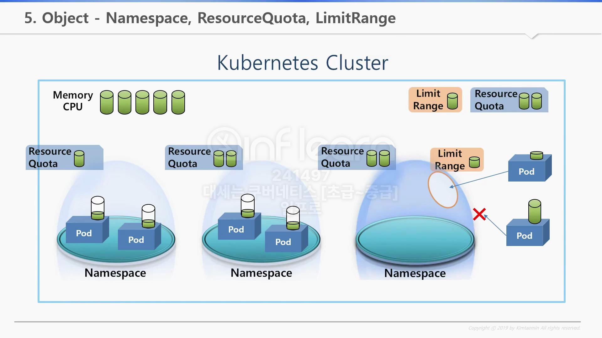
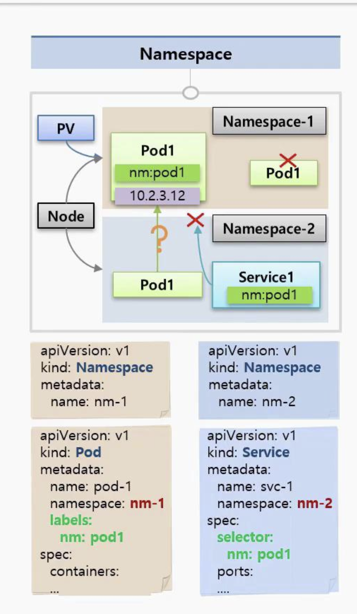
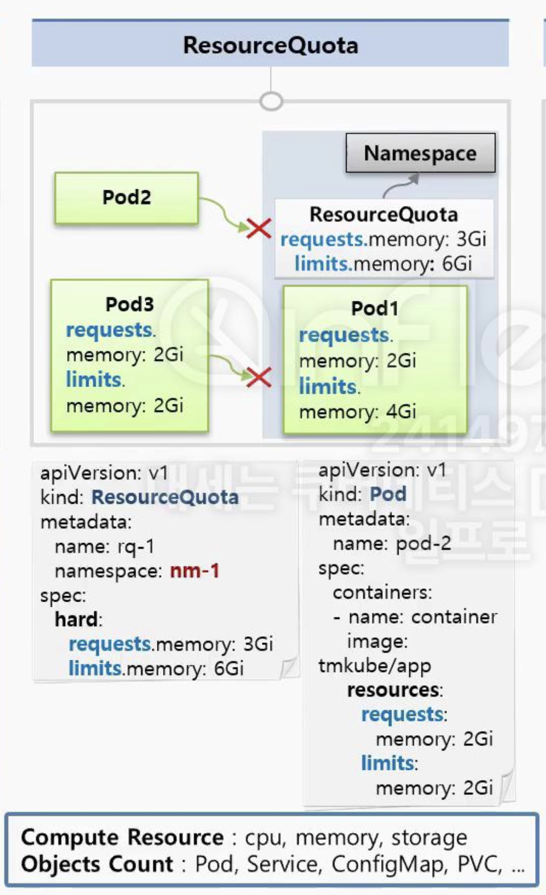
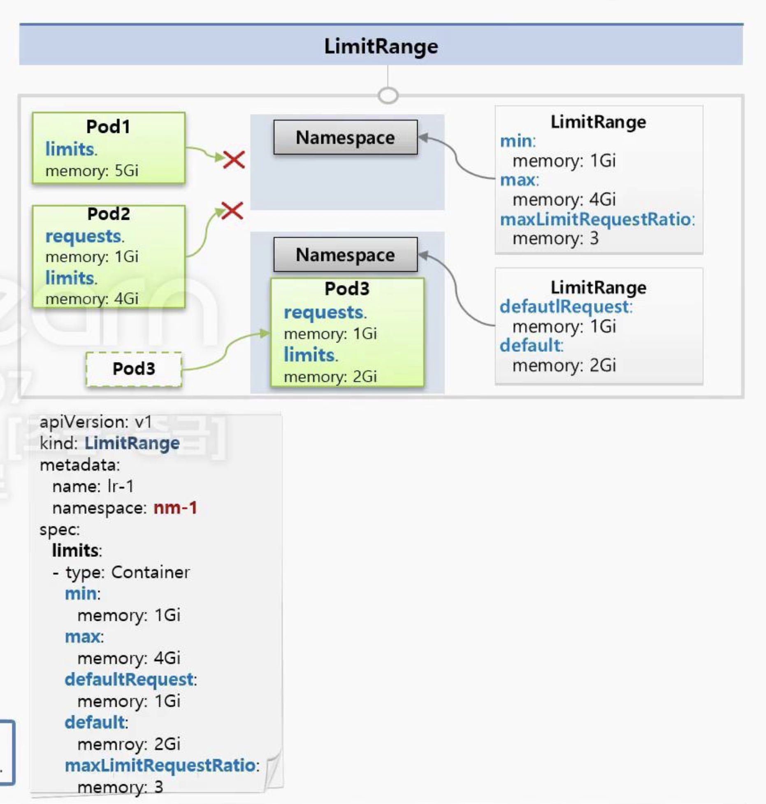

# Namespace, ResourceQuota, LimitRange



> 우선 Namespace, ResourceQuota, LimitRange을 왜 사용해야 하는지 알아보자

`k8s 클러스터`에서는 `전체 사용 가능한 리소스`(CPU, MEM)를 `제공`한다.

이러한 `클러스터 안`에서는 `여러 네임스페이스`(`namespace`)들을 만들 수 있으며,  
이러한 `네임스페이스`(`namespace`) `안에는` `여러개`의 `파드`를 `생성`할 수 있다.

`각각의 파드`에서는 `클러스터 자원을 공유`하여 `사용`을 하게 되는데,  
만약 `1개의 네임스페이스`(`namespace`) 안의 `파드`(`Pod`)가 `클러스터 안의 남은 자원을 모두 사용`해버리면  
`다른 Pod`에서 `자원`이 `필요`할 때 `문제`가 `발생`할 수 있다.

이러한 문제를 해결하기 위해 나온 개념이 `ResourceQuota`와 `LimitRange`다.

| 구분      | ResourceQuota                      | LimitRange                                   |
| --------- | ---------------------------------- | -------------------------------------------- |
| 적용 범위 | 네임스페이스 전체                  | 개별 Pod or Container                        |
| 사용 목적 | 네임스페이스 리소스 총량 제어      | Pod/Container별 리소스 최소/최대 사용량 제어 |
| 적용 예시 | 전체 Pod 수, 네임스페이스 CPU 총량 | 컨테이너별 CPU 최소/최대 사용량              |


- `ResourceQuota`
  - ResourceQuota를 namespace마다 설정하면 namespace마다 최대/최소 한계 설정 가능
  - 특정 namespace의 파드 자원이 ResourceQuota에서 설정한 한계값을 넘길 수 없음
  - 특정 namespace의 파드에 문제가 생겨도, 다른 namespace에 영향 안줌
- `LimitRange`
  - 특정 namespace 내에서 1개의 파드가 자원을 너무 많이 사용하는 경우, 다른 파드는 해당 namespace에 구동 불가
  - 위 부분을 방지 하기 위해 LimitRange를 사용
  - LimitRange를 사용하면 Pod의 Container가 LimitRange에 설정한 값/조건에 맞아야 해당 namespace에 배치 가능

## Namespace



```yaml
# 예시 : namespace 01
---
apiVersion: v1
kind: Namespace
metadata:
  name: nm-1
---
apiVersion: v1
kind: Pod
metadata:
  name: pod-1
  namespace: nm-1
  labels:
    nm: pod1
spec:
  container:
  ...중략
```

```yaml
# 예시 : namespace 02
---
apiVersion: v1
kind: Namespace
metadata:
  name: nm-2
---
apiVersion: v1
kind: Service
metadata:
  name: svc-1
  namespace: nm-2
spec:
  selector:
    nm: pod1 # 이거 불가능할텐데..?? namespace 달라서
  ports:
  ...중략
```

- 1개의 namespace안에서 같은 종류의 k8s 리소스(Pod, Service..등등)은 `중복된 이름 사용 불가`
- `namespace`는 `독립된 공간`으로 완전히 분리되어 관리됨
  - `A namespace`는 `B namespace`에 `접근 불가능`, `namespace 내에서만 접근 가능`
- `namespace`를 `삭제`하면 해당 namespace 안의 `모든 k8s 리소스는 삭제됨`
- 원래 불가능하지만, A namespace -> B namespace의 Pod IP를 통해 접근 가능 -> NetworkPolicy 설정

## ResourceQuota



```shell
# namespace 안에 있는 모든 pod가 사용할 수 있는 메모리 양이
# 요청 메모리 합산: 3Gi -> soft
# 최대 메모리 합산: 6Gi -> Hard
requests.memory: 3Gi # 최소 보장 메모리
limits.memory: 6Gi # 최대 사용 가능 메모리
```

```yaml
apiVersion: v1
kind: ResourceQuota
metadata:
  name: rq-1
  namespace: nm-1 # namespace
spec:
  hard:
    requests.memory: 3Gi # namespace 전체 요청 리소스 제한
    limits.memory: 6Gi
---
apiVersion: v1
kind: Pod
metadata:
  name: pod-2
spec:
  containers:
  - name: container
    image: tmkube/init
    resources:
      requests:
        memory: 2Gi
      limits:
        memory: 2Gi
```

- `ResourceQuota`는 네임스페이스에 지정
- `ResourceQuota`가 `지정`되어 있는 namespace에 파드를 만들때, Pod는 반드시 스펙을 명시 필요
  - 스펙 명시 안하면, Pod 생성 불가
- 현재 A Pod에서 3Gi의 request 중 2Gi를 사용중인데, B Pod에서 2Gi 요청하면 Pod 생성 불가능
- 리소스 제한 : cpu, mem, storage 가능
- 오브젝트 개수 제한 : Pod, Service.. 등등 가능

## LimitRange



```shell
# Pod/Container 수준에서 제한
min:
  memory: 1Gi # 최소 메모리
max:
  memory: 4Gi # 최대 메모리
maxLimitRequestRatio:
  memory: 3 # limits를 request의 몇 배까지 설정할 수 있는지 정의
            # limits / request --> ratio?
```

```yaml
apiVersion:
kind: LimitRange
metadata:
  name: lr-1
  namespace: nm-1
spec:
  limits:
  - type: Container
    min:
      memory: 1Gi
    max:
      memory: 4Gi
    defaultRequest:
      memory: 1Gi
    default:
      memory: 2Gi
    maxLimitRequestRatio:
      memory: 3
```

- `LimitRange`는 각각의 `Pod`마다 `Namespace에 들어올 수 있는지 자원 확인`
- defaultRequest.memory: 1Gi, default.memory: 2Gi 통해 Pod 설정 없는 경우 default 값 지정 가능
- `설정 정리`
  - min: 각 Pod/Container가 요청 가능한 리소스 최소값
  - max: 각 Pod/Container가 요청 가능한 리소스 최대값
  - defaultRequest: request 기본 값으로 값 없으면 적용
  - default: request, limit에 대해 설정된 기본값으로 값 없으면 적용
  - maxLimitRequestRatio: limits, request 사이 최대 비율 설정