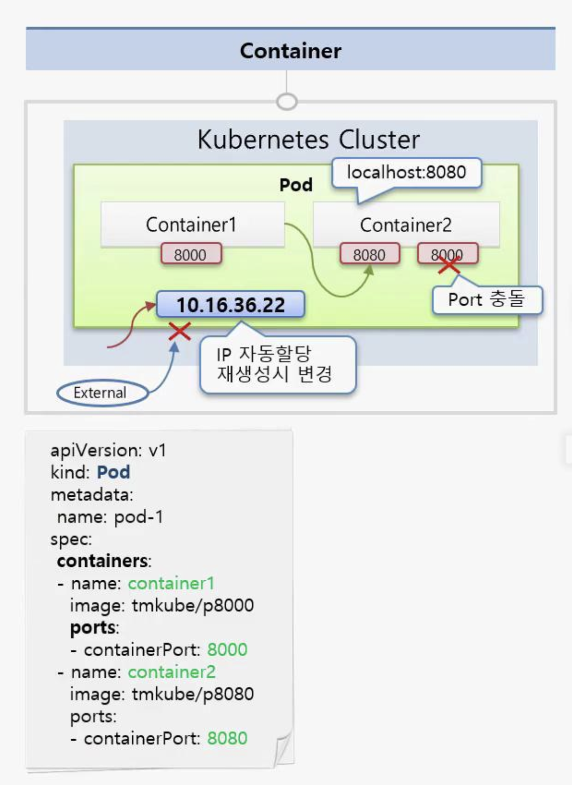
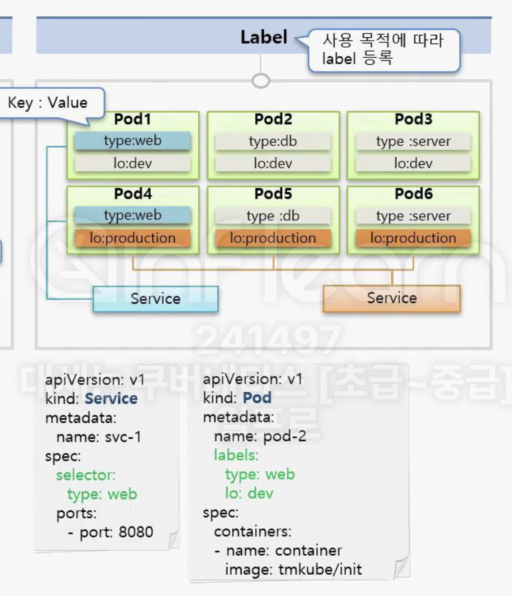

# Pod - Container, Lable, NodeSchedule

## Object - Pod(Container 관련 설명)



- Pod 안에는 하나의 독릭접인 서비스를 구동할 수 있는 컨테이너가 존재
- 컨테이너들은 서비스 연결을 위한 각각의 Port를 가지고 있다
  - 한 Pod 내에서 Port 중복은 불가능
- 두개의 컨테이너는 하나의 Host로 묶여 있다고 봐도 좋다
  - A container -> B container -> `localhost:8080 접속 가능`
- `파드 생성` 시 `고유의 IP 주소 할당` 됨
  - k8s 클러스터 내에서만 해당 IP를 통해 접근 가능
  - `외부`에서는 `해당 IP에 접근 불가능`
  - Pod에 문제가 생기면 Pod를 삭제, 삭제하는 경우 Pod의 IP는 변경됨

```yaml
apiVersion: v1
kind: Pod
metadata:
  name: pod-1
spec:
  containers:
  - name: contianer1 # 1번 컨테이너 이름
    image: tmkube/p8000 # 이미지명
    ports:
    - containerPort: 8000 # container port 지정
  - name: container2
    image: tmkube/p8080
    ports:
    - containerPort: 8080
```

- apiVersion
  - k8s API 버전 명시, v1는 k8s의 기본 API 버전 중 하나로 Pod, Service 생성 시 주로 사용
- kind: Pod
  - 리소스 종류 지정(Pod, Service, Deployment.. 등등)
- metadata:
  - 리소스에 대한 메타 데이터 지정하는 부분
  - Pod의 `이름`, `namespace`, `레이블` 등 포함
- spec
  - containers:
    - Pod 내에 실행될 컨테이너 목록 지정
  - name: 컨테이너 이름
  - image: 이미지명
  - ports: 컨테이너 포트

## Object - Pod(Ladbel 관련 설명)



- Label
  - Pod뿐만 아니라 k8s의 모든 오브젝트에서 사용 가능
  - `목적에 따라` `오브젝트`를 `구분`하기 위해 사용
  - Label은 KEY-VALUE 형태로 사용됨
  - 하나의 Pod에 여러개 Label 사용 가능
- 특정 Label을 선택(selector)하여 Service 노출 처리 가능

```yaml
# k8s pod
apiVersion: v1
kind: Pod
metadata:
  name: pod-2
  labels:
    type: web
    lo: dev
spec:
  containers:
  - name: container
    image: tmkube/init
```

```yaml
# k8s service
apiVersion: v1
kind: Service
metadata:
  name: svc-1
spec:
  selector:
    type: web
  ports:
    - port: 8080
```

## Object - Pod(Node Schedule 관련 설명)

- Pod는 여러 노드 중 1개의 노드에 구동되어야 함
- 구동 방법
  - 사용자가 Pod를 어떤 Node에 구동할지 결정
  - k8s가 Pod를 어떤 Node에 구동할지 결정

### 사용자가 결정하는 경우

```yaml
# k8s pod nodeSelector 사용
apiVersion: v1
kind: Pod
metadata:
  name: pod-3
spec:
  nodeSelector:
    hostname: node1
  containers:
  - name: container
    image: tmkube/init
```

- 위와 같이 nodeSelector를 사용하여 특정 노드에 배치 가능

### k8s 스케쥴러에 의해 결정

```yaml
# k8s pod resource 설정
apiVersion: v1
kind: Pod
metadata:
  name: pod-4
spec:
  containers:
  - name: container
    image: tmkube/init
    resources:
      requests:
        memory: 2Gi # pod의 요청 mem
      limits:
        memory: 3Gi # pod의 최대 허용 Mem
```

- 위와 같이 resources.requests or resources.limits을 사용하여 Pod를 어디에 배치할지 k8s가 결정
- limits를 설정해야 다른 Pod에 영향을 주지 않는다
- Mem이 Limit을 넘으면 해당 Pod 바로 종료, CPU는 request 수치까지 낮추고 Pod 종료는 없음